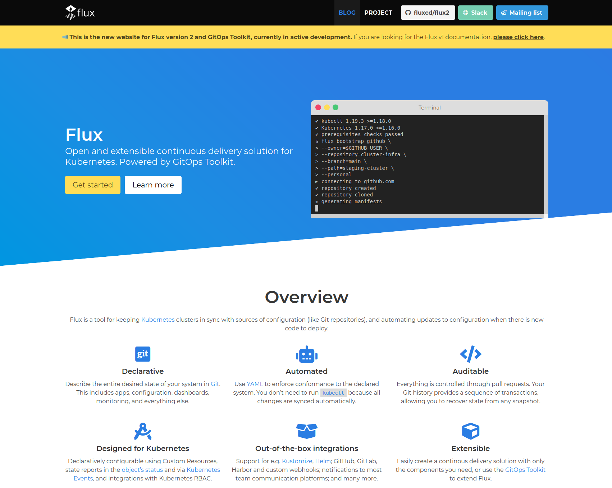

## Before we get started, what is GitOps?

If you are new to the community and GitOps, you might want to check out the [GitOps manifesto](https://www.weave.works/blog/what-is-gitops-really) or the [official GitOps FAQ](https://www.weave.works/blog/the-official-gitops-faq).

## The Road to Flux v2

The Flux community has set itself very ambitious goals for version 2 and as it’s a multi-month project, we strive to inform you each month about what has already landed, new possibilities which are available for integration and where you can get involved. Read last month’s update [here](https://www.weave.works/blog/the-road-to-flux-v2-november-update).

Let’s recap what happened in November - there have been many changes.

## Newest Flux v2 release: 0.4.0

The highlight is multi-tenancy support: you can now create tenants with the Flux CLI and restrict access to cluster resources with good old Kubernetes RBAC. Other notable changes: source operations for Git and Helm repositories, Helm charts and Buckets can now be suspended/resumed via Flux CLI or Git. This allows you to freeze the cluster reconciliation to the last fetched revision during an incident or on "No Release Fridays". We've also fixed a couple of helm-controller issues and made available a CLI command to inspect the Helm charts status.

To get you started with setting up Flux and managing multi-tenant environments, an example repository and guide has been published on: <https://github.com/fluxcd/flux2-multi-tenancy>.

## Guides for Helm users

If you have been using the Helm Operator in the past, you should be able to easily upgrade to the Helm Controller (Flux v2). Check out [this guide](/flux/migration/helm-operator-migration/) and please give us feedback - we’d love to hear from you:

If you are interested in an example which describes how you can keep e.g. two clusters updated with minimal duplication, check out this repository - it uses Flux v2, Helm and Kustomize:

<https://github.com/fluxcd/flux2-kustomize-helm-example>

## Aurel Canciu joins Flux v2 maintainers

Aurel Canciu has been putting quite a bit of work into Flux projects in the past weeks. We are very pleased to see his contributions across the project. Let’s hear a few words from Aurel himself:

    

        <blockquote>
            
As an avid promoter of the GitOps set of principles, I was very excited about the new Flux toolkit as a user, so naturally I decided to get involved and contribute to the best of my abilities and time availability. I am happy to now be part of an excellent team of maintainers and help move forward with this promising project.

        </blockquote>
    

    

        
    

## First milestone of fluxcd.io redesign landed

Ever since Flux moved into the CNCF Sandbox, we had a website for it which Luc Perkins created. For a while we have been thinking about how to best make use of the domain. We came up with a three-stage plan:

1. Move to new them, point to Flux 2 resources
1. Add a blog
1. Subsume current docs and toolkit subdomains under fluxcd.io

Thanks to Hidde Beydals’s tireless work we were able to complete stage 1 and 2. Below is what it currently looks like:

If you want to help out with the [next steps](https://github.com/fluxcd/website), please reach out.

## Fantastic demo on Flux v2

We are very pleased Viktor Farcic from Codefresh took Flux v2 for a second spin and reviewed it in his demo. If you haven’t seen Flux v2 in action yet and want to know what the big deal is about check this out:



## Flux v1 is in maintenance mode

This means we

* are focusing most of our attention on Flux v2
* will only be working on Flux (and the Helm Operator v1) for critical updates and bug fixes

Flux is still being maintained and supported, it will just take a little bit longer to get around to addressing issues and PRs. Critical bug fixes have our priority. Read more about what this means.

(The same goes for Helm Operator v1.)

## The Flux Community team

The Flux community identified work that falls into the categories of contributor experience, advocacy and communications, community management as integral to its success long ago. While this has been an implicit focus of the team for a while, we want to build out the team, open it up and formalise processes.

If you are generally interested in helping out with this effort, let us know. For now we started some social media channels for Flux and want to inform the wider community about what’s happening.

We started a Flux LinkedIn group and Flux Twitter. We will put more effort into building out the Flux community. If you are keen to help in a non-coding fashion, we’re looking forward to hearing from you.

## In other news

The Flux community is growing and we are in the middle of a quite a few big discussions:

* Flagger plans to move under the Flux organisation: https://github.com/fluxcd/community/issues/34
* Flux applies to upgrade to CNCF Incubation status: https://github.com/cncf/toc/pull/567
* GitOps Working Group starts off as a Flux sub-project (for now): https://www.weave.works/blog/announcing-gitops-working-group

If you like what you read and would like to get involved, here are a few good ways to do that:

* Join our upcoming dev meeting on Dec 3
* Talk to us in the #flux channel on CNCF Slack
* Join the planning discussions
* And if you are completely new to Flux v2, take a look at our Get Started guide and give us feedback
* Social media: Follow Flux on Twitter, join the discussion in the Flux LinkedIn group.

We are looking forward to working with you.
