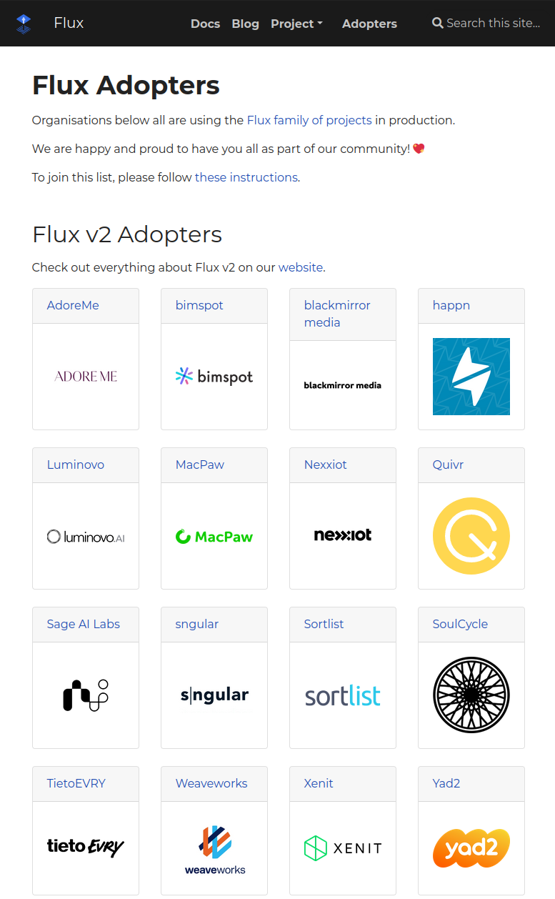

As the Flux family of projects and its communities are growing, we
strive to inform you each month about what has already landed, new
possibilities which are available for integration and where you can get
involved. Read last month's update [here](/blog/2021/04/may-2021-update).

Let's recap what happened in May - there has been so much happening!

## Newest Flux release

With the 0.14 release of Flux we added a number of big features to Flux.

The highlights are:

- We replaced the Flux monitoring stack with Prometheus Operator and
  kube-prometheus-stack.
- Support for a wider range of SSH key formats (CLI)
- Send Flux events to Azure Event Hub (notification-controller)
- Support for a wider range of OpenPGP key formats (source-controller)
- Reduce the memory usage when cloning repositories with large files
  (source-controller)
- Support for including the content of app repos into the main config
  one (better alternative to git submodules and kustomize remote
  bases) (source-controller)

Docs:

- 📔 [GitRepository include
  documentation](/flux/components/source/gitrepositories/#including-gitrepository)
- 🎁 Checkout the new [guide on ways of structuring your
  repositories](/flux/guides/repository-structure/)

If you are entirely new to Flux, check out our [get started
guide](/flux/get-started/). If you are on
an older version of Flux, check out our [migration
documentation](/flux/migration/).

## Flagger 1.11 is here

Over in the Flagger project, since our last blog the versions 1.9, 1.10 and
1.11 were released and they bring a number of nice new features and
improvements.

1.9.0 came with improvements to the Gloo Edge integration:

- Starting with this version, Flagger no longer requires Gloo
  discovery to be enabled. Flagger generated the Gloo upstream
  objects on its own and optionally it can use an existing upstream
  (specified with .spec.upstreamRef) as a template.
- Also: Adjusted Nginx ingress canary headers on init and promotion

1.10.0 comes with support for Graphite metric templates, additionally:

- ConfigTracker: Scan envFrom in init-containers
- e2e: Update Istio to v1.10 and Contour to v1.15

:warning: Flagger 1.11.0 comes with a breaking change: the minimum supported
version of Kubernetes is v1.19.0.

This release comes with support for Kubernetes Ingress `networking.k8s.io/v1`.
The Ingress from `networking.k8s.io/v1beta1` is no longer supported, affected
integrations: NGINX and Skipper ingress controllers.

## KubeCon round-up

KubeCon 2021 Europe happened in early May and the Flux team was happy to
represent. If you entirely missed the event, here are a couple of links
we'd like to share:

- 05 May 2021 - [Keynote: CNCF Project Update: Flux - Stefan
  Prodan](https://youtu.be/kuzZpKHLoVM) at KubeCon 2021
  Europe
- 05 May 2021 - [Helm Users! What Flux Can Do For
  You - Scott Rigby & Kingdon Barrett](https://youtu.be/hCTgCRlU-M0) at KubeCon 2021 Europe
- 06 May 2021 - [Flux: Multi-tenancy Deep Dive - Philip
  Laine](https://youtu.be/F7B_TBcIyl8) at KubeCon 2021
  Europe
- 04 - 07 May 2021 - [Flux Pavilion at KubeCon EU! Talks and demos
  every 30 minutes! Say
  hello!](https://bit.ly/Flux_KubeConEU2021)

These are recordings of talks which were given by Flux maintainers.

We were also present at the Flux booth at the CNCF Project Pavillion.
This was new for us and we really enjoyed being part of this. A number
of Flux maintainers and community members were at the virtual booth to
meet and greet, answer questions and do impromptu lightning talks - we
watched some of the keynotes together and shared feedback.

We had a fantastic time, laughed a lot and were pleased to learn more
about how everyone uses Flux in production and how folks can start
getting more involved in our community. Thanks everyone for supporting
us at KubeCon!

## The CNCF Flux Store is up

As one of the perks of reaching Incubation status within the CNCF, there
is now a Flux section in the CNCF Store. If you are looking for a new
hoodie, new socks, a birthday present or anything else, please sure to
check out <https://store.cncf.io/collections/flux>.

If you have fully re-clothed yourself in Flux things, be sure to share a
pic on [our Slack
channel](https://cloud-native.slack.com/archives/CLAJ40HV3)!

*(Learn more about the store and where its proceeds go
[here](https://store.cncf.io/pages/about-us).)*

## Our community is growing

We finally built a nicer home to show off who all is part of our
community: <https://fluxcd.io/adopters>.

From start-ups to Fortune 500 companies many have accompanied us for a
couple of years already, quite a few migrated to the latest of Flux and
quite a few use Flagger.

If you use any of the Flux projects in your organisation, please
consider adding yourself as well: instructions can be found
[here](/contributing/flux-adopters/).

Thanks a lot everyone who already added themselves - your support means
a lot to us! 💖

## Upcoming events

It's important to us to keep you up to date with new features and
developments in Flux and provide simple ways to see our work in action
and chat with our engineers.

We are very happy to be part of a big event that will definitely be
worth your time: an entire two-day conference about the newest
developments in the GitOps world with Keynotes from Justin Cormack (CTO,
Docker), Katie Gamanji (Ecosystem Advocate, CNCF), and Lei "Harry" Zhang
(Staff Engineer at Alibaba Cloud).

> **09-10 Jun 2021** - [GitOps Days 2021](https://www.gitopsdays.com)

Sign up for it today, share it with your friends far and wide. It's a
free event!

Check out [our calendar section](/#calendar) for more upcoming
and [links to recordings](/resources) of past talks.

## In other news

### Reviewing Flux Governance

More than half a year ago we established our [Flux Governance
document](/governance/). The idea behind
it was to formalise our values around community, the roles and
responsibilities and processes; many of which had been transparent and
with our full integrity, but still quite ad-hoc up until that point.

For us it's time to review this together with our
[Community](/community/) and
[Contributors docs](/contributing/).
So we are turning to you for feedback: [please let us know what you
think](https://github.com/fluxcd/flux2/discussions/1457).
What was your experience up until now? Do you feel things are clear
enough?

We are striving for a great contributor experience, so your feedback on
all of the above is going to make a difference.

### Representing Flux and Flagger at CNCF

The CNCF does a great job of informing the world of its member projects
and we just made sure to update all relevant information, branding and
logos. If you ever need to borrow our logos, colours or any other info
for a presentation or something, check out the [CNCF CI/CD
Landscape](https://landscape.cncf.io/card-mode?category=continuous-integration-delivery&grouping=category),
the [Flux](https://github.com/cncf/artwork/tree/master/projects/flux) and
[Flagger](https://github.com/cncf/artwork/tree/master/projects/flagger)
branding or our entry on the list of [CNCF
projects](https://www.cncf.io/projects/#incubating).

## Over and out

If you like what you read and would like to get involved, here are a few
good ways to do that:

- Join our [upcoming dev meetings](/community/#meetings) on
  2021-06-03 15:00 UTC, or 2021-06-09, 12:00 UTC.
- Talk to us in the \#flux channel on [CNCF
  Slack](https://slack.cncf.io/)
- Join the [planning
  discussions](https://github.com/fluxcd/flux2/discussions)
- And if you are completely new to Flux v2, take a look at our
  [Get Started guide](/flux/get-started/) and give us feedback
- Social media: Follow [Flux on
  Twitter](https://twitter.com/fluxcd), join the
  discussion in the [Flux LinkedIn
  group](https://www.linkedin.com/groups/8985374/).

We are looking forward to working with you.
