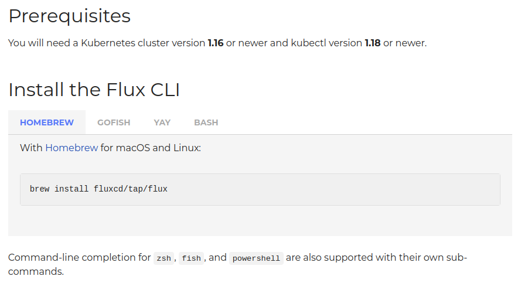

As the Flux family of projects and its communities are growing, we
strive to inform you each month about what has already landed, new
possibilities which are available for integration and where you can get
involved. Read [last month's update
here](/blog/2021/07/july-2021-update/).

Let's recap what happened in July - even though a lot of us took some
much needed holidays, a lot has been happening!

## Flux Project Facts

We are very proud of what we put together, here we want to reiterate
some Flux facts - they are sort of our mission statement with Flux.

1. **🤝 Flux provides GitOps for both apps or infrastructure.**
   Flux and Flagger deploy apps with canaries, feature flags, and
   A/B rollouts. Flux can also manage any Kubernetes resource.
   Infrastructure and workload dependency management is built in.
1. **🤖 Just push to Git and Flux does the rest.**
   Flux enables application deployment (CD) and (with the help of
   Flagger) progressive delivery (PD) through automatic
   reconciliation. Flux can even push back to Git for you with
   automated container image updates to Git (image scanning an
   patching).
1. **🔩 Flux works with your existing tools**:
   Flux works with your Git providers (GitHub, GitLab, Bitbucket,
   can even use s3-compatible buckets as a source), all major
   container registries, and all CI workflow providers.
1. **☸️ Flux works with any Kubernetes and all common Kubernetes
   tooling:** Kustomize, Helm, RBAC, and policy-driven validation
   (OPA, Kyverno, admission controllers) so it simply falls into
   place.
1. **🤹 Flux does Multi-Tenancy (and "Multi-everything"):**
   Flux uses true Kubernetes RBAC via impersonation and supports
   multiple Git repositories. Multi-cluster infrastructure and apps
   work out of the box with Cluster API: Flux can use one Kubernetes
   cluster to manage apps in either the same or other clusters, spin
   up additional clusters themselves, and manage clusters including
   lifecycle and fleets.
1. **📞 Flux alerts and notifies:** Flux provides health assessments,
   alerting to external systems and external events handling. Just
   "git push", and get notified on Slack and [other chat
    systems](/flux/components/notification/provider/).
1. **💖 Flux has a lovely community that is very easy to work with!**
   We welcome contributors of any kind. The components of Flux are on
   Kubernetes core `controller-runtime`, so anyone can contribute and
   its functionality can be extended very easily.

This section has made it onto the landing page of <https://fluxcd.io>
now - let us know how you like it!

## News in the Flux family

### Controller refactoring coming up

If you have been following the repositories under the
[fluxcd organisation](https://github.com/fluxcd/) on Github, you
will have noticed that its actually the `*-controller` projects which
provide the functionality of Flux. Their names should be fairly
self-explanatory: "`source`", "`helm`", "`kustomize`", "`notifications`"
and so on.

We had many contributors jump in and help since we started the big Flux
rewrite, but we noticed that the learning curve was a little steep and
everybody spent a little too much time learning how the controllers
interacted, and similar concepts.

Hidde Beydals recently sat down and implemented helper functions which
will aid in unifying codebases and settings standards across all Flux
Controllers. The bulk of this work has landed under
[`pkg/runtime`](https://github.com/fluxcd/pkg/tree/main/runtime).
Its README does a pretty good job explaining the helper functions and
important considerations.

Here we want to give a big shout-out to the [Cluster API
project](https://github.com/kubernetes-sigs/cluster-api),
as for example the conditions and patch packages were heavily inspired
by the project's work!

The idea behind this was to

- Reduce duplication of code
- Reduce a certain subset of race condition related bugs in Flux
  controllers
- Make writing e2e tests much easier and uniform
- Make maintaining Flux controllers easier for others to help with
- Make writing new controllers much clearer process (help widen
  ecosystem of controllers built on the GitOps Toolkit)
- Make us feel more comfortable in the code

Check out the most recent version of Go reference documentation here:
<https://pkg.go.dev/github.com/fluxcd/pkg/runtime@v0.13.0-rc.2>.

The overall plan is:

- If you are proficient in Go and have some experience with
  [controller-runtime](https://github.com/kubernetes-sigs/controller-runtime/)
  this might be straight up your alley. If you are interested in
  learning more about it, you might want to get started with this
  [Kubebuilder tutorial](https://book.kubebuilder.io/cronjob-tutorial/cronjob-tutorial.html).
- Review the `pkg/runtime` [reference
  docs](https://pkg.go.dev/github.com/fluxcd/pkg/runtime@v0.13.0-rc.2).
- Review how these new helper functions are used to standardize Source
  Controller in [this Pull Request](https://github.com/fluxcd/source-controller/pull/411).
- Based on those patterns, work together on a per-pattern, per
  controller Pull Request.

Track the wider effort by subscribing to these issues:

- <https://github.com/fluxcd/flux2/issues/1601>
- <https://github.com/fluxcd/flux2/issues/1602>

If you would like to help out in the refactoring work, please reach out
to Scott Rigby on Slack.

### Flux migration news

In last month's update we discussed how Flux's APIs are now stable. To
clarify what this means for the Flux project as a whole, we added the
following section to [our migration
timetable](/flux/migration/timetable/):

- Flux 1: Superseded
  - All existing projects encouraged to migrate to Flux 2, and
    report any bugs
  - Flux 1 Helm Operator code freeze -- no further updates except
    CVEs

- Flux 2 CLI: Needs further testing, may get breaking changes
  - CLI needs further user testing during this migration period
- [GitOps Toolkit](/flux/components/)
  APIs and Controllers
  - All Beta, Production Ready\
    The GOTK Custom Resource Definitions which are at `v1beta1` and
    `v2beta1` and their controllers are considered stable and
    production ready. Going forward, breaking changes to the beta
    CRDs will be accompanied by a conversion mechanism.
  - All Flux 1 features stable and supported in Flux 2
  - Promoting Alpha versions to Beta makes this Production Ready

Reach out to us if you have any questions about this!

## Upcoming events

It's important to us to keep you up to date with new features and
developments in Flux and provide simple ways to see our work in action
and chat with our engineers.

### Flux Bug Scrub

Our Flux Bug Scrub event is now a regular feature, with the current
scheduling information available on the [CNCF Flux Dev
Calendar](https://lists.cncf.io/g/cncf-flux-dev/calendar),
usually scheduled opposite the CNCF Flux Project Meeting. You can
[subscribe to the
calendar](/community/#subscribing-to-the-flux-dev-calendar)
to receive notifications about upcoming events and schedule changes. The
Bug Scrub is an opportunity to meet with other Flux contributors in
another setting besides the Dev meeting, where we try to identify "Good
First Issues" and spend an hour working on issue triage as a group.
These meetings are open to the general public, so individuals of any
skill level are welcome.

The theme and focus of the Bug Scrub can vary from week to week; we are
floating the idea of doing an FAQ scrub or Docs scrub, where instead of
reviewing issues and doing triage on PRs, we comb through recent Slack
history and try to find new Frequently Asked Questions that we can add
to the docs, in order to save the Flux team from writing out the same
replies longhand every time a question is asked again. Many folks are
coming to the Bug Scrub just to learn more about Flux and for a window
into Flux current events.

One goal of this event is to convert Flux users into Flux contributors,
so we will try to make sure that all attendees who are interested in
making a contribution get an issue assignment before the end of the
event. We hope that you will join us for a Bug Scrub some time soon.

For details and more information about the Flux Bug Scrub, how it works,
and what you need to do in order to participate: please read and review
the [Bug Scrub
Process/Protocol](https://docs.google.com/document/d/12RGZTBMSa4LWxourZZ08b3mtJCM0dJnSuApIE5uLgIw/edit)
doc, or revisit the blog post that announced our [First Bug
Scrub](/blog/2021/06/flux-bug-scrub-announce/#what-is-the-flux-bug-scrub).
Remember to find current scheduling information on the [CNCF Flux Dev
Calendar](https://lists.cncf.io/g/cncf-flux-dev/calendar),
and stay tuned for more info!

### GitOpsCon North America

Still a little further down the line, [GitOpsCon North
America](https://events.linuxfoundation.org/gitopscon-north-america/)
is happening October 12, 2021 as a Day-0 Event leading up to
CloudNativeCon/KubeCon in Los Angeles, California + Virtually of course.

GitOpsCon North America (\#GitOpsCon) is designed to foster
collaboration, discussion and knowledge sharing on GitOps. This event is
aimed at audiences that are new to GitOps as well as those currently
using GitOps within their organization. Get connected with others that
are passionate about GitOps. Learn from practitioners about pitfalls to
avoid, hurdles to jump, and how to adopt GitOps in your cloud native
environment.

The event is vendor-neutral and is being organized by the CNCF GitOps
Working Group. Topics include getting started with GitOps, scaling and
managing GitOps, lessons learned from production deployments, technical
sessions, and thought leadership.

The schedule is not yet available, but will be soon. Now is a good time
though to register.

Check out [our calendar section](/#calendar) for more upcoming
and [links to recordings](/resources) of past talks.

## In other news

### Flux User Interviews

As a community we want to share our success stories more, so Scott Rigby
and Daniel Holbach will soon start reaching out to folks who use Flux,
who built solutions on top of Flux or do advocacy for Flux. If you were
involved in any of these things, or know of an interesting story we
should be telling to inspire, celebrate and teach others, please let us
know. We want to reach far and wide and paint Flux's community as
colourful and diverse as it is!

### News from the Website and our Docs

We updated to a new version of the [docsy
theme](https://github.com/google/docsy), which gives us
more short-codes we can use to express ourselves in our documentation.
Alison also improved the ways tabs look as you can see
[here](/flux/installation/):

Alison also put quite a bit of work into [writing
up](/contributing/docs/style-guide/)
how we want our documents to look and which [short-codes are most
useful](/contributing/docs/writing-docs/).
This should make it much easier if you want to start contributing
documentation for Flux.

In the FAQ section, Hendrik Ferber explained [how to patch CoreDNS and
other pre-installed
addons](/flux/faq/#how-to-patch-coredns-and-other-pre-installed-addons).

Additionally, to give some of the success stories Flux users have shared
more room, we added this section to the landing page of
<https://fluxcd.io> - if you have more, we are all ears!

Many others helped us improve the site and docs in other ways - thanks
to everyone!

## Over and out

If you like what you read and would like to get involved, here are a few
good ways to do that:

- Join our [upcoming dev meetings](/community/#meetings) on
  2021-08-04 12:00 UTC, or 2021-08-12, 15:00 UTC.
- Talk to us in the \#flux channel on [CNCF
  Slack](https://slack.cncf.io/)
- Join the [planning
  discussions](https://github.com/fluxcd/flux2/discussions)
- And if you are completely new to Flux, take a look at our [Get
  Started guide](/flux/get-started/) and give us feedback
- Social media: Follow [Flux on
  Twitter](https://twitter.com/fluxcd), join the
  discussion in the [Flux LinkedIn
  group](https://www.linkedin.com/groups/8985374/).

We are looking forward to working with you.
