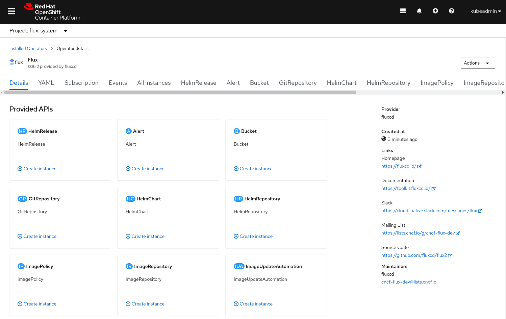
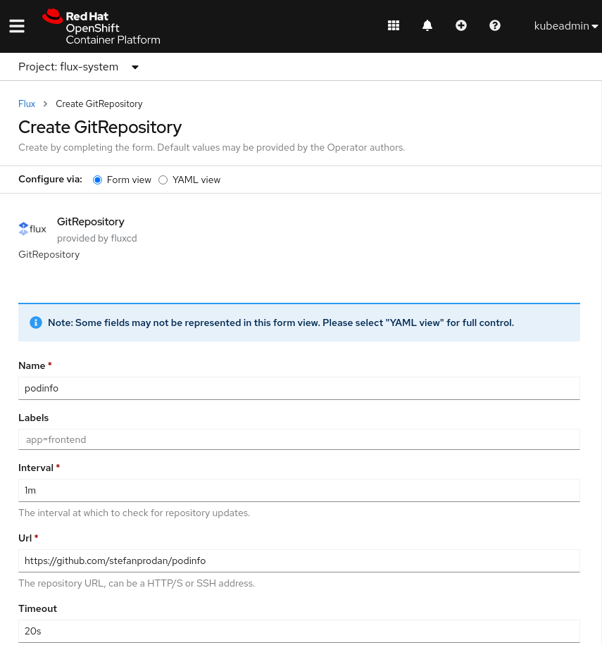
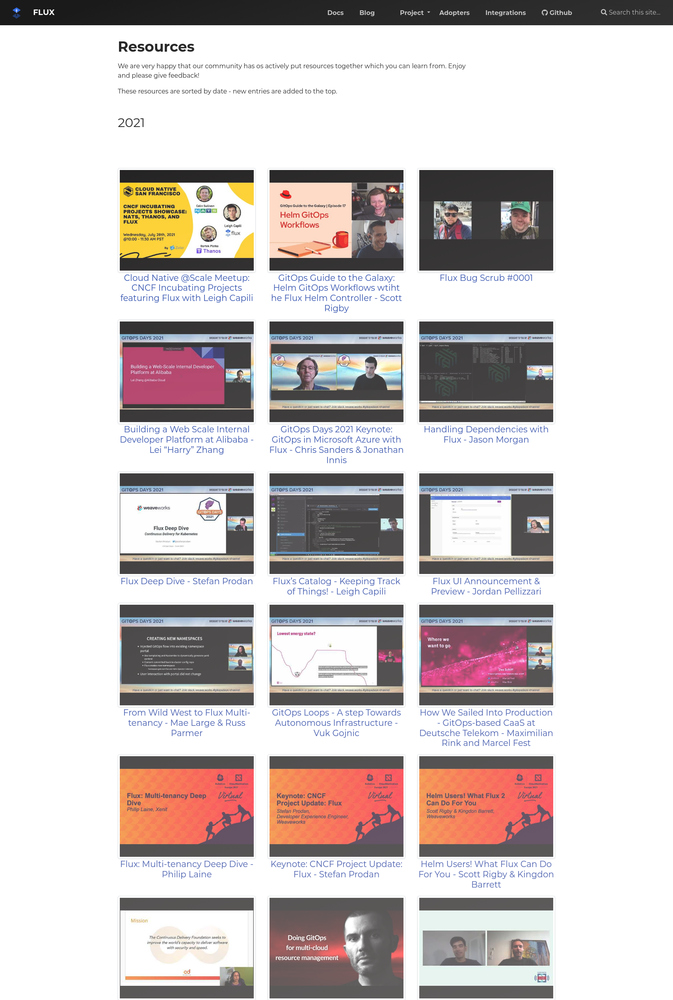

As the Flux family of projects and its communities are growing, we
strive to inform you each month about what has already landed, new
possibilities which are available for integration, and where you can get
involved. Read [last month's update
here](/blog/2021/08/august-2021-update/).

Let's recap what happened in August - there has been so much happening!

## Flux Project Facts

We are very proud of what we put together, here we want to reiterate
some Flux facts - they are sort of our mission statement with Flux.

1. 🤝 **Flux provides GitOps for both apps or
   infrastructure**. Flux and Flagger deploy apps with
   canaries, feature flags, and A/B rollouts. Flux can also manage
   any Kubernetes resource. Infrastructure and workload dependency
   management is built-in.
1. 🤖 **Just push to Git and Flux does the rest**. Flux
   enables application deployment (CD) and (with the help of Flagger)
   progressive delivery (PD) through automatic reconciliation. Flux
   can even push back to Git for you with automated container image
   updates to Git (image scanning and patching).
1. 🔩 **Flux works with your existing tools**: Flux works with
   your Git providers (GitHub, GitLab, Bitbucket, can even use
   s3-compatible buckets as a source), all major container
   registries, and all CI workflow providers.
1. ☸️ **Flux works with any Kubernetes and all common Kubernetes
   tooling**: Kustomize, Helm, RBAC, and policy-driven
   validation (OPA, Kyverno, admission controllers) so it simply
   falls into place.
1. 🤹 **Flux does Multi-Tenancy (and "Multi-everything")**:
   Flux uses true Kubernetes RBAC via impersonation and supports
   multiple Git repositories. Multi-cluster infrastructure and apps
   work out of the box with Cluster API: Flux can use one Kubernetes
   cluster to manage apps in either the same or other clusters, spin
   up additional clusters themselves, and manage clusters including
   lifecycle and fleets.
1. 📞 **Flux alerts and notifies**: Flux provides health
   assessments, alerting to external systems and external events
   handling. Just "git push", and get notified on Slack and [other
   chat
   systems](https://github.com/fluxcd/notification-controller/blob/main/docs/spec/v1beta1/provider.md).
1. 💖 **Flux has a lovely community that is very easy to work
   with!** We welcome contributors of any kind. The
   components of Flux are on Kubernetes core controller-runtime, so
   anyone can contribute and its functionality can be extended very
   easily.

This section has made it onto the landing page of <https://fluxcd.io>
now - let us know how you like it!

## News in the Flux family

### Flux 0.17.0

We have released Flux v0.17.0. You will be pleased to learn that this
version has no breaking changes. We encourage all users to upgrade ASAP.

Some of the highlights in this release are:

- Flux garbage collector has been improved to work nicely with other
  controllers such as Strimzi Kafka Operator, Redis Operator,
  Prometheus Operator and others.
- The Notification controller can now send alerts to Telegram, Lark
  and Matrix in addition to [many
  others](/flux/components/notification/provider/#writing-a-provider-spec).
- Kustomize controller has been updated to on a par with the latest
  Kustomize release v4.3.0.

Some of our community members have stepped up their level of
contributions recently and particularly in this release. On that we
would like to congratulate Somtochi Onyekwere for becoming a maintainer
of the Flux notification controller (more below)! Thanks
[Somtochi](https://github.com/SomtochiAma) for all your
contributions to the Flux project.

Also a big shout-out to Allen Porter and Chanwit Kaewkasi for helping us
with the Flux CLI testing framework!

### Flagger 1.13.0

This Flagger release comes with support for [Open Service
Mesh](https://openservicemesh.io). For more details see the
[OSM Progressive Delivery
tutorial](https://github.com/fluxcd/flagger/blob/main/docs/gitbook/tutorials/osm-progressive-delivery.md).

Starting with this version, Flagger container images are signed with
[sigstore/cosign](https://github.com/sigstore/cosign), for
more details see the [Flagger cosign
docs](https://github.com/fluxcd/flagger/blob/main/cosign/README.md).

### Flux is in the Operator Hub

We are excited to tell you that [Flux Operator is now on the Operator
Hub](https://operatorhub.io/operator/flux), and it supports
Red Hat OpenShift version 4.6, 4.7, and 4.8. Flux Operator for OpenShift
could be installed directly via the OpenShift web console on the
Operators tab. It also works on OKD, the Community Distribution that
powers OpenShift.

Flux on OpenShift Features

- One-click installation
- Automatically Upgrade
- UI for Flux Resources

The Flux Operator for OpenShift provides a UI for all Flux Resources.

In the following example, you see the UI of GitRepository, which could
create a new GitRepository object as a source for other objects.

Please consult the [Flux OpenShift documentation](/flux/use-cases/openshift/)
for the installation steps.

If you have any questions or feedback, please reach out to Chanwit or
Kingdon on Slack.

## Upcoming events

It's important to keep you up to date with new features and developments
in Flux and provide simple ways to see our work in action and chat with
our engineers.

### Flux Bug Scrub

Many Flux users and contributors have found the Bug Scrub a helpful
meet-up, including some maintainers and repeat visitors. The Bug Scrub
event is a weekly Zoom call where we discuss open issues from the Flux
org on GitHub, with a narrow focus on what we can do to help advance
each issue in the shortest amount of time. We aim to get more exposure
to the greatest possible number of open issues and set some time aside
for story telling. As Flux development moves very fast there is always
plenty to talk about.

The Bug Scrub format was designed to spread more Flux knowledge to more
people who are interested in finding their own way toward contributing
to Flux each week. We spend a few minutes talking about issues with
minimal structure meant only to prevent back-tracking or repeating any
of the discussions from one week to the next. You do not have to be a
programmer to participate; any Flux users at any knowledge level, issue
reporters, or potential contributors should feel welcome to attend. Take
your opportunity to participate and help build our community. The time
commitment is minimal!

Find our calendar on the Flux website where, thanks to some updates,
finding the [date and time of the next Bug Scrub
meeting](/#calendar) is now more
accessible than ever before.

The Zoom link is broadcast via Slack a few minutes before the
meeting start time. For more event details, subscribe to the [CNCF Flux
Dev
calendar](/community/#subscribing-to-the-flux-calendar).
Attendees all are asked to RSVP in advance, which can be done by posting
on the Slack thread for Bug Scrub, and introducing yourself briefly in
case you are new to the Flux contributor team.

Please consider joining
[\#flux](https://cloud-native.slack.com/archives/CLAJ40HV3)
on the [CNCF Slack](https://slack.cncf.io) and meeting us
for Bug Scrub. Hope to see you there!

## In other news

### News from the Website and our Docs

**📹 Resources and videos**: As a community we are not only very proud
that the Flux projects keep innovating and improving, but also that
community members go out there and talk about how they are using the
tools and what they achieved.

The list of talks and resources formerly was quite buried on the site -
they now have their own page and can shine there:
<https://fluxcd.io/resources/>

If you prefer learning about Flux through videos, you might enjoy this!

**📆 Our calendar**: From now on all upcoming Flux-related events,
meetings, workshops and sessions will be mentioned in our new calendar
section - directly on the home page:
<https://fluxcd.io/#calendar>

For this we re-use Flux's calendar that is provided by CNCF
infrastructure, so if you [subscribed to
it](/community/#subscribing-to-the-flux-calendar)
in the past, you will continue to receive all the information there.

**🤝 Thanks everyone!** In the last month, 15 people contributed to the
website and docs - we are very pleased with all the attention to detail
and help from everyone. Thanks a lot - let us know if there's anything
you would like to see improve or help out with!

### Somtochi Onyekwere joins Flux maintainers

We are very pleased to see Somtochi Onyekwere join the list of
maintainers of Flux projects. Since she started working on Flux
projects, she has by now contributed to almost all repositories. Most
recently she worked on notification-controller and got it to talk to
various other notification providers.

Before Flux she worked within the Cluster Addons projects in the
Kubernetes SIG Cluster Lifecycle. Check out her write-up about the
[Google Summer of Code project
2020](https://kubernetes.io/blog/2020/09/16/gsoc20-building-operators-for-cluster-addons/).

Thanks a lot for all your hard work Somtochi - we are very happy to have
you on the team!

### People writing about Flux

A new instalment of the Falcosidekick series has been written by Batuhan Apaydın. This series is all about how to create a Kubernetes response engine with Falco, Falcosidekick and a FaaS. Guest star this time around is Flux!

The article takes a step-by-step approach and is nicely written. We are very pleased to continue the collaboration with the Falco project. Check out the full article here: <https://falco.org/blog/falcosidekick-response-engine-part-8-fluxv2/>

## Over and out

If you like what you read and would like to get involved, here are a few
good ways to do that:

- Join our [upcoming dev
  meetings](/community/#meetings) on
  2021-09-01 12:00 UTC, or 2021-09-09, 15:00 UTC.
- Talk to us in the \#flux channel on [CNCF
  Slack](https://slack.cncf.io/)
- Join the [planning
  discussions](https://github.com/fluxcd/flux2/discussions)
- And if you are completely new to Flux, take a look at our [Get
  Started guide](/flux/get-started/)
  and give us feedback
- Social media: Follow [Flux on
  Twitter](https://twitter.com/fluxcd), join the
  discussion in the [Flux LinkedIn
  group](https://www.linkedin.com/groups/8985374/).

We are looking forward to working with you.
