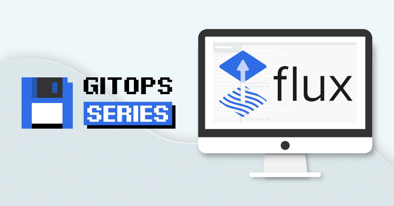
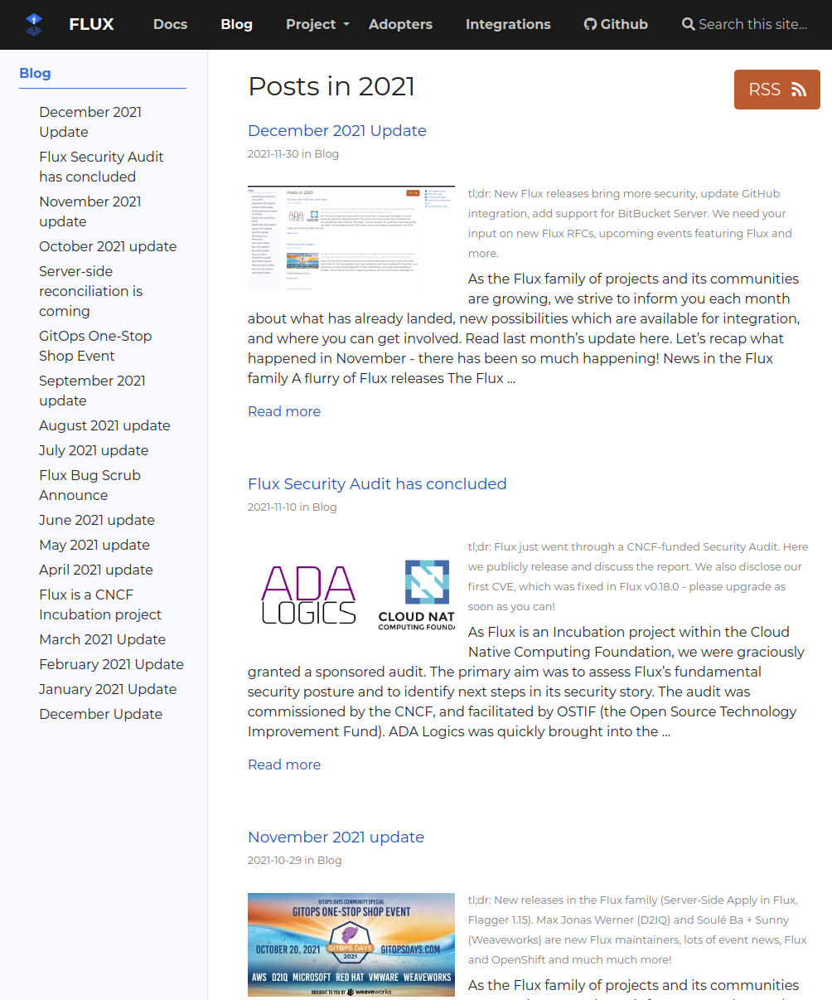

As the Flux family of projects and its communities are growing, we
strive to inform you each month about what has already landed, new
possibilities which are available for integration, and where you can get
involved. Read [last month's update here](/blog/2021/11/november-2021-update/).

Let's recap what happened in November - there has been so much happening!

## News in the Flux family

### A flurry of Flux releases

The Flux Development team has been busy. In November they released Flux
0.21, 0.22, 0.23, and 0.24. Let's review these one by one, so you can
get the most out of Flux when you are doing the upgrade, migration or
fresh installation.

**0.21** brought *ECDSA* as the default SSH key algorithm used by `flux
bootstrap` and all the other commands that generate SSH keys. This change
was imposed by GitHub that is [no longer accepting RSA SHA-1 SSH
keys](https://github.blog/2021-09-01-improving-git-protocol-security-github/).

To rotate your SSH deploy keys for the repositories bootstrapped with
Flux:

- download the Flux CLI v0.21.0 binary
- delete the deploy key secret from your cluster
  
  ```cli
  kubectl -n flux-system delete secret flux-system
  ```
  
  using the Flux CLI v0.21.0.
- rerun `flux bootstrap github` with the same arguments as before

Flux will generate a ecdsa-sha2-nistp384 SSH key and will update the
deploy key on GitHub.

**0.22** introduced no breaking changes, but included these highlights:

- Storing secrets in environment variables is no longer required, the
  `flux bootstrap` command will prompt for the GitHub/GitLab PAT
  when not found in env.
- Flux adds support for ignoring manual changes made to the cluster
  state by disabling the server-side apply for certain resources
  using an annotation.
- Improve the image automation alerting by emitting events only when
  changes are pushed upstream.
- Include the updated containers URIs in the image automation alerts
  and events.

**0.23** came with artifact integrity verification based on SHA-2 and fixes
for image automation. The highlights are:

- The format of the artifact checksum computed by `source-controller`
  changed from SHA1 to SHA256 to mitigate chosen-prefix and length
  extension attacks.
- During the acquisition of an artifact, `kustomize-controller` and
  `helm-controller` compute its checksum and verify that it matches
  the checksum advertised in the Status of the Source.

And finally **0.24** comes with security updates for Alpine CVEs. We are
also happy to bring you

- New bootstrap command for [Bitbucket Server and Data
  Center](/flux/installation/#bitbucket-server-and-data-center)
  repositories (CLI).
- Add support for self-signed certificates when bootstrapping Flux
  with on-prem GitHub, GitLab and BitBucket servers (CLI).
- Improved performance when building Helm charts and introduced limits
  for Helm index and chart files. (source-controller).
- Add support for [Slack Apps
  bot](/flux/components/notification/provider/#slack-app)
  alerting provider (notification-controller).

Please note that this version comes with breaking changes to Helm users.
The Helm repository index.yaml max size is set to 50MiB and the chart
max size is 10MiB, to change these limits see the [source-controller
changelog](https://github.com/fluxcd/source-controller/blob/v0.19.0/CHANGELOG.md).

#### Support for Bitbucket Server and Data Center repositories




Big shout-out to Soulé Ba for adding Bitbucket support to Flux. This
will make lots of Flux users happy. Thank you very much!

To find out how to bootstrap Flux on Bitbucket Server, please review
[our documentation](/flux/installation/#bitbucket-server-and-data-center).
We love feedback, so please reach out if you have any questions or are
missing anything. We are also working on support for BitBucket Cloud,
for which we might need some help testing, documentation or wherever
else you would like to contribute - we'd love to have you participate!

### Flagger 1.16 is out

Progressive Delivery fans will be happy to hear that Flagger 1.16 comes
with a new API field called `primaryReadyThreshold` that allows setting
the percentage of pods that need to be available to consider the primary
deployment as ready.

### Security news

You might have heard about [Flux's security audit](/blog/2021-11-10-flux-security-audit/)
which was performed by ADA Logics in the last months. As discussed in
the announcement, we set up a project board to track our work and have
now completed over half of the identified requests with many more in
flight.

#### Let's talk documentation

One piece of feedback in the report was that while our Flux
documentation serves its users well by e.g. showcasing many useful
configuration examples, we could do an even better job by creating a
more general, architectural overview of Flux and discussing the security
features, assumptions and considerations users should take into account.

After talking to many people, we [filed a number of
issues](https://github.com/fluxcd/website/labels/area%2Fsecurity)
to track this work and Scott Rigby created the [landing page](/flux/security)
for Security Documentation. We already brought together quite a few notes
to populate these pages more. If you want to help, please talk to Scott
and the rest of us - we look forward to your questions, ideas, input
and edits!

#### Flux's future - we need your input

Speaking of input: we started a formal RFC process for some of the
bigger improvements in Flux. This was in part due to feedback from the
audit as well, but more generally something we were missing in Flux
governance. So far, our process of using GitHub discussions, Slack and
our weekly Dev meetings was good enough to find consensus on the bigger
questions. With more integrators building on top of Flux and more
diverse ways Flux is being used, we want to get the end-user experience
and general assumptions right, so here is our first set of RFCs for you
to consider:

- RFC process was started: [\[RFC-0000\] Introduce the Flux RFC
  template](https://github.com/fluxcd/flux2/pull/2085)
- Proposals related to Flux Multi-tenancy:
  - [\[RFC-0001\] Define Flux tenancy
    models](https://github.com/fluxcd/flux2/pull/2086)
  - [\[RFC-0002\] Access control for cross-namespace source
    refs](https://github.com/fluxcd/flux2/pull/2092)
  - [\[RFC-0003\] Flux Multi-Tenancy
    Mode](https://github.com/fluxcd/flux2/pull/2093)

We really would love your feedback on any of them!

## Recent & Upcoming Events

It's important to keep you up to date with new features and developments
in Flux and provide simple ways to see our work in action and chat with
our engineers.

### Taming Multiple Traefik Deployments with a GitOps (Flux) Strategy

[December 9, 2021 at 8am PT / 5pm CET](https://bit.ly/3CkreHL) our very
own [Kingdon Barrett](https://twitter.com/yebyen) will be presenting
with Jakub Hajek from TraefikLabs. This hands-on session will include a
demo on deploying Traefik on multiple clusters using Flux! [Sign up
here](https://bit.ly/3CkreHL).

### GitOps WG and OpenGitOps project update at KubeCon China

December 9, 2021 12:10 - 12:45 CST [Scott
Rigby](https://twitter.com/r6by) will give an update of the
GitOps Working Group and OpenGitOps project as part of the
[Introduction and Deep-Dive into TAG App
Delivery](https://sched.co/pccW) for
KubeCon/CloudNativeCon/Open Source Summit China. We are very pleased to
be collaborating with these groups within the CNCF.

### KubeCon/CloudNativeCon Europe 2022 CFP deadline coming up

As you all know, there's always a KubeCon just over and the CFP deadline
for the next KubeCon just coming up! That's why we are looking for
contributors, community members, organisations or integrators who would
like to 1) represent Flux and 2) present on Flux, GitOps delivery and
more. If you want to talk things through, have any questions or want to
collaborate with us, please reach out! [Deadline to submit is December
17,
2021](https://events.linuxfoundation.org/kubecon-cloudnativecon-europe/program/cfp/).

### More Flux Resources

We recently added a number of new resources to our [Resources
page](/resources/). They were all from the
last [GitOps One-Stop Shop
Event](/blog/2021/09/gitops-one-stop-shop/)
where vendors show-cased their GitOps consumer products, which were all
based on top of the most recent versions of Flux.

### Flux Bug Scrub

The Flux Bug Scrub in the last week of November (25th) coincided with
the US Thanksgiving holiday, so it was not held. Each weekly Bug Scrub
can be found (and linked Zoom details) on the
[fluxcd.io/\#calendar](/#calendar)
calendar widget, which has now been adjusted for the end of Daylight
Savings Time. Please check in on
[\#flux](https://cloud-native.slack.com/channels/flux) or
[\#flux-contributors](https://cloud-native.slack.com/channels/flux-contributors)
for more information!

Bug Scrub is a great opportunity to talk with Flux maintainers and also
a place where you can gently nudge to get our eyes on a particular bug
if there is something that warrants a higher priority. There are
hundreds of bugs open across Flux projects at any given time, so not all
bugs can receive attention from only a dozen or so maintainers while
making progress to General Availability. We rely on user feedback,
including visitors at our public meetings like Bug Scrub to decide which
issues are worth prioritizing.

Also a great place for volunteers to gain added context of issues and
receive assignments or even a maintainer's eye or blessings to proceed,
with guidance from our GitHub triage team.

Join us for this recurring virtual meetup at 8am Eastern on Wednesday
(December 1 and 15th), or at 1pm Eastern on Thursday (December 9 and
January 6) -- note: there will be no meeting on December 23rd due to a
company-wide holiday shutdown. Find the Zoom link on the [CNCF Flux Dev
calendar](https://lists.cncf.io/g/cncf-flux-dev/calendar),
(subscribe), or locate the link directly on the [Flux main
page](/#calendar).

## In other news

### People writing about Flux

We noticed a number of new articles about Flux which we would like to
share.

#### Joshua Zenn - Introduction to GitOps with Flux v2

[This
article](https://armmaster17.github.io/2021/11/07/gitops1/)
joins the ranks of more and more upcoming news bits which firstly,
explain GitOps in simple to understand terms, and secondly, walk the
reader through setting up Flux. A second article to complete the series
will be written soon.

#### Ross Fairbank - GitOps with Flux

Ross is a Platform Engineer at GiantSwarm and in [his
article](https://www.giantswarm.io/blog/gitops-with-flux-giant-swarm)
goes into quite a bit of detail regarding the history, aims and
architecture of the Flux project, particularly in its newest version.



The article is very nicely written - go check it out.

#### Michael Irwin - Compose with K8s and Flux

We are happy to see [this
article](https://blog.mikesir87.io/2021/07/compose-with-k8s-and-flux/)
from a friend in our community. Michael Irwin has presented at our booth
at KubeCon and is a regular on Slack and elsewhere. To set the context
he starts off with

> *The Compose specification has slowly been used in contexts beyond
> running containers directly with Docker. We have*
> *[ACI](https://docs.docker.com/cloud/aci-integration/),*
> *[ECS](https://docs.docker.com/cloud/ecs-integration/),
> and an experimental Kubernetes backend. The idea is to define your
> application in one spec and deploy it in a variety of manners.*

The article comes with all the required steps, beautiful diagrams and a
video demo. Be sure to have a look!



### News from the Website and our Docs

We updated the `docsy` theme and `hugo` version in use: now we are
benefiting from styling fixes, draw.io integration and many more
upstream changes.

[The Flux Blog overview](/blog/) was a
bit dull. We made it more visually appealing by adding featured images
for blog posts and letting the entries "breathe" more.



Many docs additions and fixes as well. New adopters that were added are
Identinet, Omaze and Virginia Tech added.

Thanks Dennis Staiger, Gregory Vander Schueren, Jan Christoph Ebersbach,
Jim Van Fleet, Kingdon Barrett, Lloyd Chang, Michael Irwin, Scott Rigby,
Stefan Prodan, Valér Orlovský, Zephirin Broussard for your help!

A combined list of all Flux project maintainers is now live both in the
Flux [community
repo](https://github.com/fluxcd/community/blob/main/project/flux-project-maintainers.yaml),
and on
[maintainers.cncf.io](https://maintainers.cncf.io/). It's
another step into the direction of GitOps-ifying our governance.

## Flux Project Facts

We are very proud of what we put together, here we want to reiterate
some Flux facts - they are sort of our mission statement with Flux.

1. 🤝 Flux provides GitOps for both apps or
  infrastructure. Flux and Flagger deploy apps with
  canaries, feature flags, and A/B rollouts. Flux can also manage
  any Kubernetes resource. Infrastructure and workload dependency
  management is built-in.
1. 🤖 Just push to Git and Flux does the rest. Flux
  enables application deployment (CD) and (with the help of Flagger)
  progressive delivery (PD) through automatic reconciliation. Flux
  can even push back to Git for you with automated container image
  updates to Git (image scanning and patching).
1. 🔩 Flux works with your existing tools: Flux works with
  your Git providers (GitHub, GitLab, Bitbucket, can even use
  s3-compatible buckets as a source), all major container
  registries, and all CI workflow providers.
1. ☸️ Flux works with any Kubernetes and all common Kubernetes
  tooling: Kustomize, Helm, RBAC, and policy-driven
  validation (OPA, Kyverno, admission controllers) so it simply
  falls into place.
1. 🤹 Flux does Multi-Tenancy (and "Multi-everything"):
  Flux uses true Kubernetes RBAC via impersonation and supports
  multiple Git repositories. Multi-cluster infrastructure and apps
  work out of the box with Cluster API: Flux can use one Kubernetes
  cluster to manage apps in either the same or other clusters, spin
  up additional clusters themselves, and manage clusters including
  lifecycle and fleets.
1. 📞 Flux alerts and notifies: Flux provides health
  assessments, alerting to external systems and external events
  handling. Just "git push", and get notified on Slack and [other
  chat
  systems](https://github.com/fluxcd/notification-controller/blob/main/docs/spec/v1beta1/provider.md).
1. 👍 Users trust Flux: Flux is a CNCF Incubating project
  and was categorised as \"Adopt\" on the [CNCF CI/CD Tech
  Radar](https://radar.cncf.io/2020-06-continuous-delivery)
  (alongside Helm).
1. 💖 Flux has a lovely community that is very easy to work
  with! We welcome contributors of any kind. The
  components of Flux are on Kubernetes core controller-runtime, so
  anyone can contribute and its functionality can be extended very
  easily.

## Over and out

If you like what you read and would like to get involved, here are a few
good ways to do that:

- Join our [upcoming dev meetings](/community/#meetings) on
  2021-12-02 or 2021-12-08.
- Talk to us in the \#flux channel on [CNCF Slack](https://slack.cncf.io/)
- Join the [planning
  discussions](https://github.com/fluxcd/flux2/discussions)
- And if you are completely new to Flux, take a look at our [Get
  Started guide](/flux/get-started/)
  and give us feedback
- Social media: Follow [Flux on Twitter](https://twitter.com/fluxcd),
  join the discussion in the [Flux LinkedIn
  group](https://www.linkedin.com/groups/8985374/).

We are looking forward to working with you.
