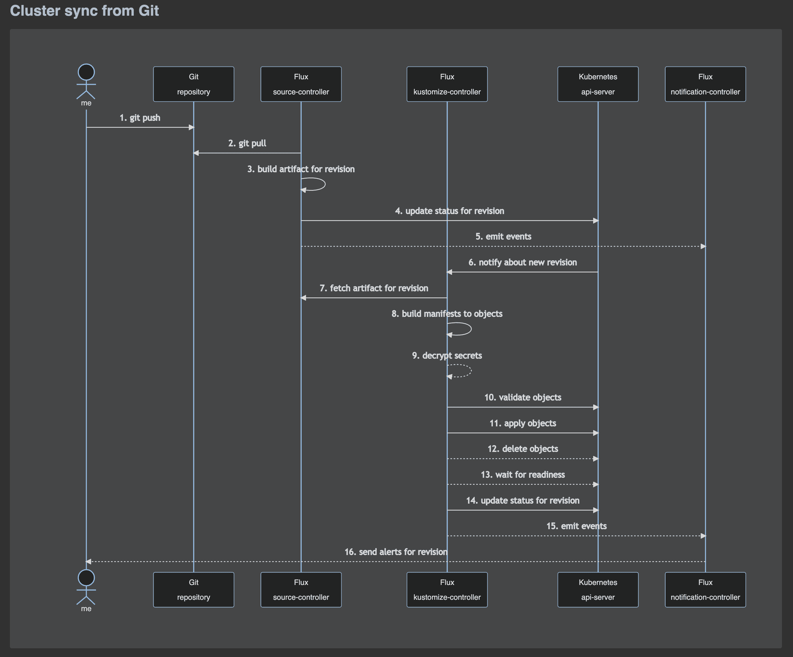

As the Flux family of projects and its communities are growing, we
strive to inform you each month about what has already landed, new
possibilities which are available for integration, and where you can get
involved. Read our [last update here](/blog/2022/01/january-update/).

It's the beginning of March 2022 - let's recap together what happened in
February - it has been a lot!

## News in the Flux family

### Latest Flux is 0.27

We have released [Flux
v0.27](https://github.com/fluxcd/flux2/releases/tag/v0.27.0).
This release comes with new features and improvements.

First of all, before you start the upgrade there are breaking changes to
be aware of:

1. Flux custom resources require their names to follow the DNS label
  standard as defined in [RFC 1123](https://tools.ietf.org/html/rfc1123).
  The `metadata.name` can only contain lowercase alphanumeric characters
  or - and must contain at most 63 characters.
1. This version introduces a breaking change to the Helm uninstall
  behavior, as the `--wait` flag is now enabled by default. Resulting
  in `helm-controller` to wait for resources to be deleted while
  uninstalling a release. Disabling this behavior is possible by
  setting `spec.uninstall.disableWait: true` in `HelmRelease` manifests.

We have been hard at work and are proud to bring you these new features
and improvements

- Add support to notification-controller for sending events to
  [Grafana annotations
  API](/flux/components/notification/provider/#grafana).
- Allow selecting event sources [based on
  labels](/flux/components/notification/alert/#example)
  using the Alert API `spec.eventSources[].matchLabels` field.
- Add support to `kustomize-controller` for making the Kubernetes
  `Secrets` and `ConfigMaps` referenced in `postBuild.substituteFrom`
  [optional](/flux/components/kustomize/kustomization/#variable-substitution).
- Allow dot-prefixed paths to be used for bootstrap e.g. `flux
  bootstrap --path=".flux/clusters/my-cluster"`.
- All Flux controllers and libraries are now tested by Google's
  [continuous fuzzing for open source
  software](https://github.com/google/oss-fuzz).

### Latest Flagger release is 1.18

[This release](https://github.com/fluxcd/flagger/releases/tag/v1.18.0)
comes with a new API field called `canaryReadyThreshold` that allows
setting the percentage of pods that need to be available to consider the
canary deployment as ready.

Starting with version, the canary `deployment` labels, `annotations` and
`replicas` fields are copied to the primary deployment at promotion time.

### Security news

#### Security Audit Feedback has been addressed

Back when we announced that the [Flux Security Audit had
concluded](/blog/2021-11-10-flux-security-audit/),
we already shared that we had created a [project
board](https://github.com/orgs/fluxcd/projects/5) where we
tracked all the concrete and immediately actionable feedback. Weighing
in at fifty tasks of differing sizes, it took us about 2-3 months
(depending if you count people's holidays over New Years) to address all
of them. It was a big team effort across teams, projects and
disciplines. A big thank you again to everyone who contributed!

Some of these tasks are obviously an ongoing piece of work, for example
ever expanding the scope of fuzzing, improving our security
documentation and using our RFC process for defining the future of Flux
together.

A big push has been made though and Flux is more secure since we all
came together for this project.

#### Welcome to the Flux Security blog post series

If you read the release notes for the last Flux releases, you will
notice that a big focus for us has been to make Flux more secure every
time. As we believe it is equally important to explain in more detail
what we have done and how you can benefit from these changes, we started
a blog post series about Flux Security.

[The value of SBOMs](/blog/2022/02/security-the-value-of-sboms/):
Since the last releases we are also releasing "Software Bill of
Materials" information, which can be easily parsed programmatically and
be used in decision making processes about the software in use. Read the
post to understand how SBOMs are constructed and the different scenarios
in which they are useful and make you more secure.

[Image Provenance](/blog/2022/02/security-image-provenance/):
If you have been following news and discussions in the Cloud Native
space, you will have noticed that this was a hot topic lately. In our
post we explain why we sign all relevant release artifacts of ours, how
you can verify the signatures and how to start integrating checks into
policy engines such as Kyverno.

[More confidence through
Fuzzing](/blog/2022/02/security-more-confidence-through-fuzzing/):
Since our first conversations with ADA Logics who performed the security
audit on Flux, we knew we wanted to integrate Fuzzing into Flux at some
stage. PRs with an initial implementation came together during the
audit. When we got back from the holidays at the end of the year, we
were able to start looking into this. First a number of changes needed
to be made to our build infrastructure. After that we extended the scope
of the Fuzzing implementation somewhat, so we knew that more code paths
were covered. We are happy with what we landed in Flux. Check out the
post to understand more of the thinking behind it and how to help out if
you want to help us take this even further.

## Recent & Upcoming Events

It's important to keep you up to date with new features and developments
in Flux and provide simple ways to see our work in action and chat with
our engineers.

[Mar 2: Managing Thousands of Clusters & Their Workloads with Flux -
Max Jonas
Werner](https://www.meetup.com/GitOps-Community/events/283484465/)

> One of the main goals of DevOps is to automate operations as much as
> possible. By automating most operations, DevOps can provide
> business agility and allow Developers to focus more on business
> applications. This allows operations to be more efficient by being
> less error-prone and repeatable, improving the overall developer
> experience. D2iQ uses Flux to automatically enable this experience
> in its products. Join us for a hands-on session on multi-cluster
> management using GitOps.

[Mar 3: Flux for Helm Users with Scott
Rigby](https://community.cncf.io/events/details/cncf-cncf-online-programs-presents-cncf-on-demand-webinar-flux-for-helm-users/)

> Scott Rigby, Flux & Helm Maintainer, takes you on a tour of Flux's
> Helm Controller, shares the additional benefits Flux adds to Helm
> and then walks through a live demo of how to manage helm releases
> using Flux.

[Mar 16: Securing GitOps Debug Access with Pinniped, Dex, GitHub, &
Flux - Leigh
Capili](https://www.meetup.com/GitOps-Community/events/284182660/)

> In this live demo, Leigh will show how the incredibly flexible,
> open-source combo of Flux, [Pinniped](https://pinniped.dev), and
> [Dex](https://dexidp.io) can empower a team to leave a traceable solution
> during a production incident. Let's explore effective team debugging
> habits with Kubernetes and git.

### Flux Bug Scrub

Since July 2021 Kingdon Barrett has been running Flux Bug Scrub events.
The idea is essentially that every week Kingdon leads you on a one hour
long guided journey through Flux issue gardening. If you can't imagine
what this should look like, take a look at the [Flux Bug Scrub YouTube
playlist](https://www.youtube.com/playlist?list=PLwjBY07V76p6J6z30cBRqS_N0Ka6NhEsY)
and see for yourself.

The focus has always been on introducing new members of our community to
the organisation of Flux projects, but also to start with simple issues,
respond to users and start fixing the first issues on their own.

Last month continued to see weekly Bug Scrubs, always with pre-prepared
bug lists to make it easier to track progress. For the next time,
Kingdon is looking for co-hosts, so if you would like people to get
involved in your area of Flux, please join the Bug Scrub crew! If you
would like to be Kingdon's shadow for some time - please join as well!

Upcoming Bug Scrubs:

- [March 3 at 10am PT / 1pm
  ET](https://www.meetup.com/GitOps-Community/events/ndjjssydcfbfb/)
- [March 9 at 1pm UTC / 2pm
  CET](https://www.meetup.com/GitOps-Community/events/fbhnssydcfbmb/)

## In other news

### Paulo Gomes joins the Flux maintainers

We are happy to have Paulo Gomes on board. He is Senior Software
Engineer at Weaveworks and has been contributing to the Flux code for
quite a while. Check out his [membership
application](https://github.com/fluxcd/community/issues/175)
to get a sense of what he has contributed so far. Particularly in the
areas of build, security and documentation we have a lot to be thankful
for. He is a maintainer for `source-controller` and
`image-automation-controller` now.

### News from the Website and our Docs

#### Flux Adopters shout-out

We are very pleased to announce that the following adopters of Flux have
come forward and added themselves to our website: Anova,
automotiveMastermind, Divid, Evrone, FACEIT, orchit GmbH, RingCentral
and Volvo Cars.

If you have not already done so, [use the instructions
here](/adopters/) or give us a ping and we
will help to add you. Not only is it great for us to get to know and
welcome you to our community. It also gives the team a big boost in
morale to know where in the world Flux is used everywhere.

#### Flux Ecosystem page

We pride ourselves as a project that can very easily be adapted and
integrated into a wide variety of use-cases. The [Flux Ecosystem
page](/ecosystem/) is testament to that.

New joiners in the past month have been

- [weaveworks/tf-controller](https://github.com/weaveworks/tf-controller) -
  a Flux controller for managing Terraform resources
- [jgz/s3-auth-proxy](https://github.com/jgz/s3-auth-proxy) -
  which creates a simple basic-auth proxy for an s3 bucket
- [tarioch/flux-check-hook](https://github.com/tarioch/flux-check-hook) -
  a [pre-commit](https://pre-commit.com) that validates
  values of HelmRelease using helm lint

If you are part of the Flux Ecosystem, we want you on that page as well!

#### Flux Data Flow diagrams

We are still in the process of tying this into our documentation nicely,
but here is a [sneak peak into
diagrams](https://twitter.com/stefanprodan/status/1493504696086147077)
which explain the data flow within Flux.

This was part of the work which came out of the Flux Security Audit,
where one of the first requests was to make it easier to understand the
information flow (and thus part of the architecture) at a first glance.

Please let us know how you like it!

#### More docs and website news

First of all: if you like what you are seeing on the website or in our
docs - and maybe if you don't like it either: if you would like to help
us out, have feedback and ideas, please reach out to us. We really want
to make our docs and website shine and are happy to receive any help or
feedback!

Because we talked about writing regarding Flux a lot already, here is
just a quick summary of everything that landed in the past month:

- We are introducing [Flux
  Cheatsheets](/flux/cheatsheets/)!
  The first one is all about Flux Bootstrap. If you have more to
  add, ideas or requests, hit us up on Slack or GitHub!
- We started addressing the first bits of feedback we received during
  [our CNCF TechDocs
  Assessment](https://github.com/cncf/techdocs/blob/main/assessments/0005-fluxcd.md).
  There is more to be done here, as we [reported
  before](/blog/2022/01/january-update/#cncf-techdocs-team-assess-flux-docs-and-website),
  but we are on the ball and getting things moving.
- Many small fixes and improvements were landed including FAQ entries
  and more. We are especially pleased that many first-time
  contributors to Flux chose to contribute here and we know we have
  so many eyeballs on our documentation.
- Some docs which received particular attention this time around were
  - [Flux Resources](/resources/)
  - [Using Flux on
    OpenShift](/flux/use-cases/openshift/)
  - [Monitoring with
    Prometheus](/flux/guides/monitoring/)

Thanks a lot to these folks who contributed to docs and website: Adam
Dickinson, akirillow, Chanwit Kaewkasi, Davi Garcia, Emanuele Massara,
Emil Dabrowski, Filipe Sequeira, Hidde Beydals, Ivan Anisimov, Jonathan
Mourtada, Jørn Fauske, Keith Petersen, Oliver Wiebeck, Patrick
Cornelißen, Patrick Ruckstuhl, Ricardo Castro, Satyam Kapoor, Somtochi
Onyekwere, Stacey Potter, Stefan Prodan, Sunny Gogoi and Tamao Nakahara.

## Flux Project Facts

We are very proud of what we put together, here we want to reiterate
some Flux facts - they are sort of our mission statement with Flux.

1. 🤝 Flux provides GitOps for both apps or
  infrastructure. Flux and Flagger deploy apps with
  canaries, feature flags, and A/B rollouts. Flux can also manage
  any Kubernetes resource. Infrastructure and workload dependency
  management is built-in.
1. 🤖 Just push to Git and Flux does the rest. Flux
  enables application deployment (CD) and (with the help of Flagger)
  progressive delivery (PD) through automatic reconciliation. Flux
  can even push back to Git for you with automated container image
  updates to Git (image scanning and patching).
1. 🔩 Flux works with your existing tools: Flux works with
  your Git providers (GitHub, GitLab, Bitbucket, can even use
  s3-compatible buckets as a source), all major container
  registries, and all CI workflow providers.
1. 🔒 Flux is designed with security in mind: Pull vs. Push,
  least amount of privileges, adherence to Kubernetes security
  policies and tight integration with security tools and
  best-practices. Read more about our security considerations.
1. ☸️ Flux works with any Kubernetes and all common Kubernetes
  tooling: Kustomize, Helm, RBAC, and policy-driven
  validation (OPA, Kyverno, admission controllers) so it simply
  falls into place.
1. 🤹 Flux does Multi-Tenancy (and "Multi-everything"):
  Flux uses true Kubernetes RBAC via impersonation and supports
  multiple Git repositories. Multi-cluster infrastructure and apps
  work out of the box with Cluster API: Flux can use one Kubernetes
  cluster to manage apps in either the same or other clusters, spin
  up additional clusters themselves, and manage clusters including
  lifecycle and fleets.
1. 📞 Flux alerts and notifies: Flux provides health
  assessments, alerting to external systems and external events
  handling. Just "git push", and get notified on Slack and [other
  chat
  systems](https://github.com/fluxcd/notification-controller/blob/main/docs/spec/v1beta1/provider.md).
1. 👍 Users trust Flux: Flux is a CNCF Incubating project
  and was categorised as \"Adopt\" on the [CNCF CI/CD Tech
  Radar](https://radar.cncf.io/2020-06-continuous-delivery)
  (alongside Helm).
1. 💖 Flux has a lovely community that is very easy to work
  with! We welcome contributors of any kind. The
  components of Flux are on Kubernetes core controller-runtime, so
  anyone can contribute and its functionality can be extended very
  easily.

## Over and out

If you like what you read and would like to get involved, here are a few
good ways to do that:

- Join our [upcoming dev
  meetings](/community/#meetings) on
  2022-03-02 or 2022-03-10.
- Talk to us in the \#flux channel on [CNCF
  Slack](https://slack.cncf.io/)
- Join the [planning
  discussions](https://github.com/fluxcd/flux2/discussions)
- And if you are completely new to Flux, take a look at our [Get
  Started guide](/flux/get-started/)
  and give us feedback
- Social media: Follow [Flux on
  Twitter](https://twitter.com/fluxcd), join the
  discussion in the [Flux LinkedIn
  group](https://www.linkedin.com/groups/8985374/).

We are looking forward to working with you.
