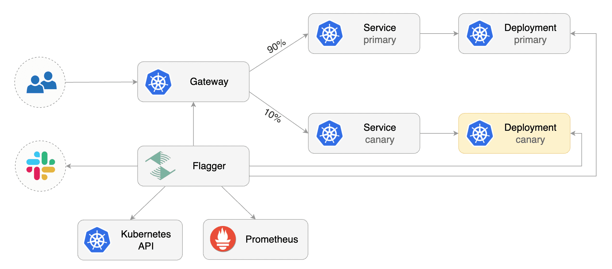

The Flagger team is proud to bring you Kubernetes Gateway API support as
part of the [1.19.0 release](https://github.com/fluxcd/flagger/releases/tag/v1.19.0).
Read here about why this is a significant development in Flagger and how
you can make use of it.

## What is Flagger?

Flagger is a progressive delivery tool that automates the release process for applications running on Kubernetes.
It reduces the risk of introducing a new software version in production by gradually shifting traffic to the
new version while measuring metrics and running conformance tests.



[Flagger](https://github.com/fluxcd/flagger) was designed to give developers confidence in automating production
releases using delivery techniques such as:

- Canary release (progressive traffic shifting)
- A/B Testing (HTTP headers and cookies traffic routing)
- Blue/Green (traffic switching and mirroring)

## What is the Gateway API?

The [announcement blog
post](https://kubernetes.io/blog/2021/04/22/evolving-kubernetes-networking-with-the-gateway-api/)
defines its design principles as

> - **Expressiveness** - In addition to HTTP host/path matching and TLS,
>   Gateway API can express capabilities like HTTP header
>   manipulation, traffic weighting & mirroring, TCP/UDP routing, and
>   other capabilities that were only possible in Ingress through
>   custom annotations.
> - **Role-oriented design** - The API resource model reflects the
>   separation of responsibilities that is common in routing and
>   Kubernetes service networking.
> - **Extensibility** - The resources allow arbitrary configuration
>   attachment at various layers within the API. This makes granular
>   customization possible at the most appropriate places.
> - **Flexible conformance** - The Gateway API defines varying
>   conformance levels - core (mandatory support), extended (portable
>   if supported), and custom (no portability guarantee), known
>   together as [flexible
>   conformance](https://gateway-api.sigs.k8s.io/concepts/guidelines/#conformance).
>   This promotes a highly portable core API (like Ingress) that still
>   gives flexibility for Gateway controller implementers.


Gateway API exposes a more general API than Ingress for proxying and you
can use it for more protocols than just HTTP (although most
implementations support just HTTP for now). It models more
infrastructure components to provide better deployment and management
options. There are three core components to the Gateway API:

- `GatewayClass`: This lets us define which controller implementation we
  want to use.
- `Gateway`: A `Gateway` resource is attached to a `GatewayClass` and
  has a 1:1 relationship with the actual load balancing infra. It lets
  us define a set of listeners, through which we can specify which
  Route resources to evaluate for routing, amongst other things.
- `HTTPRoute`: This is a `Route` resource that is specific for HTTP
  requests. It defines routing rules such as filters, path and
  header matches, etc. and which services should the request be
  forwarded to.

## How does this work in Flagger?

Flagger makes use of the fact that `HTTPRoute` allows users to define a
weight related to each reference to a service inside a routing rule. These weights are used to determine
which service should receive a request. For example, if we want to send
10% of our traffic to another service, we can define a `HTTPRoute` like:

```yaml
apiVersion: gateway.networking.k8s.io/v1alpha2
kind: HTTPRoute
metadata:
  name: foo-route
spec:
  parentRefs:
  - name: example-gateway
  hostnames:
  - "foo.example.com"
  rules:
  - matches:
    - path:
        type: PathPrefix
        value: /login
    backendRefs:
    - name: foo-primary
      port: 8080
      weight: 90
    - name: foo-canary
      port: 8080
      weight: 10
```

This sends 10% of all requests coming to foo.example.com/login to the
new service and the other 90% requests go to the stable service. You can
read more about traffic splitting in Gateway API
[here](https://gateway-api.sigs.k8s.io/v1alpha2/guides/traffic-splitting/).

Flagger fully automates the creation of `HTTPRoutes` with the appropriate header matches,
path matches, etc and attaches the primary and canary service to the
`HTTPRoute`. During the canary analysis, the weights related to both the
services are adjusted accordingly.


If you want to get started right away, have a look at [our
tutorial](/flagger/tutorials/gatewayapi-progressive-delivery),
which shows you how to use Contour's Gateway API implementation and Flagger to automate canary
deployments. It won't take long to follow, but will convey how powerful
this integration is.

## Flagger works with all implementations

With added support for Gateway API, Flagger now works with all
[implementations](https://gateway-api.sigs.k8s.io/implementations/),
which means that as of today these are natively supported: Contour,
Emissary-Ingress, Google Kubernetes Engine, HAProxy Ingress,
HashiCorp Consul, Istio, Kong and Traefik.

The Flagger team has successfully tested Contour and Istio using
the `v1beta2` Gateway API. Starting with Flagger v1.19, the Gateway API
is part of our end-to-end test suite using the Contour implementation.

## How metrics work

The Gateway API defines a common interface for traffic management, which
saves us from doing anything vendor specific. But the metrics related to
the traffic, still are specific to the Ingress/Service Mesh you're
using. Flagger lets you define a custom resource `MetricTemplate`,
which runs queries against your metrics provider and calculates stats
like error rate, latency, etc. For example, if you're using Istio with
Gateway API, the below `MetricTemplate` would calculate the error rate
using Prometheus as a provider during a canary analysis:

```yaml
apiVersion: flagger.app/v1beta1
kind: MetricTemplate
metadata:
  name: error-rate
  namespace: istio-system
spec:
  provider:
    type: prometheus
    address: http://prometheus.istio-system:9090
  query: |
    100 - sum(
        rate(
            istio_requests_total{
                reporter="source",
                destination_workload_namespace="{{ namespace }}",
                destination_workload=~"{{ target }}",
                response_code!~"5.*"
            }[{{ interval }}]
        )
    )
    /
    sum(
        rate(
            istio_requests_total{
                reporter="source",
                destination_workload_namespace="{{ namespace }}",
                destination_workload=~"{{ target }}"
            }[{{ interval }}]
        )
    ) * 100
```

Similarly the below MetricTemplate allows Flagger to compute the latency
when using any Envoy based Ingress/Service Mesh:

```yaml
apiVersion: flagger.app/v1beta1
kind: MetricTemplate
metadata:
  name: latency
  namespace: flagger-system
spec:
  provider:
    type: prometheus
    address: http://flagger-prometheus:9090
  query: |
    histogram_quantile(0.99,
      sum(
        rate(
          envoy_cluster_upstream_rq_time_bucket{
            envoy_cluster_name=~"{{ namespace }}_{{ target }}-canary_[0-9a-zA-Z-]+",
          }[{{ interval }}]
        )
      ) by (le)
    ) / 1000
```

## Further Reading

- [Kubernetes Gateway API](https://gateway-api.sigs.k8s.io/)
- [Evolving Kubernetes networking with the Gateway API \| Kubernetes
  Blog](https://kubernetes.io/blog/2021/04/22/evolving-kubernetes-networking-with-the-gateway-api/)

## Conclusion

The Gateway API is in alpha. As of 2022-03-11 its [GitHub
README](https://github.com/kubernetes-sigs/gateway-api#status)
says

> The latest supported version is `v1alpha2` as released by the [v0.4.0
> release](https://github.com/kubernetes-sigs/gateway-api/releases/tag/v0.4.0)
> of this project. This version of the API is expected to graduate to
> beta in the future with relatively minimal changes.

We as the Flux project will update the integration once the API becomes
beta/stable.

Thanks a lot [Sanskar Jaiswal](https://github.com/aryan9600) for working on [the
implementation](https://github.com/fluxcd/flagger/pull/1108)!

We are excited to bring this feature to you and we love feedback! Please
let us know if you have feedback, questions or how you are going to use
this!
