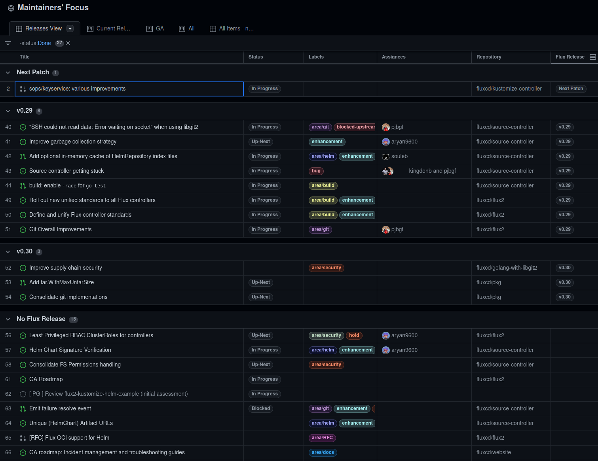
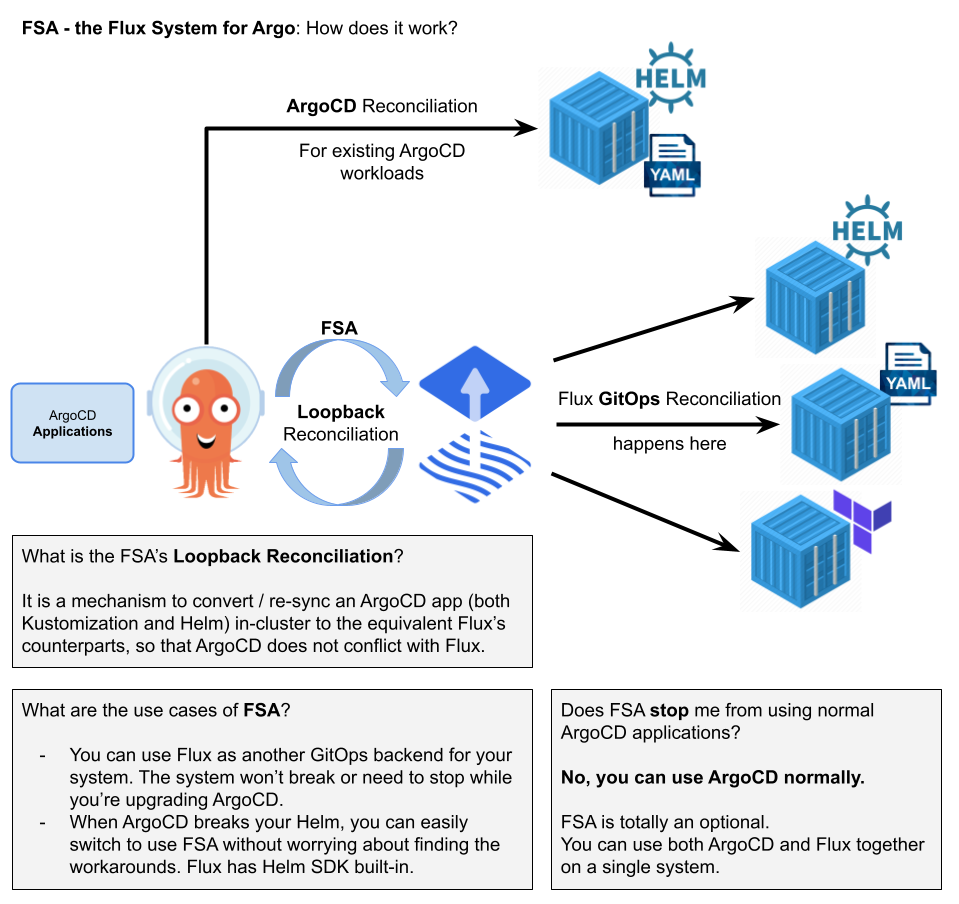
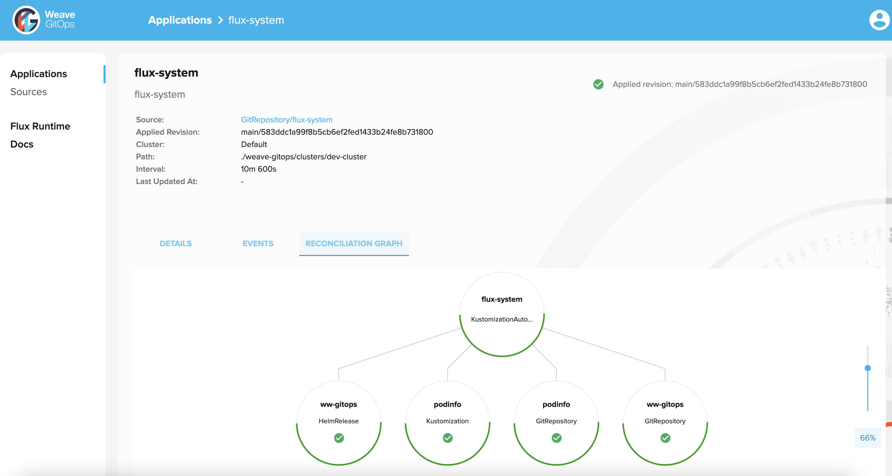
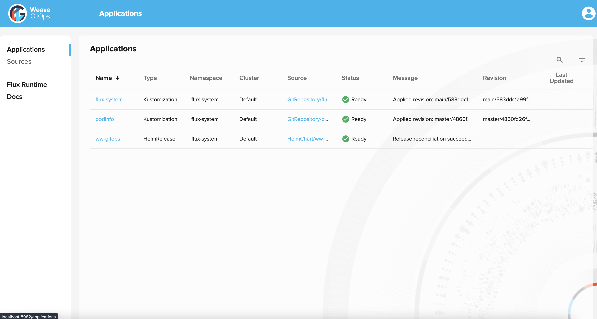

As the Flux family of projects and its communities are growing, we
strive to inform you each month about what has already landed, new
possibilities which are available for integration, and where you can get
involved. Read our [last update here](/blog/2022/03/february-update/).

It's the beginning of April 2022 - let's recap together what happened in
March - it has been a lot!

**Update:** Earlier versions of this post referred to the pre-KubeCon
Bug Bash. Unfortunately we had to cancel our participation.

## News in the Flux family

### Source API getting more mature in Flux 0.28

The latest release of Flux is 0.28. One big focus was to graduate its
Source API to `v1beta2`.

🤖 To upgrade and fully benefit from this, please follow [the upgrade
instructions](https://github.com/fluxcd/flux2/discussions/2567).

This work had been a long time in the making, partly because of a larger
refactoring effort, which we [had reported
about](/blog/2021/08/august-2021-update/#controller-refactoring-coming-up)
previously. The idea was to abstract reusable components and
functionality into the [fluxcd/pkg
repository](https://github.com/fluxcd/pkg). While this is
an ongoing effort, we are very happy with what we have learned so far
and are convinced that we will get better test coverage this way and are
providing external projects with a solid foundation to build on as well.

In this release we added new features and improvements across the board,
here's a quick list of our highlights:

- Add the Git commit message (first 50 characters) to the events and
  alerts issued by `GitRepository` sources.
- Improve performance for Helm repository index and chart download
  operations.
- Improve observability for the Git, Helm and Bucket resources by
  providing explicit status conditions which conform to the
  Kubernetes `kstatus` conventions.
- A new annotation
  ([kustomize.toolkit.fluxcd.io/ssa](http://kustomize.toolkit.fluxcd.io/ssa):
  merge) is available for allowing Flux to [patch cluster
  addons](/flux/faq/#how-to-patch-coredns-and-other-pre-installed-addons)
  such as CoreDNS.
- Add [Azure Blob Storage](/flux/components/source/buckets/#azure)
  native support to Flux Bucket sources.
- Add support for decrypting secrets with SOPS and [Azure Key
  Vault](/flux/components/kustomize/kustomization/#azure-key-vault-secret-entry)
  on multi-tenant clusters.
- Retry the Git operations on conflict errors to allow running
  bootstrap in-parallel for multiple clusters that target the same
  repository.
- Add a new transport for `libgit2` for improved reliability
  (experimental). We [wrote about this in our last blog
  post](/blog/2022/03/flux-puts-the-git-into-gitops/#whats-next-in-git-things)
  as well.

### Latest Flagger release comes with Gateway API support

We [blogged about this separately
already](/blog/2022/03/flagger-adds-gateway-api-support/)
as it is such a big achievement for Team Flagger. With its recent 1.19
release, Flagger brings Gateway API support. This means native
Progressive Delivery for all providers supported by the Gateway API
project within Kubernetes. Be sure to check out the blog post to find
out how to integrate this into your setups.

The Flux community is happy and proud that
[Flagger](/flagger/) is part of our effort
to bring GitOps solutions to the world.

### Flux "Maintainers' Focus" Project Board

Being clear about our priorities in Flux development was always
important to us as a project. Discussing this regularly in weekly
meetings to be able to get everyone's input was one measure to do this.
Updating [our roadmap](/roadmap/) regularly was another. [Monthly
updates](/tags/monthly-update/) posted on all of Flux channels yet another.

As the development team around Flux grew and we had more work to be
coordinated across Flux controllers with e.g. teams at cloud providers,
bigger pieces of code refactoring, etc, we are now pleased to use
GitHub's new project boards for having a ["Maintainer's Focus"
page](https://github.com/orgs/fluxcd/projects/6/views/1)
which shows what's bookmarked for the upcoming Flux releases - this
might also be a good resource to check if you would like to get involved
with Flux development and help out with one of the next releases.

#### On our way to Flux GA

A particular focus in our project management is GA, the big target we
have been following ever since we started the rewrite of Flux. As you
can see on the [Flux Roadmap](/roadmap/),
we closed out the vast majority of items and last year we [already
announced](/blog/2021/07/july-2021-update/#from-now-on-flux-apis-will-be-stable)
that the Flux APIs will be stable from now on. So what's left is to
finish the refactoring for the remaining controllers, complete some
parts of the documentation and some general tidying up. If you want more
detail, or would like to help us to achieve this big milestone, you
[can follow the work
here](https://github.com/orgs/fluxcd/projects/6/views/9).

### Security news

The latest addition to our [blog series about Flux Security](/tags/security/)
was a post called [«Using Pod Security Standard
\"restricted\"»](/blog/2022/03/security-pod-security-standard-restricted/).
Go check it out, as it you will learn more about Kubernetes' pod
security standard, seccomp and how we apply this in Flux to keep you
safe.

The already mentioned [blog post about our tight integration with Git
APIs](/blog/2022/03/flux-puts-the-git-into-gitops/#whats-next-in-git-things)
could also be of interest, as we discuss upcoming plans for integrating
sha256 hash support.

### Flux Ecosystem

What makes Flux great is its ecosystem. Tools and services which
integrate seamlessly because that's how the Cloud Native ecosystem
works. We are celebrating all of this on the [Flux Ecosystem
page](/ecosystem/). (Please add yourself if your tool or integration
isn't listed yet.)

#### Renovate

Here are a couple of newcomers. Firstly, there's Renovate, which is an
Open Source tool to automate:

- Detecting dependencies in a repository (Open Source and
  private/closed source)
- Checking if there are dependency updates
- Creating commits and Merge/Pull Requests to update dependencies
- Showing the release notes

We are very pleased that the team at Renovate added a [manager to
integrate with
Flux](https://docs.renovatebot.com/modules/manager/flux/).

#### GitOps Visual Studio Code Extension

The [Weaveworks GitOps
Extension](https://github.com/weaveworks/vscode-gitops-tools)
provides an intuitive way to manage, troubleshoot and operate your
Kubernetes environment following the GitOps operating model,
accelerating your development lifecycle and simplifying your continuous
delivery pipelines.

Weaveworks GitOps Extension integrates with [Kubernetes
Tools](https://marketplace.visualstudio.com/items?itemName=ms-kubernetes-tools.vscode-kubernetes-tools),
[kubectl](https://kubernetes.io/docs/reference/kubectl/overview/)
and [flux](/) for a consolidated and tightly integrated user experience.





🚧 This extension is under active development and currently available as
an alpha product.

#### Flux Subsystem for Argo

[FSA (aka Flamingo)](https://github.com/flux-subsystem-argo/flamingo)
is the Flux Subsystem for Argo. Its container image can be used as a drop-in
replacement for the equivalent ArgoCD version to visualise, and manage
Flux workloads, alongside ArgoCD.

How does it work?

🚧 This project is currently available as a technology preview.

#### Terraform-controller

In some of our last issues we already reported about the
[terraform-controller hitting the
streets](/blog/2022/01/january-update/#community-project-terraform-controller-for-flux).
It's a [Flux controller which reconciles
Terraform](https://github.com/chanwit/tf-controller)
resources in the GitOps way. We received a short report from the team
regarding their achievements of the first quarter of the year:

- TF-controller
  [v0.9.3](https://github.com/weaveworks/tf-controller/releases/tag/v0.9.3)
  is considered the most stable release to date.
- We reached 200 stars on GitHub, now at 211.
- It\'s been 45 releases so far.
- We re-factored it to the Controller/Runner architecture.
- Standing on the shoulders of our giants (Flux), we successfully
  implemented the multi-tenancy feature in 2 months.
- We cleared all Q1
  [roadmap](https://github.com/weaveworks/tf-controller#roadmap)
  with 68.2% test coverage.
- We started seeing its adoption in public, from [a Helm Controller
  user](https://github.com/fluxcd/helm-controller/issues/448),
  for example.
- We got its [first promo
  video](https://www.linkedin.com/embed/feed/update/urn:li:ugcPost:6913743507681656832).
- Chanwit Kaewkasi, Piaras Hoban and Tom Huang are the core team
  around it now!

#### Weave GitOps Core

The team around Weave GitOps has been busy and would love to hear your
feedback. If you haven't heard about it just yet, its GitHub says:

> [Weave GitOps](https://github.com/weaveworks/weave-gitops) enables an effective
> GitOps workflow for continuous delivery of applications into Kubernetes
> clusters. It is based on CNCF Flux, a leading GitOps engine.

The Flux community particularly loved the last sentence.

[Getting started with it](https://web.archive.org/web/20240213192000/https://docs.gitops.weave.works/docs/getting-started/intro/)
is very straight-forward. Please take up the offer of them and give
feedback, they are building a very nice tool based on Flux!

## Recent & Upcoming Events

It's important to keep you up to date with new features and developments
in Flux and provide simple ways to see our work in action and chat with
our engineers.

### Recent Events (ICYMI) 📺

We feel blessed to have such a big community of users, contributors and
integrators and so many are happy to talk about their experiences. In
March here are a couple of talks we would like to highlight:

- Flux Maintainer Stefan Prodan at our friends of Tanzu Tuesday: [Mar
  15: Tanzu Tuesdays \#89: GitOps with Flux on Kubernetes with
  Stefan Prodan](https://youtu.be/XG2uuAMTJg8)
- Flux contributor and VMware Tanzu Advocate Leigh Capili talking
  about a subject close to the heart of many - security and
  debugging 💖: [Mar 16: Securing GitOps Debug Access with Flux,
  Pinniped, Dex, & GitHub - Leigh
  Capili](https://youtu.be/etbvuV9EjLc)
- Weaveworks' DX Engineer Priyanka Pinky and Anchore's OSS Lead Dan
  Luhring dive deeper into security subjects here: [Mar 24:
  Security: The Value of SBOMs with Dan Luhring & Priyanka
  Ravi](https://youtu.be/-3K74I7t7CQ)
- Want to hear from professionals who brought GitOps to 7000 devs in a
  heavily regulated industry? Mae Large, Pinky & Russ Palmer reflect
  on their work together: [Mar 30: From Zero to GitOps Heros with
  Mae Large, Russ Parmer, Priyanka
  Ravi](https://youtu.be/73kOXNTrNVU)

### Upcoming Events 📆

We are happy to announce that we have a number of events coming up in
April - tune in to learn more about Flux and GitOps best practices, get
to know the team and join our community.

[April 7: GitOps with Flux on AKS with Kingdon Barrett & Jonathan
Innis](https://www.meetup.com/GitOps-Community/events/284923617/)

> - **Introduction to GitOps & Flux**  
>   You may have heard the term GitOps - it has become a bit of a
>   buzzword, but it's so much more! The benefits of GitOps are real -
>   bringing better security, reliability, velocity and more! And the
>   project that started it all was Flux - a CNCF Incubating project
>   developed and later donated by Weaveworks (the GitOps company who
>   coined the term).
> - **GitOps in Microsoft Azure with Flux**  
>   To provide Kubernetes admins and app developers with the latest
>   tooling for managing configuration and application deployment,
>   Azure enables GitOps with Flux. In this session Jonathan Innis,
>   Software Engineer II at Microsoft, will live demo how CNCF Flux is
>   enabled in Azure Arc enabled Kubernetes and Azure Kubernetes
>   Services and also give a sneak peek at implementation of Flux.

[April 13: GitOps: Core Concepts & Ways of Structuring Your
Repos](https://www.meetup.com/GitOps-Community/events/284956250/)

> Whether you're new to GitOps or a seasoned pro, this talk is for you!
> We\'ll start with the basics of how/where to get started, and then
> dive into one of the most asked GitOps questions: how to structure
> your repository!
>
> During this talk, Scott & Pinky will review the Core Concepts of Flux
> including Git Sources, Reconciliation, Helm Releases, Kustomization,
> and Bootstrapping, to get you ramped up with how to think with a
> GitOps mindset! Then they'll dive into and discuss considerations for
> and demo ways of structuring your repositories: monorepo, repo per
> environment, repo per team, or repo per app.

[April 20: DoK Talks \#131: Flux for Helm Users by Scott
Rigby](https://www.meetup.com/GitOps-Community/events/284903516/)

> Welcome Helm users! CNCF Flux has a best-in-class way to use Helm
> according to GitOps principles. For you, that means improved security,
> reliability, and velocity - no more being on the pager on the weekends
> or having painful troubleshooting or rollback when things go wrong.
>
> Built on Kubernetes controller-runtime, Flux's Helm Controller is an
> example of a mature software agent that uses Helm's SDK to full
> effect.
>
> Flux's biggest addition to Helm is a structured declaration layer for
> your releases that automatically gets reconciled to your cluster based
> on your configured rules:
>
> ⭐️ The Helm client commands let you imperatively do things\
> ⭐️ Flux Helm Custom Resources let you declare what you want the Helm
> SDK to do automatically.
>
> In addition, Scott will show how to use Helm Charts to run reliable
> stateful workloads.

[April 27: Reconcile Terraform Resources the GitOps Way with Jose
Talavera](https://www.meetup.com/GitOps-Community/events/284947777/)

> Some organisations depend heavily on their Terraform scripts because
> they are using multiple providers, have built wrappers around those
> providers, and might even be deploying their application code along
> with Terraform. Additionally, GitOps is in every IT roadmap, but
> unfortunately Terraform doesn't have an easy way to reconcile its
> resources. This means that teams won\'t notice a sudden change in the
> running environment often with critical consequences.
>
> What if teams could ensure that what they defined in the Terraform HCL
> code is what is always running and available? Flux can continuously
> look for changes on your Terraform resources and do reconciliation
> with the desired state. You can rest easy knowing that your
> deployments are always up to date with your desired state. This
> enables you to take advantage of all the benefits of GitOps:
> streamlined and secure deployments, quicker time to market, and more
> time to concentrate on app development!
>
> Jose provides an in-depth look at TF-controller, a Flux-based
> controller to reconcile your Terraform resources the GitOps Way. Jose
> will share insights on the many benefits of TF-Controller, then demo a
> common use case implementation.

### Flux Bug Scrub

Our Flux Bug Scrubs still are happening on a weekly basis and remain one
of the best ways to get involved in Flux. They are a friendly and
welcoming way to learn more about contributing and how Flux is organised
as a project.

The next dates are going to be:

- [April 6 at 1pm UTC/ 2pm
  CET](https://www.meetup.com/GitOps-Community/events/fbhnssydcgbjb/)
- [April 14 at 10am PT / 1pm
  ET](https://www.meetup.com/GitOps-Community/events/ndjjssydcgbsb/)
- [April 20 at 1pm UTC/ 2pm
  CET](https://www.meetup.com/GitOps-Community/events/fbhnssydcgbbc/)
- [April 28 at 10am PT / 1pm
  ET](https://www.meetup.com/GitOps-Community/events/ndjjssydcgblc/)

We are flexible with subjects and often go with the interests of the
group or of the presenter. If you want to come and join us in either
capacity, just show up or if you have questions, reach out to Kingdon on
Slack.

We really enjoyed this [demo of the k3d git
server](https://www.youtube.com/watch?v=hNt3v0kk6ec)
recently. It's a local Git server that runs outside of Kubernetes, to
support offline dev in a realistic but also simple way that does not
depend on GitHub or other hosted services.

### KubeCon / CloudNativeCon Europe 2022 coming up

As every other project in the Cloud Native space, we are very busy
preparing everything for [KubeCon / CloudNativeCon Europe
2022](https://events.linuxfoundation.org/kubecon-cloudnativecon-europe/),
which is going to be 16-20 May 2022 in Valencia, Spain (and virtual of
course!).

We will post a separate announcement as soon as everything is confirmed,
but we already want to inform you about what's likely to happen, so you
can plan accordingly or collaborate with us!

#### The Bug Bash

Unfortunately we will not be participating in the Bug Bash this KubeCon!

Despite earlier announcements claiming we would do this, we felt we
could not do this well enough. If you were looking forward to this,
we are sorry - but you know what: we still have the weekly Bug Scrub! Your
weekly one-on-one mentoring to learn the ropes of working on Flux!

#### Monday, 16 May

13:00 - 17:00 (Room 2H - Event Center): Flux Project Meeting: We will
kick off the Flux get-togethers and festivities with an in-person
meeting for all Flux users, contributors, maintainers and generally
interested folks. This will be an opportunity to get to know each other,
have a chat, see what people's interests are and to potentially start
contributing. ([Sign up
here](https://linuxfoundation.surveymonkey.com/r/WYGBGPZ).)
Contact people on the ground are: Somtochi Onyekwere and Scott Rigby.

#### Tuesday 17 May - [GitOpsCon](https://events.linuxfoundation.org/gitopscon-europe/program/schedule/)

Lots and lots of talks about GitOps in general and Flux in particular,
here's a short selection of what to look forward to:

- [What is GitOps and How to Get It Right - Dan Garfield (Codefresh);
  Chris Short (AWS) & Scott Rigby
  (Weaveworks)](https://sched.co/zrpk) (9:00 - 9:35)
- [Hiding in Plain Sight - How Flux Decrypts Secrets -
  Somtochi Onyekwere (Weaveworks)](https://sched.co/zrq5)
  (11:05 - 11:15)
- [Taming the Thundering Gitops Herd with Update Policies - Joaquim
  Rocha & Iago López Galeiras (Microsoft)](https://sched.co/zrqK)
  (11:35 - 11:45)
- [GitOps and Progressive Delivery with Flagger, Istio and Flux -
  Marco Amador (Anova)](https://sched.co/zrqW) (13:20-13:30)
- [Creating A Landlord for Multi-tenant K8s Using Flux, Gatekeeper,
  Helm, and Friends - Michael Irwin (Docker)](https://sched.co/zrqf)
  (13:35-14:05)
- [GitOps, A Slightly Realistic Situation on Kubernetes with Flux -
  Laurent Grangeau (Google) & Ludovic Piot
  (theGarageBandOfIT)](https://sched.co/zrqi) (14:10 - 14:40)
- [Solving Environment Promotion with Flux - Sam Tavakoli & Adelina
  Simion (Form3)](https://sched.co/zrql) (14:10 - 14:40)
- [Managing Thousands of Clusters and Their Workloads with Flux - Max
  Jonas Werner (D2iQ)](https://sched.co/zrqu) (14:55 - 15:25)
- [Crossing the Divide: How GitOps Brought AppDev & Platform Teams
  Together! - Russ Palmer (State Farm) & Priyanka 'Pinky' Ravi
  (Weaveworks)](https://sched.co/zrqx) (15.30 - 16:00)
- [GitOps Everything!? We Sure Can!, AppsFlyer](https://sched.co/zrr0)
  (15:30 - 16:00)
- [Lightning Talk: Addressing Log4Shell with Software Supply Chains -
  Duane DeCapite (VMware)](https://sched.co/ytwg)
  (18:04 - 18:09)

#### Wednesday 18 May - Friday May 20 - [KubeCon](https://kccnceu2022.sched.com/?iframe=no)

Over these three days we are going to be at the Flux booth (both
virtually and on the ground), so come over for a chat. We are planning
loads of talks, demos and ample time to have a chat, get to know
everyone, ask questions and have great new ideas together!

On top of that, here is a list of talks, workshops and sessions during
those days:

- Wed 18: [Flux Security Deep Dive - Stefan Prodan
  (Weaveworks)](https://sched.co/ytlV) (11:55 - 12:30)
- Wed 18: [Intro to Kubernetes, GitOps, and Observability Hands-On
  Tutorial - Johee Chung (Microsoft) & Tiffany Wang
  (Weaveworks)](https://sched.co/ytkj) (11:00 - 12:30)
- Wed 18: [A New Generation of Trusted GitOps for Mixed K8s and
  Non-K8s End Users - Alexis & Vasu Chandrasekhara
  (SAP)](https://sched.co/ytmW) (15:25 - 16:00)
- Thu 19: [GitOps to Automate the Setup, Management and Extension a
  K8s Cluster - Kim Schlesinger (DigitalOcean)](https://sched.co/yto4)
  (11:00 - 12:30)
- Thu 19: Flux Project Office Hour - Paulo Gomes (Weaveworks)
  (13:30 - 14:15)
- Fri 20: [Observing Fastly's Network at Scale Thanks to K8s and the
  Strimzi Operator - Fernando Crespo & Daniel Caballero,
  (Fastly)](https://sched.co/ytrM) (11:00 - 11:35)
- Fri 20: [Simplifying Service Mesh Operations with Flux and
  Flagger - Mitch Connors (Google) &
  Stefan Prodan (Weaveworks)](https://kccnceu2022.sched.com/#)
  (14:55 - 15:30)

Please note: all of the above might be subject to change. Please
double-check the schedule beforehand. Please reach out to Vanessa
Abankwah or Daniel Holbach on Slack if you have questions or would like
to participate in any of the above.

We very much look forward to seeing you there!

## In other news

### People writing/talking about Flux

We love it when you all write about Flux and share your experience,
write how-tos on integrating Flux with other pieces of software or other
things. Give us a shout-out and we will link it from this section! ✍

[Stefan Prodan on Flux, Flagger, and the Operator Pattern Applied to
Non-Clustered
Resources](https://www.infoq.com/podcasts/flux-flagger-operator-pattern/)

> In this podcast, Wesley Reisz talks to Stefan Prodan about Flux and
> Flagger--two tools built on top of Flux's GitOps Toolkit. After
> discussing some of the architectural differences between Flux v1 and
> v2 and discussing some of the GitOps toolkit use cases, the two
> discuss the operator pattern on Kubernetes. They specifically spend
> time talking about the operator pattern, why developers may opt to
> build API's on top of Kubernetes, and how the pattern can be used on
> non-clusters resources. The podcast wraps with a discussion on the
> work being down towards Flux v2's push to GA.

[A deep dive to Canary Deployments with Flagger, NGINX and Linkerd on
Kubernetes](https://devopsian.net/posts/kubernetes-canary-deployments/)

> Chen wrote up a nice tutorial on using Flagger and has this to say
> about Flagger itself:
>
> *Flagger is a progressive delivery tool that automates the release
> process for apps on Kubernetes. It can gradually shift traffic to the
> new version while measuring metrics and running conformance tests.
>
> I prefer flagger because of two main points:
>
> - It integrates natively: it watches Deployment resources, while Argo
> uses its own CRD Rollout
> - It is highly extensible and comes with batteries included: it
> provides a load-tester to run basic, or complex scenarios*

[GitOpsify Cloud Infrastructure with Crossplane and
Flux](https://itnext.io/gitopsify-cloud-infrastructure-with-crossplane-and-flux-d605d3043452)

> Check out this article by Piotr who dives into how to automate the
> provisioning of cloud resources via Crossplane and combine it with
> GitOps practices. At the end of it, you will have stopped using
> kubectl to manage resources, but rather delegate this to Flux using
> Git. GitOps for the win!

[CNCF Live Webinar: From Pipelines to Supply Chains: Level up with
Supply Chain
Choreography](https://www.cncf.io/online-programs/cncf-live-webinar-from-pipelines-to-supply-chains-level-up-with-supply-chain-choreography/)

> Cora Iberkleid and David Espejo at VMware talk about Cartographer.
> They say: *The Kubernetes ecosystem has a rich set of solutions for
> various stages of CI/CD. Tools like Flux, Tekton, kpack, Knative,
> ArgoCD, and more each enable big steps forward in establishing a
> modern path to production. And yet, the teams and organizations that
> adopt these tools still struggle with complex, DIY snowflake
> pipelines. The challenge can be creating and maintaining imperative
> scripts; orchestrating the flow of information between tools; driving
> reusability; adopting GitOps practices; and enabling proper separation
> of concerns.*

### News from the Website and our Docs

#### Flux Adopters shout-out

We are very pleased to announce that the following adopters of Flux have
come forward and added themselves to our website:
[Netrics](https://netrics.ch),
[Syntasso](https://syntasso.io/),
[EmploymentHero](https://employmenthero.com/),
[Anchore](https://anchore.com/) and [Giant
Swarm](https://giantswarm.io/).

If you have not already done so, [use the instructions
here](/adopters/) or give us a ping and we
will help to add you. Not only is it great for us to get to know and
welcome you to our community. It also gives the team a big boost in
morale to know where in the world Flux is used.

#### More docs and website news

We are constantly improving our documentation and website - here are a
couple of small things we landed recently.

Documentation:

- This was a big effort: The Source API documentation has been
  refactored to be more user-friendly. See the v1beta2 specification
  for: [Git Repositories](/flux/components/source/gitrepositories/),
  [Buckets](/flux/components/source/buckets/) and
  [Helm Repositories](/flux/components/source/helmrepositories/).
- [Flux from
  End-to-End](/flux/flux-e2e/): This was a big part of work as well.
  It describes the flow of data through Flux, from End to End.
- [Cheatsheets](/flux/cheatsheets/bootstrap/):
  Various configurations of Flux controllers at install time are now
  available as a [bootstrap
  cheatsheet](/flux/cheatsheets/bootstrap/).
- We added new [FAQ entries](/flux/faq/).
- We added new [resources](/resources/) to the site.

In terms of documentation, we are working on a [bigger piece of
navigation and information architecture
refactoring](https://github.com/fluxcd/website/pull/845).
This was [pointed out to us as piece of
feedback](/blog/2022/01/january-update/#cncf-techdocs-team-assess-flux-docs-and-website)
from the CNCF TechDocs team. As the Flux project has grown over time, we
appreciate this opportunity to restructure our docs to make them as easy
to find as possible. Your feedback matters here, so if you could leave
us a note with your impression [on this
PR](https://github.com/fluxcd/website/pull/845), we would
love to hear from you.

And finally on our blog, we added a tag cloud and a note to blog posts
that are older than a year - we also typed up [how to
blog](https://github.com/fluxcd/website/tree/main/internal_docs/how-to-write-a-blog-post.md).

Thanks a lot to these folks who contributed to docs and website: Kingdon
Barrett, Stefan Prodan, Stacey Potter, Hidde Beydals, Sebastian
Bernheim, Ihor Sychevskyi, Colin Humphreys, Filip Sequeira, Jan Lauber,
Marcus Noble, Morgan Christiansson, Satish Kumar Kardarkarai Mani, Tom
Huang and Nguyen Duc Toan.

## Flux Project Facts

We are very proud of what we have put together. We want to reiterate
some Flux facts - they are sort of our mission statement with Flux.

1. 🤝 Flux provides GitOps for both apps or
  infrastructure. Flux and Flagger deploy apps with
  canaries, feature flags, and A/B rollouts. Flux can also manage
  any Kubernetes resource. Infrastructure and workload dependency
  management is built-in.
1. 🤖 Just push to Git and Flux does the rest. Flux
  enables application deployment (CD) and (with the help of Flagger)
  progressive delivery (PD) through automatic reconciliation. Flux
  can even push back to Git for you with automated container image
  updates to Git (image scanning and patching).
1. 🔩 Flux works with your existing tools: Flux works with
  your Git providers (GitHub, GitLab, Bitbucket, can even use
  s3-compatible buckets as a source), all major container
  registries, and all CI workflow providers.
1. 🔒 Flux is designed with security in mind: Pull vs. Push,
  least amount of privileges, adherence to Kubernetes security
  policies and tight integration with security tools and
  best-practices. Read more about our security considerations.
1. ☸️ Flux works with any Kubernetes and all common Kubernetes
  tooling: Kustomize, Helm, RBAC, and policy-driven
  validation (OPA, Kyverno, admission controllers) so it simply
  falls into place.
1. 🤹 Flux does Multi-Tenancy (and "Multi-everything"):
  Flux uses true Kubernetes RBAC via impersonation and supports
  multiple Git repositories. Multi-cluster infrastructure and apps
  work out of the box with Cluster API: Flux can use one Kubernetes
  cluster to manage apps in either the same or other clusters, spin
  up additional clusters themselves, and manage clusters including
  lifecycle and fleets.
1. 📞 Flux alerts and notifies: Flux provides health
  assessments, alerting to external systems and external events
  handling. Just "git push", and get notified on Slack and [other
  chat
  systems](https://github.com/fluxcd/notification-controller/blob/main/docs/spec/v1beta1/provider.md).
1. 👍 Users trust Flux: Flux is a CNCF Incubating project
  and was categorised as \"Adopt\" on the [CNCF CI/CD Tech
  Radar](https://radar.cncf.io/2020-06-continuous-delivery)
  (alongside Helm).
1. 💖 Flux has a lovely community that is very easy to work
  with! We welcome contributors of any kind. The
  components of Flux are on Kubernetes core controller-runtime, so
  anyone can contribute and its functionality can be extended very
  easily.

## Over and out

If you like what you read and would like to get involved, here are a few
good ways to do that:

- Join our [upcoming dev meetings](/community/#meetings) on
  2022-04-07 or 2022-04-13.
- Talk to us in the \#flux channel on [CNCF Slack](https://slack.cncf.io/)
- Join the [planning discussions](https://github.com/fluxcd/flux2/discussions)
- And if you are completely new to Flux, take a look at our [Get
  Started guide](/flux/get-started/) and give us feedback
- Social media: Follow [Flux on Twitter](https://twitter.com/fluxcd),
  join the discussion in the [Flux LinkedIn
  group](https://www.linkedin.com/groups/8985374/).

We look forward to working with you.
