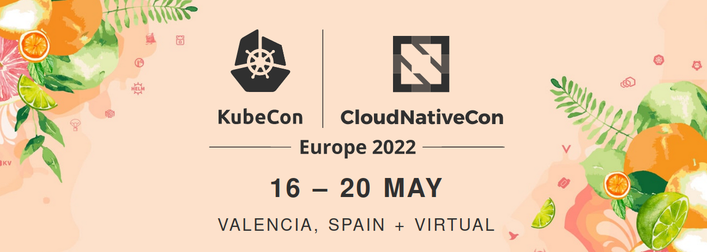
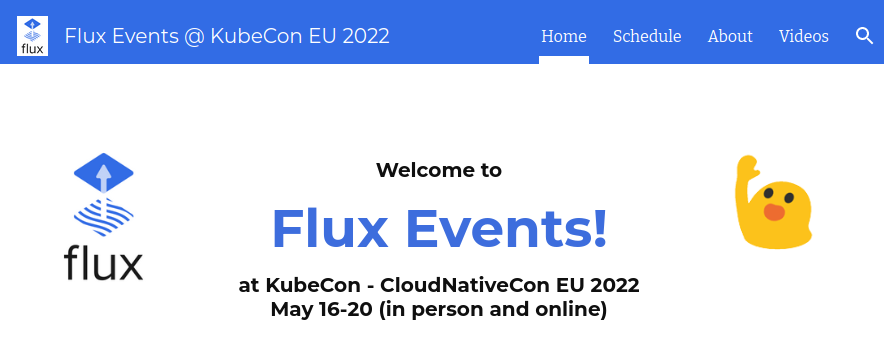

We are so excited! [KubeCon / CloudNativeCon Europe
2022](https://events.linuxfoundation.org/kubecon-cloudnativecon-europe/)
is happening 16-20 May 2022 in Valencia, Spain. Team Flux is going to be
there and we are looking forward to meeting you in-person or in our
virtual sessions, meetings and co-located events. 🎉

**Update:** 2022-05-16: We updated the details of the project meeting.

## If you can't make it to KubeCon

Many of us won't be able to attend in-person this time around. Don't
worry, we have you covered! There will be lots of opportunities to meet
Flux people online, see talks, discuss and learn from each other.

There's just one thing you need to do to join: visit our [Flux at
KubeCon site](https://bit.ly/flux_kubeconEU2022) and
bookmark it. It lists all the talks and all events - everything
Flux-related in one place.

We are also going to have a Virtual Booth. This will allow you to talk
to Flux people at all official booth times, we will have short talks,
watch some of the talks together and bring like-minded people together.
We can't wait to meet you there.

Visit our [Flux at KubeCon site](https://bit.ly/flux_kubeconEU2022)
and bookmark it now!

## 🎉 Flex your Flux knowledge and win prizes! 🎉

If you are at KubeCon, this is your chance to get a limited edition
T-shirt (while supplies last) and a chance to win a meeting with a Flux
or Flagger maintainer!




Essentially what you need to do is

1. Visit the \"Flux Booth in the Project Pavilion\"
1. You will be given a Flux question, if you answer correctly, you will
   win a T-shirt
1. If you answer an advanced question you will win a T-Shirt + an 1-hour
   meeting with a Flux maintainer (winners announced after KubeCon).
1. Make sure you tweet using \#flexyourflux

If you are entering virtually make sure you participate online by
tweeting questions will be posted during KubeCon so keep an eye out for
them !!!

Visit the Flux booth (we are number 6) in person for more info and
follow #flexyourflux from the [@fluxcd Twitter
handle](https://twitter.com/fluxcd).

## At KubeCon, watch out for these folks

There will be lots more of Team Flux in the crowds: contributors,
advocates, friends, implementers and folks in adjacent communities we
work a lot with. Find them at our physical booth or in all of the
sessions listed below.

All right, how about these folks above? They will all give sessions, MC
the events and coordinate all the things.

- **Priyanka "Pinky" Ravi** has been speaking about her experience as
   a DevOps Engineer a lot lately. She gathered a lot of experience
   working at a large insurance institution and helped them
   transition to Flux and GitOps. Since then she has been a recurring
   guest at Weave Online User Group, [GitOps
   Days](https://www.gitopsdays.com/) and elsewhere.
- **Stefan Prodan** is the creator of Flagger and has been a core
   maintainer of Flux since Weaveworks donated the project to CNCF.
   He is a maintainer of SMI and he\'s been part of Team Flux for 4+
   years already. He is also the owner of a very cute dog.
- **Scott Rigby** is a maintainer of Flux and Helm, and one of the
   chairs of OpenGitOps. He knows the ecosystem very well,
   contributed a lot to all these projects and was one of the driving
   forces behind Flux Governance.
- **Philips Laine** is a core maintainer of Flux as well and among
   other things founded the terraform-provider-flux project.
- **Vanessa Abankwah** is pulling all the strings behind the scenes.
   Not only did she organise all of our presence at KubeCon, but lots
   and lots of meetups and events where Team Flux was present.
- **Max Jonas Werner** is a core maintainer of Flux as well and makes
   sure that Flux works great in D2iQ's DKP platform. Apart from that
   he is interested in landing OCI support in Flux and loads more.

Everyone is looking forward to meeting you! 💖

## This is what is happening at KubeCon

### Monday, 16 May

13:00 - 17:00 (Room 2H - Event Center): Flux Project Meeting: We will
kick off the Flux get-togethers and festivities with an in-person
meeting for all Flux users, contributors, maintainers and generally
interested folks. This will be an opportunity to get to know each other,
have a chat and see what people's interests are. ([Sign up
here](https://linuxfoundation.surveymonkey.com/r/WYGBGPZ).)
Contact people on the ground are: Scott Rigby, Priyanka Ravi and Stefan
Prodan.

Schedule:

- 13:00 Meet and greet
- 13:30 **Intro to GitOps and Flux** lightning talk + Q&A with Pinky
- 14:00 **Flux's Top 10 Features** with Stefan Prodan + Q&A/office hours
- 15:00 **Open topics.** We can do office hours or mix and match with lightning talks on **Flux + Helm, Flux + Terraform, Flux + HashiCorp Vault, Flux + Visual Studio Code**, etc. Whatever people want.

> Click here to register
> ([here](https://linuxfoundation.surveymonkey.com/r/WYGBGPZ))
> for the Flux Project Meeting.
> (Free, in-person, no special ticket required)
>
> Details Flux Project Meeting
>
> Monday, May 16, 13:00 - 17:00 CEST
>
> Room 2H \| Event Center
>
> Space is limited *Please note: we will not have any live streaming,
> recordings, or any virtual component available for this meeting.*

### Tuesday 17 May - [GitOpsCon](https://events.linuxfoundation.org/gitopscon-europe/program/schedule/)

Lots and lots of talks about GitOps in general and Flux in particular,
here's a short selection of what to look forward to:

- [What is GitOps and How to Get It Right - Dan Garfield (Codefresh);
   Chris Short (AWS) & Scott Rigby
   (Weaveworks)](https://sched.co/zrpk) (9:00 - 9:35)
- [Hiding in Plain Sight - How Flux Decrypts Secrets - Somtochi
   Onyekwere (Weaveworks)](https://sched.co/zrq5)
   (11:05 - 11:15)
- [Taming the Thundering Gitops Herd with Update Policies - Joaquim
   Rocha & Iago López Galeiras
   (Microsoft)](https://sched.co/zrqK) (11:35 - 11:45)
- [GitOps and Progressive Delivery with Flagger, Istio and Flux -
   Marco Amador (Anova)](https://sched.co/zrqW)
   (13:20-13:30)
- [Creating A Landlord for Multi-tenant K8s Using Flux, Gatekeeper,
   Helm, and Friends - Michael Irwin
   (Docker)](https://sched.co/zrqf) (13:35-14:05)
- [GitOps, A Slightly Realistic Situation on Kubernetes with Flux -
   Laurent Grangeau (Google) & Ludovic Piot
   (theGarageBandOfIT)](https://sched.co/zrqi) (14:10 -
   14:40)
- [Solving Environment Promotion with Flux - Sam Tavakoli & Adelina
   Simion (Form3)](https://sched.co/zrql) (14:10 -
   14:40)
- [Managing Thousands of Clusters and Their Workloads with Flux - Max
   Jonas Werner (D2iQ)](https://sched.co/zrqu) (14:55 -
   15:25)
- [Crossing the Divide: How GitOps Brought AppDev & Platform Teams
   Together! - Russ Palmer (State Farm) & Priyanka 'Pinky' Ravi
   (Weaveworks)](https://sched.co/zrqx) (15.30 - 16:00)
- [GitOps Everything!? We Sure Can!,
   AppsFlyer](https://sched.co/zrr0) (15:30 - 16:00)
- [Lightning Talk: Addressing Log4Shell with Software Supply Chains -
   Duane DeCapite (VMware)](https://sched.co/ytwg)
   (18:04 - 18:09)

### Wednesday 18 May - Friday May 20 - [KubeCon](https://kccnceu2022.sched.com/?iframe=no)

Over these three days we are going to be at the Flux booth (both
virtually and on the ground), so come over for a chat. We are planning
loads of talks, demos and ample time to have a chat, get to know
everyone, ask questions and have great new ideas together!

On top of that, here is a list of talks, workshops and sessions during
those days:

- Wed 18: [Flux Security Deep Dive - Stefan Prodan
   (Weaveworks)](https://sched.co/ytlV) (11:55 - 12:30)
- Wed 18: [Intro to Kubernetes, GitOps, and Observability Hands-On
   Tutorial - Johee Chung (Microsoft) & Tiffany Wang
   (Weaveworks)](https://sched.co/ytkj) (11:00 - 12:30)
- Wed 18: [Flux Bug Scrub - Kingdon
   Barrett](https://weaveworks.zoom.us/j/85821738864?pwd=cjk4QjRabEpUVlRlcFBqMm9UZ2xNZz09)
   (13:00 - 14:00)
- Wed 18: [A New Generation of Trusted GitOps for Mixed K8s and
   Non-K8s End Users - Alexis & Vasu Chandrasekhara
   (SAP)](https://sched.co/ytmW) (15:25 - 16:00)
- Thu 19: [GitOps to Automate the Setup, Management and Extension a
   K8s Cluster - Kim Schlesinger
   (DigitalOcean)](https://sched.co/yto4) (11:00 -
   12:30)
- Thu 19: [Flux Project Office Hour - Paulo Gomes
   (Weaveworks)](https://kccnceu2022.sched.com/event/10Bwn/virtual-project-office-hours-flux)
   (13:30 - 14:15)
- Fri 20: [Observing Fastly's Network at Scale Thanks to K8s and the
   Strimzi Operator - Fernando Crespo & Daniel Caballero,
   (Fastly)](https://sched.co/ytrM) (11:00 - 11:35)
- Fri 20: [Simplifying Service Mesh Operations with Flux and
   Flagger - Mitch Connors (Google) & Stefan Prodan
   (Weaveworks)](https://kccnceu2022.sched.com/#)
   (14:55 - 15:30)

Please note: all of the above might be subject to change. Please
double-check [the schedule
beforehand](https://bit.ly/flux_kubeconEU2022). Please
reach out to Vanessa Abankwah or Daniel Holbach on Slack if you have
questions.

We very much look forward to seeing you there! 💖

## What's to come after KubeCon

> **[GitOps Days!](https://www.gitopsdays.com)**  
> **[June 8-9, 2022](https://www.gitopsdays.com)**

Don't miss this free, 2-day online event on June 8-9 (2 weeks after KubeCon). This is THE event for your GitOps Journey! Getting started? Taking GitOps to the next level? We'll cover all of the steps for your success!

Come hear from speakers like Taylor Dolezal (CNCF), Anaïs Urlichs (Aqua Security, CNCF Ambassador), Viktor Farcic (Upbound/Crossplane), Mae Large (VMware), Rosemary Wang (HashiCorp), Jason Morgan (Buoyant/Linkerd), and so many more!

Schedule:

- Talks and tutorials on how to get started with Kubernetes and GitOps
- Talks from Flux users about their use cases
- How to do GitOps securely
- Platforms that offer GitOps: Microsoft Arc Kubernetes, AWS Anywhere, Weave GitOps, D2iQ Kubernetes Platform, and more! all using Flux!
- Flux in the CNCF and the GitOps Ecosystem
- Flux support and Integrations: Flux + Helm, Terraform, HashiCorp Vault, Jenkins, OpenShift, Visual Studio Code, and much much more!
- Technical deep dives with Flux maintainers

[Register today!](https://www.gitopsdays.com)
