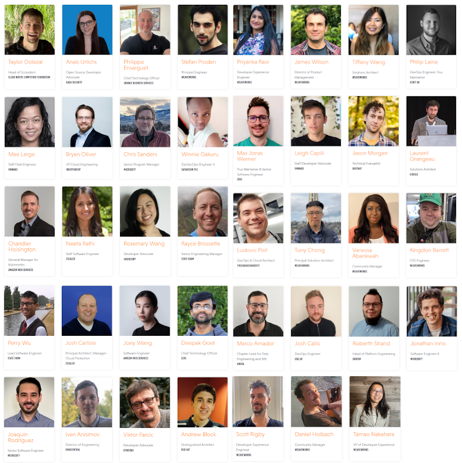

The Flux Community is proud to play a central part in the upcoming
GitOps Days event. In a free two-day event we will join in and all learn
from Flux maintainers, adopter use-cases, end-user stories and
integrators who use Flux to power their GitOps offerings.

The event is a testament to what we as a community have accomplished
together, how GitOps as a best-practise has evolved and to the general
growth of the ecosystem.

We hope you will join us, as the event is a lot of fun, a great way to
get to know people and get inspired.

**GitOps Days 2022 is a free 2-day online event on June 8-9, 2022.**

This is **THE** event for your GitOps journey! Getting started? Taking
GitOps to the next level? We'll cover all of the steps for your success!

The event will run from \~7:00 am Pacific Time to \~3:00 pm PT each day
as a free online event.

✨✨ **[Register now](https://youtube.com/playlist?list=PL9lTuCFNLaD0NVkR17tno4X6BkxsbZZfr) to
reserve your spot to receive updates to the schedule and speakers.** ✨✨

**Join the conversation!** Chat with the speakers and other attendees!

**Invite yourself at [https://slack.weave.works](https://weave-community.slack.com/join/shared_invite/zt-yqwtav03-QPo7W4Qoi1pL6W8UQYk2yQ) and hang out with us at
[#gitopsdays](https://bit.ly/GitOpsDays_Slack)**

Event Schedule
--------------

The event is packed with great speakers and talks, here is an excerpt to
whet your appetite.

Day 1 will bring you the fantastic mix of a GitOps hands-on tutorial,
keynotes, demos how GitOps products have been successfully based on top
of Flux and other news from our ecosystem.

- Hands-on Tutorial: Intro to Kubernetes, GitOps, and Observability -- Tiffany Wang (Weaveworks) & Joaquin Rodriguez (Microsoft)
- Keynote: CNCF Ecosystem & GitOps as a Natural Evolution of Kubernetes -- Taylor Dolezal (CNCF)
- Keynote: GitOps is the Way to Overcome the Scaling Wall by Introducing New Operational Models? An Enterprise Market Perspective -- Philippe Ensarguet (Orange)
- Keynote: GitOps' Wealth of Opportunity -- Mae Large (VMware)
- Keynote: GitOps Business Benefits at State Farm -- Rayce Brossette (State Farm)
- GitOps with Weave GitOps -- James Wilson (Weaveworks)
- GitOps in Microsoft Azure with Flux -- Chris Sanders & Jonathan Innis (Microsoft)
- GitOps with Amazon EKS Anywhere -- Chandler Hoisington & Joey Wang (AWS)
- GitOps with VMware Tanzu Application Platform -- Leigh Capili (VMware)
- How D2iQ Operates Flux -- Deepak Goel & Max Jonas Werner (D2iQ)
- GitOps with Flux on OpenShift -- Andrew Block (Red Hat)
- Reconcile Terraform Resources the GitOps Way -- Priyanka "Pinky" Ravi (Weaveworks) & Roberth Strand (Crayon)
- Securing Kubernetes Secrets for GitOps with HashiCorp Vault -- Rosemary Wang (HashiCorp)
- Happier Helming with GitOps and Flux -- Scott Rigby (Weaveworks, Flux & Helm Maintainer)
- Introducing Flux Visual Studio Code Extension in Public Beta -- Kingdon Barrett (Weaveworks)

On Day 2 we will dive deeper. Particularly security and policy
management will be hot topics. And if you are interested in how other
organisations implemented GitOps, check out the wealth of user success
stories.

- Flux & Flagger Deep Dives -- Philip Laine (Xenit) & Stefan Prodan (Weaveworks)
- Crayon's Cloud Native Journey -- Roberth Strand (Crayon)
- GitOps & Progressive Delivery with Flux, Flagger, and Istio -- Marco Amador (Anova)
- GitOps with Flux at Safaricom -- Winnie Gakuru (Safaricom)
- Key Learnings from Migrating from Flux1 to Flux2 -- Josh Callis (OSO.sh)
- GitOps, A Slightly Realistic Situation on Kubernetes with Flux -- Laurent Grangeau (Google) & Ludovic Piot (theGarageBandOfIT)
- GitOps + Security -- Anaïs Urlichs (Aqua Security)
- Applying GitOps to Everything with Flux + Crossplane -- Viktor Farcic (Upbound)
- GitOps and Flux at State Farm (Technical Deep Dive) -- Rayce Brossette & Perry Wu (State Farm)
- Multi-tenancy Best Practices Using the Cloud Native Ecosystem: ZScaler's GitOps Journey -- Josh Carlisle & Neeta Rathi (ZScaler)
- GitOps at RingCentral with Flux & Flagger -- Ivan Anisimov (RingCentral)
- Flagger and Linkerd revisited: how I learned to stop worrying and use A/B testing -- Jason Morgan (Buoyant)
- GitOps and Flux Scaled to Hundreds of Developers -- Bryan Oliver (Independent) & Kingdon Barrett (Weaveworks)
- Policy Management & GitOps -- Tony Chong (Weaveworks / Magalix)

Leading through the programme are our MCs Tamao Nakahara and Vanessa
Abankwah from Weaveworks' DX team. Daniel Holbach aka DJ Desired State
will play his newest favorites in the breaks.

Please make sure you check the actual schedule on <https://www.gitopsdays.com/>
as it might be subject to change.

We are very much looking forward to the event and hope you'll be there
with us too! [Register today!](https://www.gitopsdays.com)

\#flexyourflux
--------------

The \#flexyourflux campaign we started for KubeCon is still ongoing.
Only here you can still win a 1h-long 1-on-1 meeting with Flux Core
Maintainer Stefan Prodan.



The t-shirts unfortunately are out of stock, but the meeting with Stefan
is still up for grabs! We will draw the lucky winners live at the
[GitOps Days event](https://www.gitopsdays.com/).
