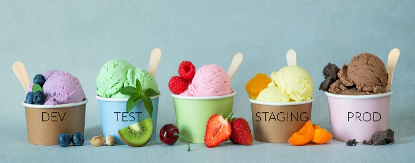

As the Flux family of projects and its communities are growing, we
strive to inform you each month about what has already landed, new
possibilities which are available for integration, and where you can get
involved. Read our [last update here](/blog/2022/06/may-update/).

It's the beginning of July 2022 - let's recap together what happened in
June - it has been a lot!

## News in the Flux family

A lot of work culminated in the 0.31 release series, where we landed at
[Flux v0.31.3](https://github.com/fluxcd/flux2/releases/tag/v0.31.3).
You can look forward to the the following set of important fixes and
documentation improvements:

### ✨ Flux releases v0.31

We've released [Flux v0.31](https://github.com/fluxcd/flux2/releases/tag/v0.31.0).
This release comes with new features and improvements.

**🚀 New features**

- Pull Helm charts from container registries by configuring Helm
  repositories with `type: oci`.\
  For more information please see the [Helm OCI
  documentation](/flux/guides/helmreleases/#helm-oci-repository)
- Trigger GitHub Actions workflows from Flux by configuring alerting
  providers with `type: githubdispatch`.\
  For more information please see the [GitHub dispatch provider
  documentation](/flux/components/notification/provider/#setting-up-the-github-dispatch-provider).

**📔 New guides**

- [Promote Flux Helm Releases with GitHub
  Actions](/flux/use-cases/gh-actions-helm-promotion/).
- [Using Flux on GKE with Google Cloud Source
  Repositories](/flux/use-cases/gcp-source-repository/).
- [Monitoring Flux logs with Loki and
  Grafana](/flux/guides/monitoring/).

**🤖 New improvements and fixes**

- Starting with this version, all Flux controllers conform to the
  Kubernetes API Priority and Fairness.
- Add support for configuring the authentication to AWS KMS, Azure Key
  Vault and Google Cloud KMS on multi-tenant clusters.
- The Git reconciliation has been made more efficient by adding
  support for no-op clones that should reduce the outbound traffic
  substantially.
- The `libgit2` managed transport feature has been enabled by default to
  improve the Azure DevOps and AWS CodeCommit Git operations.
- Fix an issue where the token used for Helm operations would go stale
  if it was provided using a Bound Service Account Token Volume.
- Update the controllers and CLI dependencies to Kubernetes v1.24,
  Kustomize v4.5.5 and Helm v3.9.0.
- Fix caching issue in registry client (source-controller)
- Fix repository url error for Helm OCI (source-controller)
- Fix semver sorting for Helm OCI charts (source-controller)
- Fix service account impersonation when using target namespace
  (helm-controller)
- Validate that the image name does not contain tags
  (image-reflector-controller)
- Fix `libgit2` SSH host key verification (source-controller &
  image-automation-controller)
- Fix authentication when using Gitlab via HTTP/S (source-controller &
  image-automation-controller)

Thanks to everyone who contributed to this release. 🤗

### Flux Ecosystem

Since the rewrite of Flux as a set of targeted controllers, we believe
it has become a lot easier to extend Flux to whatever you need it to do.
If you check out the [Flux Ecosystem page](/ecosystem/) you can see a lot of
very useful extensions, products and tools you might find useful.

In this section of our monthly update, let's go through what happened in
the ecosystem.

#### Terraform-controller

The team around terraform-controlle started the new development cycle towards
v0.10.0. They introduced a new feature that supports resource inventory inside
a Terraform object so that other controllers like an external drift detector,
or a cost estimator would be able to leverage it.

For the coming v0.10.0 release, they will focus on performance improvements so
that the controller will handle large numbers of objects better.   

#### Weave GitOps

The GitOps Dashboard is continuing to evolve and we have added a bunch
of new features with the release of
[v0.9.0](https://github.com/weaveworks/weave-gitops/releases/tag/v0.9.0).
You can now pause and resume automations and sources within the UI. The team
also added a new yaml tab to each object page so you can see the full
detail of the object on the cluster.

They have also added support for [displaying custom
metadata](https://web.archive.org/web/20240107222734/https://docs.gitops.weave.works/docs/guides/displaying-custom-metadata/).
It is super easy to use and enables you to put relevant information such
as a description of the object or hyperlinks to metrics dashboards.

They have also improved the detail and graph views in the application. They
were only able to show a subset of kubernetes objects that were created
by Kustomizations and Helm Releases. You can now get a full view of all
of the objects that were created.

The team is turning their attention to a new feature at the moment and are
looking for people willing to participate as early beta users. They are
building a new feature in Weave GitOps that will change the way you can
interact with Kubernetes as you build out your system.  The idea is to
reduce friction as much as possible and get live feedback.  Once you are
done then you will be able to easily transition the workload management
over to GitOps via Flux.

They are excited about this feature and would appreciate people that are
willing to test early versions so they build the best possible solution that
solves problems.  If you are interested please sign up
[here](https://forms.gle/NaVBKVLjvErxgpyEA) and they will
reach out to you via email when they are ready to start the beta test.

#### New additions to the Flux Ecosystem

We are very pleased to recognise
[KubeVela](https://github.com/kubevela/kubevela) as part
of the Flux Ecosystem: it integrates Flux well for [Helm Chart
delivery](https://kubevela.io/docs/tutorials/helm) and
[GitOps](https://kubevela.io/docs/case-studies/gitops),
and provides [multi-cluster
capabilities](https://kubevela.io/docs/tutorials/helm-multi-cluster).

## Recent & Upcoming Events

It's important to keep you up to date with new features and developments
in Flux and provide simple ways to see our work in action and chat with
our engineers.

### Upcoming Events

#### Flux maintainer Somtochi Onyekwere at KCD Africa 2022 - Virtual

Somtochi Onyekwere has been contributing to Kubernetes and Flux for
a long while already. We are very grateful to have her as part of the
Flux maintainers team.

At the keynote at [Kubernetes Community Days Africa 2022 -
Virtual](https://community.cncf.io/events/details/cncf-kcd-africa-presents-kubernetes-community-days-africa-2022-virtual/),
she will be speaking about her experience going from contributor to
project maintainer.

Join her and all the other speakers on July 7 & 8. [Register
here](https://community.cncf.io/events/details/cncf-kcd-africa-presents-kubernetes-community-days-africa-2022-virtual/).

### Recent Events (ICYMI) 📺

#### GitOps Days 2022

[GitOps Days](https://www.gitopsdays.com/) was a big
celebration of everything we achieved as the Flux community in the past
years. It was a big get-together of its maintainers, GitOps
practitioners, cloud service vendors and our big community to talk about
everything that's possible today.

If you check out the schedule on [its
website](https://www.gitopsdays.com/) you get a good idea
of the high quality talks and workshops that happened there.

If you should have missed it, don't despair - the GitOps Days team is
working on publishing separate videos and dedicated videos very soon. In
the meantime you can still hit the "Register" button on the website to
get a link to the recordings of the two days!

Thanks to everyone who attended and organised the event - we had a
fabulous time!

### Flux Bug Scrub

Our Flux Bug Scrubs still are happening on a weekly basis and remain one
of the best ways to get involved in Flux. They are a friendly and
welcoming way to learn more about contributing and how Flux is organised
as a project.

The next dates are going to be:

- [2022-07-07 17:00 UTC, 1pm
  ET](https://www.meetup.com/gitops-community/events/qphvvsydckbkb/)
- [2022-07-13 12:00 UTC, 14:00
  CEST](https://www.meetup.com/gitops-community/events/gxhvvsydckbrb/)
- [2022-07-21 17:00 UTC, 1pm
  ET](https://www.meetup.com/gitops-community/events/qphvvsydckbcc/)
- [2022-07-27 12:00 UTC, 14:00
  CEST](https://www.meetup.com/gitops-community/events/gxhvvsydckbkc/)

We are flexible with subjects and often go with the interests of the
group or of the presenter. If you want to come and join us in either
capacity, just show up or if you have questions, reach out to Kingdon on
Slack.

We really enjoyed this [demo of the k3d git
server](https://www.youtube.com/watch?v=hNt3v0kk6ec)
recently. It's a local Git server that runs outside of Kubernetes, to
support offline dev in a realistic but also simple way that does not
depend on GitHub or other hosted services. If folks have other
Flux-related topics and want a friendly audience to present for interest
and feedback, we are always open to ideas and will host, come pitch us
with your Flux talks while we iterate weekly issue queue hygiene!

## In other news

### People writing/talking about Flux

We love it when you all write about Flux and share your experience,
write how-tos on integrating Flux with other pieces of software or other
things. Give us a shout-out and we will link it from this section! ✍

#### Alexander Block: Multiple Environments with Flux and Kluctl

Alexander Block is not only the author of
[Kluctl](https://kluctl.io/), but has joined us as a Flux
contributor as well. If you are new to Kluctl, it says on its website
that

> *Kluctl is the missing glue to put together large Kubernetes
> deployments.*
>
> *It allows you to declare and manage small, large, simple and/or
> complex multi-env and multi-cluster deployments.*
>
> *Kluctl does not have cluster-side dependencies and works out of the
> box.*

Check out the [new blog
post](https://medium.com/kluctl/multiple-environments-with-flux-and-kluctl-199f8a00a950)
to get an idea how Kluctl helps you wire up multiple environments.

### News from the Website and our Docs

#### Flux Adopters shout-out

We are very pleased to announce that the following adopters of Flux have
come forward and added themselves to our website:
[Autops](https://www.autops.eu/),
[MediaMarktSaturn](https://www.mediamarktsaturn.com),
[J.B. Hunt](https://www.jbhunt.com/),
[QuickTable](https://www.quicktable.io/),
[SenseLabs](https://senselabs.de/) and
[TraefikLabs](https://traefik.io/).

If you have not already done so, [use the instructions
here](/adopters/) or give us a ping and we
will help to add you. Not only is it great for us to get to know and
welcome you to our community. It also gives the team a big boost in
morale to know where in the world Flux is used everywhere.

#### More docs and website news

We are constantly improving our documentation and website - here are a
couple of small things we landed recently:

- Add section for OCI Helm repositories
- Add documentation for how to run jobs with Flux.
- Add post-deployment jobs and repo structure.
- Add \"Karmada + Flux\" user guide.
- Add \--ssh-hostkey-algos to image-automation-controller docs.
- helm gh actions guide: Exclude events related to dependencies check.
- Add guide: Promote Flux Helm Releases with GitHub Actions.
- Monitoring: Add Loki and Flux logs to guide.
- Update azure docs on mozilla sops.
- Migration: Add links for flux v1 uninstall.
- [Roadmap](/roadmap/): Add OCI items
  for GA.
- [Ecosystem page](/ecosystem/): We
  finally got around to adding [Weave
  GitOps](https://github.com/weaveworks/weave-gitops).
- Build: Update docsy and hugo. Make builds more robust.

Thanks a lot to these folks who contributed to docs and website: Stefan
Prodan, Ihor Sychevskyi, Ed Briggler, Max Jonas Werner, Paulo Gomes,
xiexiong, Chrliey Haley, Hidde Beydals, Jianbo Sun, Kevin Fritz, LXM,
Philip Laine, Poor12, Somtochi Onyekwere, Soulé Ba, Vincent Palmer,
Vincent Van der Kussen, Wiliam Brode, netthier.

In particular we would like to thank Ihor Sychevskyi again who took on
fixing small UI glitches all over the place - especially on mobile the
site should work a lot better now!

## Flux Project Facts

We are very proud of what we have put together. We want to reiterate
some Flux facts - they are sort of our mission statement with Flux.

1. 🤝 Flux provides GitOps for both apps or
  infrastructure. Flux and Flagger deploy apps with
  canaries, feature flags, and A/B rollouts. Flux can also manage
  any Kubernetes resource. Infrastructure and workload dependency
  management is built-in.
1. 🤖 Just push to Git and Flux does the rest. Flux
  enables application deployment (CD) and (with the help of Flagger)
  progressive delivery (PD) through automatic reconciliation. Flux
  can even push back to Git for you with automated container image
  updates to Git (image scanning and patching).
1. 🔩 Flux works with your existing tools: Flux works with
  your Git providers (GitHub, GitLab, Bitbucket, can even use
  s3-compatible buckets as a source), all major container
  registries, and all CI workflow providers.
1. 🔒 Flux is designed with security in mind: Pull vs. Push,
  least amount of privileges, adherence to Kubernetes security
  policies and tight integration with security tools and
  best-practices. Read more about our security considerations.
1. ☸️ Flux works with any Kubernetes and all common Kubernetes
  tooling: Kustomize, Helm, RBAC, and policy-driven
  validation (OPA, Kyverno, admission controllers) so it simply
  falls into place.
1. 🤹 Flux does Multi-Tenancy (and "Multi-everything"):
  Flux uses true Kubernetes RBAC via impersonation and supports
  multiple Git repositories. Multi-cluster infrastructure and apps
  work out of the box with Cluster API: Flux can use one Kubernetes
  cluster to manage apps in either the same or other clusters, spin
  up additional clusters themselves, and manage clusters including
  lifecycle and fleets.
1. 📞 Flux alerts and notifies: Flux provides health
  assessments, alerting to external systems and external events
  handling. Just "git push", and get notified on Slack and [other
  chat
  systems](https://github.com/fluxcd/notification-controller/blob/main/docs/spec/v1beta1/provider.md).
1. 👍 Users trust Flux: Flux is a CNCF Incubating project
  and was categorised as \"Adopt\" on the [CNCF CI/CD Tech
  Radar](https://radar.cncf.io/2020-06-continuous-delivery)
  (alongside Helm).
1. 💖 Flux has a lovely community that is very easy to work
  with! We welcome contributors of any kind. The
  components of Flux are on Kubernetes core controller-runtime, so
  anyone can contribute and its functionality can be extended very
  easily.

## Over and out

If you like what you read and would like to get involved, here are a few
good ways to do that:

- Join our [upcoming dev meetings](/community/#meetings) on
  2022-07-06 or 2022-07-14.
- Talk to us in the \#flux channel on [CNCF Slack](https://slack.cncf.io/)
- Join the [planning discussions](https://github.com/fluxcd/flux2/discussions)
- And if you are completely new to Flux, take a look at our [Get
  Started guide](/flux/get-started/) and give us feedback
- Social media: Follow [Flux on Twitter](https://twitter.com/fluxcd),
  join the discussion in the [Flux LinkedIn
  group](https://www.linkedin.com/groups/8985374/).

We are looking forward to working with you.
