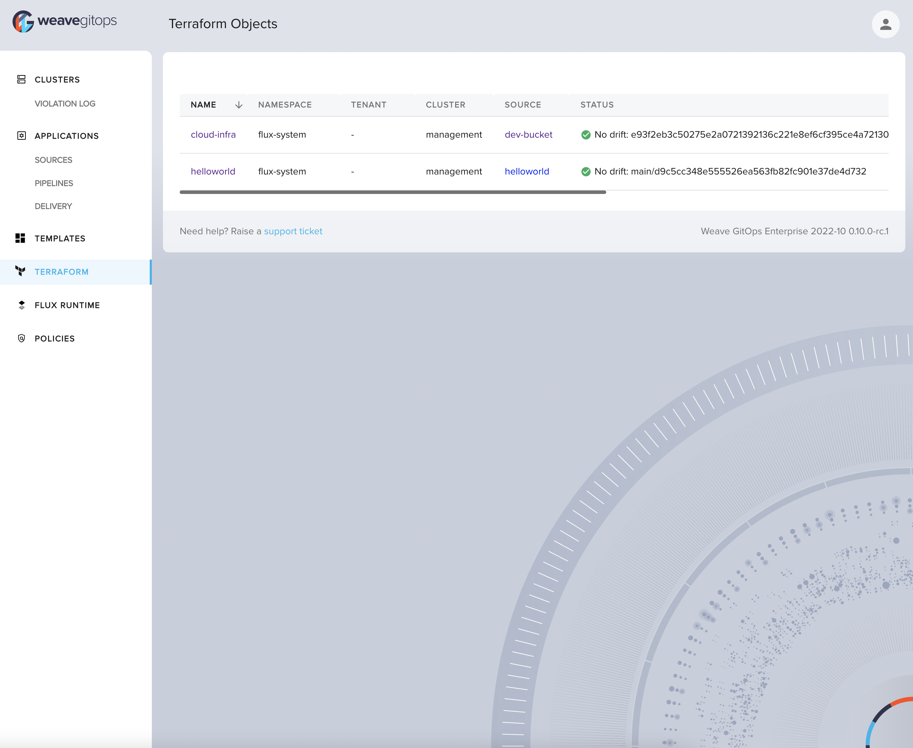

As the Flux family of projects and its communities are growing, we
strive to inform you each month about what has already landed, new
possibilities which are available for integration, and where you can get
involved. Read [our last update here](/blog/2022/10/september-2022-update/).

It's the beginning of November 2022 - let's recap together what happened
in October - it has been a lot!

## News in the Flux family

### Flux v0.36 adds support for verifying Helm charts with Cosign

Team Flux has released Flux 0.36 which continues the integration of OCI
features further into Flux. Here is a list of features and improvements
that were added in the last release:

- Verify OCI Helm charts signed by Cosign (including keyless) with
  [`HelmChart.spec.verify`](/docs/cheatsheets/oci-artifacts/#verify-helm-charts).
- Allow publishing a single YAML file to OCI with
  `flux push artifact <URL> --path=deploy/install.yaml`.
- Detect changes to local files before pushing to OCI with
  `flux diff artifact <URL> --path=<local files>`.
- New Alert Provider type named `generic-hmac` for authenticating the
  webhook requests coming from `notification-controller`.
- The `Kustomization.status.conditions` have been aligned with
  Kubernetes standard conditions and `kstatus`.
- The `kustomize-controller` memory usage was reduced by 90% when
  performing artifact operations.

For this release we also added new documentation to our site:

- Guide: [How to deploy Flagger with Flux using signed Helm charts
  and OCI artifacts](/flagger/install/flagger-install-with-flux/)
- FAQ: [Should I be using Kustomize remote
  bases?](/flux/faq/#should-i-be-using-kustomize-remote-bases)
- FAQ: [Should I be using Kustomize Helm chart
  plugin?](/flux/faq/#should-i-be-using-kustomize-helm-chart-plugin)

Please upgrade for the best experience.

### Security news

Keeping the Flux Community up to date on new Security features and ways
to keep their organisations and clusters secure is important to us. We
are very happy that Flux project member Batuhan Apaydın took the time to
write this [blog post about proving the authenticity of OCI
artifacts](/blog/2022/10/prove-the-authenticity-of-the-oci-artifacts/).
Please take a look at to get practical advice on how to make use of
this.

What's more? CLOMonitor is a service which checks open source project
repositories to verify they meet project health best practices. With the
last Flux release, we [have hit 100%
compliance](https://clomonitor.io/projects/cncf/flux-project)
with Linux Foundation security best practices.

We would also like to high five Alexander Block, a member of our
community and maintainer of [kluctl](https://kluctl.io/):
he reported the last Flux CVE (CVE-2022-39272) [Improper use of
metav1.Duration allows for Denial of
Service](https://github.com/fluxcd/flux2/security/advisories/GHSA-f4p5-x4vc-mh4v).
Thanks a lot for helping out with this!

### Flagger v1.24 comes with signed releases & OCI Helm charts

Starting with [Flagger
1.24.0](https://github.com/fluxcd/flagger/releases/tag/v1.24.0),
the Flagger release artifacts are published to GitHub Container
Registry, and they are signed with Cosign and GitHub ODIC.

OCI artifacts:

- `ghcr.io/fluxcd/flagger:<version>`: multi-arch container images
- `ghcr.io/fluxcd/flagger-manifest:<version>`: Kubernetes manifests
- `ghcr.io/fluxcd/charts/flagger:<version>`: Helm charts

To verify an OCI artifact with Cosign:

```cli
export COSIGN_EXPERIMENTAL=1
cosign verify ghcr.io/fluxcd/flagger:1.24.0
cosign verify ghcr.io/fluxcd/flagger-manifests:1.24.0
cosign verify ghcr.io/fluxcd/charts/flagger:1.24.0
```

To deploy Flagger from its OCI artifacts the GitOps way, please see the
[Flux installation guide](/flagger/install/flagger-install-with-flux/).

The previous release, [Flagger
1.23.0](https://github.com/fluxcd/flagger/releases/tag/v1.23.0)
added support for Slack bot token authentication.

### Flux Legacy reaches End-Of-Life

As [discussed in the last monthly update for the Flux
project](/blog/2022/10/september-2022-update/#flux-legacy-v1-retirement-plan),
we retired Flux v1 and Helm Operator on November 1st. The projects will
no longer be supported and were archived on GitHub.

Please look into [migrating to Flux v2](/flux/migration/) as soon as possible.

If you still need migration help, there are still [free migration
workshops](https://bit.ly/FluxMigrationSurvey), or reach
out for paid support to one of the companies [listed
here](/support/#commercial-support).

### Flux Ecosystem

#### Weave GitOps

The Weave GitOps team continues to iterate and just released
[v0.10.1](https://github.com/weaveworks/weave-gitops/releases/tag/v0.10.1)
of Weave GitOps.

With the release of v0.10.0 they are excited to announce the beta launch
of a new tool called GitOps Run. GitOps can be challenging for the
everyday developer to work with and it can create some friction,
especially for developers who are less familiar with Kubernetes or Flux.
The purpose of GitOps Run is to remove the complexity for developers so
that platform operators can create developer environments easily, and
application developers can benefit from GitOps and focus on writing
code. Basically, they set up a live reconciliation loop between your
cluster and local working directory of choice. Any changes made to your
local working directory will automatically be pulled onto the cluster so
you can iterate quickly. When you are done you can turn off GitOps Run
and your cluster will go back to the previous state. This tool is
incredibly useful with the [VSCode GitOps
extension](https://marketplace.visualstudio.com/items?itemName=Weaveworks.vscode-gitops-tools).

You can either toggle GitOps Run to allow changes directly on the
cluster or choose a sandbox option as well. The team is definitely
looking for feedback on this exciting new feature so please don't
hesitate to engage and submit feature requests. Check out an overview
and quick getting started video
[here](https://docs.gitops.weave.works/docs/gitops-run/overview/).

The team continues to make improvements to the GitOps Dashboard as well.
You are now able to inspect the YAML of all objects within the
application as well as being able to navigate to objects via the various
graph views. We have also added support for alerts and providers.

##### Terraform Controller

The Weave GitOps team has been hard at work on the next version of the
tf-controller and just released [Weave TF-controller
v0.13.0](https://github.com/weaveworks/tf-controller/releases/tag/v0.13.0)
this week.

###### First-class YAML Support (tech preview)

A notable feature in this version is the first-class YAML support for
Terraform. A Terraform object in v0.13.0+ allows you to better configure
your Terraform resources via YAMLs, without introducing any extra CRDs
to your cluster. Together with a new generator, Tofu-Jet will now be
able to ship pre-generated primitive Terraform modules for all major
cloud providers. The team shipped the alpha version of AWS package in this
release. Tofu-Jet generator will be open-sourced later by the end of
this year.

A primitive Terraform module is a module that only contains a single
primitive resource like, `aws_iam_role` or `aws_iam_policy`.
With this concept, we would be able to use Terraform without writing
Terraform codes and make it more GitOps-friendly at the same time.

###### New Features and Bug Fixing

- Implement webhooks for Terraform stages
- Add use case examples
- Add `.spec.workspace` field
- Add the default value to workspace
- Implement spec.values and map it to Terraform HCL
- Add docs for preflight checks
- Implement Helm-like template for Terraform files
- Add runner Dockerfile for Azure
- Upgrade Golang to v1.19
- Bundle an alpha version AWS Package
- Fix e2e
- Implement init containers support on the runner pod
- Implement `spec.dependsOn` and watch for the output secret changes
- Implement templating for input references
- Fix the check of dependencies by taking the output secret into
  account
- Add tests for the `spec.dependsOn` feature
- Change templating delimiter to `${{ }}`
- Add labels to `tfstate` via the K8s backend so that we can group
  them by the labels
- Fix dependency in the finalizer
- Add an ability to Helm chart for creating service accounts in each
  namespace
- Parameterize AWS package in chart
- Add trace logging
- Fix runner service account template not returning multiple docs
- Implement `replan` to avoid double planning
- Add SHA and version information to the binaries

##### Weave GitOps Enterprise

Weave GitOps Enterprise continues to improve with numerous features
including all of those mentioned in the OSS version above. They have
released v0.10.1. First, you can now view terraform resources from the
UI, plus sync and suspend resources like Kustomizations, HelmReleases,
and Sources.



The team has also launched their pipeline feature which will enable you
to set up environments for helm charts and track the chart versions
across dev, staging, and production (or however you decide to define
your environment stages).

Policy sets have been added as well so you can now state whether
policies should just be treated as non-blocking (audit) or blocking
(admission). This means you can easily configure your various policies
to request the team to  fix their code, either to future-proof it, or
for the fix to be included before changes can actually be applied to
the clusters.

Finally, the team has been working hard to open up templates to all
types of objects within the platform. In the past, templates were
isolated to only CAPI providers so you could easily self service
clusters. From Weave GitOps Enterprise you are now able to create
templates for any yaml objects so you can self-serve anything from new
microservices to cloud infrastructure all driven by GitOps and the power
of Flux.

#### Flux Subsystem for Argo

Flux Subsystem for Argo (aka Flamingo) is the safe migration path for
Argo CD to Flux and Weave GitOps. A Flamingo image is the drop-in
replacement of the equivalent version of Argo CD. You can safely run
workloads reconciled by Flux and Argo CD on the same clusters.

The team has upgraded Flamingo to support Flux v0.36 and Argo CD v2.5.
Not only the v2.5 support, this train of releases also include Flamingo
for v2.2 - v2.4 too.

Here's the updated support matrix

| Flux  | Argo CD | Flamingo Image
| ----- | ------- | --------------------------
| v0.36 | v2.5    | v2.5.0-fl.3-main-2bba0ae6
| v0.36 | v2.4    | v2.4.15-fl.3-main-2bba0ae6
| v0.36 | v2.3    | v2.3.10-fl.3-main-2bba0ae6
| v0.36 | v2.2    | v2.2.15-fl.3-main-2bba0ae6

#### VS Code GitOps Extension

A new "Configure GitOps" workflow is available in the pre-release of
[the
extension](https://github.com/weaveworks/vscode-gitops-tools).
The workflow introduces a new unified user interface for creating Source
and Workload and for attaching Workloads to Sources. It supports both
Generic Flux and Azure Flux (Arc/AKS) cluster modes. In Azure mode,
`FluxConfig` resources are created automatically (this can be disabled if
the user wants Generic mode compatibility). Currently this feature is in
the Extension Marketplace pre-release channel and supports `GitRepository`
and `Kustomization` resources. Final release will be available early in
November and will provide an user-friendly UI for working with every
type of Source and Workflow.

#### New additions to the Flux Ecosystem

We are very pleased to announce the following new members of the Flux
Ecosystem. We feel blessed to have a lively and active community like
this!

First up is the [Datadog Agent for
Flux](https://github.com/DataDog/integrations-extras/tree/master/fluxcd):
it runs on your hosts and collects events and metrics from hosts and
sends them to Datadog, where you can analyze your monitoring and
performance data.

[KubeVela](https://github.com/kubevela/kubevela) is next
on the list, which now integrates Flux as well for [Helm Chart
delivery](https://kubevela.io/docs/tutorials/helm) and
[GitOps](https://kubevela.io/docs/case-studies/gitops),
and provides [multi-cluster
capabilities](https://kubevela.io/docs/tutorials/helm-multi-cluster).

We could have some kind of Halloween reference here, but [GitOps
zombies](https://github.com/raffis/gitops-zombies) is
actually a tool for finding Kubernetes resources which are not managed
via GitOps. Go check it out.

And last but not least, here is the [Pulumi Kubernetes
Operator](https://github.com/pulumi/pulumi-kubernetes-operator),
which runs [Pulumi
programs](https://www.pulumi.com/docs/intro/concepts/project/),
and can fetch them via Flux sources.



## Recent & Upcoming Events

It's important to keep you up to date with new features and developments
in Flux and provide simple ways to see our work in action and chat with
our engineers.

### Recent Events (ICYMI) 📺

Thanks to all the Flux community members who are happy to talk about
their experiences. In October there was obviously KubeCon (which we will
have a separate blog post about), here is one talk already which we
would like to highlight.



[GitOps with Flux and OCI Registries - Soulé Ba & Scott Rigby,
Weaveworks](https://www.youtube.com/watch?v=Ums3Q9kMPd8)

Please let us know if we missed anything of interest and we will make
sure to mention it in the next post!

### Upcoming Events 📆

We are happy to announce that we have a number of events coming up in
November - tune in to learn more about Flux and GitOps best practices,
get to know the team and join our community.

[ATO 2022 Get Started with Kubernetes & GitOps Workshop (Nov
1)](https://2022.allthingsopen.org/sessions/get-started-with-kubernetes-gitops/)

> For those that are new to Kubernetes, don't fret! Justin will give a
> brief overview of Kubernetes core concepts, features, architecture, and
> key components to ensure you have a necessary understanding of the
> Kubernetes ecosystem so that you can follow along with the rest of this
> hands-on workshop.

[HashiCorp User Group Luxembourg (virtual) (Nov
30)](https://www.meetup.com/luxembourg-hashicorp-user-group/events/288797616/)

> Flux Terraform Controller is a controller for Flux to reconcile
> Terraform configurations in the GitOps way with the power of Flux and
> Terraform, Terraform Controller allows you to GitOps-ify your
> infrastructure, and your application resources, in the Kubernetes and
> Terraform universe.

### Flux Bug Scrub

Our Flux Bug Scrubs still are happening on a weekly basis and remain one
of the best ways to get involved in Flux. They are a friendly and
welcoming way to learn more about contributing and how Flux is organised
as a project.

The next dates are going to be:

- [2022-11-02 12:00 UTC, 14:00
  CEST](https://www.meetup.com/weave-user-group/events/wvhvvsydcpbdb/)
- 2022-11-10 18:00 UTC
- 2022-11-16 13:00 UTC

We are flexible with subjects and often go with the interests of the
group or of the presenter. If you want to come and join us in either
capacity, just show up or if you have questions, reach out to Kingdon on
Slack.

We really enjoyed this [demo of the k3d git
server](https://www.youtube.com/watch?v=hNt3v0kk6ec)
recently. It's a local Git server that runs outside of Kubernetes, to
support offline dev in a realistic but also simple way that does not
depend on GitHub or other hosted services.

## In other news

### Your Community Team

The Flux Community Team started its own set of meetings as an experiment
for the next 3 months. Here we want to discuss everything that's
important for the Flux community, such as organisation of events,
advocacy, getting more people involved in the community and more.

This month we had our first two meetings. Check out [the meeting
notes](https://docs.google.com/document/d/12aOlwyYipXH3PJj-m_G09ZijSjBqS6sUpcQYVZF01B0/edit)
which include the meeting recordings to see what was discussed in
detail.

A few themes we are looking into as a group are:

- Document and refine processes and tools to make it a lot easier to
  be involved
- Highlight events and meetings to our community better
- Make things like our social and editorial calendars public so people
  can feed into it more easily and it becomes more of a team effort

Please join us for the next meeting - instructions and agenda can be
found
[here](https://docs.google.com/document/d/12aOlwyYipXH3PJj-m_G09ZijSjBqS6sUpcQYVZF01B0/edit).

### People writing/talking about Flux

We love it when you all write about Flux and share your experience,
write how-tos on integrating Flux with other pieces of software or other
things. Give us a shout-out and we will link it from this section! ✍

- [Using Flux to Automate Simple
  Tasks](https://siebjee.nl/posts/using-flux-to-automate-simple-tasks/)
- [GitOps using Flux and
  Flagger](https://www.infracloud.io/blogs/gitops-using-flux-flagger/)
- [GitOpsify Cloud Infrastructure with Crossplane and
  Flux](https://blog.upbound.io/gitopsify-infrastructure-xp/)

### News from the Website and our Docs

#### Flux Adopters shout-out

We are very pleased to announce that the following adopters of Flux have
come forward and added themselves to our website:
[Cyera](https://cyera.io/),
[Syneki](https://syneki.com/) and [University of
Bordeaux](https://www.u-bordeaux.fr/).

If you have not already done so, [use the instructions
here](/adopters/) or give us a ping and we
will help to add you. Not only is it great for us to get to know and
welcome you to our community. It also gives the team a big boost in
morale to know where in the world Flux is used everywhere.

#### More docs and website news

We are constantly improving our documentation and website - here are a
couple of things we landed recently:

- Update themes and move to using them as Hugo modules. This
  simplified our setup quite a bit.
- Generate [resources
  section](/resources/) from YAML.
- Deemphasise Legacy Flux in our docs.
- Updates to the frontpage to make events easier to find.
- Update Flagger docs to 1.24. New guide to [set up Flagger on a
  Kubernetes cluster the GitOps
  way](/flagger/install/flagger-install-with-flux/).
- And lots of other updates and improvements.

Thanks a lot to these folks who contributed to docs and website: Stefan
Prodan, Batuhan Apaydın, Mohamed F. Ahmed, Arhell, FG, Hidde Beydals,
Michael Bridgen, Santosh Kaluskar, Jasmin Müller, Kingdon Barrett,
Martin PAUCOT, Raffael Sahli, Shalom Yerushalmy, Steve Wilkerson and
ebCrypto.

## Flux Project Facts

We are very proud of what we have put together. We want to reiterate
some Flux facts - they are sort of our mission statement with Flux.

1. 🤝 Flux provides GitOps for both apps or
  infrastructure. Flux and Flagger deploy apps with
  canaries, feature flags, and A/B rollouts. Flux can also manage
  any Kubernetes resource. Infrastructure and workload dependency
  management is built-in.
1. 🤖 Just push to Git and Flux does the rest. Flux
  enables application deployment (CD) and (with the help of Flagger)
  progressive delivery (PD) through automatic reconciliation. Flux
  can even push back to Git for you with automated container image
  updates to Git (image scanning and patching).
1. 🔩 Flux works with your existing tools: Flux works with
  your Git providers (GitHub, GitLab, Bitbucket, can even use
  s3-compatible buckets as a source), all major container
  registries, and all CI workflow providers.
1. 🔒 Flux is designed with security in mind: Pull vs. Push,
  least amount of privileges, adherence to Kubernetes security
  policies and tight integration with security tools and
  best-practices. Read more about our security considerations.
1. ☸️ Flux works with any Kubernetes and all common Kubernetes
  tooling: Kustomize, Helm, RBAC, and policy-driven
  validation (OPA, Kyverno, admission controllers) so it simply
  falls into place.
1. 🤹 Flux does Multi-Tenancy (and "Multi-everything"):
  Flux uses true Kubernetes RBAC via impersonation and supports
  multiple Git repositories. Multi-cluster infrastructure and apps
  work out of the box with Cluster API: Flux can use one Kubernetes
  cluster to manage apps in either the same or other clusters, spin
  up additional clusters themselves, and manage clusters including
  lifecycle and fleets.
1. 📞 Flux alerts and notifies: Flux provides health
  assessments, alerting to external systems and external events
  handling. Just "git push", and get notified on Slack and [other
  chat
  systems](https://github.com/fluxcd/notification-controller/blob/main/docs/spec/v1beta1/provider.md).
1. 👍 Users trust Flux: Flux is a CNCF Incubating project
  and was categorised as \"Adopt\" on the [CNCF CI/CD Tech
  Radar](https://radar.cncf.io/2020-06-continuous-delivery)
  (alongside Helm).
1. 💖 Flux has a lovely community that is very easy to work
  with! We welcome contributors of any kind. The
  components of Flux are on Kubernetes core controller-runtime, so
  anyone can contribute and its functionality can be extended very
  easily.

## Over and out

If you like what you read and would like to get involved, here are a few
good ways to do that:

- Join our [upcoming dev
  meetings](/community/#meetings) on
  2022-11-03 or 2022-11-11.
- Talk to us in the \#flux channel on [CNCF
  Slack](https://slack.cncf.io/)
- Join the [planning
  discussions](https://github.com/fluxcd/flux2/discussions)
- And if you are completely new to Flux, take a look at our [Get
  Started guide](/docs/get-started/)
  and give us feedback
- Social media: Follow [Flux on
  Twitter](https://twitter.com/fluxcd), join the
  discussion in the [Flux LinkedIn
  group](https://www.linkedin.com/groups/8985374/).

We are looking forward to working with you.
