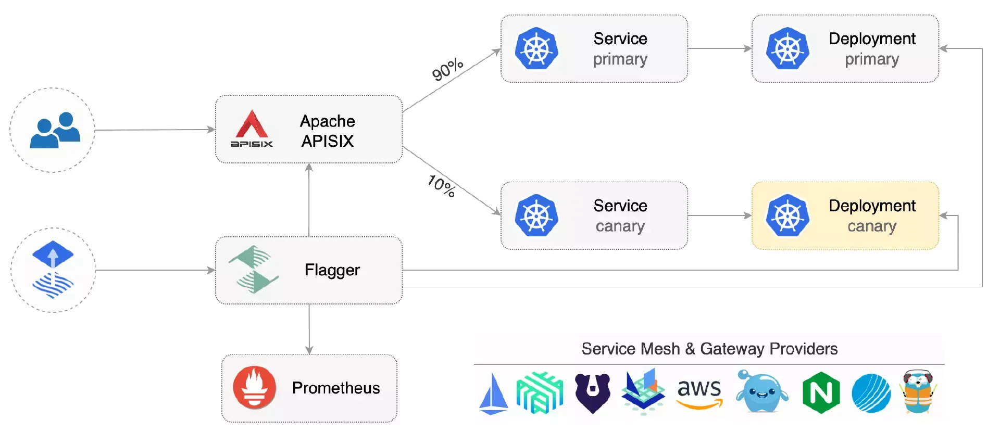
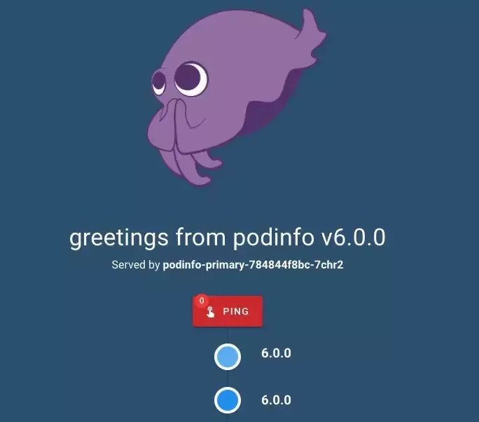
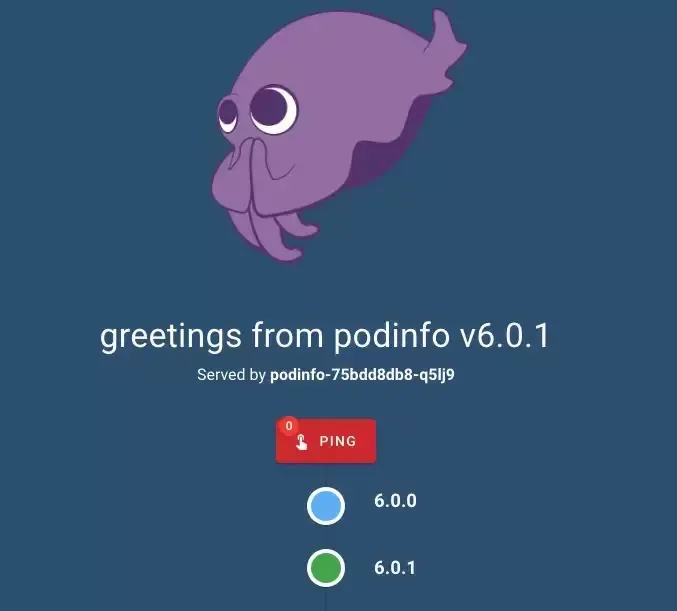

In the process of project development, service updates are often a challenge. To provide the best user experience, we need to avoid the risk of service unavailability as much as possible. Thus, continuous delivery was born, accepted as an enterprise software practice, and a natural evolution of well-established continuous integration principles. However, continuous deployment is still very rare due to the complexity of management and the fear that deployment failures will affect system availability. Canary release is probably the most classic scenario in the continuous delivery system. Based on this, we can quickly discover unhealthy and problematic services and roll back to the previous version effortlessly.

## Canary Release

Canary release is also known as grayscale release. Generally speaking, the new version of the application is released and deployed as a "canary" to test the performance. The old version remains for normal operations at the same stage. During the upgrade, some users will be directed to use the new version, while other users will continue to use the old version. On the premise of ensuring the overall system's stability, it enables early detection of bugs and timely adjustment.

The canary release does not directly release the update. It slowly guides a certain percentage of traffic to a small number of users. If there are no errors detected, it will be promoted to all users, and the old version will be phased out. This method reduces the risk of introducing new functions into the production environment.

This article will introduce how to achieve smooth canary release through Apache APISIX Ingress and Flagger, improve release efficiency, and reduce release risks.

## About Apache APISIX Ingress

Apache APISIX Ingress is realized by the Kubernetes Ingress Controller that uses Apache APISIX as the data plane proxy. It provides hundreds of functions, such as load balancing, dynamic upstream, canary release, fine-grained routing, rate-limiting, service degradation, service circuit breaker, authentication, and observability. It has been adopted by domestic and foreign companies and organizations, including Zoom, Tencent Cloud, Jiakaobaodian, Horizon Robotics, European Copernicus Reference System, etc.

## About Flagger

Flagger is a CNCF (Cloud Native Computing Foundation) project and part of the Flux family of GitOps tools. Recently, the CNCF also announced the official graduation of Flux, which is a good indicator of the success and promising future of cloud-native technology. As a progressive delivery tool, Flagger automates the release process for applications running on Kubernetes. It reduces the risk of introducing a new software version in production by gradually shifting traffic to the new version while measuring analytics metrics and running conformance tests.

After continuous efforts of the Apache APISIX and Flux communities, Flagger recently released v1.27.0, which supports automated canary releases using Apache APISIX Ingress and Flagger.



Let's experience this smooth canary release process together.

## Environment

Requires a v1.19 or newer Kubernetes cluster, which you can install via [kind](https://kind.sigs.k8s.io/).

### Install Components

Use Helm V3 to install Apache APISIX and Apache APISIX Ingress Controller

```
helm repo add apisix https://charts.apiseven.com
kubectl create ns apisix


helm upgrade -i apisix apisix/apisix --version=0.11.3 \
--namespace apisix \
--set apisix.podAnnotations."prometheus\.io/scrape"=true \
--set apisix.podAnnotations."prometheus\.io/port"=9091 \
--set apisix.podAnnotations."prometheus\.io/path"=/apisix/prometheus/metrics \
--set pluginAttrs.prometheus.export_addr.ip=0.0.0.0 \
--set pluginAttrs.prometheus.export_addr.port=9091 \
--set pluginAttrs.prometheus.export_uri=/apisix/prometheus/metrics \
--set pluginAttrs.prometheus.metric_prefix=apisix_ \
--set ingress-controller.enabled=true \
--set ingress-controller.config.apisix.serviceNamespace=apisix
```

Install the Flagger and Prometheus components in the apisix namespace.

```
helm repo add flagger https://flagger.app


helm upgrade -i flagger flagger/flagger \
--namespace apisix \
--set prometheus.install=true \
--set meshProvider=apisix
```

Note: if you need to customize Prometheus or Prometheus Operator, you can search related articles for modification.

## Application Initialization

Flagger can be applied to Kubernetes deployment and other workloads and can also be combined with HPA. It will create a series of objects: Kubernetes deployments, ClusterIP services, and ApisixRoute. These objects can expose applications to outside clusters to provide services and are used for the analysis of the canary release process.

Create a new test namespace:

`kubectl create ns test`

Create a new deployment and HPA. Here we extract the official code sample from Flagger.

`kubectl apply -k https://github.com/fluxcd/flagger//kustomize/podinfo?ref=main`

Deploy Flagger's load testing service to generate traffic during canary release for analysis.

`helm upgrade -i flagger-loadtester flagger/loadtester \
--namespace=test`

Create the `ApisixRoute` of Apache APISIX, and then Flagger will reference the created resource and generate the `ApisixRoute` of Apache APISIX Ingress in the canary version. (Replace `app.example.com` in the below example with your actual domain name)

```
apiVersion: apisix.apache.org/v2
kind: ApisixRoute
metadata:
  name: podinfo
  namespace: test
spec:
  http:
    - backends:
        - serviceName: podinfo
          servicePort: 80
      match:
        hosts:
          - app.example.com
        methods:
          - GET
        paths:
          - /*
      name: method
      plugins:
        - name: prometheus
          enable: true
          config:
            disable: false
            prefer_name: true
```

Save it as `podinfo-apisixroute.yaml` and submit it to the cluster:

`kubectl apply -f ./podinfo-apisixroute.yaml`

Create a Flagger custom resource Canary. (Replace `app.example.com` in the example with your actual domain name)

```
apiVersion: flagger.app/v1beta1
kind: Canary
metadata:
  name: podinfo
  namespace: test
spec:
  provider: apisix
  targetRef:
    apiVersion: apps/v1
    kind: Deployment
    name: podinfo
  # Refer apisix route
  routeRef:
    apiVersion: apisix.apache.org/v2
    kind: ApisixRoute
    name: podinfo
  progressDeadlineSeconds: 60
  service:
    port: 80
    targetPort: 9898
  analysis:
    interval: 10s
    # maximum number of failures for roll back
    threshold: 10
    # maximum percentage of traffic to the canary version
    # (0-100)
    maxWeight: 50
    # the step size of the canary analysis
    # (0-100)
    stepWeight: 10
    # use Prometheus to check the traffic information of APISIX
    metrics:
      - name: request-success-rate
        # the minimum success rate (none 5xx responses)
        # (0-100)
        thresholdRange:
          min: 99
        interval: 1m
      - name: request-duration
        # P99 is the largest request delay(ms)
        thresholdRange:
          max: 500
        interval: 30s
    webhooks:
        # automated traffic for canary analysis, modified based on the actual scenario
      - name: load-test
        url: http://flagger-loadtester.test/
        timeout: 5s
        type: rollout
        metadata:
          cmd: |-
            hey -z 1m -q 10 -c 2 -h2 -host app.example.com http://apisix-gateway.apisix/api/info
```

Save it as `podinfo-canary.yaml` and submit it to the cluster:

`kubectl apply -f ./podinfo-canary.yaml`

Flagger will automatically generate related resources:

`# Submitted
deployment.apps/podinfo
horizontalpodautoscaler.autoscaling/podinfo
apisixroute/podinfo
canary.flagger.app/podinfo`

`# Auto-generated
deployment.apps/podinfo-primary
horizontalpodautoscaler.autoscaling/podinfo-primary
service/podinfo
service/podinfo-canary
service/podinfo-primary
apisixroute/podinfo-podinfo-canary`



At this point, you can access the application through the domain name [app.example.com](app.example.com) (Replace `app.example.com` in the example with your actual domain name), and you will see the current version of the application.

## Automation of Canary Release

Flagger implements a control loop that gradually shifts traffic to canary nodes while measuring key performance metrics such as HTTP request success rate, average request duration, and pod health. According to the analysis of relevant indicators, release or stop the canary deployment and publish the analysis results to relevant platforms such as Slack, MS Teams or Prometheus Alert Manager, etc.


Trigger a canary release by updating the container image version

`kubectl -n test set image deployment/podinfo \
podinfod=stefanprodan/podinfo:6.0.1`

Flagger detects that there is a new version of the deployment and will start a trial run of the canary analysis release.

```
kubectl -n test describe canary/podinfo

Status:
  Canary Weight:  0
  Conditions:
    Message:               Canary analysis completed successfully, promotion finished.
    Reason:                Succeeded
    Status:                True
    Type:                  Promoted
  Failed Checks:           1
  Iterations:              0
  Phase:                   Succeeded

Events:
  Type     Reason  Age                    From     Message
  ----     ------  ----                   ----     -------
  Warning  Synced  2m59s                  flagger  podinfo-primary.test not ready: waiting for rollout to finish: observed deployment generation less than desired generation
  Warning  Synced  2m50s                  flagger  podinfo-primary.test not ready: waiting for rollout to finish: 0 of 1 (readyThreshold 100%) updated replicas are available
  Normal   Synced  2m40s (x3 over 2m59s)  flagger  all the metrics providers are available!
  Normal   Synced  2m39s                  flagger  Initialization done! podinfo.test
  Normal   Synced  2m20s                  flagger  New revision detected! Scaling up podinfo.test
  Warning  Synced  2m (x2 over 2m10s)     flagger  canary deployment podinfo.test not ready: waiting for rollout to finish: 0 of 1 (readyThreshold 100%) updated replicas are available
  Normal   Synced  110s                   flagger  Starting canary analysis for podinfo.test
  Normal   Synced  109s                   flagger  Advance podinfo.test canary weight 10
  Warning  Synced  100s                   flagger  Halt advancement no values found for apisix metric request-success-rate probably podinfo.test is not receiving traffic: running query failed: no values found
  Normal   Synced  90s                    flagger  Advance podinfo.test canary weight 20
  Normal   Synced  80s                    flagger  Advance podinfo.test canary weight 30
  Normal   Synced  69s                    flagger  Advance podinfo.test canary weight 40
  Normal   Synced  59s                    flagger  Advance podinfo.test canary weight 50
  Warning  Synced  30s (x2 over 40s)      flagger  podinfo-primary.test not ready: waiting for rollout to finish: 1 old replicas are pending termination
  Normal   Synced  9s (x3 over 50s)       flagger  (combined from similar events): Promotion completed! Scaling down podinfo.test
```

During the canary release process, you will receive different responses when you access the application through the domain name [app.example.com](app.example.com) (Replace `app.example.com` with your actual domain name).



By viewing the `ApisixRoute` resource `podinfo-podinfo-canary` of Apache APISIX created automatically by Flagger, you will find that the weights of service `podinfo-primary` and service `podinfo-canary` change along with the publishing process.

```
spec:
  http:
    - backends:
        - serviceName: podinfo-primary
          servicePort: 80
          # Auto-adjusted by Flagger
          weight: 80
        - serviceName: podinfo-canary
          servicePort: 80
          # Auto-adjusted by Flagger
          weight: 20
```

You will see the latest stable version when the final release is complete.


Note: Flagger will re-run the canary analysis if you change the deployment again during the canary release.

You can observe all canary releases with this command:

```
watch kubectl get canaries --all-namespaces

NAMESPACE   NAME      STATUS      WEIGHT   LASTTRANSITIONTIME
test        podinfo-2   Progressing   10       2022-11-23T05:00:54Z
test        podinfo     Succeeded     0        2022-11-23T06:00:54Z
```

## Rollback

During canary release analysis, you can test Flagger to suspend the canary release and rollback to the old version by generating an HTTP 500 Bad Request.

Trigger another canary release:

`kubectl -n test set image deployment/podinfo \
podinfod=stefanprodan/podinfo:6.0.2`

Enter load tester container

`kubectl -n test exec -it deploy/flagger-loadtester bash`

Generate HTTP 500 error:

`hey -z 1m -c 5 -q 5 -host app.example.com http://apisix-gateway.apisix/status/500`

Simulate server delay:

`watch -n 1 curl -H \"host: app.example.com\" http://apisix-gateway.apisix/delay/1`

When the number of detected failures reaches the threshold of canary analysis, the traffic is automatically routed back to the master node, the canary node is scaled down to zero, and the canary release process is marked as failed.

```
kubectl -n apisix logs deploy/flagger -f | jq .msg

"New revision detected! Scaling up podinfo.test"
"canary deployment podinfo.test not ready: waiting for rollout to finish: 0 of 1 (readyThreshold 100%) updated replicas are available"
"Starting canary analysis for podinfo.test"
"Advance podinfo.test canary weight 10"
"Halt podinfo.test advancement success rate 0.00% < 99%"
"Halt podinfo.test advancement success rate 26.76% < 99%"
"Halt podinfo.test advancement success rate 34.19% < 99%"
"Halt podinfo.test advancement success rate 37.32% < 99%"
"Halt podinfo.test advancement success rate 39.04% < 99%"
"Halt podinfo.test advancement success rate 40.13% < 99%"
"Halt podinfo.test advancement success rate 48.28% < 99%"
"Halt podinfo.test advancement success rate 50.35% < 99%"
"Halt podinfo.test advancement success rate 56.92% < 99%"
"Halt podinfo.test advancement success rate 67.70% < 99%"
"Rolling back podinfo.test failed checks threshold reached 10"
"Canary failed! Scaling down podinfo.test"
```

## Customize Metrics for Canary Analysis

Canary analysis can be extended by querying Prometheus metrics. We customize based on actual business scenarios.
Create a metric template and submit it to the cluster.

```
apiVersion: flagger.app/v1beta1
kind: MetricTemplate
metadata:
  name: not-found-percentage
  namespace: test
spec:
  provider:
    type: prometheus
    address: http://flagger-prometheus.apisix:9090
  query: |
    sum(
      rate(
        apisix_http_status{
          route=~"{{ namespace }}_{{ route }}-{{ target }}-canary_.+",
          code!~"4.."
        }[{{ interval }}]
      )
    )
    /
    sum(
      rate(
        apisix_http_status{
          route=~"{{ namespace }}_{{ route }}-{{ target }}-canary_.+"
        }[{{ interval }}]
      )
    ) * 100
# Modify the analysis in the canary release and add the indicator template created above.
  analysis:
    metrics:
      - name: "404s percentage"
        templateRef:
          name: not-found-percentage
        thresholdRange:
          max: 5
        interval: 1m
```

The configuration above validates the canary by checking if the QPS (Queries per second) of HTTP 404 requests is higher than 5% of the total traffic. The canary rollout fails if the HTTP 404 requests exceed the 5% threshold.

## Summary

The above process can be extended with more custom metric checks, Webhook, manual approvals and Slack or MS Teams notifications.

A very smooth canary release is achieved through the integration of Apache APISIX and Flagger, which improves release efficiency and reduces release risks. In the future, the two communities will cooperate more closely to realize more publishing capabilities such as Blue/Green Mirroring and A/B Testing.
