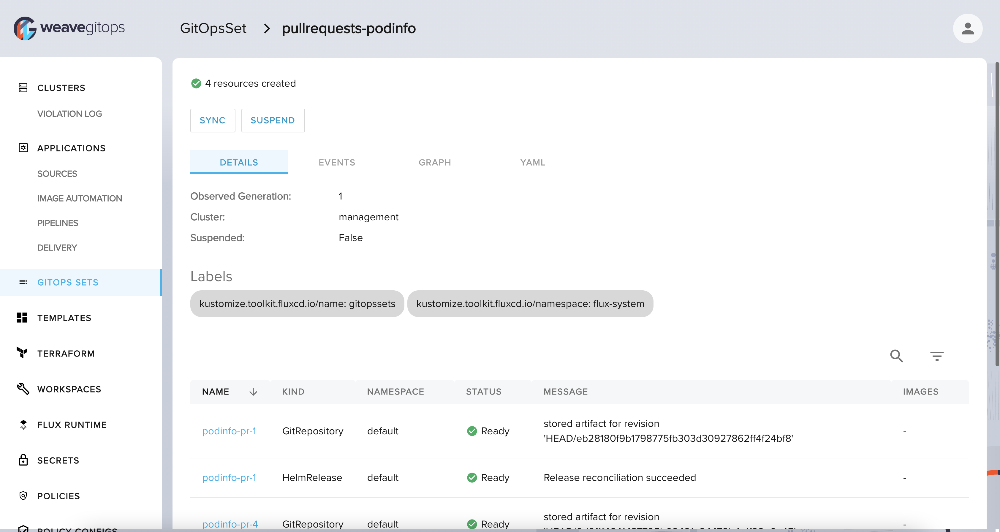
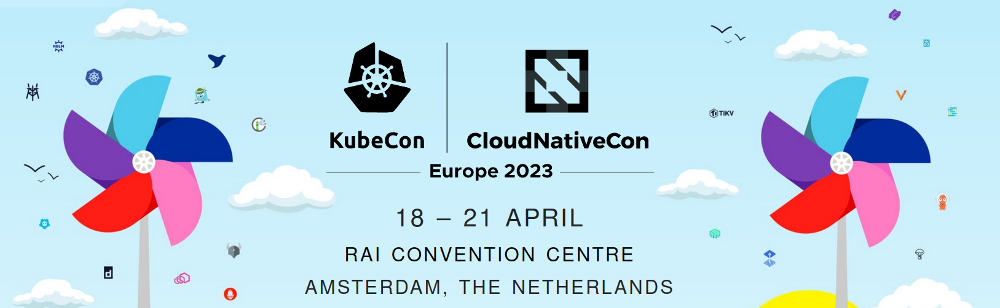

As the Flux family of projects and its communities are growing, we
strive to inform you each month about what has already landed, new
possibilities which are available for integration, and where you can get
involved. Read our last update [here](/blog/2023/03/february-2023-update/).

It's the beginning of April 2023 - let's recap together what
happened in March - it has been a lot!

## News in the Flux family

### Flux v0.41: more performance improvements, Helm-related features and "flux events"

We have released [Flux v0.41](https://github.com/fluxcd/flux2/releases/tag/v0.41.0)
with new features and improvements. As always, everyone is encouraged to upgrade for the
best experience.

Here is a short-list of features and improvements in this release:

- Experimental support of drift detection of Helm releases compared to cluster-state.
- Improved handling of `SIGTERM` signals received by the helm-controller, which will now
  terminate running Helm install or upgrade actions, instead of potentially leaving them
  in a pending state.
- Opt-in OOM watcher in helm-controller to handle graceful termination of the controller
  before it is forcefully killed by Kubernetes' OOM killer.
- Kubernetes client and Custom Resource Definition life-cycle improvements to reduce the
  memory consumption of the helm-controller, with observed reductions up to 50%.
- Opt-in allowance of DNS lookups during the rendering of Helm templates in the
  helm-controller via feature gate.
- Optional disabling of the cache of the status poller used to determine the health of
  the resources applied by the kustomize-controller. This may improve memory usage on
  large scale clusters at the cost of more direct API calls.
- Changes to the logging of all controllers to ensure Kubernetes components like the
  discovery client use the configured logging format.
- New `flux events` command to display Kubernetes events for Flux resources, including
  the events of a referenced resource.
- Custom annotations can now be set with `flux push` using `--annotations`.

It's important to us to document all the new features, so here goes a list of new
articles and how-tos:

- Cheatsheet: [Enable Helm drift
  detection](/flux/installation/configuration/helm-drift-detection/)
- Cheatsheet: [Enable Helm near OOM
  detection](/flux/installation/configuration/helm-oom-detection/)
- Cheatsheet: [Allow Helm DNS
  lookups](/flux/installation/configuration/helm-dns-lookup/)
- Controller: [New helm-controller feature gates and
  options](/flux/components/helm/options/#feature-gates)
- Controller: [New kustomize-controller feature
  gate](/flux/components/kustomize/options/#feature-gates)
- Spec: [HelmRelease drift
  detection](/flux/components/helm/helmreleases/#drift-detection)

Big thanks to all the Flux contributors that helped us with this release!

### Flux Ecosystem

#### Weave GitOps

[Weave GitOps Enterprise](https://docs.gitops.weave.works/docs/intro-ee/)
v0.19.0 brings a host of new features to help the Flux community streamline
their workflows and improve overall efficiency. The GitOpsSets GUI makes
it easier to manage applications across a fleet of clusters, while
additional generators like `cluster`, `gitRepository`, and `apiClient`
offer enhanced functionality and customization. Weave GitOps Enterprise
now supports raw templating for greater flexibility, and the Sandbox
environments provide real-time visibility and testing capabilities
for Kubernetes infrastructure.

New additions to the PolicyConfig UI simplify policy management, and the
SOPS Secrets features enable seamless GPG and AGE key management, making
it easier than ever to create encrypted secrets.  Experience the benefits
of adopting Weave GitOps by leveraging these powerful new features for
Kubernetes environments.

#### Terraform-controller

The team has been working on the new release of [Terraform
controller](https://github.com/weaveworks/tf-controller). Bug fixes
related to the GitOps dependency management have been landed in the
main branch. So please feel free to try it out.

The team has also been working closely with the Flux team to ensure
that Terraform controller will support everything in the coming Flux GA.

#### Flux Subsystem for Argo

[Flamingo, the Flux Subsystem for
Argo](https://github.com/flux-subsystem-argo/flamingo), for ArgoCD 2.6
and Flux v0.41, has been released. Flamingo is the only tool that combines
the best two GitOps technologies together. Flux and ArgoCD are both
CNCF graduate projects.

This new Flamingo version includes support for the following:

- Flux v0.41 which comes with many features and enhancements,
- Pack of new user interface features from ArgoCD 2.6

Chanwit Kaekwasi, the main developer of Flamingo, is looking for feedback.
If you use Flamingo and want to chat about how you use it, where you
would like it to go or just want to give some feedback, please find him on
the #flux channel on CNCF Slack. Thanks a lot in advance!

#### VS Code GitOps Extension

Version 0.24.0 of the [VS Code
extension](https://github.com/weaveworks/vscode-gitops-tools) was released.
This version introduces a new feature for the users of Weave GitOps Enterprise:
Templates. Using Templates users can create complex GitOps configurations,
workflows and pipelines with a simple UI. Templates must be enabled in the
VS Code settings to be available. The [README
file](https://github.com/weaveworks/vscode-gitops-tools#readme) includes
further information.

The team is continuing to work on UI and performance improvements. In the 0.24
release, the Sources and Workloads views are now grouped by Namespaces and
their details are presented in a consistent way.

#### New additions to the Flux Ecosystem

We are very happy to see Timoni joining the [Flux Ecosystem](/ecosystem).

[Timoni](https://github.com/stefanprodan/timoni) is a package manager for Kubernetes, powered by [CUE](https://cuelang.org) and inspired by Helm.

The Timoni project strives to improve the UX of authoring Kubernetes configs. Instead of mingling Go templates with YAML like Helm, or layering YAML on top of each-other like Kustomize, Timoni relies on cuelang's type safety, code generation and data validation features to offer a better experience of creating, packaging and delivering apps to Kubernetes.

Timoni can be [used together with Flux](https://timoni.sh/gitops-flux/) to create a
GitOps delivery pipeline for Timoni’s module instances.



## Recent & Upcoming Events

It's important to keep you up to date with new features and developments
in Flux and provide simple ways to see our work in action and chat with
our engineers.

### Recent Events (ICYMI) 📺

We feel blessed to have such a big community of users, contributors and
integrators and so many are happy to talk about their experiences. In
March here are a couple of talks we would like to highlight.



Kubernetes co-founder Brendan Burns and Flux maintainer Stefan Prodan
recently gave a CNCF talk on #ubernetes in 2023.



Monolith to Microservices with Bite-Sized Kubernetes.



Cloud Native Live: Automating Kubernetes Deployments.

Here is a list of additional videos and topics we really enjoyed -
please let us know if we missed anything of interest and we will make
sure to mention it in the next post!

### Upcoming Events 📆

We are happy to announce that we have a number of events coming up in
April - tune in to learn more about Flux and GitOps best practices,
get to know the team and join our community.

#### CloudNativeCon / KubeCon EU 2023

We are very excited! From Tuesday, April 18 through Friday, April 21
it is [CloudNativeCon / KubeCon EU
2023](https://events.linuxfoundation.org/kubecon-cloudnativecon-europe/)
in Amsterdam.

At the time of writing all the tickets have been sold out, so if you
managed to get one, we look forward to seeing you there! Let's dig into
what's happening over all of the days, because it is a lot.

Here is [the link to our mini-website](https://bit.ly/Flux_KubeConEU_2023)
to keep you up to date at all times.

##### Tuesday, April 18

This is where CloudNativeCon starts and we are happy to have representation
at a number of Day-0 events.

- 08:00: [OpenGitOps Project Meeting](https://sched.co/1K65O) in the
  Auditorium Center.
- 11:55: [Cloud Native Telco Day Panel: Looking Ahead to the Future with
  Project Sylva, Energy Efficiency & Telco Cloud
  Platforms](https://sched.co/1Jo7P). Panelists are Niki Manoledaki
  (Weaveworks), Philippe Ensarguet (Orange Business Services), Gergely
  Csatári (Nokia), Tim Irnich (SUSE) in Hall 7, Room A.

In the afternoon, starting at 13:00 (1pm), we start our [**Flux Project
Gathering** in Room G108 of the Auditorium Center](https://sched.co/1JWP8).
A lot of Flux maintainers and contributors will be there to chat with and
we have a nice programme prepared for you.

- 1:00 pm Meet and Greet
- 1:15 pm Welcome and Overview of Flux activities at KubeCon
- 1:30 pm Intro to GitOps and Flux + Q&A (Priyanka "Pinky" Ravi)
- 2:00 pm What's New with Flux! Overview (Flux team)
  - Flux GA Release is coming up! What does that mean for you?
  - Graduation and other updates!
  - Contributing to Flux
- 3:00 pm Q&A time
- 3:15 pm Break
- 3:30 pm Flux & Other Tools
  - Terraform (Pinky)
  - Vault (Pinky)
  - Helm (Hidde Beydals)
  - VS Code (Juozas Gaigalas)
  - Secrets & Sops (Hidde)
  - Cosign (Stefan)
  - Plus lots of time for Q&A!
- 4:45 pm Closing: Thanks and final questions

##### Wednesday, April 19

- 10:30 - 21:00 (9pm): Meet the Flux team at our booth at the Project Pavilion  
  at Project Pavilion, Kiosk 3
- 11:00 - 11:35: [A CI/CD Platform in the Palm of Your Hand](https://sched.co/1HyVW)  
  Claudia Beresford, Weaveworks at Elicium Building, D201-202
- 11:55 - 12:30: [Flux Beyond Git: Harnessing the Power of
  OCI](https://sched.co/1HySr)  
  Stefan Prodan & Hidde Beydals, Weaveworks at Forum Center, E103-E104
- 18:00 (6pm) - 20:00 (8pm): Meet the Flux team at our booth for the Booth Crawl  
  at Project Pavilion, Kiosk 3

**Update:** previously the OCI talk was scheduled to happen at 17:25. 11:55 is correct.

##### Thursday, April 20

- 10:30 - 17:30 (5.30pm): Meet the Flux team at our booth at the Project Pavilion  
  at Project Pavilion, Kiosk 3
- 16:00 - 16:30 (4.30pm): Flux Project Graduation Celebration  
  in Hall 5

##### Friday, April 21

- 10:30 - 14:30 (2.30pm): Meet the Flux team at our booth at the Project Pavilion  
  at Project Pavilion, Kiosk 3
- 14:55 (2.55pm) - 15:30 (5.30pm): [How GitOps Changed Our Lives & Can Change
  Yours Too!](https://sched.co/1HydD) at Auditorium Center, G104-105  
  Priyanka Ravi, Weaveworks  
  Christian Hernandez, Red Hat  
  Filip Jansson, Strålfors  
  Roberth Strand, Amesto Fortytwo  
  Leigh Capili, VMware
- 16:00 (4pm) - 16:35 (4.35 pm): [Self-Service GitOps at a Regulated
  Enterprise](https://sched.co/1Hyc9)  
  Erick Bourgeois (Freelance) at Auditorium Center, G104-105
- 16:00 (4pm) - 16:35 (4.35 pm): [A Look Under the Hood of CNCF Security
  Audits](https://sched.co/1Hybf)  
  Adam Korczynski & David Korczynski, Ada Logics at Auditorium Center, Auditorium + Balcony

**Update:** previously the time for the panel was 16:55, it has been moved to 14:55.

#### Flux Bug Scrub

The Flux Bug Scrub has undertaken a slightly new format, where we'll be
spending more time working on our own code, and even building some new
software under the aegis of the "flux-community" organization! We'll still
have our familiar spreadsheet every week, but we will be conversely
spending less time per-meeting on curating the list of issues across the
FluxCD org than we have been.

The Bug Scrub community is small but growing; we need your feedback to make
this effort a blockbuster hit (which you can provide asynchronously, please
remember to @ KingdonB if you are interested, whether you can or cannot make
the meeting time!)

Since we'll be spending more time on code at the meeting, we are also
evaluating the possibility of a new, more inclusive "Late Late" Bug Scrub,
which would aim to be more accessible to people in the Asia/Pacific time zones,
Australia, as well as those in Eastern Europe, Middle East, and Africa. We hope
that there are some folks who might not have been able to make the earlier times,
who could benefit from this new addition. If you are in these time zones which
are not covered now, it'll actually be "Early Work Hours" for you if we've
calibrated this correctly. (Good morning, Internet...)

The addition of another meeting at a new time of day, is intended to provide a
little extra time for the curation of issues to go along with our new format
change, and also to balance the scales somewhat better across all regions.
Now, we just need your feedback and RSVP to decide exactly what time this new
meeting should be! Please check out [the FluxCD calendar](/#calendar) for an
indication of when it has been scheduled, or ping KingdonB in the Flux channel
on CNCF slack if you have a strong opinion on the matter!

The next dates are going to be:

- [2023-04-05 12:00 UTC, 14:00 CEST](/#calendar)
- [2023-04-13 17:00 UTC, 19:00 CEST](/#calendar)
- [2023-04-19 12:00 UTC, 14:00 CEST](/#calendar)
- [2023-04-27 17:00 UTC, 19:00 CEST](/#calendar)

## In other news

### People writing/talking about Flux

We love it when you all write about Flux and share your experience,
write how-tos on integrating Flux with other pieces of software or other
things. Give us a shout-out and we will link it from this section! ✍

**[blakyaks.com: AKS & Flux via
Terraform](https://www.blakyaks.com/resources/aks-and-flux-via-terraform)**

Flux Adopters BlakYaks wrote this nice article in which they explain
how to bring Flux to AKS via Terraform. In closing they say:

> Hopefully by now you've got an idea of why we're big advocates of GitOps
> workflows and, in particular, Flux.
>
> The convention-based approach allows us to build complex application
> deployments with ease, and by leveraging source control best practices
> such as pull requests and branch policy we can quickly integrate
> deployments into our existing CI/CD toolchains in a secure and scalable
> manner.

### News from the Website and our Docs

#### Flux Adopters shout-out

We are very pleased to announce that the following adopters of Flux have
come forward and added themselves to our website:
[BlakYaks](https://blakyaks.com), [Enliven Systems](https://enliven.systems),
[Kratix](https://kratix.io), [MyTaxi](https://mytaxi.uz),
[ScaleAq](https://scaleaq.com), [Szerzi](https://szerzi.hu) and
[TrueLayer](https://truelayer.com)

If you have not already done so, [use the instructions
here](/adopters/) or give us a ping and we will help to add you. Not only
is it great for us to get to know and welcome you to our community. It
also gives the team a big boost in morale to know where in the world
Flux is used everywhere.

#### More docs and website news

We are constantly improving our documentation and website - here are a
couple of small things we landed recently:

- Update of [fluxcd.io](/) landing page: we removed the terminal as it
  had been outdated and slowed down the loading time. We also simplified
  our messaging about Flux features and mission so it's easier to
  understand at a glance.
- We restructured our use of shortblocks, so the code structure is
  more straight-forward.
- We applied for [Google Season of Docs
  2023](/contributing/docs/google-season-of-docs-2023/). If you are
  interested in the initiative, go and check out the link.
- We added information about to [enable Helm drift
  detection](/flux/installation/configuration/helm-drift-detection/)
  and how to [allow Helm DNS
  lookups](/flux/installation/configuration/helm-dns-lookup/).

And on top of that countless fixes, small improvements and updates as
always. Thanks a lot to these folks who contributed to docs and website:
Stefan Prodan, Hidde Beydals, Arhell, Max Jonas Werner, Andreas Olsen Gulla,
Craig Hurt, Gangstead, Jake, KwongTN, Matteo Martellini, Metin OSMAN,
Sanskar Jaiswal, Timo Furrer and zoltan.zvara.

## Flux Project Facts

We are very proud of what we have put together. We want to reiterate
some Flux facts - they are sort of our mission statement with Flux.

1. 🤝 Flux provides GitOps for both apps or
  infrastructure. Flux and [Flagger](https://github.com/fluxcd/flagger)
  deploy apps with canaries, feature flags, and A/B rollouts. Flux
  can also manage any Kubernetes resource. Infrastructure and workload
  dependency management is built-in.
1. 🤖 Just push to Git and Flux does the rest. Flux
  enables application deployment (CD) and (with the help of
  [Flagger](https://github.com/fluxcd/flagger))
  progressive delivery (PD) through automatic reconciliation. Flux
  can even push back to Git for you with automated container image
  updates to Git (image scanning and patching).
1. 🔩 Flux works with your existing tools: Flux works with your Git
   providers (GitHub, GitLab, Bitbucket, can even use s3-compatible
   buckets as a source), all major container registries, fully
   integrates [with OCI](/flux/cheatsheets/oci-artifacts) and all CI
   workflow providers.
1. 🔒 Flux is designed with security in mind: Pull vs. Push,
  least amount of privileges, adherence to Kubernetes security
  policies and tight integration with security tools and
  best-practices. Read more about our security considerations.
1. ☸️ Flux works with any Kubernetes and all common Kubernetes
  tooling: Kustomize, Helm, RBAC, and policy-driven
  validation (OPA, Kyverno, admission controllers) so it simply
  falls into place.
1. 🤹 Flux does Multi-Tenancy (and "Multi-everything"):
  Flux uses true Kubernetes RBAC via impersonation and supports
  multiple Git repositories. Multi-cluster infrastructure and apps
  work out of the box with Cluster API: Flux can use one Kubernetes
  cluster to manage apps in either the same or other clusters, spin
  up additional clusters themselves, and manage clusters including
  lifecycle and fleets.
1. ✨ Dashboards love Flux: No matter if you use one of
   [the Flux UIs](/ecosystem/#flux-uis--guis) or a hosted cloud
   offering from your cloud vendor, Flux has a thriving ecosystem
   of integrations and products built on top of it and all have
   great dashboards for you.
1. 📞 Flux alerts and notifies: Flux provides health
  assessments, alerting to external systems and external events
  handling. Just "git push", and get notified on Slack and [other
  chat systems](/flux/components/notification/provider/).
1. 👍 Users trust Flux: Flux is a CNCF Graduated project
  and was categorised as "Adopt" on the [CNCF CI/CD Tech
  Radar](https://radar.cncf.io/2020-06-continuous-delivery)
  (alongside Helm).
1. 💖 Flux has a lovely community that is very easy to work
  with! We welcome contributors of any kind. The
  components of Flux are on Kubernetes core controller-runtime, so
  anyone can contribute and its functionality can be extended very
  easily.

## Over and out

If you like what you read and would like to get involved, here are a few
good ways to do that:

- Join our [upcoming dev meetings](/community/#meetings) on
  2023-04-06 or 2023-04-12.
- Talk to us in the #flux channel on [CNCF Slack](https://slack.cncf.io/)
- Join the [planning discussions](https://github.com/fluxcd/flux2/discussions)
- And if you are completely new to Flux, take a look at our [Get
  Started guide](/flux/get-started/) and give us feedback
- Social media: Follow [Flux on Twitter](https://twitter.com/fluxcd),
  join the discussion in the [Flux LinkedIn
  group](https://www.linkedin.com/groups/8985374/).

We are looking forward to working with you.
