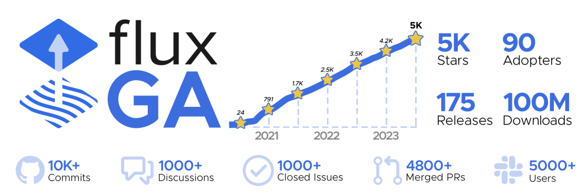

## Flux 2.0 and General Availability!

> Best Buy: Tahir Raza, Staff Engineer - Cloud & Platform Engineering: 
> “GitOps practices and Flux has elevated our engineering: code infra
> as software, eliminate human intervention, accelerate lead time for changes -
> without compromising security requirements.”

On July 5, 2023, Flux reached a major landmark with Flux 2.0 and the general
availability of its GitOps components! Flux has continued to grow during its
incredible journey. Its early iteration was built at Weaveworks for their own
needs and for a previous SaaS product built on Flux. Flux led to Weaveworks
CEO Alexis Richardson to coin the term, GitOps, which has taken the world by
storm with a CNCF Working Group, GitOpsCon, GitOps Days, and several GitOps
community groups. Moreover, leaders such as Kubernetes co-creators Brendan Burns
and Joe Beda have stated how GitOps is a natural evolution of Kubernetes itself.

It’s, therefore, no surprise that the open-source Flux project has reached many
great achievements: continued developmental improvements and thought leadership
such as microservices architecture, security-first design, multi-tenancy, OCI and
Cosign support, and more. as part of this journey, Flux is a graduated project in the Cloud
Native Computing Foundation and is the GitOps tool that companies such as Microsoft,
AWS, GitLab, D2iQ, and more trust to deliver GitOps to their customers. 
Enterprises such as SAP, RingCentral, Best Buy, Volvo and many others 
also trust Flux to be an essential part of their Kubernetes journey.

> Safaricom PLC: Winnie Gakuru, DevSecOps Engineer II: "Safaricom PLC 
> rovides mobile telephony, mobile money transfer, consumer electronics, e-commerce,
> cloud computing, data, music streaming, and fiber optic services to the Kenyan
> Market predominantly and to the wider East Africa. So, Flux has been an essential
> part of critical areas such as deployment frequency, standardization, and security,
> among other GitOps capabilities that help us to be competitive. We are excited
> about Flux 2.0 and the project's continued maturity.

## Flux General Availability

> AWS: Joey Wang, Senior Software Engineer, Amazon Web Services: EKS Anywhere has been
> providing GitOps capabilities with Flux to our happy enterprise customers. We've been
> testing Flux 2.0 since our EKS-A v0.16.0 release and it has been solid. Flux,
> as a CNCF Graduated project and now with its GitOps components at GA, has been
> reliable and enterprise grade so that we can deliver the best experience to the
> customers who depend on our quality of product.

### What does General Availability (GA) mean for you as a Flux user:

> Thoughtworks: Bryan Oliver, Principal: "Flux is often my go-to technology
> choice for building multi-cluster and even multi-region deployment patterns.
> It helps me enable teams in evolving their applications from one cluster to
> many with consistent and repeatable config."

This signifies that the APIs that have achieved GA (Generally Available) status
are now considered stable and can be used with confidence in production environments.
They offer backward compatibility, ensuring that existing implementations will continue
to function as expected. Flux encompasses various APIs, but not all of them have attained GA status yet.

The APIs that have reached GA include:

- GitRepository: This API facilitates pulling configurations from Git repositories.
- Kustomization: It enables the application and synchronization of Kubernetes manifests defined in Git.
- Receiver API: This API triggers the reconciliation of Flux Custom Resources using webhooks.

It is important to note that these GA APIs will not undergo backwards-incompatible
changes unless accompanied by a major version update and appropriate advance announcements
As for the remaining Flux APIs, they will undergo further development and enhancements
before being promoted to GA status at a later stage.

> GitLab: Viktor Nagy, Senior Product Manager, Environments group:
> "GitLab picked Flux for its official GitOps integration within our GitLab agent for Kubernetes.
> Flux's maturation and reliability have continued to show as we've tested Flux 2.0 in development.
> Now with Flux's GA, we can continue to build the best user experience for our enterprise
> customers on solid foundations."

### Releases

> Weaveworks: Stefan Prodan, Principal Developer Experience Engineer: Flux maintainer
> and Flagger creator: “It has been a fantastic journey of rebuilding the original
> Flux into a microservices architecture, adding Flagger as a subproject, getting
> validated as a graduated project in the CNCF, and now reaching GA with Flux 2.0.
> I am grateful to work with great teams, maintainers, contributors, and partners,
> and then  to see major enterprises and cloud providers relying on Flux to start
> or mature their Kubernetes journey. Keeping great company with users (the likes
> of Amazon AWS, D2iQ, Microsoft Azure, VMware, Weaveworks, GitLab, Volvo, SAP,
> Xenit and many more) keeps me motivated for the future innovations and growth for Flux.”

Release Cadence: Flux will have at least three minor releases in a year
following the Kubernetes release cadence. The release will happen roughly
two weeks after the Kubernetes release. Two weeks timeline can be adjusted if more
time is needed for testing the Kubernetes version.

API Versioning: The Flux project follows the semver standard for versioning.
Release candidates are marked as `x.y.z-rc.a` (e.g v1.0.0-rc.3) and stable
releases are marked as `x.y.z`.

Support: Flux will support the last three minor release versions of a major
release and the previous major release version for a year after its release.
A newly released Flux version offers support for Kubernetes N-2 minor versions.

CVE Backport: We will backport bug fixes and security fixes to the last three minor
releases as patch releases. Users are advised to run the latest patch release of
a given minor release.

For more details on the release procedure, take a look at https://fluxcd.io/flux/releases.

> Xenit: Simon Gottschlag, CTO: "Xenit is proud to be contributors and maintainers
> of the Flux project, which is the GitOps tool of choice for enterprises and cloud
> providers such as Volvo, GitLab, Microsoft, and AWS. We are particularly proud
> to be part of Flux's major milestones: not only graduating in the Cloud Native
> Computing Foundation some months ago, but now getting Flux to 2.0 and general
> availability. We enjoy being part of the Flux community and look forward to
> the next stages of this growing community."

## How to get started?

- Watch our [CNCF webinar on Flux 2.0](https://community.cncf.io/events/details/cncf-cncf-online-programs-presents-cncf-on-demand-webinar-flux-20-what-you-need-to-know/),
  which has an intro to GitOps for newcomers and Flux 2.0-specific updates for existing users.
- Need extra support for Flux and Flagger? Check out the
  [Flux support page](https://fluxcd.io/support/#my-employer-needs-additional-help) and this
  [August 2 webinar](https://go.weave.works/Webinar-FluxCD-Positioned-for-Growth_LP.html)
  on Flux 2.0-specific support.

❤️ Your Flux maintainer, Somtochi Onyekwere, and project member, Tamao Nakahara.
