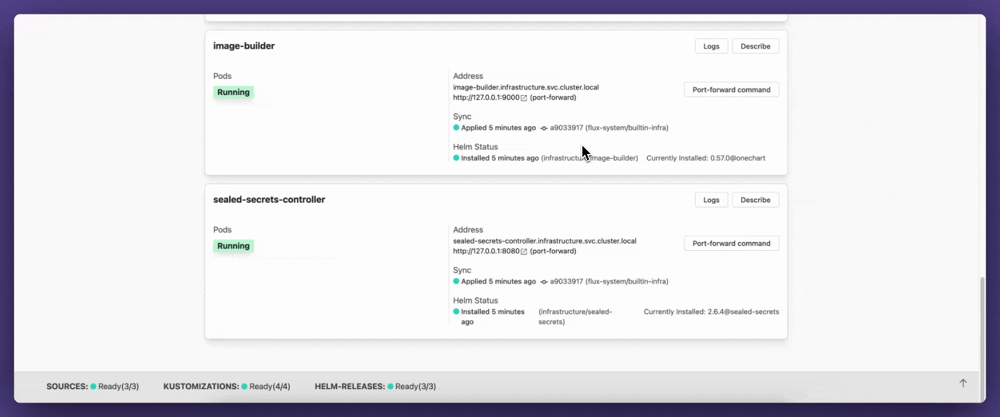
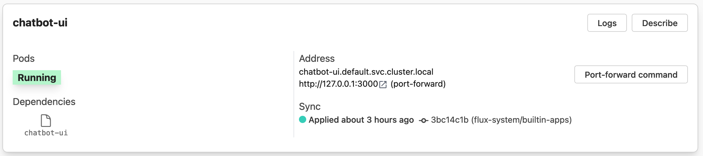
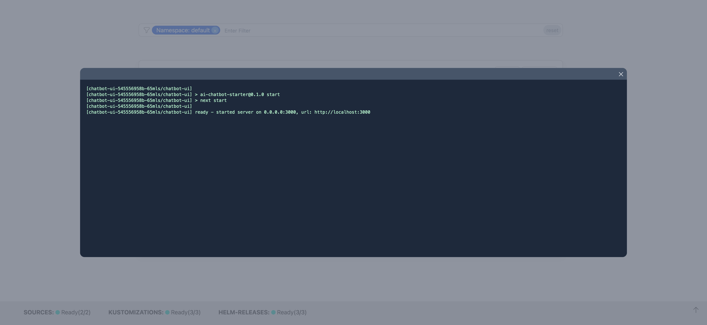

<!--

Have a look at these documents

- internal_docs/how-to-do-the-monthly-update.md
  online: https://github.com/fluxcd/website/blob/main/internal_docs/how-to-do-the-monthly-update.md
- internal_docs/how-to-write-a-blog-post.md
  online: https://github.com/fluxcd/website/blob/main/internal_docs/how-to-write-a-blog-post.md

to get more background on how to publish this blog post.

-->

Flux has been one of the most popular gitops tools available for years. Yet, it only existed as a CLI tool until now. Capacitor is a GUI that acts as a dashboard for Flux where you can get quick overview about your Flux resources and application deployments to debug issues quickly.


## A word from Laszlo, the maintainer of Capacitor

> “Hello Flux blog,
> 
> Long time Flux user here, although I haven't been very active in the community so far. The maintainers have been doing an amazing job with Flux. We’re standing on the shoulders of giants 🙌.
> 
> There is an odd fact though: there was no de facto Flux GUI until now. How come?
> I thought we could make one, hence we made Capacitor.
> 
> Why?
> Because it is not easy to observe Kustomization and HelmRelease states in the cluster. Even with tools that show Custom Resources, it is not obvious to make the connection between application deployments and Flux resources.
> 
> The goal with Capacitor is to create the right context for developers to debug their deployments. Whether the error is related to Flux or not.
> 
> We hope you’re going to find the tool useful.”

## Use cases

### Commandless Flux observation

The GUI substitutes for interacting with Flux resources and runtime via flux CLI commands.


### Connecting application deployments with Flux resources

Application deployments show which Flux Kustomization or HelmRelease deployed them.

With a click of a button you can jump to the Flux resource and check the reconsiliation state.



### Application deployment debugging
Application deployments have controls to perform routine tasks, like checking logs, describing deployments, pods, configmaps.

With these controls Capacitor can become your daily driver for your Kubernetes dashboarding needs.





## What’s supported?

Flux resources:
- Kustomization
- HelmRelease
- GitRepository
- OCIRepositories
- Buckets

Kubernetes resources:
- Deployment
- Pod
- Service
- Ingress
- Configmap
- Secret

## Who made Capacitor?

Capacitor is an open-source project backed by [Gimlet](https://gimlet.io), a team that creates a Flux-based IDP.

Gimlet is our opinionated project, Capacitor is our un-opinionated take.

## How to get started?

Capacitor doesn’t come with Flux natively, you’ll need to set it up separately.

Deploy the latest Capacitor release in the flux-system namespace by adding the following manifests to your Flux repository:

```yaml
---
apiVersion: source.toolkit.fluxcd.io/v1beta2
kind: OCIRepository
metadata:
  name: capacitor
  namespace: flux-system
spec:
  interval: 12h
  url: oci://ghcr.io/gimlet-io/capacitor-manifests
  ref:
    semver: ">=0.1.0"
---
apiVersion: kustomize.toolkit.fluxcd.io/v1
kind: Kustomization
metadata:
  name: capacitor
  namespace: flux-system
spec:
  targetNamespace: flux-system
  interval: 1h
  retryInterval: 2m
  timeout: 5m
  wait: true
  prune: true
  path: "./"
  sourceRef:
    kind: OCIRepository
    name: capacitor
```

Note that Flux will check for Capacitor releases every 12 hours and will automatically deploy the new version if it is available.

Access Capacitor UI with port-forwarding:

```bash
kubectl -n flux-system port-forward svc/capacitor 9000:9000
```

## Where is the project hosted?

It is hosted on Github: [gimlet-io/capacitor](https://github.com/gimlet-io/capacitor)
