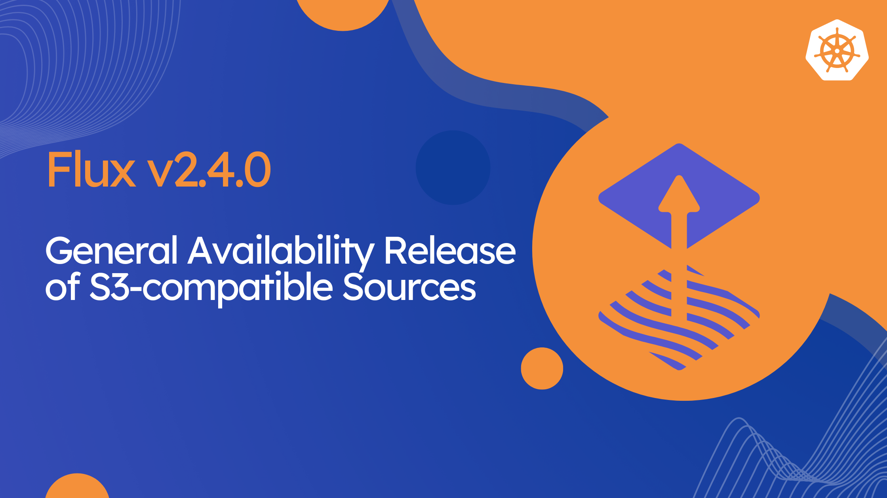

We are thrilled to announce the release of [Flux v2.4.0](https://github.com/fluxcd/flux2/releases/tag/v2.4.0)!
In this post, we will highlight some of the new features and improvements included in this release.



## General availability of Flux S3-compatible Source API

This release marks the General Availability (GA) of Flux `Bucket` API which allows storing
the desired state of Kubernetes clusters in S3-compatible storage services such as
Amazon S3, Azure Blob Storage, Google Cloud Storage, Alibaba Cloud, MinIO, and others.

The `Bucket` v1 API comes with new features including: proxy support, mTLS and custom STS
configuration for AWS S3 and MinIO LDAP authentication.

New fields in the `source.toollkit.fluxcd.io/v1` API:

- `.spec.proxySecretRef` allows configuring HTTP/S Proxy authentication for the S3-compatible storage service.
- `.spec.certSecretRef` allows custom TLS client certificate and CA for secure communication with the S3-compatible storage service.
- `.spec.sts` allows custom STS configuration for AWS S3 and MinIO LDAP authentication.

For more details, please see the [Bucket documentation](/flux/components/source/buckets/).

To upgrade, make sure the new CRDs and controllers are deployed, and then change the manifests in Git:

1. Set  `apiVersion: source.toolkit.fluxcd.io/v1` in the YAML files that contain `Bucket` definitions.
2. Commit, push and reconcile the API version changes.

Bumping the APIs version in manifests can be done gradually.
It is advised to not delay this procedure as the deprecated versions will be removed after 6 months.

## Azure DevOps OIDC Authentication

Starting with Flux v2.4, you can configure source-controller and image-automation-controller
to authenticate against Azure DevOps repositories using AKS Workload Identity.

Instead of using Azure personal access tokens or SSH keys that require manual rotation,
you can now use OIDC tokens to authenticate against Azure DevOps repositories by leveraging
Kubernetes Workload Identity. 

For more details on how to configure the Azure DevOps OIDC authentication, see the
[GitRepository API documentation](https://fluxcd.io/flux/components/source/gitrepositories/#provider).

## Controller Improvements

- The `OCIRepository` v1beta2 API gains support for proxy configuration thus allowing
  dedicated [HTTP/S Proxy](/flux/components/source/ocirepositories/#proxy-secret-reference)
  authentication on multi-tenant Kubernetes clusters.
- The `HelmRelease` v2 API gains support for disabling JSON schema validation of the Helm release values
  during installation and upgrade. And allows adopting existing Kubernetes resources during Helm release
  installation.
- The notification-controller allows transitioning the Microsoft Teams alerting from the deprecated
  Office 365 connector to MS Workflows and the [Adaptive Card format](/flux/components/notification/providers/#microsoft-teams).
- The Flux Kustomization and HelmRelease APIs now support defining dependencies between resources
  managed by different controller shards.

## CLI Improvements

- A new command was added, `flux create secret proxy` that can be used to generate a Kubernetes Secret
  for HTTP/S Proxy authentication referenced by `Bucket`, `GitRepository` and `OCIRepository`. 
- The `flux create source git` command now supports the `--provider=azure` flag to configure OIDC authentication
  for Azure DevOps repositories.
- The `flux diff kustomization` command now supports the `--recursive` flag to recursively diff encountered Kustomizations.
- On Windows, the Flux CLI can now be installed using the WinGet tool by running `winget install -e --id FluxCD.Flux`.

## Supported Versions

Flux v2.1 has reached end-of-life and is no longer supported.

Flux v2.4 supports the following Kubernetes versions:

| Distribution | Versions         |
|:-------------|:-----------------|
| Kubernetes   | 1.29, 1.30, 1.31 |
| OpenShift    | 4.16             |

{}
Note that the CNCF Flux project offers support only for the latest
three minor versions of Kubernetes.

Backwards compatibility with older versions of Kubernetes and OpenShift is offered by vendors
such as [ControlPlane](https://control-plane.io/enterprise-for-flux-cd/) that provide
enterprise support for Flux.
{}

## Flux Operator and OpenShift Compatibility

Flux can be installed on Red Hat OpenShift cluster directly from
[OperatorHub](https://operatorhub.io/operator/flux-operator) or by using the
[Flux Operator Helm chart](https://artifacthub.io/packages/helm/flux-operator/flux-operator).

The [Flux Operator](https://github.com/controlplaneio-fluxcd/flux-operator)
is an open-source project developed by ControlPlane that offers an alternative to the
Flux Bootstrap procedure, it removes the operational burden of managing Flux across
fleets of clusters by fully automating the installation, configuration, and upgrade
of the Flux controllers based on a declarative API.

The operator simplifies the configuration of Flux multi-tenancy lockdown, sharding,
horizontal and vertical scaling, persistent storage, and allows fine-tuning
the Flux controllers with Kustomize patches. The operator streamlines the
transition from Git as the delivery mechanism for the cluster desired state
to OCI artifacts and S3-compatible storage.

After installing the Flux Operator on OpenShift, you can deploy the Flux controllers
using the `FluxInstance` custom resource e.g.:

```yaml
apiVersion: fluxcd.controlplane.io/v1
kind: FluxInstance
metadata:
  name: flux
spec:
  distribution:
    version: "2.x"
    registry: "ghcr.io/fluxcd"
    artifact: "oci://ghcr.io/controlplaneio-fluxcd/flux-operator-manifests:latest"
  components:
    - source-controller
    - kustomize-controller
    - helm-controller
    - notification-controller
    - image-reflector-controller
    - image-automation-controller
  cluster:
    type: openshift
    multitenant: true
    networkPolicy: true
    domain: "cluster.local"
  sharding:
    shards: [ "shard1", "shard2" ]
  sync:
    kind: OCIRepository
    url: "oci://ghcr.io/my-org/my-fleet-manifests"
    ref: "latest"
    path: "clusters/my-cluster"
    pullSecret: "flux-system"
```

For more details on how to use configure Flux using the operator, please see the
[Flux Operator documentation](https://fluxcd.control-plane.io/operator/).

## Over and out

If you have any questions, or simply just like what you read and want to get involved,
here are a few good ways to reach us:

- Join our [upcoming dev meetings](https://fluxcd.io/community/#meetings).
- Join the [Flux mailing list](https://lists.cncf.io/g/cncf-flux-dev) and let us know what you need help with.
- Talk to us in the #flux channel on [CNCF Slack](https://slack.cncf.io/).
- Join the [planning discussions](https://github.com/fluxcd/flux2/discussions).
- Follow [Flux on Twitter](https://twitter.com/fluxcd), or join the
  [Flux LinkedIn group](https://www.linkedin.com/groups/8985374/).
