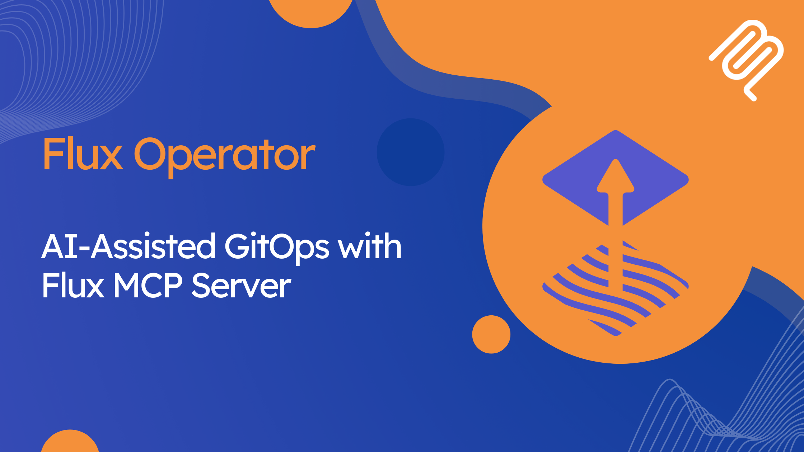
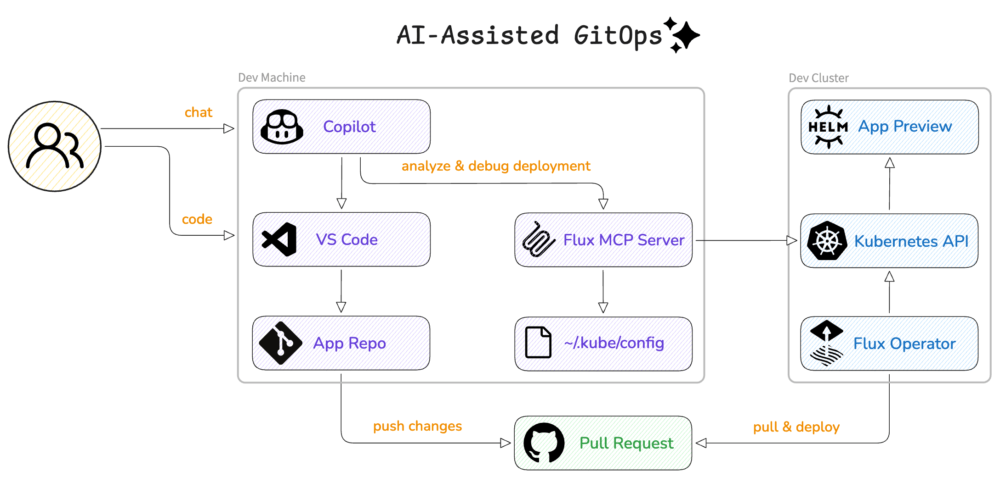
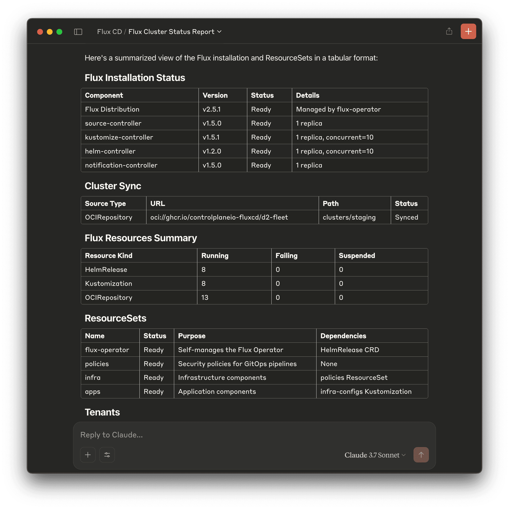
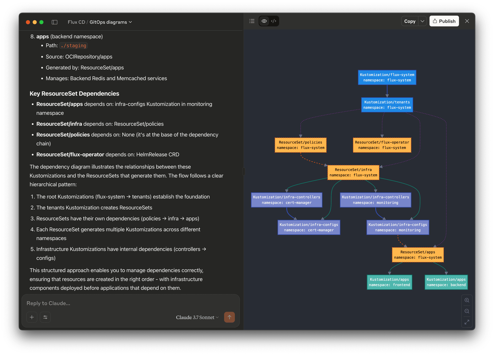
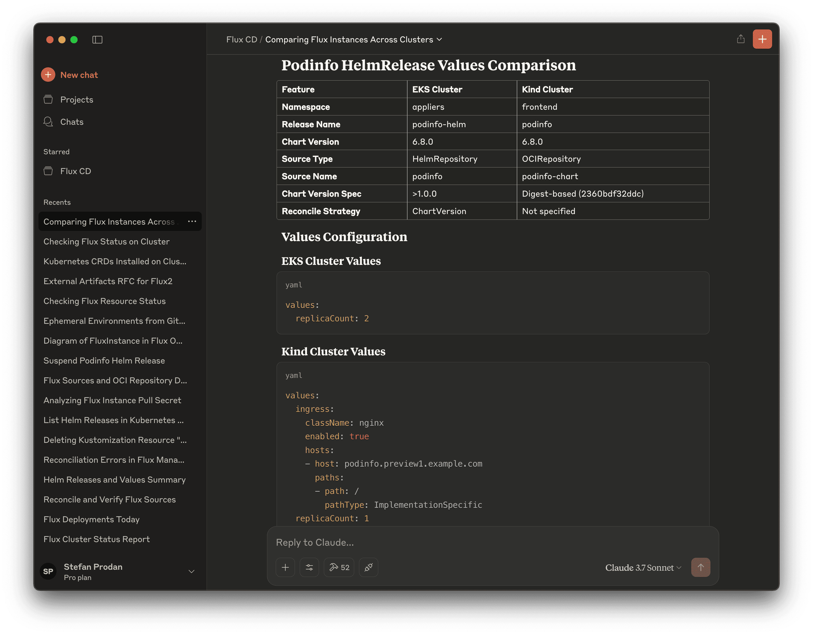

In this blog post, we introduce the Flux MCP Server, a new component of the
[Flux Operator](https://github.com/controlplaneio-fluxcd/flux-operator) project
that connects AI assistants directly to your Kubernetes clusters, enabling seamless interaction
through natural language. It serves as a bridge between AI tools and your GitOps pipelines,
allowing you to analyze the cluster state, troubleshoot deployment issues,
and perform operations using conversational prompts.

## Bringing AI to GitOps

The GitOps movement started with the Flux community back in 2016, and since then,
it has gained immense popularity in the Kubernetes ecosystem as a way to manage
infrastructure and application deployments declaratively. But as the GitOps pipelines
grow in complexity, so does the cognitive load required to troubleshoot issues,
understand resource relationships, and perform routine operations.

That's where the Flux MCP Server comes in. By connecting AI assistants to Kubernetes clusters
and the desired state in Git, it allows operators to:

- Debug GitOps pipelines end-to-end from Flux resources to application logs
- Get accurate root cause analysis for failed deployments
- Compare Flux configurations and Kubernetes resources between clusters
- Visualize Flux dependencies with diagrams generated from the cluster state
- Instruct Flux to perform operations using conversational prompts
- Get up-to-date information and recommendations using the latest Flux official docs

## How It Works

The Flux MCP Server implements the Model Context Protocol (MCP),
providing purpose-built tools that allow AI assistants to interact with your clusters.
When you ask a question or make a request, the AI model uses these tools to gather information,
analyze configurations, and even perform operations based on your instructions.

The AI assistants leveraging the Flux MCP Server can trace issues from high-level GitOps resources
like ResourceSets, HelmReleases, and Kustomizations all the way down to Kubernetes deployments
and pod logs.



In addition, the MCP Server enables the AI to search the Flux documentation
and provide accurate, up-to-date guidance based on the latest features and best practices,
rather than relying solely on its training data.

## Getting Started

Setting up the Flux MCP Server is straightforward. The server is written in Go and
statically compiled as a single binary with no external dependencies.

You can install it using Homebrew:

```shell
brew install controlplaneio-fluxcd/tap/flux-operator-mcp
```

Alternatively, you can download pre-built binaries for Linux, macOS,
and Windows, for more details refer to the [installation guide](https://fluxcd.control-plane.io/mcp/install/).

Once installed, you can configure your AI assistant to use the Flux MCP Server.
For Claude, Cursor, Windsurf, or GitHub Copilot add the following configuration to the MCP settings:

```json
{
  "flux-operator-mcp":{
    "command":"flux-operator-mcp",
    "args":["serve"],
    "env":{
      "KUBECONFIG":"/path/to/.kube/config"
    }
  }
}
```

Make sure to replace `/path/to/.kube/config` with the absolute path to your kubeconfig file.

## Setting Up AI Instructions

For the best experience with the Flux MCP Server, it's crucial to provide your AI assistant
with proper instructions on how to interact with Kubernetes clusters and the Flux resources.
These instructions help the AI understand the context and make appropriate tool calls.

The Flux MCP Server comes with a set of predefined instructions that you can copy from the
[instructions.md](https://raw.githubusercontent.com/controlplaneio-fluxcd/distribution/refs/heads/main/docs/mcp/instructions.md)
file.

It's recommended to enhance these instructions with information specific to your clusters, such as:

- Kubernetes distribution details (EKS, GKE, AKS, etc.)
- Cloud-specific services integrated with your clusters
- Types of applications deployed
- Secret management approaches

For detailed guidance on how to configure these instructions with different AI assistants,
refer to the [AI Instructions](https://fluxcd.control-plane.io/mcp/prompt-engineering/#ai-instructions)
section of the documentation.

## Practical Applications

Let's look at some practical ways the Flux MCP Server can enhance your GitOps experience:

### 1. Quick Health Assessment

Instead of running multiple kubectl and flux commands to check the status of your GitOps pipeline, you can simply ask:


> Analyze the Flux installation in my current cluster and report the status of all components and ResourceSets.




The AI assistant will gather information about your Flux Operator installation, controllers,
and managed resources, providing a comprehensive health assessment.

### 2. GitOps Pipeline Visualization

Understanding the relationships between various GitOps resources can be challenging. The Flux MCP Server makes it easy:

> List the Flux Kustomizations and draw a Mermaid diagram for the depends on relationship.



The AI will generate a visual representation of your GitOps pipeline, showing the dependency
relationships between Flux Kustomizations and helping you understand the deployment order and potential bottlenecks.

### 3. Cross-Cluster Comparisons

When managing multiple environments, comparing configurations can be tedious. With Flux MCP Server:

> Compare the podinfo HelmRelease between production and staging clusters.



The AI will switch contexts, gather the relevant information, and highlight the differences between the two environments.

### 3. Root Cause Analysis

When deployments fail, finding the root cause can involve digging through multiple resources and logs:

> Perform a root cause analysis of the last failed Helm release in the frontend namespace.

The AI assistant will trace through dependencies, check resource statuses, analyze logs,
and provide a detailed explanation of what went wrong and how to fix it.

### 4. GitOps Operations

You can even perform GitOps operations directly through natural language:


> Resume all the suspended Flux resources in the current cluster and verify their status.


The AI will identify suspended resources, resume them, and report on the results.

### 5. Kubernetes Operations

The Flux MCP Server enables complex Kubernetes operations with simple instructions:

> Create a namespace called test, then copy the podinfo Helm release and its source.
> Change the Helm values for ingress to test.podinfo.com

The AI will generate and apply the necessary Kubernetes resources,
handling the details of creating namespaces, cloning Helm releases,
and modifying configuration values - all through a single conversational request.

## Security Considerations

As with any tool that interacts with your clusters, security should be a top priority.
The Flux MCP Server includes several security features to ensure safe operations:

- Operates with your existing kubeconfig permissions
- Supports service account impersonation for limited access
- Masks sensitive information in Kubernetes Secret values
- Provides a read-only mode for observation without affecting the cluster state

For more details on security settings, please refer to the [configuration guide](https://fluxcd.control-plane.io/mcp/config/).

## The Future of AI-Assisted GitOps

The Flux MCP Server is currently an experimental feature, and it's being actively developed based
on user feedback and real-world use cases.

We plan to enhance the server with the following features in future releases:

- Integration with Kubernetes metrics-server and other observability tools
- Improved the documentation search capabilities
- More advanced troubleshooting capabilities
- Support for staged rollout/rollback of apps across clusters

All feedback is welcome, please reach out to us on [GitHub Discussions](https://github.com/fluxcd/flux2/discussions/5352).
