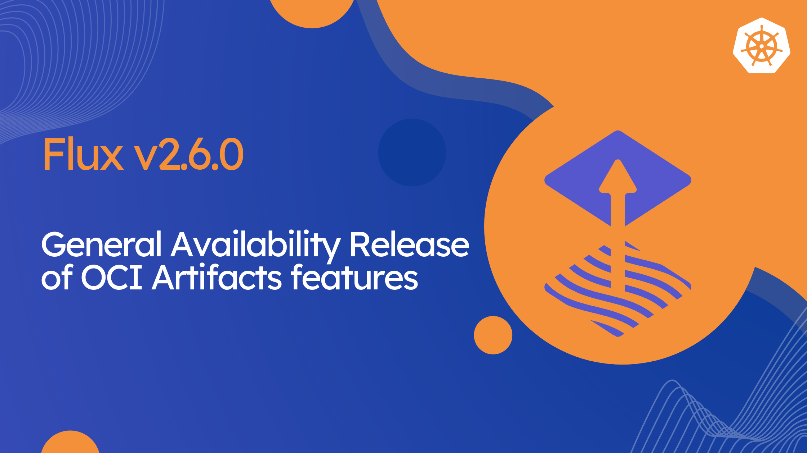

We are thrilled to announce the release of [Flux v2.6.0](https://github.com/fluxcd/flux2/releases/tag/v2.6.0)!
In this post, we will highlight some of the new features and improvements included in this release.



## Highlights

Flux v2.6 marks the General Availability (GA) of the Flux Open Container Initiative (OCI) Artifacts features.
The OCI artifacts support was first introduced in 2022, and since then we've been evolving Flux towards
a **Gitless GitOps** model. In this model, the Flux controllers are fully decoupled from Git,
relying solely on container registries as the source of truth for the desired state of Kubernetes clusters.

In the last couple of years, the OCI feature-set has matured, and we've seen major financial institutions
and enterprises adopting Flux and OCI as their preferred way of managing production deployments.
To see it in action, you can check the reference architecture guide made by ControlPlane
on how highly regulated industries can securely implement
[Gitless GitOps with Flux and OCI](https://control-plane.io/posts/d2-reference-architecture-guide/).

In this release, we have also introduced several new features to the Flux controllers,
including digest pinning in image automation, object-level workload identity for container registries
and KMS services authentication, and various improvements to notifications.

In ecosystem news, there is a new release of [Flux Operator](https://github.com/controlplaneio-fluxcd/flux-operator)
that comes with a Model Context Protocol (MCP) implementation for allowing AI assistants to interact with Flux.
For more details on the Flux MCP Server, see the [AI-Assisted GitOps blog post](https://fluxcd.io/blog/2025/05/ai-assisted-gitops/).

## General availability of Flux OCI Artifacts

This release marks the General Availability (GA) of Flux [OCIRepository](/flux/components/source/ocirepositories/)
API, which allows storing the desired state of Kubernetes clusters in OCI container registries.

The `OCIRepository` v1 API comes with new features including:

- Support for [Object-Level Workload Identity](#object-level-workload-identity),
  which allows Flux to use different cloud identities for accessing container registries on multi-tenant clusters.
- Caching of registry credentials for cloud providers, which allows Flux to reuse the OIDC tokens
  for subsequent requests to the same registry, reducing the number of authentication requests.

The `OCIRepository` v1 API is backward compatible with the previous v1beta2 API, users can upgrade
by changing the `apiVersion` in the YAML files that contain `OCIRepository` definitions from
`source.toolkit.fluxcd.io/v1beta2` to `source.toolkit.fluxcd.io/v1`.

The Flux CLI commands for working with OCI artifacts have been promoted to stable:

- `flux build artifact`
- `flux push artifact`
- `flux pull artifact`
- `flux tag artifact`
- `flux diff artifact`
- `flux list artifacts`

The Flux custom media types used for OCI artifacts produced by the Flux CLI are now stable:

- config media type `application/vnd.cncf.flux.config.v1+json`
- content media type `application/vnd.cncf.flux.content.v1.tar+gzip`

### Breaking changes

Prior to `v2.6.0`, the `OCIRepository` and `ImageRepository` APIs allowed the `spec.provider` field
to be set to a value that did not necessarily match the repository URL. In these cases the controllers
would simply ignore the `spec.provider`, not configuring OIDC authentication for the repository.

For example, the repository `public.ecr.aws/aws-controllers-k8s` never matched Flux's regular expression
for the `aws` provider, but the controller would still allow the `spec.provider` to be set to `aws` in
this case and would simply ignore it. This specific configuration would work correctly because this
particular repository is public and does not require authentication.

Similarly, a private repository that did not match any of Flux's validations for the three container
registry providers (`aws`, `azure`, `gcp`) would also work with the `spec.provider` set to one of
these values, as long as it was also configured with one of the `spec.secretRef` or
`spec.serviceAccountName` fields for using image pull secrets. In these cases, the controller
would simply ignore the `spec.provider` and use the image pull secret instead.

Starting with `v2.6.0`, Flux is fixing this behavior. The repository URL must now match the provider
set in `spec.provider`, otherwise the controller will reject the configuration and return an error.
For automatic OIDC authentication, the `spec.provider` must be set to one of the three container
registry providers (`aws`, `azure`, `gcp`). For public repositories or authentication using image
pull secrets, the `spec.provider` must not be set, or set to `generic`. These configuration
instructions were explicit in the Flux docs since many releases, but are only now in `v2.6.0`
being strictly enforced by the controllers.

## Image Automation Digest Pinning

In Flux v2.6, the image automation has been enhanced to support digest pinning
for container images. This feature allows users to configure the `ImagePolicy`
to track the latest digest of a container image, and the `ImageUpdateAutomation`
to update the manifests in the Git repository with the new digest.

The `ImagePolicy` can now be configured to select the latest image digest
with `.spec.digestReflectionPolicy` set to `Always`.
Once a policy is set to track the latest digest, the manifests in the Git repository
will be updated with digest references in the format `<registry>/<name>:<tag>@<digest>`.

A new marker has been introduced to allow setting the digest in custom resources
where `repository`, `tag` and `digest` are separate values:

```yaml
apiVersion: helm.toolkit.fluxcd.io/v2
kind: HelmRelease
metadata:
  name: my-app
  namespace: apps
spec:
  values:
    image:
      repository: docker.io/my-org/my-app # {"$imagepolicy": "flux-system:my-app:name"}
      tag: latest  # {"$imagepolicy": "flux-system:my-app:tag"}
      digest: sha256:ec0119... # {"$imagepolicy": "flux-system:my-app:digest"}
```

For more details on how to configure image automation digest pinning,
see the following [guide](/flux/guides/image-update/#digest-pinning).

## Object-level Workload Identity

Starting with Flux v2.6, you can configure workload identity at the object level
in the `Kustomization` API for SOPS decryption with KMS services, and in the
`OCIRepository` and `ImageRepository` APIs for accessing container registries.

This feature allows cluster admins to use different cloud identities on multi-tenant
clusters. Instead of relying on static Secrets that require manual rotation,
you can now assign cloud identities per tenant by leveraging Kubernetes Workload Identity.

To use this feature, cluster admins have to enable the feature gate
`ObjectLevelWorkloadIdentity` which is opt-in from Flux v2.6.

For more details on how to configure object-level workload identity for Flux,
see the following docs:

- [AWS workload identity](/flux/integrations/aws/)
- [Azure workload identity](/flux/integrations/azure/)
- [GCP workload identity](/flux/integrations/gcp/)

## GitHub App Authentication

In Flux v2.6, we have completed the integration of GitHub App authentication for Git repositories.
This feature was introduced in [Flux v2.5](https://fluxcd.io/blog/2025/02/flux-v2.5.0/#github-app-authentication-for-git-repositories),
and it is now fully supported across all Flux APIs.

The GitHub App authentication tokens are now cached by the Flux controllers
and reused for subsequent requests for the duration of the token lifetime.

The notification-controller has also been updated to support GitHub App authentication
when updating [Git commit statuses](/flux/components/notification/providers/#git-commit-status-updates)
and for triggering [GitHub Actions workflows](flux/components/notification/providers/#github-dispatch).

## Notifications Improvements

Starting with Flux v2.6, users can customize the [Git commit status](/flux/components/notification/providers/#git-commit-status-updates)
identifier in the notifications sent to Git providers by using Common Expression Language (CEL) expressions.

```yaml
apiVersion: notification.toolkit.fluxcd.io/v1beta3
kind: Provider
metadata:
  name: github-status
  namespace: flux-system
spec:
  type: github
  address: https://github.com/my-gh-org/my-gh-repo
  secretRef:
    name: github-app-auth
  commitStatusExpr: "(event.involvedObject.kind + '/' + event.involvedObject.name + '/' + event.metadata.clusterName)"
```

Customizing the commit status ID is particularly useful when using a monorepo for a fleet of Kubernetes clusters,
as it allows you to differentiate the commit statuses for each cluster.

Other improvements include:

- The notification-controller can now use Azure Workload Identity when sending notifications to Azure Event Hub.
- The `github` and `githubdispatch` providers now support authenticating with a GitHub App.

## Controller Improvements

- The `GitRepository` v1 API now supports sparse checkout by setting a list of directories in the `.spec.sparseCheckout` field.
  This allows for optimizing the amount of data fetched from the Git repository.
- The `GitRepository` v1 API gains supports mTLS authentication for HTTPS Git repositories.
- The `Kustomization` v1 API now supports the value `WaitForTermination` for the `.spec.deletionPolicy` field.
  This instructs the controller to wait for the deletion of all resources managed by the Kustomization
  before allowing the Kustomization itself to be deleted.
- The helm-controller v1.3.0 comes with a new feature gate called `DisableChartDigestTracking`,
  which allows disabling appending the digest of OCI Helm charts to the chart version.
  This is useful for charts that do not follow Helm's recommendation of using the app version
  instead of the chart version as a label in the manifests.

## Supported Versions

Flux v2.3 has reached end-of-life and is no longer supported.

Flux v2.6 supports the following Kubernetes versions:

| Distribution | Versions         |
|:-------------|:-----------------|
| Kubernetes   | 1.31, 1.32, 1.33 |
| OpenShift    | 4.18             |

> **Enterprise support** Note that the CNCF Flux project offers support only for the latest three minor versions of Kubernetes.
> Backwards compatibility with older versions of Kubernetes and OpenShift is offered by vendors such as [ControlPlane](https://control-plane.io/enterprise-for-flux-cd/) that provide enterprise support for Flux.

## Over and out

If you have any questions or simply just like what you read and want to get involved,
here are a few good ways to reach us:

- Join our [upcoming dev meetings](https://fluxcd.io/community/#meetings).
- Talk to us in the #flux channel on [CNCF Slack](https://slack.cncf.io/).
- Join the [planning discussions](https://github.com/fluxcd/flux2/discussions).
- Follow [Flux on Twitter](https://twitter.com/fluxcd), or join the
  [Flux LinkedIn group](https://www.linkedin.com/groups/8985374/).
