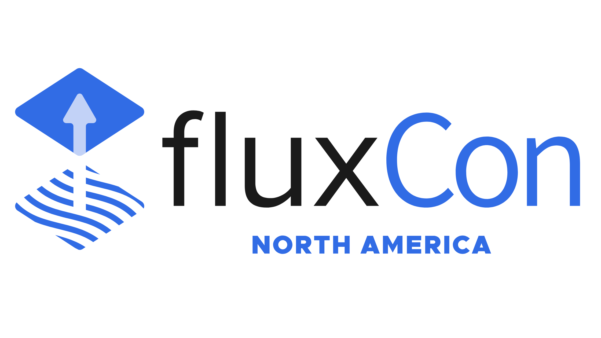

This year at KubeCon NA in Atlanta, we'll be hosting the first-ever [FluxCon](https://events.linuxfoundation.org/kubecon-cloudnativecon-north-america/co-located-events/fluxcon/)!
We're so excited to have a space specifically for Flux end-users to share their stories.
FluxCon will be taking place on **November 10th**, 2025.

We've added a number of new features to Flux and continue to stabilize API's
for a stable, scalable lifetime.
FluxCon is a great way to learn about new use-cases, hear about Flux at scale, and connect with other
Flux practitioners.

## Call for Papers
Are you using Flux in your org? We'd love to hear your story.
You can [submit your talk proposal](https://events.linuxfoundation.org/kubecon-cloudnativecon-north-america/co-located-events/fluxcon/#call-for-proposals) before **June 30th**, 2025.

## New Use-Cases
Flux is used in retail stores, massive datacenters, trains, cell-towers, satellites, tractors, and so many more places. Practitioners choose Flux because it's performant, flexible, and secure. Over the years, we've heard so many use-cases for Flux's uniquely extensible continuous delivery API's.

This year we're advocating for Gitless GitOps, experimenting with AI-assisted GitOps, and showing object-level identity for external API's. The ecosystem of projects innovating around Flux is also healthy. The Headlamp project builds UI tools for Flux users, and there are a number of vendors offering SaaS and support for Flux in their products. We can't wait to hear what people are doing next at FluxCon.

## Connect with the Community
The most important part of the Flux project is our community. Yes, our software is beautiful, and simple, and incredibly principled, but we build Flux purely for the love of our community of practitioners. We created GitOps to change the way we work, and meeting each other and sharing our stories is the only way to do so.

You can expect to meet other users, talk directly with Flux maintainers (represented by multiple companies), and hear more about how we're moving GitOps forward.

Please consider this a warm invitation to come join us at FluxCon this November. [We'll see you there!](https://events.linuxfoundation.org/kubecon-cloudnativecon-north-america/co-located-events/fluxcon/)
