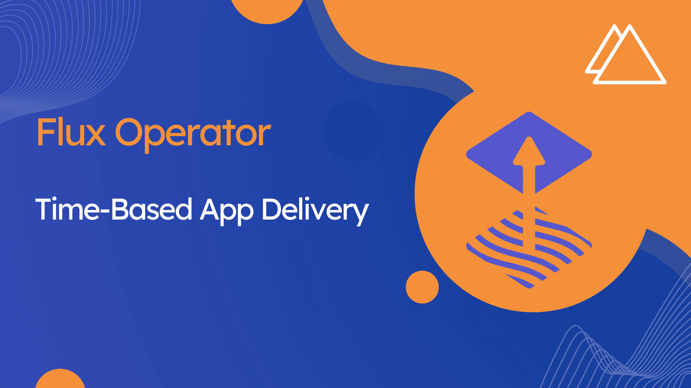

A common need of Flux users is copying Secrets between namespaces to work
with the Flux resources. This comes from the strong security stance Flux
has of not allowing cross-namespace references for Secrets and ConfigMaps
in the Flux APIs.

Another common need is to reflect changes in Flux resources referencing
Secrets and ConfigMaps as soon as the referenced resources change.

We are happy to announce a combo solution for both these problems in
[Flux Operator v0.26.0](https://github.com/controlplaneio-fluxcd/flux-operator/releases/tag/v0.26.0)!

## How it works

The Flux Operator `ResourceSet` API allows defining bundles of Flux objects by
templating a set of resources. When defining a `ResourceSet`, you can define
any Kubernetes resource, including `ConfigMaps` and `Secrets`.

When defining `ConfigMaps` and `Secrets` in a `ResourceSet`, you can use the
`fluxcd.controlplane.io/copyFrom: <namespace>/<name>` annotation to copy
the data from the referenced resource into the resource that will be
applied by the `ResourceSet`. For example:

```yaml
apiVersion: fluxcd.controlplane.io/v1
kind: ResourceSet
metadata:
  name: my-app-config
  namespace: apps
spec:
  resources:
    - apiVersion: v1
      kind: ConfigMap
      metadata:
        name: my-app-config
        namespace: apps
      annotations:
        fluxcd.controlplane.io/copyFrom: "shared-configs/my-app-config"
```

Starting with Flux Operator v0.26.0, the `ResourceSet` API has been enhanced to
allow a label selector to be used for watching changes in ConfigMaps and Secrets
referenced by the `fluxcd.controlplane.io/copyFrom` annotation. The default
label selector is `reconcile.fluxcd.io/watch: Enabled`. So, in the example
above:

```yaml
apiVersion: v1
kind: ConfigMap
metadata:
  name: my-app-config
  namespace: shared-configs
  labels:
    # This label will cause Flux Operator to reconcile the ResourceSet
    # when this ConfigMap changes.
    reconcile.fluxcd.io/watch: Enabled
data:
  # These fields will be copied to the ConfigMap applied by the ResourceSet
  # when the ResourceSet is reconciled. The label above will not be copied!
  key1: value1
  key2: value2
```

The result of the configuration above is that the `my-app-config` ConfigMap
in the `apps` namespace will be instantly updated with the data from the
`my-app-config` ConfigMap in the `shared-configs` namespace whenever the
latter changes. The watch label itself is not copied!

To define a custom label selector for watching changes in the referenced
ConfigMaps and Secrets, you can use the `--watch-configs-label-selector`
flag in Flux Operator.

An alternative to adding the label to all the ConfigMaps and Secrets
is to set the flag to `--watch-configs-label-selector=owner!=helm`,
which allows watching all ConfigMaps and Secrets that are not Helm
storage Secrets, i.e. those Secrets created by a Helm release to store
its state.

The complete docs for this feature are available
[here](https://fluxcd.control-plane.io/operator/resourceset/#copying-data-from-existing-configmaps-and-secrets).

## Reconciling CNCF Flux resources upon changes on referenced ConfigMaps and Secrets

The watch feature will also land in CNCF Flux in the next minor release, v2.7!
This release is planned for September 2025.

Starting with Flux v2.7, `ConfigMaps` and `Secrets` referenced by the following
APIs can benefit from the same label selector-based watch feature described above:

- `Kustomization` (implemented [here](https://github.com/fluxcd/kustomize-controller/pull/1486))
- `HelmRelease` (implemented [here](https://github.com/fluxcd/helm-controller/pull/1258))
- `Receiver` (implemented [here](https://github.com/fluxcd/notification-controller/pull/1151))

The respective controllers will implement the flag `--watch-configs-label-selector`
for defining custom label selectors for watching `ConfigMaps` and `Secrets`:

- `kustomize-controller`
- `helm-controller`
- `notification-controller`

The default label selector will be the same across all controllers and Flux Operator:

```yaml
reconcile.fluxcd.io/watch: Enabled
```

The fields supported for each Flux API will be the following:

- `Kustomization.spec.postBuild.substituteFrom`
- `Kustomization.spec.decryption.secretRef`
- `Kustomization.spec.kubeConfig.secretRef`
- `Kustomization.spec.kubeConfig.configMapRef` (new field introduced in Flux v2.7)
- `HelmRelease.spec.valuesFrom`
- `HelmRelease.spec.kubeConfig.secretRef`
- `HelmRelease.spec.kubeConfig.configMapRef` (new field introduced in Flux v2.7)
- `Receiver.spec.secretRef`

## A complex use case: Combining the Flux Operator and CNCF Flux features

In the Flux Operator website we published
[ControlPlane's D2 Reference Architecture](https://fluxcd.control-plane.io/guides/d2-architecture-reference/),
a complete example of how to run Flux Operator and Flux in a multi-cluster,
multi-tenant production environment.

The D2 Reference Architecture defines a core `ConfigMap` in the `flux-system`
namespace called `flux-runtime-info` that contains cluster-level configuration:

```yaml
apiVersion: v1
kind: ConfigMap
metadata:
  name: flux-runtime-info
  namespace: flux-system
  labels:
    toolkit.fluxcd.io/runtime: "true"
    # This ConfigMap is watched by Flux Operator's ResourceSets, works since Flux Operator v0.26.0.
    reconcile.fluxcd.io/watch: Enabled
  annotations:
    kustomize.toolkit.fluxcd.io/ssa: "Merge"
data:
  ARTIFACT_TAG: latest-stable
  ENVIRONMENT: production
  CLUSTER_NAME: prod-eu-1
  CLUSTER_DOMAIN: prodeu1.example.com
  ARTIFACT_SUBJECT_WORKFLOW: release-artifact
  ARTIFACT_SUBJECT_GIT_REF: refs/tags/.*
```

This `ConfigMap` is copied to each tenant namespace in the cluster by the tenant
`ResourceSets`, and referenced by the Flux `Kustomizations` defined in the same
`ResourceSet`. There are two main tenant `ResourceSets` in the architecture.

This is the `infra` `ResourceSet`, which defines the infrastructure tenants
of the cluster, composed of the cluster addons and monitoring stack:

```yaml
apiVersion: fluxcd.controlplane.io/v1
kind: ResourceSet
metadata:
  name: infra
  namespace: flux-system
  annotations:
    fluxcd.controlplane.io/reconcileEvery: "5m"
spec:
  dependsOn:
    - apiVersion: fluxcd.controlplane.io/v1
      kind: ResourceSet
      name: policies
      namespace: flux-system
      ready: true
      readyExpr: status.conditions.filter(e, e.type == 'Ready').all(e, e.status == 'True')
  inputs:
    - tenant: "cert-manager"
      tag: "${ARTIFACT_TAG}"
      environment: "${ENVIRONMENT}"
      artifactSubjectWorkflow: "${ARTIFACT_SUBJECT_WORKFLOW}"
      artifactSubjectGitRef: "${ARTIFACT_SUBJECT_GIT_REF}"
    - tenant: "monitoring"
      tag: "${ARTIFACT_TAG}"
      environment: "${ENVIRONMENT}"
      artifactSubjectWorkflow: "${ARTIFACT_SUBJECT_WORKFLOW}"
      artifactSubjectGitRef: "${ARTIFACT_SUBJECT_GIT_REF}"
  resources:
    - apiVersion: v1
      kind: Namespace
      metadata:
        name: << inputs.tenant >>
    - apiVersion: v1
      kind: ConfigMap
      metadata:
        name: flux-runtime-info
        namespace: << inputs.tenant >>
        annotations:
          fluxcd.controlplane.io/copyFrom: "flux-system/flux-runtime-info"
        labels:
          # This copied ConfigMap will be watched by kustomize-controller starting with Flux v2.7.
          reconcile.fluxcd.io/watch: Enabled
    - apiVersion: v1
      kind: Secret
      metadata:
        name: ghcr-auth
        namespace: << inputs.tenant >>
        annotations:
          fluxcd.controlplane.io/copyFrom: "flux-system/ghcr-auth"
      type: kubernetes.io/dockerconfigjson
    - apiVersion: v1
      kind: ServiceAccount
      metadata:
        name: flux
        namespace: << inputs.tenant >>
      imagePullSecrets:
        - name: ghcr-auth
    - apiVersion: rbac.authorization.k8s.io/v1
      kind: ClusterRoleBinding
      metadata:
        name: flux-infra-<< inputs.tenant >>
      roleRef:
        apiGroup: rbac.authorization.k8s.io
        kind: ClusterRole
        name: cluster-admin
      subjects:
        - kind: ServiceAccount
          name: flux
          namespace: << inputs.tenant >>
    - apiVersion: source.toolkit.fluxcd.io/v1
      kind: OCIRepository
      metadata:
        name: infra
        namespace: << inputs.tenant >>
      spec:
        interval: 5m
        serviceAccountName: flux
        url: "oci://ghcr.io/controlplaneio-fluxcd/d2-infra/<< inputs.tenant >>"
        ref:
          tag: << inputs.tag >>
        verify:
          provider: cosign
          matchOIDCIdentity:
          - issuer: ^https://token\.actions\.githubusercontent\.com$
            subject: ^https://github\.com/controlplaneio-fluxcd/d2-infra/\.github/workflows/<< inputs.artifactSubjectWorkflow >>\.yaml@<< inputs.artifactSubjectGitRef >>$
    - apiVersion: kustomize.toolkit.fluxcd.io/v1
      kind: Kustomization
      metadata:
        name: infra-controllers
        namespace: << inputs.tenant >>
      spec:
        targetNamespace: << inputs.tenant >>
        serviceAccountName: flux
        interval: 30m
        retryInterval: 5m
        wait: true
        timeout: 5m
        sourceRef:
          kind: OCIRepository
          name: infra
        path: "./controllers/<< inputs.environment >>"
        prune: true
        postBuild:
          substituteFrom:
            - kind: ConfigMap
              name: flux-runtime-info # This is the copied ConfigMap defined above.
    - apiVersion: kustomize.toolkit.fluxcd.io/v1
      kind: Kustomization
      metadata:
        name: infra-configs
        namespace: << inputs.tenant >>
      spec:
        dependsOn:
          - name: infra-controllers
        targetNamespace: << inputs.tenant >>
        serviceAccountName: flux
        interval: 30m
        retryInterval: 5m
        wait: true
        timeout: 5m
        sourceRef:
          kind: OCIRepository
          name: infra
        path: "./configs/<< inputs.environment >>"
        prune: true
        postBuild:
          substituteFrom:
            - kind: ConfigMap
              name: flux-runtime-info # This is the copied ConfigMap defined above.
```

And this is the `apps` `ResourceSet`, which defines the application
tenants of the cluster, composed of the application workloads:

```yaml
apiVersion: fluxcd.controlplane.io/v1
kind: ResourceSet
metadata:
  name: apps
  namespace: flux-system
  annotations:
    fluxcd.controlplane.io/reconcileEvery: "5m"
spec:
  dependsOn:
    - apiVersion: kustomize.toolkit.fluxcd.io/v1
      kind: Kustomization
      name: infra-configs
      namespace: monitoring
      ready: true
      readyExpr: status.observedGeneration >= 0
  inputs:
    - tenant: "frontend"
      tag: "${ARTIFACT_TAG}"
      environment: "${ENVIRONMENT}"
      artifactSubjectWorkflow: "${ARTIFACT_SUBJECT_WORKFLOW}"
      artifactSubjectGitRef: "${ARTIFACT_SUBJECT_GIT_REF}"
    - tenant: "backend"
      tag: "${ARTIFACT_TAG}"
      environment: "${ENVIRONMENT}"
      artifactSubjectWorkflow: "${ARTIFACT_SUBJECT_WORKFLOW}"
      artifactSubjectGitRef: "${ARTIFACT_SUBJECT_GIT_REF}"
  resources:
    - apiVersion: v1
      kind: Namespace
      metadata:
        name: << inputs.tenant >>
        labels:
          toolkit.fluxcd.io/role: "tenant"
    - apiVersion: v1
      kind: ConfigMap
      metadata:
        name: flux-runtime-info
        namespace: << inputs.tenant >>
        annotations:
          fluxcd.controlplane.io/copyFrom: "flux-system/flux-runtime-info"
        labels:
          # This copied ConfigMap will be watched by kustomize-controller starting with Flux v2.7.
          reconcile.fluxcd.io/watch: Enabled
    - apiVersion: v1
      kind: Secret
      metadata:
        name: ghcr-auth
        namespace: << inputs.tenant >>
        annotations:
          fluxcd.controlplane.io/copyFrom: "flux-system/ghcr-auth"
      type: kubernetes.io/dockerconfigjson
    - apiVersion: v1
      kind: ServiceAccount
      metadata:
        name: flux
        namespace: << inputs.tenant >>
      imagePullSecrets:
        - name: ghcr-auth
    - apiVersion: rbac.authorization.k8s.io/v1
      kind: RoleBinding
      metadata:
        name: flux
        namespace: << inputs.tenant >>
      roleRef:
        apiGroup: rbac.authorization.k8s.io
        kind: ClusterRole
        name: admin
      subjects:
        - kind: ServiceAccount
          name: flux
          namespace: << inputs.tenant >>
    - apiVersion: source.toolkit.fluxcd.io/v1
      kind: OCIRepository
      metadata:
        name: apps
        namespace: << inputs.tenant >>
      spec:
        interval: 5m
        serviceAccountName: flux
        url: "oci://ghcr.io/controlplaneio-fluxcd/d2-apps/<< inputs.tenant >>"
        ref:
          tag: << inputs.tag >>
        verify:
          provider: cosign
          matchOIDCIdentity:
          - issuer: ^https://token\.actions\.githubusercontent\.com$
            subject: ^https://github\.com/controlplaneio-fluxcd/d2-apps/\.github/workflows/<< inputs.artifactSubjectWorkflow >>\.yaml@<< inputs.artifactSubjectGitRef >>$
    - apiVersion: kustomize.toolkit.fluxcd.io/v1
      kind: Kustomization
      metadata:
        name: apps
        namespace: << inputs.tenant >>
      spec:
        targetNamespace: << inputs.tenant >>
        serviceAccountName: flux
        interval: 30m
        retryInterval: 5m
        wait: true
        timeout: 5m
        sourceRef:
          kind: OCIRepository
          name: apps
        path: "./<< inputs.environment >>"
        prune: true
        postBuild:
          substituteFrom:
            - kind: ConfigMap
              name: flux-runtime-info # This is the copied ConfigMap defined above.
```

In this combined scenario, Flux Operator will copy the `flux-runtime-info`
`ConfigMap` from the `flux-system` namespace to each tenant namespace, and
will watch for changes in this `ConfigMap` to trigger reconciliations of
the `ResourceSets` defined in the `flux-system` namespace to update the
copies in the tenant namespaces accordingly. This already works in Flux
Operator since v0.26.0.

Starting with Flux v2.7, kustomize-controller will also watch for changes
in the copied `ConfigMap` in each tenant namespace, and will reconcile
the `Kustomizations` defined in the tenant namespaces whenever the copy
changes. The copies are consumed by the `Kustomizations` via the
`.spec.postBuild.substituteFrom` field, which allows substituting values
from `ConfigMaps` and `Secrets` in the resources applied by the
`Kustomization`.

Note that the `reconcile.fluxcd.io/watch: Enabled` label is not copied
by the `ResourceSet`, and must be defined explicitly in the copies.
This is intentional, so users can have more control over which
`ConfigMaps` and `Secrets` are watched.
