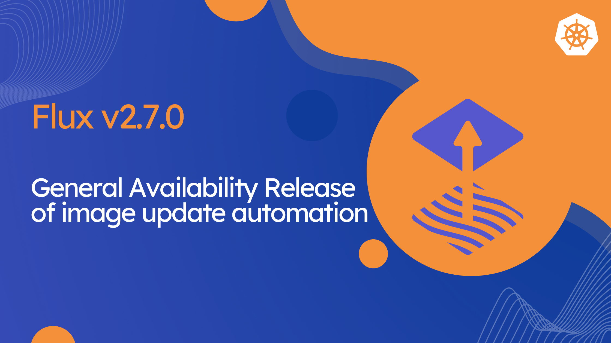

We are thrilled to announce the release of [Flux v2.7.0](https://github.com/fluxcd/flux2/releases/tag/v2.7.0)!
In this post, we highlight some of the new features and improvements included in this release.



## Highlights

Flux v2.7 marks the General Availability (GA) of the image update automation features
and comes with new APIs `ExternalArtifact` and `ArtifactGenerator`
for advanced source [composition and decomposition](#artifact-generators) patterns.

In this release, we have also introduced several new features to the Flux controllers,
including watching for changes in ConfigMaps and Secrets references,
extended readiness evaluation of dependencies with CEL expressions,
and support for OpenTelemetry tracing for Flux `Kustomization` and `HelmRelease` reconciliation.

In ecosystem news, there is a new release of [Flux Operator](https://github.com/controlplaneio-fluxcd/flux-operator)
that comes with [in-cluster image update automation](https://fluxcd.control-plane.io/operator/resourcesets/image-automation/)
features, that can be used for GitLess GitOps workflows.

## General availability of Image Update Automation

This release marks the General Availability (GA) of Flux [Image Automation](/flux/components/image/)
APIs and controllers. The image-reflector-controller and image-automation-controller work together to
update Kubernetes manifests in Git repositories when new container images are available in
container registries.

The following APIs have been promoted to stable v1:

- [ImageRepository](/flux/components/image/imagerepositories/)
- [ImagePolicy](/flux/components/image/imagepolicies/)
- [ImageUpdateAutomation](/flux/components/image/imageupdateautomations/)

The `ImagePolicy` API now supports the `.spec.suspend` field to pause and resume the policy evaluation.

The `ImageUpdateAutomation` API gains support for Git sparse checkout. To enable this optimization,
the image-automation-controller can be configured with the `--feature-gates=GitSparseCheckout=true` flag.

In addition, the image-automation-controller can now be configured to use Kubernetes Workload Identity
for authenticating with AzureDevOps repositories.

**Breaking changes**:

- The image-reflector-controller `autologin` flags which were deprecated since 2023 are now removed. 
  Users should set `ImageRepository.spec.provider` to the appropriate cloud provider for their container registry.
- The `ImageUpdateAutomation` commit template fields `.Updated` and `.Changed.ImageResult` which were deprecated since 2024 are now removed.
  Users should migrate to:
    - `.Changed.FileChanges` for detailed change tracking
    - `.Changed.Objects` for object-level changes
    - `.Changed.Changes` for a flat list of changes

## Watching for changes in ConfigMaps and Secrets

Starting with Flux v2.7, the `kustomize-controller`, `helm-controller` and `notification-controller`
gain support for reacting to changes in ConfigMaps and Secrets references.

The following references are now watched for changes:

- `Kustomization.spec.postBuild.substituteFrom`
- `Kustomization.spec.decryption.secretRef`
- `Kustomization.spec.kubeConfig.secretRef`
- `Kustomization.spec.kubeConfig.configMapRef`
- `HelmRelease.spec.valuesFrom`
- `HelmRelease.spec.kubeConfig.secretRef`
- `HelmRelease.spec.kubeConfig.configMapRef`
- `Receiver.spec.secretRef`

When a referenced ConfigMap or Secret changes, the controller will immediately trigger a reconciliation
if the referenced object is labelled with `reconcile.fluxcd.io/watch: Enabled`.

To enable the watching of all referenced objects without the need to label them,
the controllers can be configured with the `--watch-configs-label-selector=owner!=helm` flag.

## Workload Identity Authentication for Remote Clusters

Starting with Flux v2.7, you can configure workload identity at the object level
in the `Kustomization` and `HelmRelease` resources to authenticate with cloud providers
when running Flux in the hub-and-spoke model.

This feature allows cluster admins to use cloud identities on the hub cluster to 
configure Flux authentication to spoke clusters, without the need to create and manage
static `kubeconfig` Secrets.

For more details on how to configure secret-less authentication to remote clusters,
please refer to the following guides:

- [Kustomization - remote cluster apply](/flux/components/kustomize/kustomizations/#secret-less-authentication)
- [HelmRelease - remote cluster apply](/flux/components/helm/helmreleases/#secret-less-authentication)

## Object-level Workload Identity

In Flux v2.7, we have completed the integration of Kubernetes Workload Identity
at the object level for all Flux APIs that support authentication with cloud providers.

This includes the following resources:

- `Bucket.spec.serviceAccountName` for authenticating with AWS S3, Azure Blob Storage and Google Cloud Storage.
- `GitRepository.spec.serviceAccountName` for authenticating with Azure DevOps.
- `OCIRepository.spec.serviceAccountName` for authenticating with AWS ECR, Azure Container Registry and Google Artifact Registry.
- `ImageRepository.spec.serviceAccountName` for authenticating with AWS ECR, Azure Container Registry and Google Artifact Registry.
- `Kustomization.spec.decryption.serviceAccountName` for authenticating with AWS KMS, Azure Key Vault and Google KMS.
- `Kustomization.spec.kubeConfig.configMapRef.name` for authenticating with remote clusters on AWS EKS, Azure AKS and Google GKE.
- `HelmRelease.spec.kubeConfig.configMapRef.name` for authenticating with remote clusters on AWS EKS, Azure AKS and Google GKE.
- `Provider.spec.serviceAccountName` for authenticating with Azure DevOps, Azure Event Hub and Google Pub/Sub.

For more details on how to configure object-level workload identity for Flux, see the following docs:

- [AWS workload identity](/flux/integrations/aws/)
- [Azure workload identity](/flux/integrations/azure/)
- [GCP workload identity](/flux/integrations/gcp/)

## OpenTelemetry Tracing

Starting with Flux v2.7, users can enable OpenTelemetry tracing for Flux reconciliations
by configuring a Provider of type `otel`:

```yaml
apiVersion: notification.toolkit.fluxcd.io/v1beta3
kind: Provider
metadata:
  name: jaeger
  namespace: flux-system
spec:
  type: otel
  address: http://jaeger-collector.jaeger:4318/v1/traces
```

The notification-controller converts Flux events into OTEL spans with proper trace relationships
based on the Flux object hierarchy. Source objects (`GitRepository`, `HelmChart`, `OCIRepository`, `Bucket`)
create root spans, while `Kustomization` and `HelmRelease` objects create child spans within the same trace.
Each span includes event metadata as attributes and uses the alert name and namespace as the service identifier.



For more details on how to configure OpenTelemetry tracing for Flux, please refer to the
[notification-controller documentation](/flux/components/notification/providers.md#otel).

## Controller Improvements

- The `GitRepository` API gains support for mTLS in GitHub App authentication.
- The `Kustomization` API now supports [CEL expressions](/flux/components/kustomize/kustomizations.md#dependency-ready-expression) for extended readiness evaluation of dependencies.
- The `Kustomization` API gains a new field `.spec.ignoreMissingComponents` for ignoring missing Kustomize components in the source.
- The kustomize-controller now supports global SOPS decryption for Age keys, allowing centralized management of decryption keys.
- The kustomize-controller can be configured to cancel ongoing health checks when a new source revision is detected with the `--feature-gates=CancelHealthCheckOnNewRevision=true` flag.
- The `HelmRelease` API now supports [CEL expressions](/flux/components/helm/helmreleases.md#dependency-ready-expression) for extended readiness evaluation of dependencies.
- The `HelmRelease` API gains a new strategy called `RetryOnFailure` for better handling of release failures.
- The `Provider` API now supports setting proxy via `spec.proxySecretRef` and mTLS via `spec.certSecretRef`.
- The `Provider` API has been extended with support for Zulip and OpenTelemetry tracing.

## CLI Improvements

- The `flux bootstrap` and `flux install` commands now support the `--components-extra=source-watcher` flag to enable the new source-watcher component.
- A new `flux migrate` command has been added to migrate Flux resources stored in Kubernetes etcd to their latest API version.
- The `flux debug` command gains a new `--show-history` flag to display the reconciliation history of Flux objects.
- The `flux diff` command now handles the `kustomize.toolkit.fluxcd.io/force: Enabled` annotation.
- The `flux create hr` command gains a new `--storage-namespace` flag for changing the namespace of Helm storage objects.
- New commands were added for `ImagePolicy` resources:
  - `flux reconcile image policy`
  - `flux suspend image policy`
  - `flux resume image policy`
- New commands were added for `ArtifactGenerator` resources:
  - `flux get artifact generator`
  - `flux export artifact generator`
  - `flux tree artifact generator`
  - `flux events --for ArtifactGenerator/<name>`

## Artifact Generators

Flux v2.7 comes with a new component that can be enabled at bootstrap time
with the `--components-extra=source-watcher` flag.

The [source-watcher](https://github.com/fluxcd/source-watcher) controller
implements the [ArtifactGenerator](/flux/components/source/artifactgenerators/) API which allows Flux users to:

- **Compose** multiple Flux sources (GitRepository, OCIRepository, Bucket) into a single deployable artifact
- **Decompose** monorepos into multiple independent artifacts with separate deployment lifecycles
- **Optimize** reconciliation by only triggering updates when specific paths change
- **Structure** complex deployments from distributed sources maintained by different teams

### Multiple Source Composition

The `ArtifactGenerator` can be used to combine multiple sources into a single deployable artifact,
for example, you can combine upstream Helm charts from OCI registries
with your organization's custom values and configuration overrides stored in Git:

```yaml
apiVersion: source.extensions.fluxcd.io/v1beta1
kind: ArtifactGenerator
metadata:
  name: podinfo
  namespace: apps
spec:
  sources:
    - alias: chart
      kind: OCIRepository
      name: podinfo-chart
    - alias: repo
      kind: GitRepository
      name: podinfo-values
  artifacts:
    - name: podinfo-composite
      originRevision: "@chart"
      copy:
        - from: "@chart/"
          to: "@artifact/"
        - from: "@repo/charts/podinfo/values.yaml"
          to: "@artifact/podinfo/values.yaml"
          strategy: Overwrite
        - from: "@repo/charts/podinfo/values-prod.yaml"
          to: "@artifact/podinfo/values.yaml"
          strategy: Merge
---
apiVersion: helm.toolkit.fluxcd.io/v2
kind: HelmRelease
metadata:
  name: podinfo
  namespace: apps
spec:
  interval: 15m
  releaseName: podinfo
  chartRef:
    kind: ExternalArtifact
    name: podinfo-composite
```

### Monorepo Decomposition

The `ArtifactGenerator` can be used to decompose a monorepo into multiple independent artifacts
with separate deployment lifecycles. For example:

```yaml
apiVersion: source.extensions.fluxcd.io/v1beta1
kind: ArtifactGenerator
metadata:
  name: app-decomposer
  namespace: apps
spec:
  sources:
    - alias: git
      kind: GitRepository
      name: monorepo
  artifacts:
    - name: frontend
      originRevision: "@git"
      copy:
        - from: "@git/deploy/frontend/**"
          to: "@artifact/"
    - name: backend
      originRevision: "@git"
      copy:
        - from: "@git/deploy/backend/**"
          to: "@artifact/"
---
apiVersion: kustomize.toolkit.fluxcd.io/v1
kind: Kustomization
metadata:
  name: frontend-service
  namespace: apps
spec:
  interval: 15m
  prune: true
  sourceRef:
    kind: ExternalArtifact
    name: frontend
  path: ./
---
apiVersion: kustomize.toolkit.fluxcd.io/v1
kind: Kustomization
metadata:
  name: backend-service
  namespace: apps
spec:
  interval: 15m
  prune: true
  sourceRef:
    kind: ExternalArtifact
    name: backend
  path: ./
```

Each service gets its own `ExternalArtifact` with an independent revision.
Changes to `deploy/backend/` only trigger the reconciliation of the backend-service `Kustomization`,
leaving other services untouched.

For more details on how to use the `ArtifactGenerator` API, please refer to the
[source-watcher documentation](/flux/components/source/artifactgenerators/).

## Supported Versions

Flux v2.4 has reached end-of-life and is no longer supported.

Flux v2.7 supports the following Kubernetes versions:

| Distribution | Versions         |
|:-------------|:-----------------|
| Kubernetes   | 1.32, 1.33, 1.34 |
| OpenShift    | 4.19             |

> **Enterprise support** Note that the CNCF Flux project offers support only for the latest three minor versions of Kubernetes.
> Backwards compatibility with older versions of Kubernetes and OpenShift is offered by vendors such as [ControlPlane](https://control-plane.io/enterprise-for-flux-cd/) that provide enterprise support for Flux.

## Upgrade Procedure

Note that in Flux v2.7, the following APIs have reached end-of-life and have been removed from the CRDs:

- `source.toolkit.fluxcd.io/v1beta1`
- `kustomize.toolkit.fluxcd.io/v1beta1`
- `helm.toolkit.fluxcd.io/v2beta1`
- `image.toolkit.fluxcd.io/v1beta1`
- `notification.toolkit.fluxcd.io/v1beta1`

Before upgrading to Flux v2.7, make sure to migrate all your resources to the stable APIs
using the [flux migrate](/flux/cmd/flux_migrate/) command.

{}
We have published a dedicated step-by-step upgrade guide, please follow the instructions from [Upgrade Procedure for Flux v2.7+](https://github.com/fluxcd/flux2/discussions/5572).
{}

## Over and out

If you have any questions or simply just like what you read and want to get involved,
here are a few good ways to reach us:

- Join our [upcoming dev meetings](https://fluxcd.io/community/#meetings).
- Talk to us in the #flux channel on [CNCF Slack](https://slack.cncf.io/).
- Join the [planning discussions](https://github.com/fluxcd/flux2/discussions).
- Follow [Flux on Twitter](https://twitter.com/fluxcd), or join the
  [Flux LinkedIn group](https://www.linkedin.com/groups/8985374/).
