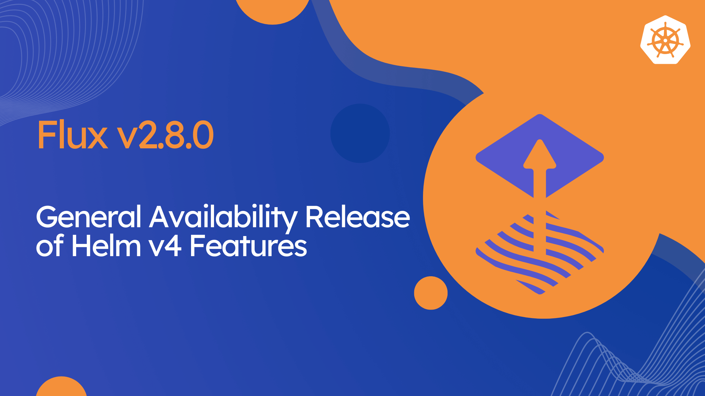

We are thrilled to announce the release of [Flux v2.8.0](https://github.com/fluxcd/flux2/releases/tag/v2.8.0)!
In this post, we highlight some of the new features and improvements included in this release.

## Highlights

Flux v2.8 comes with Helm v4 support, bringing server-side apply and enhanced health checking to Helm releases.
Big thanks to the Helm maintainers for their work on Helm v4 and for collaborating with us to ensure a smooth integration with Flux!

In this release, we have also introduced several new features to the Flux controllers:

- Reduced the mean time to recovery of Flux-managed applications
- Readiness evaluation of Helm-managed objects with CEL expressions
- ArtifactGenerator support for extracting and modifying Helm charts
- Support for commenting on Pull Requests directly from Flux notifications
- Custom SSA apply stages for ordering resource application in kustomize-controller
- Automatic GitHub App installation ID lookup from the repository owner
- Support for Cosign v3 for verifying OCI artifacts and container images

In ecosystem news, there is a new release of [Flux Operator](https://github.com/controlplaneio-fluxcd/flux-operator)
that comes with a dedicated [Flux Web UI](https://fluxoperator.dev/web-ui/) and new providers for preview environments.

## Helm v4 Support

Flux now ships with Helm v4. This brings two major improvements to how Flux manages Helm releases:
server-side apply and kstatus-based health checking.

With server-side apply, the API server takes ownership of merging fields, rather than the client.
This means fewer conflicts when multiple controllers or tools manage overlapping resources, and
more accurate drift detection out of the box.

Health checking now defaults to [kstatus](https://github.com/fluxcd/cli-utils/tree/master/pkg/kstatus),
the same library used by the kustomize-controller. Instead of relying on Helm's legacy readiness
logic, Flux can now understand the actual rollout status of Deployments, StatefulSets, Jobs, and
other resources — including custom resources that follow standard status conventions. For teams
that rely on custom readiness logic, Flux now supports [CEL-based health check expressions](https://fluxcd.io/flux/cheatsheets/cel-healthchecks/) on
HelmReleases, giving you the same flexibility already available in the Kustomization API.

Both server-side apply and kstatus health checking are the new defaults. Because Helm persists
the apply method in its release storage, existing HelmReleases will continue to use client-side
apply until explicitly opted in. Health checking, on the other hand, will switch to kstatus for
all HelmReleases. For teams that prefer Helm v3's behavior across the board, the `UseHelm3Defaults`
feature gate restores the previous defaults.

Finally, HelmReleases now track an inventory of managed resources in `.status.inventory`,
giving you full visibility into what Flux has deployed — useful for debugging, auditing, and
building tooling on top of Flux.

## Faster recovery from failed deployments

A common pain point with GitOps is the wait time after pushing a fix for a broken deployment. When a
release fails health checks, Flux would previously wait for the full timeout before acting — even if
a new revision was already available. This delay directly impacts the mean time to recovery (MTTR).

In Flux 2.7, the kustomize-controller introduced the `CancelHealthCheckOnNewRevision` feature gate,
allowing ongoing health checks to be canceled when a new source revision is detected. With Flux 2.8,
this capability has been extended to helm-controller and expanded to react to more kinds of changes:

- Changes in the resource spec (e.g. path, patches, images, values)
- Changes in referenced ConfigMaps and Secrets (var substitutions, SOPS decryption keys, Kubeconfig)
- Reconciliations triggered manually with `flux reconcile` or via notification-controller receivers

In all these cases, Flux cancels the ongoing health checks and immediately starts reconciling the
new state. Instead of waiting several minutes for a failing release to time out, the fix is picked
up as soon as it lands.

For observability, a new `HealthCheckCanceled` reason is added to the `Ready` condition when this
happens.

This feature gate is opt-in for now, and we plan to enable it by default once the implementation is
stable across both controllers.

## Ecosystem News

### Flux Operator Web UI

At KubeCon Atlanta 2025, the Flux maintainers from ControlPlane
gave a sneak peek of the new Flux Web UI, which is now available
in the latest release of Flux Operator.

The Flux Web UI provides a modern and user-friendly interface for managing and
monitoring your Flux-managed clusters. It offers a comprehensive view of your GitOps resources,
including:

- Cluster dashboard with sync statistics and overall system health
- Deep-dive views for ResourceSets, HelmReleases and Kustomizations
- Workload monitoring from deployment rollouts to pod statuses
- Powerful search and filtering
- Favorites for quick access to critical resources
- SSO support via OIDC & Kubernetes RBAC for multi-tenant clusters
- GitOps Graphs for visualizing the delivery pipeline
- GitOps Actions guarded by RBAC for manual interventions and incident response



Get started by installing the latest version of Flux Operator and following the [Flux Web UI documentation](https://fluxoperator.dev/web-ui/).

### Preview environments

Flux Operator's [ResourceSet API](https://fluxoperator.dev/docs/crd/resourceset/) makes it easy to
deploy ephemeral preview environments from GitHub Pull Requests and GitLab Merge Requests. With
Flux 2.8, closing the feedback loop on these environments is now much simpler thanks to new
notification-controller provider types: `githubpullrequestcomment`, `gitlabmergerequestcomment`
and `giteapullrequestcomment`.

Previously, posting deployment status on a Pull Request required setting up a `githubdispatch`
provider and a GitHub Actions workflow to parse the event payload and post a comment. With the new
providers, notification-controller posts and updates comments directly on the PR or MR page — no
CI workflow needed. Comments are automatically deduplicated, so the PR stays clean with a single
status comment that gets updated on each deployment.

In addition, commit status reporting now works with any Flux API — not just Kustomizations and
GitRepositories. This means HelmReleases deployed for preview environments can now report their
status as commit checks on the PR, giving developers immediate visibility into whether their
changes deployed successfully.

To annotate your Flux resources for these providers, use the standard event metadata keys:

- `event.toolkit.fluxcd.io/change_request` — identifies the PR/MR number for comment providers
- `event.toolkit.fluxcd.io/commit` — identifies the commit SHA for commit status providers

For complete setup guides, see the Flux Operator documentation:

- [Ephemeral Environments for GitHub Pull Requests](https://fluxoperator.dev/docs/resourcesets/github-pull-requests/)
- [Ephemeral Environments for GitLab Merge Requests](https://fluxoperator.dev/docs/resourcesets/gitlab-merge-requests/)

## Supported Versions

Flux v2.5 has reached end-of-life and is no longer supported.

Flux v2.8 supports the following Kubernetes versions:

| Distribution | Versions         |
|:-------------|:-----------------|
| Kubernetes   | 1.33, 1.34, 1.35 |
| OpenShift    | 4.20             |

> **Enterprise support** Note that the CNCF Flux project offers support only for the latest three minor versions of Kubernetes.
> Backwards compatibility with older versions of Kubernetes and OpenShift is offered by vendors such as [ControlPlane](https://control-plane.io/enterprise-for-flux-cd/) that provide enterprise support for Flux.

## Upgrade Procedure

Note that in Flux v2.8, the following APIs have reached end-of-life and have been removed from the CRDs:

- `source.toolkit.fluxcd.io/v1beta2`
- `kustomize.toolkit.fluxcd.io/v1beta2`
- `helm.toolkit.fluxcd.io/v2beta2`

Before upgrading to Flux v2.8, make sure to migrate all your resources to the stable APIs
using the [flux migrate](/flux/cmd/flux_migrate/) command.

{}
We have published a dedicated step-by-step upgrade guide, please follow the instructions from [Upgrade Procedure for Flux v2.7+](https://github.com/fluxcd/flux2/discussions/5572).
{}

## Over and out

If you have any questions or simply just like what you read and want to get involved,
here are a few good ways to reach us:

- Join our [upcoming dev meetings](https://fluxcd.io/community/#meetings).
- Talk to us in the #flux channel on [CNCF Slack](https://slack.cncf.io/).
- Join the [planning discussions](https://github.com/fluxcd/flux2/discussions).
- Follow [Flux on Twitter](https://twitter.com/fluxcd), or join the
  [Flux LinkedIn group](https://www.linkedin.com/groups/8985374/).
