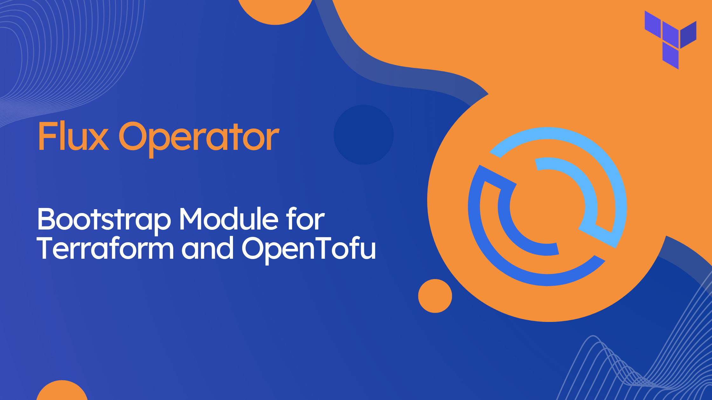

Today we are excited to introduce a new
[Terraform module](https://github.com/controlplaneio-fluxcd/terraform-kubernetes-flux-operator-bootstrap)
(fully compatible with OpenTofu) that bootstraps [Flux Operator](https://fluxoperator.dev)
into a Kubernetes cluster and then gracefully steps aside, letting Flux do what Flux does best.

Here are some of the problems it sets out to fix.

## Ownership handoff

Terraform is the natural place to install Flux right after a cluster comes up — credentials
are in scope, providers are wired. The trouble starts the moment Flux is online: every
object Terraform applied is now also an object Flux wants to reconcile. The traditional
workaround — the [`fluxcd/flux`](https://registry.terraform.io/providers/fluxcd/flux/latest)
provider, or chained `helm_release` resources — keeps Terraform on the hook for
steady-state reconciliation forever.

This module flips that. Terraform owns only the bootstrap mechanism: a
namespace, temporary RBAC, and a Kubernetes Job that applies Flux Operator
and the [FluxInstance](https://fluxoperator.dev/docs/crd/fluxinstance/)
with **create-if-missing** semantics. Once Flux adopts an object,
Terraform stops touching it. When inputs are unchanged, `terraform plan`
shows zero diff.

## Same GitOps repository

The Terraform root module and the Flux manifests live side-by-side in the same repository,
so the bootstrap inputs and the steady-state desired state are versioned together:

```text
repo/
├── terraform/                             # Terraform root module
│   ├── main.tf
│   ├── providers.tf
│   └── variables.tf
└── clusters/
    └── staging/                           # reconciled by Flux via FluxInstance.spec.sync.path
        └── flux-system/
            ├── flux-instance.yaml         # applied by the bootstrap Job
            ├── flux-operator-values.yaml  # shared between Terraform and the Flux-managed HelmRelease
            ├── flux-operator.yaml         # ResourceSet wrapping the Flux Operator HelmRelease
            ├── runtime-info.yaml          # Git-managed fields of flux-runtime-info (optional)
            └── kustomization.yaml         # configMapGenerator for flux-operator-values
```

The Terraform module loads the same `flux-instance.yaml` that Flux will reconcile after
bootstrap, and provisions the Git pull secret it needs to keep syncing the repository:

```hcl
module "flux_operator_bootstrap" {
  source   = "controlplaneio-fluxcd/flux-operator-bootstrap/kubernetes"
  revision = 1

  gitops_resources = {
    instance_yaml = file("${path.root}/../clusters/${var.cluster_name}/flux-system/flux-instance.yaml")
  }

  managed_resources = {
    secrets_yaml = <<-YAML
      apiVersion: v1
      kind: Secret
      metadata:
        name: flux-system
      type: Opaque
      stringData:
        username: git
        password: '${var.git_token}'
    YAML
  }
}
```

**And — importantly — no secret material ever lands in the Terraform state file.** The
module marks `managed_resources` as `sensitive` and only persists a SHA-256 hash to
detect changes, while still reconciling drift on every run with server-side apply — the
same model as kustomize-controller. Pull values from Vault, AWS Secrets Manager, or any
other store via `data` sources and compose them into `secrets_yaml`; the rendered YAML
never appears in state.

## Same root module as the cluster

The module does not require cluster connectivity at plan time, so it lives in the same
Terraform root module that creates the cluster — no two-phase apply, no provider
chicken-and-egg:

```hcl
module "cluster" { source = "..." }

provider "helm" {
  kubernetes = {
    host                   = module.cluster.endpoint
    cluster_ca_certificate = base64decode(module.cluster.ca_certificate)
    token                  = module.cluster.token
  }
}

module "flux_operator_bootstrap" {
  depends_on = [module.cluster]
  source     = "controlplaneio-fluxcd/flux-operator-bootstrap/kubernetes"
  revision   = 1
  # ...
}
```

## Platform prerequisites Flux depends on

Some components have to exist before Flux can run — a self-managed CNI like Cilium being
the canonical example, since without it no pod gets networking, including the Flux
controllers themselves. The module accepts an ordered list of prerequisite Helm charts
and manifests, which are applied by the bootstrap Job before Flux Operator. For the CNI
case the Job can run with `host_network: true`, since pod networking is unavailable until
the CNI is up:

```hcl
job = {
  host_network = true
}

gitops_resources = {
  instance_yaml = file("${path.root}/../clusters/${var.cluster_name}/flux-system/flux-instance.yaml")
  prerequisites = {
    charts = [
      { name = "cilium", repository = "quay.io/cilium/charts/cilium", namespace = "kube-system" },
    ]
  }
}
```

The same mechanism handles CSI drivers that the Flux controllers may need to mount before
they can start — and lays the groundwork for an upcoming SPIFFE/SPIRE integration that
we'll have more to share about in the next releases. Prerequisites are also adopted by
Flux for steady-state reconciliation — same handoff as above.

## Migrating

- From the [`fluxcd/flux`](https://registry.terraform.io/providers/fluxcd/flux/latest) provider — [migration guide](https://github.com/controlplaneio-fluxcd/terraform-kubernetes-flux-operator-bootstrap/blob/main/docs/migration-from-flux-provider.md)
- From the previous flux-operator Terraform example — [migration guide](https://github.com/controlplaneio-fluxcd/terraform-kubernetes-flux-operator-bootstrap/blob/main/docs/migration-from-previous-approach.md)
- Minimal example — [flux-operator/config/terraform](https://github.com/controlplaneio-fluxcd/flux-operator/tree/main/config/terraform)
- Full reference setup — [d2-fleet](https://github.com/controlplaneio-fluxcd/d2-fleet/tree/main/terraform)
