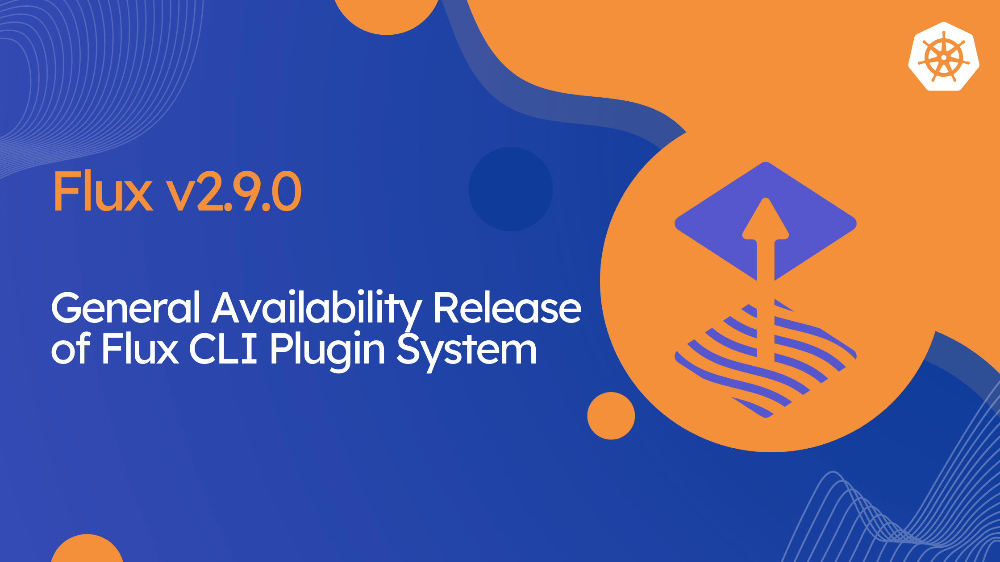

We are thrilled to announce the release of [Flux v2.9.0](https://github.com/fluxcd/flux2/releases/tag/v2.9.0)!
In this post, we highlight some of the new features and improvements included in this release.



## Highlights

Flux v2.9 introduces the **Flux CLI Plugin System**, a new way to extend the Flux command-line
interface with first-class plugins. Alongside the plugin system, this release brings powerful
additions to server-side apply, secrets decryption, and Git integrations.

In this release, we have introduced several new features to the Flux CLI and controllers:

- Flux CLI Plugin System with the Mirror and Schema plugins
- Server-Side Apply field ignore rules for fine-grained drift control
- SOPS decryption with the Age post-quantum cipher
- Kubernetes Workload Identity authentication for OpenBao and Vault
- Helm post-render strategies, including chart hooks support
- Git commit signing and verification with SSH keys
- Secret-less, OIDC-secured webhook Receivers
- AWS CodeCommit authentication using Workload Identity

In ecosystem news, there is a new release of [Flux Operator](https://github.com/controlplaneio-fluxcd/flux-operator)
that extends the [Flux Web UI](https://fluxoperator.dev/web-ui/) with a workload dashboard and a
powerful pod log viewer.

## Flux CLI Plugin System

The headline feature of Flux v2.9 is the new
[Flux CLI Plugin System](https://github.com/fluxcd/flux2/blob/main/rfcs/0013-cli-plugin-system/README.md),
specified in RFC-0013. Plugins let you extend the `flux` command with additional capabilities that
ship and version independently of the Flux CLI itself, while still feeling like a native part of the
tool.

The [Flux plugins catalog](https://github.com/fluxcd/plugins) ships with two plugins maintained by
the Flux project:

- **[Mirror](https://github.com/fluxcd/flux-mirror)** — mirrors Helm charts, OCI artifacts, and
  container images between registries using a declarative configuration. It supports
  multi-architecture images, HTTP/S to OCI Helm chart conversion, signature verification, regex and
  semver filtering, and multiple authentication methods including cloud Workload Identity.
- **[Schema](https://github.com/fluxcd/flux-schema)** — validates Kubernetes manifests against JSON
  schemas and CEL rules. It comes with built-in schemas for Kubernetes, OpenShift, Gateway API, and
  the Flux CRDs, supports custom schema catalogs, and integrates with CI/CD via GitHub Actions or
  Docker.

In addition, ControlPlane maintains the **[Operator](https://github.com/controlplaneio-fluxcd/flux-operator)**
plugin for managing Flux Operator resources, tracing objects through the GitOps pipeline,
debugging ResourceSets, and installing AI agent skills.

### Installing plugins

Plugins are managed through the new `flux plugin` subcommands. Binaries are downloaded
to `~/fluxcd/plugins` and registered as Flux sub-commands, so once installed they are
invoked as `flux <plugin>`:

```shell
# Search the catalog of available plugins
flux plugin search

# Install a plugin
flux plugin install schema

# List installed plugins
flux plugin list

# Update and remove plugins
flux plugin update schema
flux plugin uninstall schema
```

By default, `flux plugin install` pulls the latest version of a plugin. For reproducible setups,
you can pin a plugin to a specific version with `flux plugin install schema@0.5.0`, or to an
immutable digest with `flux plugin install schema@sha256:<digest>`, which is recommended for CI
pipelines and production environments.

## Server-Side Apply field ignore rules

Flux applies your resources with server-side apply, becoming the field manager for everything it
reconciles. However, certain fields are meant to be owned by other controllers, like
the `replicas` field managed by a Horizontal Pod Autoscaler, or certificates injected by an admission
webhook. Until now, Flux would continuously try to revert those fields to the desired state declared
in Git.

Flux v2.9 extends server-side apply with **field ignore rules**. Using the new
`Kustomization.spec.ignore` field, you can tell kustomize-controller to ignore specific managed
fields during drift detection and apply, leaving them under the ownership of other controllers:

```yaml
apiVersion: kustomize.toolkit.fluxcd.io/v1
kind: Kustomization
metadata:
  name: podinfo
  namespace: flux-system
spec:
  # ...
  ignore:
    - target:
        kind: Deployment
      paths:
        - "/spec/replicas"
```

This gives you fine-grained control over which parts of a resource Flux owns, making it much easier
to combine GitOps with autoscalers, service meshes, and other controllers that mutate live objects.

## Enhanced secrets decryption

### Age post-quantum cipher

Flux v2.9 adds support for decrypting SOPS-encrypted secrets sealed with the
[Age post-quantum cipher](/flux/components/kustomize/kustomizations/#decryption). As the industry
prepares for post-quantum cryptography, this allows teams to protect their secrets at rest with
quantum-resistant encryption while keeping the same SOPS-based GitOps workflow.

### Workload Identity for OpenBao and Vault

Starting with this release, kustomize-controller can now authenticate to
[OpenBao and HashiCorp Vault using Kubernetes Workload Identity](/flux/components/kustomize/kustomizations/#controller-global-decryption).
This removes the need to store long-lived Vault tokens in the cluster. Flux exchanges the
controller's ServiceAccount token for Vault credentials, following the same keyless authentication
model already used for cloud providers.

## Helm improvements

### Post-render strategies

Flux v2.9 adds support for [Helm post-render strategies](/flux/components/helm/helmreleases/#post-render-strategy)
in the HelmRelease API, giving you control over how post-rendering interacts with chart hooks.

{}
The default post-render strategy has changed from `nohooks` to `combined`. With the new default,
Helm hooks are included in the post-rendering process, which more closely matches Helm's native
behavior. If your charts rely on the previous behavior, set the strategy explicitly to `nohooks`
on your HelmReleases before upgrading.
{}

### Literal values

The HelmRelease `valuesFrom` field now supports a
[literal mode](/flux/components/helm/helmreleases/#values-references) that mirrors the semantics of
`helm install --set-literal`. This lets you inject the entire content of a ConfigMap or Secret key
as a single string value, without Helm attempting to parse it as a type; useful for values that
contain characters Helm would otherwise interpret. A common example is passing whole configuration
files, such as Java `application.properties` or `.yaml` config blobs, into a chart value as-is
without the dots in property keys being expanded into nested objects.

### CEL health checks

CEL-based health check expressions now [allow an empty kind](/flux/cheatsheets/cel-healthchecks/#applying-one-expression-to-every-kind-in-a-group),
making it possible to write health checks that apply across multiple resource kinds in both
HelmReleases and Kustomizations.

## Git integrations

Flux v2.9 brings SSH keys to Git commit signing and verification, complementing the existing GPG
support:

- **Verification** source-controller can now verify Git commit signatures made with SSH keys,
  in addition to GPG, configured via the
  [GitRepository `.spec.verify` API](/flux/components/source/gitrepositories/#verification).
- **Signing** image-automation-controller can sign the commits it pushes with SSH keys, configured
  via the [ImageUpdateAutomation `.spec.git.commit.signingKey` API](/flux/components/image/imageupdateautomations/#ssh),
  and `flux bootstrap` can sign the manifest commits it pushes with SSH keys.

This release also adds support for authenticating to
[AWS CodeCommit using Workload Identity](/flux/components/source/gitrepositories/#aws),
extending the keyless authentication model to AWS-hosted Git repositories. You can also bootstrap
Flux directly onto CodeCommit following the dedicated
[AWS CodeCommit bootstrap guide](/flux/installation/bootstrap/aws-codecommit/).

## Artifact improvements

### Private Sigstore

For air-gapped and self-hosted environments, source-controller now supports a
[custom Sigstore trusted root](/flux/components/source/ocirepositories/#custom-sigstore-infrastructure-self-hosted-rekor--fulcio) for keyless
verification of OCI artifacts and container images. This allows organizations running their own
Sigstore infrastructure to verify signatures without relying on the public Sigstore trust root.

### ArtifactGenerator directory discovery

The ArtifactGenerator API gains
[path pattern directory discovery](/flux/components/source/artifactgenerators/#path-pattern-directory-discovery),
making it much easier to manage artifacts across monorepos. Instead of declaring an artifact per
application by hand, you describe a directory layout with a pattern and let source-watcher discover
matching directories and generate one ExternalArtifact per match. Named captures like `{app}` and
`{env}` become template variables for artifact names and labels:

```yaml
apiVersion: source.toolkit.fluxcd.io/v1beta1
kind: ArtifactGenerator
metadata:
  name: monorepo-apps
  namespace: flux-system
spec:
  sources:
    - alias: monorepo
      kind: GitRepository
      name: my-monorepo
  pathPattern: "@monorepo/apps/{app}/envs/{env}"
  artifacts:
    - name: "{app}-{env}"
      copy:
        - from: "@monorepo/apps/{app}/envs/{env}/**"
          to: "@artifact/"
```

## Webhook improvements

Flux v2.9 introduces support for
[OIDC-secured generic Receivers](/flux/components/notification/receivers/#generic-oidc),
allowing webhook Receivers to be secured without a shared secret. Instead of validating an HMAC
signature, notification-controller can verify an OIDC ID token presented by the caller, enabling
secure, secret-less integrations with platforms that support OIDC.

Receivers can also now be configured with a
[resource-level filter](/flux/components/notification/receivers/#per-resource-filtering), giving you
more precise control over which resources a Receiver reconciles when triggered.

To make Receivers easier to work with from the command line and CI jobs, this release adds the new
[`flux trigger receiver`](https://fluxcd.io/flux/cmd/flux_trigger_receiver/) command, which lets you
trigger a webhook without having to craft and send the HTTP request yourself.

## Ecosystem News

### Flux Web UI: Workloads and Logs

The latest release of [Flux Operator](https://github.com/controlplaneio-fluxcd/flux-operator) extends
the [Flux Web UI](https://fluxoperator.dev/web-ui/) with a dedicated **workload dashboard** and a
full-featured **pod log viewer**.

The new workload dashboard provides a focused view for Deployments, StatefulSets, DaemonSets, and
CronJobs, including:

- A pipeline visualization showing the flow from source through reconciler to workload and pods
- Action controls for reconciliation, rollout operations and suspend/resume
- A multi-tab panel with Overview, Pods, Events, Specification, and Status sections
- Detailed pod listings with rollout status and per-container image information

The pod log viewer brings a modern logging experience directly into the UI:

- Real-time log streaming with follow and snapshot modes
- Multi-pod and multi-container aggregation with chronological ordering
- Log-level detection and color-coding across many logging frameworks
- Collapsible stack-trace grouping for Go, Python, Node, and Java exceptions
- Powerful filtering with negation support, JSON pretty-printing, and downloadable exports

All workload and log operations respect Kubernetes RBAC through user impersonation, so what each user
can see and do in the UI matches their cluster permissions.



Get started by installing the latest version of Flux Operator and following the
[Flux Web UI documentation](https://fluxoperator.dev/web-ui/).

## Supported Versions

Flux v2.6 has reached end-of-life and is no longer supported.

Flux v2.9 supports the following Kubernetes versions:

| Distribution | Versions         |
|:-------------|:-----------------|
| Kubernetes   | 1.34, 1.35, 1.36 |
| OpenShift    | 4.21             |

> **Enterprise support** Note that the CNCF Flux project offers support only for the latest three minor versions of Kubernetes.
> Backwards compatibility with older versions of Kubernetes and OpenShift is offered by vendors such as [ControlPlane](https://control-plane.io/enterprise-for-flux-cd/) that provide enterprise support for Flux.

## Upgrade Procedure

Note that in Flux v2.9, the following APIs have reached end-of-life and have been removed from the CRDs:

- `image.toolkit.fluxcd.io/v1beta2`
- `notification.toolkit.fluxcd.io/v1beta2`

Before upgrading to Flux v2.9, make sure to migrate all your resources to the stable APIs
using the [flux migrate](/flux/cmd/flux_migrate/) command.

This release also contains the following breaking changes, please review them before upgrading:

- The default Helm post-render strategy has changed from `nohooks` to `combined`.
- GCR `Receivers` now require the `email` and `audience` fields in their referenced Secret
  ([CVE-2026-40109](https://github.com/fluxcd/notification-controller/security/advisories/GHSA-h9cx-xjg6-5v2w)).

{}
We have published a dedicated step-by-step upgrade guide, please follow the instructions from [Upgrade Procedure for Flux v2.7+](https://github.com/fluxcd/flux2/discussions/5572).
{}

## Over and out

If you have any questions or simply just like what you read and want to get involved,
here are a few good ways to reach us:

- Join our [upcoming dev meetings](https://fluxcd.io/community/#meetings).
- Talk to us in the #flux channel on [CNCF Slack](https://slack.cncf.io/).
- Join the [planning discussions](https://github.com/fluxcd/flux2/discussions).
- Follow [Flux on Twitter](https://twitter.com/fluxcd), or join the
  [Flux LinkedIn group](https://www.linkedin.com/groups/8985374/).
