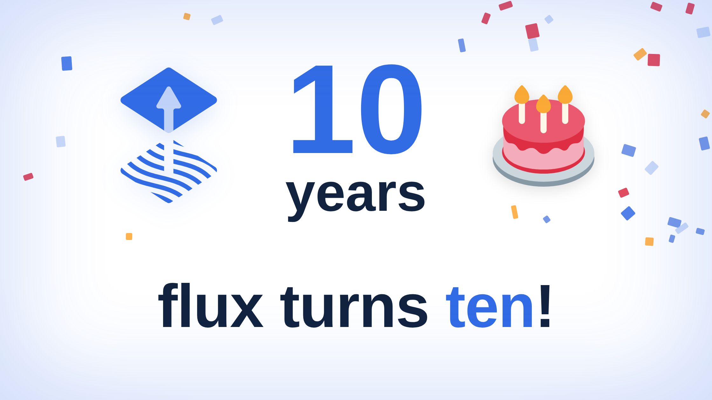
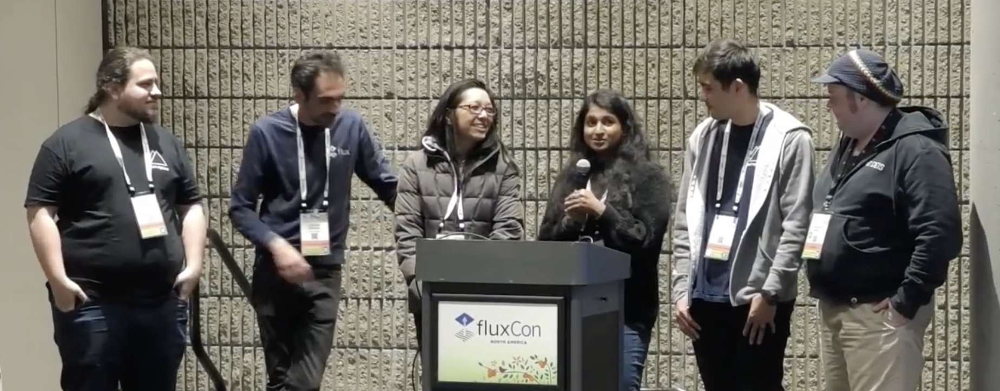

On Jul 7, 2016, Peter Bourgon made the initial commit [a6fbd68a](https://github.com/fluxcd/flux/commit/a6fbd68a967846f8c8b62ed0ae3482af1120b58c) to iterate on a fresh way to do continuous delivery.

Today, that commit is one decade old, and we celebrate 10 years of Flux.

> "Happy Birthday to Flux, the project that anticipated all of my needs and solves all my problems on a daily basis!"  
> 
> — Kingdon Barrett, Flux Maintainer, DevOps Engineer @ Navteca

The early repo shows Peter and Michael Bridgen implementing the `fluxd` daemon and `fluxctl` CLI; the repo also contains user stories on why people might want to use flux.
An [accompanying blogpost](https://web.archive.org/web/20180107011605/https://www.weave.works/blog/gitops-operations-by-pull-request) from Weaveworks invents the term **GitOps** with a relatable anecdote about production outages, disaster recovery, and "Operations by Pull Request."

By [August 2018](https://github.com/fluxcd/flux/graphs/contributors?from=5%2F23%2F2018&to=8%2F19%2F2018), Stefan Prodan has joined Michael in contributing to the project.

At this stage, Flux is gaining adoption amongst edgy teams of practitioners deploying Kubernetes v1.11.
Flux runs inside your namespace, and dev teams can install it fully self-service.
It clones your repo, runs scripts, checks container registries for image tags, and applies your changes with kubectl.

GitOps is taking off, and Kubernetes is becoming people's day jobs.

### Extending Kubernetes
2016 also brings us a blog post from a company called CoreOS: 
[Introducing Operators: Putting Operational Knowledge into Software [archive]](https://web.archive.org/web/20170129131616/https://coreos.com/blog/introducing-operators.html)

It introduces "The Operator Pattern", which pairs Kubernetes' Third Party Resources with a controller implementing some domain knowledge around software to assist SREs.
The diagrams are lovely.
CoreOS works with others upstream and in the following year Custom Resource Definitions (CRDs) replace TPRs in Kubernetes 1.7.

We start thinking about this in the Flux project, and in 2018 Tamara Kaufler writes the first iteration of Helm Operator:
[flux#947](https://github.com/fluxcd/flux/pull/947).
We all get our first real taste of GitOps for Helm.
Helm is still v2, so it still uses the Tiller in-cluster daemon. Remember that?

In [May of 2019](https://github.com/fluxcd/helm-operator/graphs/contributors?from=11%2F20%2F2018&to=5%2F4%2F2019) Hidde Beydals joins Stefan in contributing to Helm Operator, and we're learning how to evolve APIs and support a growing adopter list:
[[archive link]](https://web.archive.org/web/20200514142120/https://github.com/fluxcd/flux#who-is-using-flux-in-production)

### Rebuilding Flux
Four years of the early Kubernetes/Go/Helm ecosystem flies by in a blur.  

Some of the early decisions in Flux start causing pain. Flux is a single binary monolith that is also disjoint from Helm Operator.
Users grow Flux well beyond the initial scope and are leaning into multi-tenant clusters and global, cross-organization deployments.

The team starts an experiment to break apart the GitOps problem into separate pieces, all implemented with CRDs and kubernetes/controller-runtime.
This lets us decouple the source fetching logic into its own domain that can de-duplicate sources and share them for both kustomize and helm.
The end result is the GitOps Toolkit: a secure, open, and performant base for solving your continuous delivery problems.

This experiment becomes Flux 2 :)

> "Flux's longevity shows the value of building for real use cases and for evolving the technology in open source communities. We built Flux for our own fledgling use of Kubernetes, and we redesigned and continue to innovate for the needs of Flux users in industries that are the most demanding in terms of security, reliability, and performance. Most importantly, it is a community in which so many individuals and companies contribute with code and their passion for Flux."  
> 
> — Tamao Nakahara, Flux Community Maintainer, Director @ Guild.ai

Over the next 6 years, Flux evolves to meet the demands of the most interesting Kubernetes use-cases.
A mix of engineering excellence and impeccable DevRel strategy led by Tamao invites cross-company collaboration & maintenance and connects the Flux team directly with end-users and their companies' customers.

After ten years, we've totalled:
- 1,076 contributors
- 44 repos
- 17,946 pull requests
- 7,474 issues

On just Flux 2 alone:
- 210 flux2 releases
- 30.2 billion container image downloads

Today, Flux is everywhere you look. Flux runs in 5G towers, retail stores, cloud control-planes, open science clusters, airplanes, tractors, satellites, and in many air-gapped networks, running the software and services that make all of our modern conveniences possible.

Flux is unique in its correct, robust, reliable, and secure machinery for delivering workloads to Kubernetes, which is why teams trust Flux to run where no other software can meet the same operational requirements.
We do our best to keep our APIs clean and composable. Signs of our APIs evolving are the adoption of Gitless GitOps and extension of secure mechanisms for authentication such as Workload Identity.

We are very proud of our software, and we are very humbled to be a part of serving the internet.

### Flux isn't software
GitOps cannot fully be embodied by our tools, but rather, GitOps is how we work with each other.
Flux is the same. It is not purely software.

> "As Flux turns 10 and I reflect on my experience as a contributor and maintainer, one thing that stands out to me is its people. Behind every release are countless reviews, discussions, bug reports, feature proposals, documentation updates, and debugging sessions. Flux is more than a GitOps project; it's a community built on technical excellence, collaboration, and a shared commitment to making the project better for everyone.
> 
> I'm grateful to be a small part of this journey and excited to keep building alongside this incredible community for the next decade."  
> 
> — Dipti Pai, Flux Maintainer, Software Engineer @ Microsoft

> "My first commit in CNCF was to Flux, back in 2018. Eight years later I'm still here because of the people. Every contributor who showed up with a fix, every user who filed a detailed bug report, every maintainer who reviewed PRs at midnight before a release. Flux at ten is proof that a project's real infrastructure is its community."  
> 
> — Stefan Prodan, Flux Core Maintainer, Head of Development @ ControlPlane

Our decade journey has been filled with so many moments of connection, frustration, inspiration, grit, kindness, and love.
We can't capture all of the names and stories, battles and victories in this measly editorial. Our friends have repeatedly chosen Flux beyond personal gain. Our active and archived repos are monuments to the personal and monetary sacrifice that has made Flux possible.

Here is a short list of some folks who've made over 20 commits to Flux:
- @stefanprodan, Stefan Prodan
- @hiddeco, Hidde Beydals
- @squaremo, Michael Bridgen
- @matheuscscp, Matheus Pimenta
- @darkowlzz, Sunny
- @aryan9600, Sanskar Jaiswal
- @makkes, Max Jonas Werner
- @paulbellamy, Paul Bellamy
- @2opremio, Alfonso Acosta
- @peterbourgon, Peter Bourgon
- @somtochiama, Somtochi Onyekwere
- @kingdonb / @yebyen, Kingdon Barrett
- @souleb, Soule Ba
- @awh, Adam Harrison
- @philwinder, Phil Winder
- @phillebaba, Philip Laine
- @relu, Aurel Canciu
- @jpellizzari, Jordan Pellizzari
- @luxas, Lucas Käldström
- @cappyzawa, Shu Kutsuzawa
- @rndstr, Roland "roli" Schilter
- @stealthybox, Leigh Capili
- @dholbach, Daniel Holbach
- @dimitropoulos, Dimitri Mitropoulos
- @swade1987, Steve Wade
- @Arhell, Ihor Sychevskyi
- @mathetake, Takeshi Yoneda
- @scottrigby, Scott Rigby
- @juozasg, Juozas Gaigalas
- @staceypotter, Stacey Potter
- @dipti-pai, Dipti Pai
- @alisondy, Alison Dowdney
- @pa250194, Joe Alagoa
- @samb1729, Sam Broughton
- @aaron7, Aaron Kirkbride
- @mewzherder, Tamao Nakahara
- @yiannistri, Yiannis Triantafyllopoulos
- @seaneagan, Sean Eagan
- @lelenanam, Elena Morozova
- @yuval-k, Yuval Kohavi
- @rytswd, Ryota
- @pjbgf, Paulo Gomes
- @bb-Ricardo, Ricardo
- @stefansedich, Stefan Sedich
- @rade, Matthias Radestock
- @ncabatoff, Nick Cabatoff
- @tamarakaufler, Tamara Kaufler
- @chanwit, Chanwit Kaewkasi
- @kdorosh, Kevin Dorosh

Flux is also nothing without its users. We take this responsibility very seriously. Flux is an embedding of our aggregate concerns and desires in operations software and we see ourselves in it. When you choose to trust Flux with your own infrastructure, we hope you see yourself in it too.

We really mean it when we say, "thank you for using Flux."

### The next decade
This past decade has culminated in a very strong foundation.  
Secure, Open, and Fast. We focus on making sure Flux melds to webscale use-cases and within your homelab.

Our recent releases show that we prioritise these values:
- Solid Helm 4 support with per-resource backwards compatibility
- Resource lifecycle improvements in Kustomize and Helm controller
- Reactive applies from ConfigMap/Secret watches
- Cross-cluster and multi-service workload identity support
- GitOps Toolkit support for extending Flux with custom source Artifacts
- A new CLI plugin system

On the topic of security, we have very few CVEs to mitigate within the Flux source code, especially considering how many cross-ecosystem dependencies we have. Avoiding binary execs, using pure go SDKs, segmenting concerns to independent controllers/APIs, dropping privileges with impersonation, and relying on core Kubernetes API machinery has led to software that is difficult to misuse or abuse.

It is because of this foundation that so many users and vendors have incorporated Flux into their infra and products. These are deployments that need to work in perpetuity.

We intend to keep our sterling reputation, even as the way we work with each other changes with AI and the environment for contribution and software exploits also changes.

We now have [fluxcd/agent-skills](https://github.com/fluxcd/agent-skills) to help your coding agents use modern GitOps practices. In the ecosystem, Flux Operator MCP can bridge the chaos of your runtime to your editor and agentic workflows.

We're also paranoid about the state of software vulnerabilities. We've done extensive build engineering to ensure we can attest to the inputs of Flux's release artifacts.

We know that the accelerating pace of software vulns affects end-users too.  
We've built 2 official plugins: [flux-schema](https://github.com/fluxcd/flux-schema) and [flux-mirror](https://github.com/fluxcd/flux-mirror), so that you can implement correct configurations and a secure supply-chain diode for all of the things your team or business depends on in your clusters at runtime. Dealing with config validation and artifact relocation also just happen to be some of the most common usability issues for Kubernetes practitioners.

Software and infrastructure is changing fast, and we are adapting with it while maintaining what we know best.

> "The first decade of Flux was about machines applying what humans decide. The next is about AI agents joining that loop, diagnosing and proposing fixes with Flux users always in control. Our focus now is building the APIs and tools that make Flux the natural home for AI-driven GitOps."  
> 
> — Stefan Prodan, Flux Core Maintainer, Head of Development @ ControlPlane

We're excited to meet those of you who will join us for the next 10 years of Flux.

<3  
the Flux team
