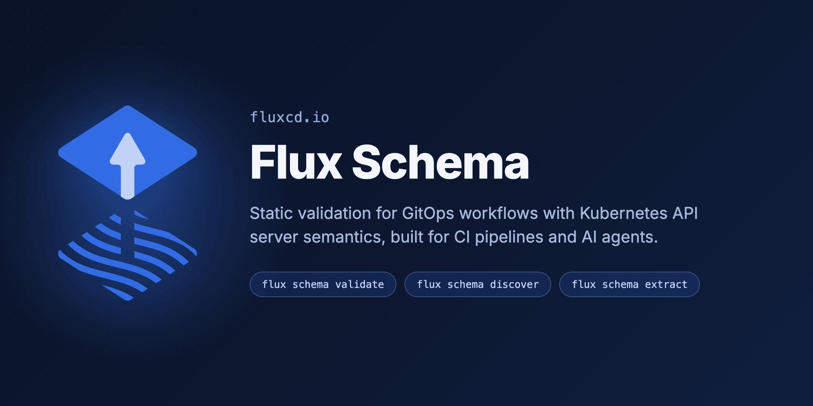
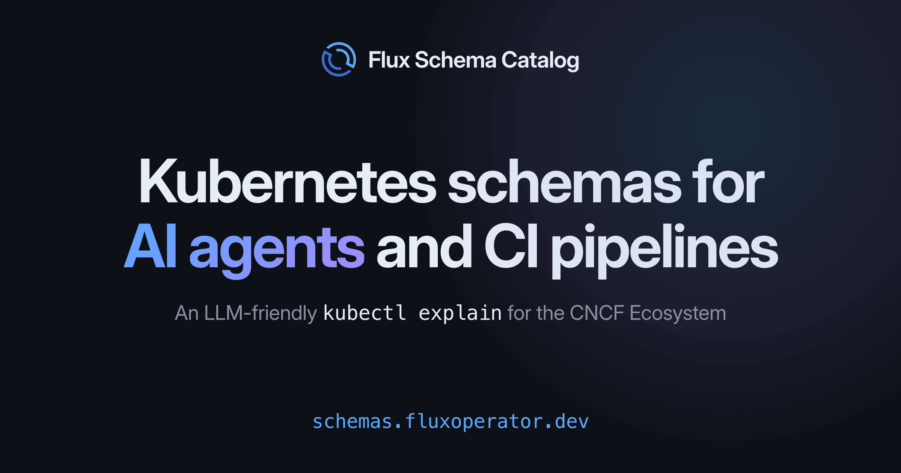

In this blog post, we introduce [Flux Schema](https://github.com/fluxcd/flux-schema),
a new Flux CLI plugin for validating Kubernetes manifests against JSON Schema
and CEL rules using the same evaluation semantics as the Kubernetes API server.

Alongside the plugin, we're announcing the
[Ecosystem Schema Catalog](https://schemas.fluxoperator.dev),
a hosted catalog of JSON Schemas and LLM-optimized indexes covering the
Kuberentes ecosystem of controllers, served to CI pipelines over CDN and to AI agents over MCP.



## Why Another Validation Tool

The GitOps workflow has a well-known blind spot: a manifest with a typo, a wrong
type, or a violated CEL rule sails through `git push` and only fails when
Flux applies it on the cluster. By then the error lives in your main
branch and shows up as a failed reconciliation instead of a failed pull request.

Tools like `kubeconform` (which inspired this project) solved part of the problem
by validating manifests against JSON Schemas offline. Flux Schema builds on that
idea and extends it with the API server's own evaluation semantics:

- **Strict schema validation**: every field of every Kubernetes built-in kind
  and custom resource is checked. Unknown fields, wrong types, and missing
  required properties are reported as schema violations.
- **CEL evaluation**: the `x-kubernetes-validations` rules embedded in CRDs are
  evaluated with the same engine as the Kubernetes API server. A HelmRelease
  missing both `chart` and `chartRef` is caught locally, not on the cluster.
- **Strict YAML decoding**: duplicate keys are rejected, matching Flux behavior,
  and metadata names, namespaces, labels, and annotations are checked against
  API server rules (DNS-1123, qualified names).
- **Ecosystem catalog**: the `ecosystem` schema location resolves to
  [schemas.fluxoperator.dev](https://schemas.fluxoperator.dev), a CDN-hosted
  catalog for over a hundred Cloud Native projects, extracted from upstream releases and rebuilt daily.
- **SOPS-aware**: the SOPS metadata fields can be stripped before validation,
  so encrypted Secrets are checked without decryption.

## Getting Started

Install the plugin with the Flux CLI:

```shell
flux plugin install schema
```

Validate a directory tree against the built-in catalog:

```shell
flux schema validate ./manifests
```

You can also validate rendered kustomize overlays and Helm charts, the same
manifests Flux sees at reconciliation time:

```shell
kustomize build ./clusters/production | flux schema validate --verbose

helm template ./charts/app | flux schema validate -v --skip-missing-schemas
```

The output pinpoints each violation with its JSON path, ready to act on:

```console
$ flux schema validate ./manifests

manifests/releases.yaml - HelmRelease/apps/frontend is invalid: cel violation
  - /spec: Invalid value: either 'chart' or 'chartRef' must be set
manifests/sources.yaml - Bucket/apps/frontend-config is invalid: schema violation
  - /spec: missing property 'bucketName'
  - /spec/interval: got number, want string
  - /spec: additional properties 'force' not allowed
Summary: 5 resources found in 2 files - Valid: 3, Invalid: 2, Skipped: 0
```

By default, only the invalid documents are printed; pass `--verbose` to also
list the valid and skipped ones.

For your own in-house CRDs, you can extract JSON Schemas straight from your
cluster and layer them on top of the built-in catalog:

```shell
kubectl get crds -o yaml | flux schema extract crd -d ./my-catalog

flux schema validate ./manifests \
  --schema-location ./my-catalog \
  --schema-location default
```

## The Ecosystem Schema Catalog



The [Ecosystem Schema Catalog](https://schemas.fluxoperator.dev)
is a hosted catalog of JSON Schemas and refreshed daily from upstream stable releases.
It currently covers 100 projects and close to 9000 schemas: Kubernetes and OpenShift built-ins,
all CNCF projects, and the cloud provider operators for AWS, Azure, and GCP.

The catalog is served from Cloudflare's global network, where you can also
search and browse every project and schema. The CLI reaches it through the
`ecosystem` schema location:

```shell
flux schema validate ./manifests -s ecosystem
```

The catalog also keeps versioned snapshots for the six most recent minor
releases of Kubernetes, OpenShift, and Flux, so validation can be pinned to
the minors your clusters run. Schema locations resolve in order, so put the
pinned minors first and the ecosystem catalog last as the fallback:

```shell
flux schema validate ./manifests \
  -s https://schemas.fluxoperator.dev/catalog/versions/kubernetes/v1.35 \
  -s https://schemas.fluxoperator.dev/catalog/versions/flux/v2.8 \
  -s ecosystem
```

## Explaining Fields Without a Cluster

Backed by the ecosystem catalog, the `explain` command is like `kubectl explain`
without a cluster at hand.

```console
$ flux schema explain -s ecosystem hr.spec.dependsOn

GROUP:      helm.toolkit.fluxcd.io
KIND:       HelmRelease
VERSION:    v2

FIELD: dependsOn <[]Object>

DESCRIPTION:
    DependsOn may contain a DependencyReference slice with references to
    HelmRelease resources that must be ready before this HelmRelease can be
    reconciled.
...
```

Add `--recursive` to print nested fields, and `--api-version` to pick a
specific group/version when a kind is served by more than one.

## Shifting Validation Left in CI

Running Flux Schema in CI catches violations in pull requests before they
reach the cluster. For GitHub repositories, two composite actions cover the
whole pipeline: one installs the CLI, the other detects kustomize overlays
and Helm charts, renders them, and validates every document against the
catalog.

```yaml
name: flux-schema

on:
  pull_request:
    branches: [main]

jobs:
  validate:
    runs-on: ubuntu-latest
    steps:
      - name: Checkout
        uses: actions/checkout@v7
      - name: Setup Flux with Schema plugin
        uses: fluxcd/flux2/action@main
        with:
          plugins: |
            schema
      - name: Validate manifests
        uses: fluxcd/flux-schema/actions/validate@main
        with:
          helm-charts: "true"
```

A `.fluxschema.yml` file at the repository root makes the validation config
reproducible across local machines and CI:

```yaml
apiVersion: schema.plugin.fluxcd.io/v1beta1
kind: Config
validate:
  schemaLocation:
    - ecosystem
```

## A Feedback Loop for AI Agents

The second audience for Flux Schema is AI agents. Anyone who has asked an AI
assistant to generate Flux manifests knows the failure mode: the YAML looks
plausible, the field names are almost right, and the error only surfaces when
the manifest hits the cluster.

Agents thrive when they can verify their own work. For code, that feedback
loop is the compiler and the test suite. For Kubernetes manifests, the only
authoritative validator is the API server, so agents either dry-run apply
manifests to a live cluster (risky, requires credentials) or skip verification
entirely.

Flux Schema gives agents the API server's judgment as a local, read-only,
instant operation. The agent generates a manifest, runs `flux schema validate`,
reads the violations with their JSON paths, fixes them, and repeats until the
output is clean. Structured reports in JSON or YAML make the results
machine-parseable:

```shell
flux schema validate ./manifests -s ecosystem -o json
```

Because the catalog is refreshed daily from upstream releases, agents validate
against the current APIs rather than the versions frozen into their training
data.

## An MCP Server as a Public Good

Validation tells an agent that a manifest is wrong; to write it correctly in
the first place, the agent needs to look up the real schema instead of
reconstructing it from training data. For that, the ecosystem catalog is
exposed as a remote MCP server. The MCP is a free public service operated
by the Flux Operator team, with no authentication or API key required:

```text
https://schemas.fluxoperator.dev/mcp
```

Think of it as an LLM-friendly `kubectl explain` for the whole Kubernetes
ecosystem with no cluster required.

Connecting an agent takes one command. For Claude Code:

```shell
claude mcp add --transport http flux-schema-catalog https://schemas.fluxoperator.dev/mcp
```

For Codex:

```shell
codex mcp add flux-schema-catalog --url https://schemas.fluxoperator.dev/mcp
```

And for other MCP clients (Cursor, VS Code, Windsurf, …), add the server to
the project's `.mcp.json`:

```json
{
  "mcpServers": {
    "flux-schema-catalog": {
      "type": "http",
      "url": "https://schemas.fluxoperator.dev/mcp"
    }
  }
}
```

We measured the impact by giving the same agent four tasks against recently
shipped CRDs: two field lookups, one manifest to write, and one manifest
review with planted errors. From training data alone, the agent got one task
of four right; it invented enum values and flagged valid fields as errors.
With the MCP server it scored four of four, using **57%** fewer tokens and **80%**
fewer tool calls than achieving the same score with web search. Smaller
models depend on the catalog even more: Haiku scored zero of four from memory
and four of four with the MCP server, at a quarter of the web-search cost.

See the [AI agents guide](https://schemas.fluxoperator.dev/agents) for the
full benchmark details and per-client setup instructions.

## Repository Discovery for Agents

Validation and schema lookup are still only part of what an agent needs.
Before generating or auditing anything, an agent has to understand the
repository it landed in, and GitOps repos are hostile to `tree` and `grep`
exploration: file names like `sync.yaml` and `release.yaml` reveal nothing,
multi-document files hide resources, and grepping for `kind: HelmRelease`
matches kustomize patch files.

The `flux schema discover` command replaces that read-and-grep loop with one
deterministic pass:

```shell
flux schema discover ./my-gitops-repo -o json
```

The scan is purely static (no kustomize builds, no Helm rendering, no cluster
access) and emits a structured inventory designed for AI agents:

- **Directory classification**: every directory is typed as plain Kubernetes
  manifests, a kustomize overlay, a Helm chart, or a Terraform module, so the
  repository pattern reads at a glance.
- **Flux resources by file**: every Flux resource is listed with its defining
  file and `namespace/name` identity, so an agent opens exactly the files
  relevant to the task.
- **Resource census by API version**: everything is counted per
  `apiVersion/kind`, so deprecated API versions stand out without reading a
  single manifest.
- **Context-budgeted output**: plain Kubernetes resources appear as counts
  (2,000 Deployments cost a few lines, not thousands), and Helm chart and
  Terraform subtrees are pruned. A typical repository results in a few KBs.

Like the validation report, the inventory is a versioned JSON envelope with a
published schema, so agents parse it programmatically instead of interpreting
ad-hoc shell output.

## Powering the Flux AI Skills

Flux Schema is the engine behind the official
[GitOps Agent Skills](https://github.com/fluxcd/agent-skills).

The `gitops-repo-audit` skill turns an AI assistant into a GitOps repository
auditor. Its discovery phase runs `flux schema discover` to build the
inventory, and its validation phase runs `flux schema validate` on both raw
manifests and rendered kustomize output. The skill also ships the Flux OpenAPI
schemas, so the agent verifies exact field names before recommending any YAML
change instead of guessing from memory.

You can install the skills in your GitOps repository with the Flux Operator
CLI, which verifies the cosign signature of the OCI artifact:

```shell
flux plugin install operator

flux operator skills install ghcr.io/fluxcd/agent-skills
```

For Claude Code and Codex you can install from the marketplace:

```text
/plugin marketplace add fluxcd/agent-skills
/plugin install gitops-skills@fluxcd
```

Then ask your assistant to "audit this GitOps repo" and watch it work through
discovery, validation, API compliance, best practices, and security review,
with every claim grounded in the flux-schema output rather than hallucinated.

## Get Involved

The ecosystem catalog grows with the community: if a project you rely on is
missing from [schemas.fluxoperator.dev](https://schemas.fluxoperator.dev),
request it by opening an
[issue](https://github.com/controlplaneio-fluxcd/schema-catalog/issues/new?template=add-project.yaml),
and it will be picked up by the daily rebuilds once added.
