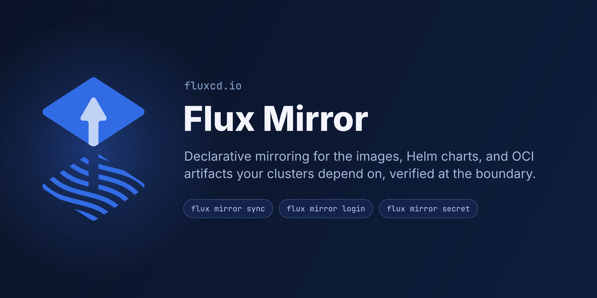

The great part about open source is we get to participate in ecosystems of shared components. However, our Kubernetes clusters end up depending
at runtime on many artifacts hosted all over the internet and in private registries.

In this blog post, we introduce [Flux Mirror](https://github.com/fluxcd/flux-mirror),
a new Flux CLI plugin that mirrors container images, Helm charts, and OCI
artifacts between registries from a declarative configuration.

Flux Mirror lets you take continuous, operational control of these dependencies using your own registries, with verification policies enforced at the time of syncing.



## Why We Built Flux Mirror

When we celebrated [ten years of Flux](/blog/2026/07/flux-turns-10/) earlier in July, we wrote that artifact relocation is one of the oldest and most common 
usability issues for Kubernetes practitioners.
When you put an image from a registry you don't operate into your `Deployment`, you make that
registry's uptime, rate limits, and retention policy part of your production
architecture. Docker Hub tweaking rate limits in 2020 and 2025 taught many of us to ingest images or set up pull-through caches. In August 2025, Broadcom
[froze the free Bitnami catalog](https://github.com/bitnami/charts/issues/35164)
and moved its images to a read-only legacy namespace.

This applies to more than images. Some of your Helm charts likely come from some HTTP
server or a hacky GitHub Pages static site. With Gitless GitOps, your desired-state itself
travels as OCI artifacts. Every
Kubernetes user should have a deliberate answer for where these artifacts live, who
can change them, and what happens when the upstream disappears. That's true even if you aren't doing GitOps or running Flux.

Some targeted tools exist for slices of this problem, but tools and their communities also change.
Bitnami's `charts-syncer`, a common choice for chart relocation,
[states that starting in 2026 it is licensed under a Broadcom license](https://github.com/bitnami/charts-syncer)
that permits use only in connection with Broadcom products. Flux Mirror is
[Apache 2.0 licensed](https://github.com/fluxcd/flux-mirror/blob/main/LICENSE)
under the CNCF, and every release ships with signed SLSA build provenance,
like the rest of Flux.

Flux Mirror covers the whole relocation problem in one declarative tool:

- **Container images**: manifests and blobs are copied byte-for-byte, and
  multi-arch manifest lists are mirrored as a whole.
- **Helm charts**: pulled from classic HTTP/S repositories and republished as
  deterministic Helm OCI artifacts, easing migration from `HelmRepository`
  sources to `OCIRepository` within Flux.
- **OCI artifacts**: the desired-state artifacts produced by
  `flux push artifact` relocate the same way as images.
- **Filtering**: a selector pipeline (`regex → semver → sort → top-N`)
  filters down to exactly the versions you depend on, instead of the whole upstream history.
- **Verification**: cosign keyless signature verification with OIDC identity
  matching and a minimum signature age can be enforced before anything is copied.
- **Attestations included**: SBOMs, signatures, and provenance travel with
  each artifact as OCI 1.1 referrers via `includeReferrers`.
- **Authentication**: cloud Workload Identity for ECR, ACR, and GAR, plus token auth, JWKs, and mTLS.

## Getting Started

Flux Mirror ships through the new
[Flux CLI Plugin System](https://github.com/fluxcd/flux2/blob/main/rfcs/0013-cli-plugin-system/README.md)
introduced in Flux v2.9. Go ahead and install it with the
Flux CLI:

```shell
flux plugin install mirror
```

For CI pipelines and prod environments, we can pin the plugin to an immutable
digest:

```shell
flux plugin install mirror@sha256:<digest>
```

To try it out, let's start a throwaway [zot](https://zotregistry.dev) registry to
mirror into. We're using zot because it supports the OCI 1.1 referrers API:

```shell
docker run -d --name zot -p 5000:5000 ghcr.io/project-zot/zot:latest
```

Next, let's create a declarative `flux-mirror.yaml` config file describing the desired state
of the registry. This one mirrors the
podinfo demo app image + Helm chart into zot:

```yaml
apiVersion: mirror.plugin.fluxcd.io/v1beta1
kind: Config
artifacts:
  - source: ghcr.io/stefanprodan/podinfo
    destination: localhost:5000/apps/podinfo
    selector:
      semver: "6.x"
      limit: 2
    includeReferrers: true
charts:
  - name: podinfo
    source: https://stefanprodan.github.io/podinfo
    destination: oci://localhost:5000/charts
    version: "6.x"
    limit: 2
```

We can preview the plan with `--dry-run`. Each tag will report as `would-copy`.
Running without the dry-run copies the artifacts over:

```console
$ flux mirror sync flux-mirror.yaml
✓ ghcr.io/stefanprodan/podinfo:6.14.0 (copied)
→ localhost:5000/apps/podinfo:6.14.0
✓ ghcr.io/stefanprodan/podinfo:6.14.1 (copied)
→ localhost:5000/apps/podinfo:6.14.1
✓ https://stefanprodan.github.io/podinfo/podinfo:6.14.0 (copied)
→ localhost:5000/charts/podinfo:6.14.0
✓ https://stefanprodan.github.io/podinfo/podinfo:6.14.1 (copied)
→ localhost:5000/charts/podinfo:6.14.1
Summary: 4 copied in 8.443s.
```

Running it again will be idempotent. The four tags would show `skipped` as
up-to-date. If a tag changes upstream, it will be reported as
`drifted`, so that it's not just silently overwritten, and we can parse the results as JSON:

```shell
flux mirror sync flux-mirror.yaml -o json | jq '.report.results[].tags'
```

The tool uses UNIX-y exit codes: `0` for a clean sync, `1` if any
tag failed, and `2` if a tag drifted and `overwrite` is disabled. Because of this, drift
detection is designed to fail your CI by default. You can override this with `--drift-exit-code`. 

Our local registry needs no credentials, but the config supports auth per registry.

We also have the `flux mirror login` command, which works on your Docker config, so that you no longer need to install the Docker client in CI or write weird jq base64 shell scripts just to work with container registries.

The config file format also supports env substitution since ambient credentials commonly come from ENV vars.

When you're done experimenting, remember to tear down your local registry:
```shell
docker rm -f zot
```

For more details on the config format and the `login`, `secret`, and `keygen`
commands, check out the
[Flux Mirror documentation](https://fluxcd.io/flux/cli-plugins/flux-mirror/).

## Moving Helm Charts from HTTP to OCI

Plenty of popular components still ship their Helm charts only through a
classic HTTP repository. These repos serve one big `index.yaml` that grows
with every release, and because of the way the Helm SDK works, every client
has to download and parse the whole index just to resolve a single chart version.
These indexes can vary in size from 50KB to a few megabytes.
The frozen bitnami-legacy index is actually 27MB! Internal HTTP repos within
your own company's Artifactory can have this exact same performance issue.

OCI Helm charts don't have an index. Each chart resolves by name and tag like any
other artifact, which is why `OCIRepository` sources perform significantly better
in source-controller than HTTP `HelmRepository` sources. Big community repos like
prometheus-community, grafana, and cert-manager have started publishing OCI
charts for exactly this reason, but plenty of upstreams haven't yet.

For example, OpenBao publishes OCI charts, but Vault still only shares an HTTP index
with all of the other HashiCorp helm charts.
We don't have to wait for them, though. Let's republish the HashiCorp Vault chart from
`helm.releases.hashicorp.com` into our own registry:

```yaml
apiVersion: mirror.plugin.fluxcd.io/v1beta1
kind: Config
charts:
  - name: vault
    source: https://helm.releases.hashicorp.com
    destination: oci://ghcr.io/my-org/charts
    version: "0.34.x"
    limit: 3
hosts:
  - host: ghcr.io
    username: my-org
    credential:
      value: ${GH_TOKEN} # substituted from ENV when syncing
```

Each version lands at `ghcr.io/my-org/charts/vault:<version>` as a
deterministic OCI Helm chart, and you can mirror from both HTTP and OCI
helm repos to create uniform storage for all of your dependencies.

From there, a `HelmRelease` consumes the mirrored chart with an OCI `chartRef`:

```yaml
apiVersion: source.toolkit.fluxcd.io/v1
kind: OCIRepository
metadata:
  name: vault
  namespace: vault
spec:
  interval: 10m
  url: oci://ghcr.io/my-org/charts/vault
  ref:
    semver: "0.34.x"
---
apiVersion: helm.toolkit.fluxcd.io/v2
kind: HelmRelease
metadata:
  name: vault
  namespace: vault
spec:
  interval: 1h
  chartRef:
    kind: OCIRepository # ref the previous resource
    name: vault
```

We can then retire our HTTP `HelmRepository` objects entirely, and our
clusters only watch the registry we own.

## Continuous, Correct Pipelines

Imperative scripts that change what software is running can cause very strange categories of bugs and misconfigurations. Building declarative, continuous pipelines, can help us build and operate more resilient systems. Our `flux-mirror.yaml` file is a statement of what your registry
should contain. This is using the same principle that makes GitOps work so well.
The config is reviewable in a pull request, and since the sync is idempotent, it's safe to run on a
schedule.
Any drift between your upstream dependencies and your mirror is detected and then either reported or remediated. Here's how you can run the sync on a schedule with the
[setup action](https://github.com/fluxcd/flux-mirror/tree/main/actions/setup)
from the flux-mirror repo:

```yaml
name: flux-mirror

on:
  schedule:
    - cron: "0 */6 * * *"
  workflow_dispatch:

jobs:
  sync:
    runs-on: ubuntu-latest
    permissions:
      contents: read
      packages: write
    steps:
      - name: Checkout
        uses: actions/checkout@v6
      - name: Setup Flux Mirror CLI
        uses: fluxcd/flux-mirror/actions/setup@main
      - name: Login to GHCR
        uses: docker/login-action@v4
        with:
          registry: ghcr.io
          username: ${{ github.actor }}
          password: ${{ secrets.GITHUB_TOKEN }}
      - name: Sync
        run: flux-mirror sync .flux-mirror.yaml --no-progress
```

CI doesn't need the Flux CLI at all here. The setup action installs the
standalone `flux-mirror` binary and verifies its release attestation with
`gh attestation verify` before first use.

You can also run it as a Kubernetes `CronJob`, colocated with the cluster and the registry itself. Check out our docs for examples with
[EKS+IRSA, AKS Workload Identity, and GKE Workload Identity](https://fluxcd.io/flux/cli-plugins/flux-mirror/sync/#mirror-into-ecr-acr-or-gar-from-a-cronjob-with-workload-identity),
and for
[mirroring into ECR, ACR, or GAR from GitHub Actions with cloud OIDC](https://fluxcd.io/flux/cli-plugins/flux-mirror/sync/#mirror-into-ecr-acr-or-gar-from-github-actions).
Implementing these pipelines without depending on long-lived registry credentials ensures that our clusters can keep reconciling from their own private registries even when the
upstream dependencies become rate-limited, re-licensed, or just gone forever.

Once you're mirroring into a private registry, there's a follow-up problem:
how do the workloads in each namespace get permission to pull?
The `flux mirror secret` command solves this UX problem.
It resolves the same `hosts` credentials that the sync config uses,
including the short-lived tokens minted through Workload Identity,
and then it upserts them into a `kubernetes.io/dockerconfigjson` Secret. You can
point a Pod's `imagePullSecrets` or an `OCIRepository` `secretRef` at it, and
schedule it next to the sync so your pull credentials stay rotated.

These dependencies need to keep working for as long as our systems do, and
owning their lifecycle shouldn't mean maintaining a bunch of scripts.

We aim for Flux Mirror to be a usable and clean solution for this whole problem.

## Gitless GitOps

Flux treats container registries as a first-class source of truth.
`OCIRepository` fetches desired-state artifacts, `HelmRelease` consumes OCI
charts through `chartRef`, and `flux push artifact` stamps every artifact
with its source URL and revision. This is how `flux trace` can walk any
object on the cluster back to the exact commit that produced it.

When our apps, charts, and configuration all flow as OCI artifacts, we get
a unified transport and signing model for cluster dependencies. Git
stays where humans collaborate, but the registry is our delivery
interface. This is what we call Gitless GitOps.

Flux Mirror can also handle relocation between networks or other availability
boundaries. First, CI might build, sign, and push to a central registry. The mirror
pipelines can then relocate artifacts along with their signatures and attestations into
each environment's registry when appropriate, and clusters only ever pull from a registry
inside their own trust boundary. This same topology works for a fleet of
edge clusters or when crossing an air gap.

## Verification Policies Beyond Signatures

The other half of mirroring is deciding what's allowed to cross into your
registry. What is your mirror's policy? Consider this declarative config:

```yaml
apiVersion: mirror.plugin.fluxcd.io/v1beta1
kind: Config
artifacts:
  - source: docker.io/stefanprodan/podinfo
    destination: quay.io/my-org/podinfo
    selector:
      semver: "6.x"
      limit: 2
    includeReferrers: true
    verify:
      provider: cosign
      minAge: 48h
      matchOIDCIdentity:
        - issuer: https://token.actions.githubusercontent.com
          subject: ^https://github\.com/stefanprodan/.*$
```

The `verify` block checks
[Cosign keyless bundles](https://docs.sigstore.dev) attached to the source
artifact and rejects anything that isn't signed by the OIDC identity we
expect. The signing certificate has to come from the configured issuer and
match the subject pattern, or the tag is never copied.

A signature tells you who signed an artifact. Provenance attestations tell
you which workflow built it, from which repository, at which commit. With
`includeReferrers: true`, these attestations and SBOMs are copied alongside
every artifact, so all of this evidence lands in your registry together with
the artifact it describes. On the cluster,
[`OCIRepository` verification](/flux/components/source/ocirepositories/#verification)
re-checks signatures against your identity policies, and admission policy
engines can run CEL programs over the attestation payloads to require a
specific builder, source repository, or workflow. With these layered checks,
no single compromised credential is enough to move an artifact from the
internet into a running workload.

## A Supply-Chain Diode: Minimum Artifact Age

The `minAge` field above deserves its own section, because it addresses how
supply-chain attacks actually unfold these days.

Over the past year, supply chain attacks have increased in sophistication and speed. The
[Shai-Hulud worm](https://www.cisa.gov/news-events/alerts/2025/09/23/widespread-supply-chain-compromise-impacting-npm-ecosystem)
compromised over 500 npm packages in September 2025 by self-replicating
through stolen publish tokens, and its "mini Shai-Hulud" successors followed
[through 2026](https://unit42.paloaltonetworks.com/monitoring-npm-supply-chain-attacks/):
one wave in May pushed
[639 malicious versions across 323 packages in a single hour](https://snyk.io/blog/mini-shai-hulud-antv-npm-supply-chain-attack/),
a July wave hit AsyncAPI packages, and just last week
[another wave backdoored `keyv`, `cacheable`, and 400+ other npm packages](https://www.elastic.co/security-labs/shai-hulud-chaindrop-npm-supply-chain)
totaling over a billion combined monthly downloads. Closer
to home for the cloud native community, attackers who stole an Aqua Security
CI token this February
[published a malicious Trivy release in March and force-pushed 76 of the 77 release tags](https://github.com/aquasecurity/trivy/security/advisories/GHSA-69fq-xp46-6x23)
of the `trivy-action` used in CI pipelines everywhere (CVE-2026-33634). The
malicious artifacts were live for days before remediation completed. The
year before,
[tj-actions/changed-files](https://www.cisa.gov/news-events/alerts/2025/03/18/supply-chain-compromise-third-party-tj-actionschanged-files-cve-2025-30066-and-reviewdogaction)
had its tags retroactively repointed the same way.

Compromises like these are typically detected within days, which is why
dependency cooldowns work so well:
[in one analysis](https://blog.yossarian.net/2025/11/21/We-should-all-be-using-dependency-cooldowns),
8 of 10 major attacks had exploit windows under a week. The ecosystem is
converging on the technique: pnpm now
[applies a 24-hour `minimumReleaseAge` by default](https://pnpm.io/supply-chain-security),
npm added a native `min-release-age` option, and Renovate gates update PRs
with
[`minimumReleaseAge`](https://docs.renovatebot.com/key-concepts/minimum-release-age/).
Waiting turns out to be a good step in defense. If an artifact ages in public view
for long enough, scanners, researchers, and upstream maintainers have a
chance to catch what automated malware can release at scale in a few minutes.

Notably, we need to be able to trust the publish time for this to work.
For a container image, this is baked into the image config by the publisher, not the registry itself,
so we can't use the timestamp from the artifact. Reproducible builds will all use the same timestamp
anyway, making it meaningless, and an attacker can control this value.
We need to rely on different infrastructure designed to capture and assure the actual time something happens.

Signature timestamps don't have this problem. When an artifact is signed
keylessly, the signature is recorded in the Rekor transparency log, and the
log countersigns the integration timestamp, so it cannot be quietly rewritten
later. Flux Mirror measures `minAge` against that verified timestamp. A tag
whose signature is valid but too recent gets `skipped` with the reason
`signature-too-new`, and a signature with no verifiable timestamp fails
outright. The JSON report will show exactly why a tag is waiting,
for example `"age": "47h13m11s"` vs. `"minAge": "48h0m0s"`.

Combining identity policies, attestations, and minimum artifact age turns
your mirror into what we've been calling a supply-chain diode. Artifacts flow
one way into the registries you control, only after they're signed by the
right identity and have been public long enough for the ecosystem to take a
look at them. With this technique your clusters, CI pipelines, and other container
workloads will never race to pull attacker published OCI artifacts from an hour ago.

## Get Involved

We think anyone who uses containers or Kubernetes can benefit from Flux Mirror.
We'd love to hear how you mirror artifacts today and what your pipelines need:

- Read the [Flux Mirror documentation](https://fluxcd.io/flux/cli-plugins/flux-mirror/)
  and open issues or pull requests on
  [fluxcd/flux-mirror](https://github.com/fluxcd/flux-mirror).
- Join our [upcoming dev meetings](https://fluxcd.io/community/#meetings) and
  tell us about your use-cases.
- Talk to us in the #flux channel on [CNCF Slack](https://slack.cncf.io/).

If you're curious about doing more config validation in your pipelines, also check
out the [Flux Schema plugin](/blog/2026/07/flux-schema-validation/) we
announced alongside Mirror. These are the first two official plugins of
Flux's [second decade](/blog/2026/07/flux-turns-10/).
