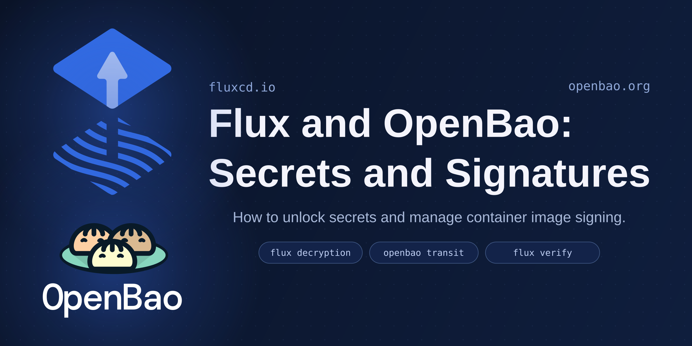

A Git repository can tell Flux what should run. On its own, it cannot answer two harder questions: who may unlock the secrets in that configuration, and which signatures should the cluster trust?

[OpenBao](https://openbao.org/), an open source secrets and encryption platform, gives both answers a home inside infrastructure you control. The OpenBao transit secrets engine performs cryptographic operations without releasing key material, while its Kubernetes and JWT auth methods let workloads arrive with an identity instead of a long-lived credential.

This post follows two integrations built on that foundation. First, SOPS encrypts Kubernetes Secrets while OpenBao protects their data keys, and kustomize-controller decrypts them with workload identity—no static `VAULT_TOKEN` to bootstrap. Then OpenBao holds an OCI signing key, Cosign uses it to sign an artifact by digest, and Flux verifies the signature before reconciliation.

TODO: REPLACE FEATURED IMAGE!



## SOPS: GitOps secrets without a static token

Keeping encrypted Secrets in Git solves most of the secret-distribution problem. For a SOPS encryption key living in OpenBao's transit engine, before 2.9 Flux still needed a static `VAULT_TOKEN` to ask OpenBao for decryption: one secret that had to exist before GitOps could take charge of managing secrets. Starting with Flux 2.9, that token is optional: kustomize-controller can use ServiceAccount tokens to authenticate to OpenBao, so Flux can manage secrets without any pre-existing secret.

### Step 1: Configure OpenBao for SOPS decryption

OpenBao needs a transit key, a decrypt-only policy, and an auth role for the ServiceAccount Flux will use. Both Kubernetes and JWT auth are supported; using Kubernetes auth with the `flux-system/kustomize-controller` ServiceAccount, the setup is:

```shell
bao secrets enable transit
bao write -f transit/keys/sops

bao policy write sops - <<'EOF'
path "transit/decrypt/sops" {
  capabilities = ["update"]
}
EOF

bao auth enable kubernetes
bao write auth/kubernetes/config \
  kubernetes_host=https://kubernetes.example.com:6443 \
  kubernetes_ca_cert=@ca.crt \
  token_reviewer_jwt=@reviewer.jwt

bao write auth/kubernetes/role/flux-system_kustomize-controller \
  bound_service_account_names=kustomize-controller \
  bound_service_account_namespaces=flux-system \
  audience=https://openbao.example.com:8200 \
  token_policies=sops \
  ttl=20m
```

The role name `flux-system_kustomize-controller` follows Flux's `{namespace}_{name}` convention, while its audience matches the OpenBao address later stored in the SOPS metadata. This `sops` policy is only for Flux decryption; the developer or CI identity in Step 2 needs `update` on `transit/encrypt/sops`. OpenBao's [Kubernetes auth method](https://openbao.org/api-docs/auth/kubernetes/) and [JWT/OIDC auth method](https://openbao.org/api-docs/auth/jwt/) documentation cover both server-side options.

### Step 2: Encrypt a Secret with OpenBao

After authenticating to OpenBao, a developer or CI job asks SOPS to encrypt a regular Kubernetes Secret using an OpenBao transit key:

```shell
sops encrypt \
  --hc-vault-transit https://openbao.example.com:8200/v1/transit/keys/sops \
  --encrypted-regex '^(data|stringData)$' \
  secret.yaml > secret.enc.yaml
```

The resulting `secret.enc.yaml` is ready for Git. It looks like this:

```yaml
apiVersion: v1
kind: Secret
metadata:
  name: database
  namespace: apps
type: Opaque
stringData:
  username: ENC[AES256_GCM,data:...,iv:...,tag:...,type:str]
  password: ENC[AES256_GCM,data:...,iv:...,tag:...,type:str]
sops:
  hc_vault:
    - vault_address: https://openbao.example.com:8200
      engine_path: transit
      key_name: sops
      created_at: "2026-07-14T12:00:00Z"
      enc: vault:v1:...
  encrypted_regex: ^(data|stringData)$
  mac: ENC[AES256_GCM,data:...,iv:...,tag:...,type:str]
```

SOPS replaces the plaintext content with ciphertext and adds a `sops.hc_vault` metadata field routing the encryption to OpenBao.

### Step 3: Configure kustomize-controller to use workload identity for OpenBao

When Flux reconciles files like the one above, it asks OpenBao to decrypt the content. Before Flux 2.9, that request depended on the static `VAULT_TOKEN`. Flux 2.9 replaces that token with an opt-in workload identity path. Operators give kustomize-controller an allowlist of OpenBao instances and their JWT-backed login endpoints. This is done by creating a ConfigMap in the `flux-system` namespace and pointing kustomize-controller to its name through the flag `--sops-vault-configmap`. The ConfigMap looks like this:

```yaml
data:
  config.yaml: |
    instances:
      - address: https://openbao.example.com:8200
        loginPath: auth/kubernetes/login
```

With that in place, the OpenBao address in the SOPS metadata selects an entry from this list. kustomize-controller requests a Kubernetes ServiceAccount token with that address as its audience, then presents it at the configured login path under the matching role created in Step 1. OpenBao returns a short-lived token, which Flux then uses to call OpenBao's transit engine to decrypt the Secret.

### Step 4: Use a dedicated ServiceAccount for decryption

By default, the exchange described above uses kustomize-controller's own ServiceAccount. A Flux Kustomization can instead select a dedicated ServiceAccount:

```yaml
spec:
  decryption:
    provider: sops
    serviceAccountName: sops
```

Per-Kustomization decryption ServiceAccounts require the `ObjectLevelWorkloadIdentity` feature gate to be enabled in kustomize-controller. For a Kustomization in the `apps` namespace, the `sops` ServiceAccount needs a corresponding `apps_sops` role in OpenBao, configured with the same audience and policy as the role in Step 1.

## Cosign: Sovereign Software Signatures

Flux can verify the signature of an OCI artifact before it reconciles it, using [Cosign](https://docs.sigstore.dev/). That verification is deliberately **backend-agnostic**: Flux takes a public key, checks a signature, and forms no opinion about how or where the artifact was signed. With a static key, it never reaches out to Fulcio or Rekor.

That property is more useful than it first appears. It means you can build a signing chain that depends on nothing outside infrastructure you run - no public cloud KMS holding your key, no public Sigstore transparency log in the path. This post walks through one such chain: [OpenBao](https://openbao.org/) holds the signing key, Cosign signs the artifact, and Flux verifies it. Every step stays on your side of the network boundary, which matters for regulated environments, data-sovereignty requirements, and anyone who would rather not rent a link in their trust chain from a service they don't control.

The full, reproducible setup lives at [openbao-flux-demo](https://github.com/controlplaneio-openbao/openbao-flux-demo). What follows are the pieces that matter.

```text
OpenBao transit engine   →   Cosign   →   GHCR (artifact + signature)   →   Flux
holds the signing key        signs        stores signature                  verifies
```

The configuration below uses a static key. Flux also supports keyless verification: omit `.verify.secretRef`, and Flux will match OIDC identities against Fulcio certificates and the Rekor log. That is the right choice when short-lived identities and a public, auditable signing record are what you want, and reliance on public Sigstore infrastructure is acceptable.

This demo takes the other path on purpose. The goal is a chain with no public dependencies, so a static key held in OpenBao is the natural fit: you own key custody and rotation, and nothing in the flow calls out to a service you don't run. Neither mode is universally correct - they encode different trade-offs, and Flux lets you choose per source.

### Step 1: Generate the signing key in OpenBao

OpenBao's transit secrets engine is a cryptography-as-a-service backend: it holds key material and performs sign and verify operations on request. Cosign has native support for it through the `openbao://` KMS URI, so generating the key is a single command - and the private half is created inside OpenBao and never written to disk:

```shell
cosign generate-key-pair --kms openbao://control-plane-demo
```

Only `cosign.pub` lands on your filesystem. That public key is the sole piece of the chain Flux needs to verify signatures later.

The demo runs OpenBao in dev mode with a root token, which is fine for a throwaway cluster and nothing else. In production you would sign with a token scoped to just this key - read the public key and sign, nothing more:

```hcl
path "transit/keys/control-plane-demo" {
  capabilities = ["read"]
}

path "transit/sign/control-plane-demo" {
  capabilities = ["update"]
}
```

### Step 2: Push and sign the artifact by digest

Package the manifests as an OCI artifact and push them to the registry with the Flux CLI:

```shell
flux push artifact oci://ghcr.io/controlplaneio-openbao/openbao-flux-demo-workload:latest \
  --path=./workload \
  --source="https://github.com/controlplaneio-openbao/openbao-flux-demo" \
  --revision="main@sha1:$(git rev-parse HEAD)"
```

Then sign the pushed artifact by its digest. Passing `--tlog-upload=false` keeps the signature off the public Rekor log, so the signing event itself never becomes a public record:

```shell
cosign sign --key openbao://control-plane-demo --tlog-upload=false \
  ghcr.io/controlplaneio-openbao/openbao-flux-demo-workload@sha256:...
```

OpenBao performs the signing operation, and the signature is stored in the registry alongside the artifact. One thing to watch: Cosign authenticates to the registry separately from `flux push artifact --creds` - the two don't share credentials, so Cosign needs its own `cosign login`.

### Step 3: Configure Flux to verify the artifact

Flux only needs the Cosign public key. Create a Secret holding it, then reference that Secret from an `OCIRepository`'s `.spec.verify`. The public key is not sensitive, so the demo creates the Secret directly; in production you would manage it declaratively with SOPS or sealed-secrets:

```shell
kubectl -n flux-system create secret generic cosign-public-key \
  --from-file=cosign.pub=cosign.pub
```

```yaml
apiVersion: source.toolkit.fluxcd.io/v1
kind: OCIRepository
metadata:
  name: demo-workload
  namespace: flux-system
spec:
  interval: 5m
  url: oci://ghcr.io/controlplaneio-openbao/openbao-flux-demo-workload
  ref:
    tag: latest
  verify:
    provider: cosign
    secretRef:
      name: cosign-public-key
```

When the signature checks out, Flux records it on the source and only then applies the manifests:

```text
SourceVerified=True (Succeeded): verified signature of revision latest@sha256:…
```

No part of that verification reached outside the cluster.

## References

- [Flux Kustomization decryption with OpenBao via workload identity](https://fluxcd.io/flux/components/kustomize/kustomizations/#openbaovault-kubernetes-auth)
- [Flux OCIRepository verification with public keys](https://fluxcd.io/flux/components/source/ocirepositories/#public-keys-verification)
- [OpenBao transit engine](https://openbao.org/docs/secrets/transit/)
- [OpenBao KMS support](https://docs.sigstore.dev/cosign/key_management/overview/)
- [OpenBao Kubernetes auth method API docs](https://openbao.org/api-docs/auth/kubernetes/)
- [OpenBao JWT/OIDC auth method API docs](https://openbao.org/api-docs/auth/jwt/)
