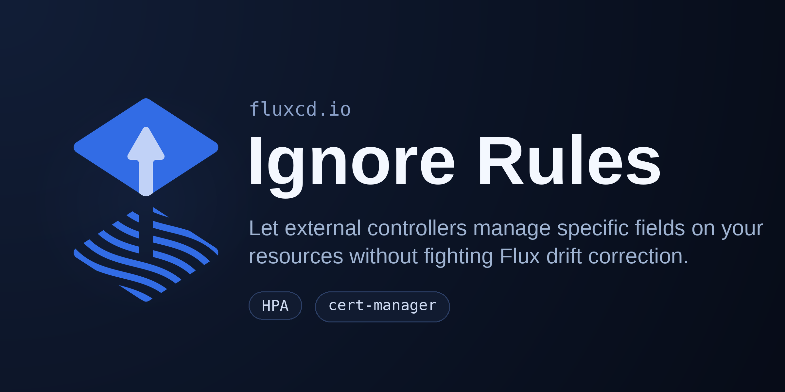

We are excited to introduce **drift ignore rules** for Flux Kustomizations, a long-requested
capability that lets you tell Flux to leave specific fields alone during drift detection and
correction, while continuing to reconcile everything else.



One of the core promises of GitOps with Flux is continuous reconciliation: the
[kustomize-controller](https://fluxcd.io/flux/components/kustomize/) runs a periodic server-side
apply dry-run to detect drift between the desired state in Git and the live state in the cluster,
and corrects any divergence. This is exactly what you want for most fields; it guarantees that the
cluster always matches the source of truth and that manual `kubectl` edits are reverted.

But not every field on a Kubernetes object should be owned by Flux. In real clusters, other
controllers legitimately mutate parts of the resources that Flux manages, and Flux's drift
correction ends up fighting them on every reconcile.

## The problem: when drift correction fights other controllers

Consider a Deployment that Flux reconciles from Git with `replicas: 2`. You also run a
[HorizontalPodAutoscaler](https://kubernetes.io/docs/tasks/run-application/horizontal-pod-autoscale/)
that scales the workload to `5` replicas under load. On the next reconciliation, Flux sees the
live `replicas: 5` as drift from the desired `replicas: 2` and scales the Deployment back down,
undoing the autoscaler. The HPA scales it back up, Flux scales it back down, and the two
controllers ping-pong indefinitely.

I ran into a memorable variant of this myself. On a small cluster, an HPA had been configured with a
`minReplicas` floor well below the replica count baked into the GitOps manifest. Every time Flux
reconciled, it bumped the Deployment back up to the manifest's much higher replica count. That surge
was enough to exceed the cluster's capacity, so the cluster autoscaler dutifully spun up a brand new
node to schedule the extra pods. Moments later the HPA scaled the Deployment back down to its
`minReplicas` floor, the new node went idle, and the autoscaler tore it down again. Reconcile,
scale up, add node, scale down, remove node, repeat, on every interval. What should have been a
quiet steady state turned into constant node churn and a SEV2 incident.

The same pattern shows up with many other tools:

- **cert-manager's cainjector** writing the `caBundle` into a CRD conversion webhook.
- An operator that owns a single key inside a ConfigMap while Flux owns the rest.

Until now, the options were coarse: disable drift correction for the whole Kustomization, or
exclude the entire resource from reconciliation. Both throw away the safety that GitOps gives you
for all the *other* fields on those objects.

Drift ignore rules solve this at the field level.

## Introducing `.spec.ignore`

The Kustomization API now has an optional `.spec.ignore` list. Each rule combines a set of
[JSON Pointer (RFC 6901)](https://datatracker.ietf.org/doc/html/rfc6901) `paths` with an optional
`target` selector that scopes the rule to specific resources:

```yaml
---
apiVersion: kustomize.toolkit.fluxcd.io/v1
kind: Kustomization
metadata:
  name: app
  namespace: flux-system
spec:
  interval: 10m
  prune: true
  sourceRef:
    kind: GitRepository
    name: app
  ignore:
    - paths:
        - "/spec/replicas"
      target:
        kind: Deployment
```

With this rule in place, Flux ignores `/spec/replicas` on all Deployments during drift detection
and correction, allowing an HPA to own the replica count, while still correcting drift on every
other field (image tags, environment variables, labels, and so on).

The `target` selector supports `group`, `version`, `kind`, `name` and `namespace` (all matched as
regular expressions), as well as `labelSelector` and `annotationSelector` using standard Kubernetes
selector syntax. If you omit `target`, the rule applies to **all** resources managed by the
Kustomization, so it is good practice to always scope rules to the resources you intend.

> **Tip:** For JSON Pointer paths that contain a `/` in the key name, the `/` must be escaped as
> `~1`. For example, the annotation `example.com/config-hash` is referenced as
> `/metadata/annotations/example.com~1config-hash`.

## How it works

Drift ignore rules build on the Kubernetes
[server-side apply](https://kubernetes.io/docs/reference/using-api/server-side-apply/) field
ownership model. When a reconciliation is triggered, for each ignored path the controller resolves
one of two strategies based on who owns the field:

- **Strip** — if the ignored field is owned by another server-side Apply field manager, Flux
  removes the field from its apply payload. This relinquishes Flux's ownership and lets the other
  field manager keep full control of the field.
- **Adopt** — if Flux is the sole Apply-type field manager for the field, the in-cluster value is
  copied into the apply payload. This preserves the current value, even after a `kubectl patch` or
  `kubectl edit`, without Flux reverting it and while keeping Flux's field ownership intact.

A key property is that **changes to ignored fields alone do not trigger a reconciliation**. The
controller excludes ignored paths when comparing the desired state against the live object, so a
modification made by an external controller to an ignored field will not cause an unnecessary apply
or a resource version bump. 

## Real-world examples

### Let an autoscaler own replicas

The canonical use case: hand `replicas` over to a HorizontalPodAutoscaler.

```yaml
spec:
  ignore:
    - paths:
        - "/spec/replicas"
      target:
        kind: Deployment
        name: podinfo
```

If the HPA scales `podinfo` from 2 to 5 replicas, Flux leaves the count at 5. If you also bump the
container image in Git, Flux still corrects the image; the ignore rule only protects `replicas`.

### Let cert-manager inject a webhook CA bundle

cert-manager's [cainjector](https://cert-manager.io/docs/concepts/ca-injector/) populates the
`caBundle` field of webhook configurations and CRD conversion webhooks, triggered by the
`cert-manager.io/inject-ca-from` annotation. `caBundle` is an optional base64 field whose real value
cert-manager owns at runtime. If the CRD is committed to Git with an explicit empty `caBundle: ""`,
Flux and cainjector end up toggling the field against each other on every reconcile, rewriting the
object each time. Ignore the `caBundle` path so cainjector keeps control:

```yaml
spec:
  ignore:
    - paths:
        - "/spec/conversion/webhook/clientConfig/caBundle"
      target:
        group: apiextensions.k8s.io
        kind: CustomResourceDefinition
        name: widgets.example.com
```

### Combine multiple rules

Rules compose, so you can cover several resources in a single Kustomization:

```yaml
spec:
  ignore:
    - paths:
        - "/spec/replicas"
      target:
        kind: Deployment
        name: podinfo
    - paths:
        - "/spec/conversion/webhook/clientConfig/caBundle"
      target:
        group: apiextensions.k8s.io
        kind: CustomResourceDefinition
        name: widgets.example.com
    - paths:
        - "/data/managed-by-operator"
      target:
        kind: ConfigMap
        name: app-config
```

## Preview changes with `flux diff`

The Flux CLI honors the ignore rules too. Running
[`flux diff kustomization`](https://fluxcd.io/flux/cmd/flux_diff_kustomization/) gives you an
accurate preview that matches what the controller will actually do, so ignored fields are not
reported as spurious diffs:

```sh
flux diff kustomization my-app --path ./path/to/local/manifests --kustomization-file ./path/to/local/my-app.yaml
```

## Notes and limitations

- Drift ignore rules are designed to work with the server-side apply field ownership model. They are
  the right tool for delegating fields to other controllers that legitimately manage them (such as
  HPA and cert-manager).
- Always scope rules with `target` unless you genuinely want to ignore the given paths across every
  resource in the Kustomization.
- Because ignored fields are excluded from drift comparison, Flux will not update an ignored field
  even when its value changes in Git while another controller owns it. The field is intentionally
  delegated.

## Wrapping up

Drift ignore rules close a long-standing gap: you no longer have to choose between full GitOps drift
correction and coexisting with autoscalers and other field-level controllers. You get both: Flux
keeps the cluster aligned with Git for everything you declare, and steps back from the specific
fields you delegate.

This capability landed across several Flux components:

- [fluxcd/pkg#1157](https://github.com/fluxcd/pkg/pull/1157) — field-level ignore support in the
  server-side apply engine.
- [fluxcd/kustomize-controller#1627](https://github.com/fluxcd/kustomize-controller/pull/1627) — the
  `.spec.ignore` API on the Kustomization.
- [fluxcd/flux2#5923](https://github.com/fluxcd/flux2/pull/5923) — `flux diff kustomization` support
  for ignore rules.

For the full reference, see the
[Ignore Rules](https://fluxcd.io/flux/components/kustomize/kustomizations/#ignore-rules) section of
the Kustomization documentation. As always, we would love to hear your feedback, join us on the
[CNCF Slack](https://cloud-native.slack.com/messages/flux) or open an issue on
[GitHub](https://github.com/fluxcd/flux2).
