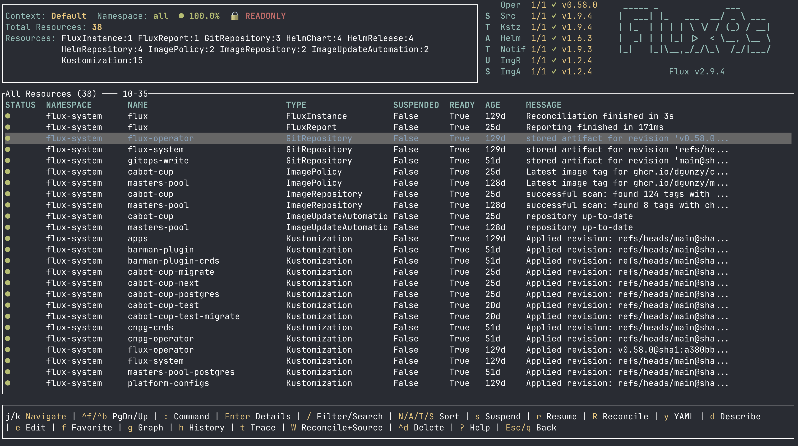
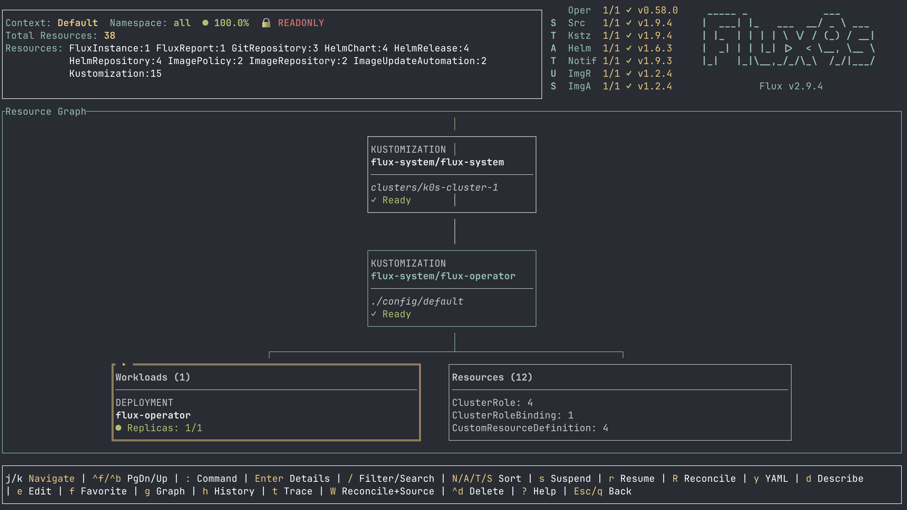
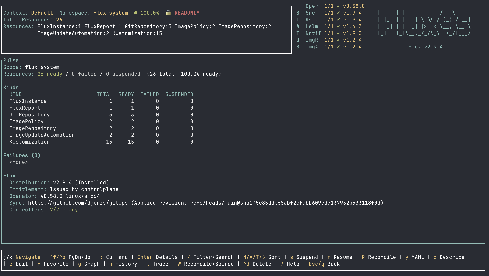
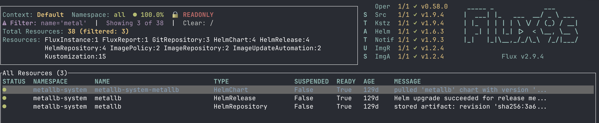

[flux9s](https://github.com/dgunzy/flux9s) recently reached 1.0. It is a
K9s-inspired terminal UI for Flux: real-time state for every Flux resource in
your cluster, with the operations you reach for most a single keystroke away.

This post is about why it exists, how the
Flux Operator's web UI accelerated its development, and what it took to cover the whole
Flux Operator ecosystem before the 1.0 release.

## The motivation: seeing cluster state at a glance

When I was new to Flux, the process I used to determine "what is happening with this
cluster?" was `flux get all`, usually piped through `grep`. It worked, but it was
hard to visualize, and not in real time. Which Kustomizations are failing and why? What is the
semver of that Kustomization's upstream OCIRepository?
The state of a cluster and the relationships between its
components are hard to see at a glance. The Flux CLI is very powerful, and
features like `flux trace` can answer a specific question quickly, but reconciliation
is continuous, and my view of it was a series of snapshots.

I thought that a good solution to my problem was a TUI (Terminal User Interface).
There were some great ones I had encountered before, especially [K9s](https://k9scli.io/).
K9s had solved this exact problem for core Kubernetes objects. I
wanted the Flux equivalent: a live view I could leave open on a second monitor,
with the same muscle memory from vim of `j`/`k` to move, `:` for commands, `/` to filter.
It is worth noting K9s has an excellent Flux plugin, but the scope of this plugin
could never fully keep up with the actions, views, and monitoring capability
needed for an ecosystem as complex as the Flux one.

I wrote flux9s in Rust (although my initial velocity might have been faster in Go).
I was studying the language at the time, and [kube-rs](https://kube.rs/) offered
support for the Watch API that a live view is built on. The result is a single
lightweight binary. Rust also pairs very well with AI-assisted
development: the compiler catches some of the silly bugs at compile time instead of
letting an agent ship them to runtime.

The first release in November 2025 was fairly simple: the Flux
CRDs in a unified list, driven by the Kubernetes Watch API rather than polling,
with suspend, resume, reconcile, and YAML inspection. This is still what flux9s is today,
with some added features. Two parts that have remained since the initial release:

- **Read-only by default.** flux9s launches in read-only mode; mutating a
  cluster is opt-in via `:readonly` or `flux9s config set readOnly false`.
- **Watch API.** Everything rendered in flux9s is from the Watch API and live.

## The inflection point: the Flux Operator's web UI

A month after flux9s's first release, when I had only shared it with a few
people, the Flux Operator shipped its
[web UI](https://fluxoperator.dev/web-ui/), Mission Control for GitOps.
At that point I was not sure if anyone would use flux9s. Did Flux need
multiple UIs? After some thought and discussions, I kept going.
Many people in the SRE / Platform Engineering world prefer to work in the terminal,
and having an interactive UI tied to a user's kubeconfig is additive to the ecosystem.

In practice, the web UI turned out to be one of the best things to
happen to the development of flux9s. Many of the features of the web UI had clearly
been derived from user requests, so there was a clear roadmap of enhancements to add.
I cloned the web UI code, deployed it on my personal cluster in minutes
(very easy!) and thought about what could be added to flux9s. The features that
landed next were web UI concepts translated into the TUI:

- **Dependency graphs** (`g`) - the ownership and inventory relationships around
  a resource, drawn with box characters instead of SVG, navigable with `j`/`k`
  and `Enter`.
- **Reconciliation history** (`h`) - for the resources that track it, what
  happened on each attempt and why.
- **Favorites** (`f`) - the handful of custom resources you actually watch,
  pinned into their own view.

flux9s got dramatically better because a larger, well-designed
project in the same ecosystem had already worked out what mattered most to users.
This accelerated the development a lot, and something like the graph view is one of
my favorite features for seeing and understanding a cluster.



## The road to 1.0

The Flux Operator ecosystem moves fast. `ResourceSets` became very important,
and supporting the way many users are consuming the new flux-operator CRDs drove
most of the releases through 2026:

- **`FluxInstance` and `ResourceSet` downstream discovery** - both publish a
  `status.inventory`, so both render like a Kustomization in the graph view.
- **`ResourceSet` step visualization** - ordered steps with per-step phase, so
  a stalled rollout points at the step that stalled.
- **`:pulse` cluster health dashboard** - the operator's `FluxReport` rendered
  live: ready/failed/suspended totals, per-kind counts, and the most recent
  failures with their messages.
- **Opt-in CRD discovery** - after running
  `flux9s config set discoverFluxResources true`, any CRD
  labeled `app.kubernetes.io/part-of=flux` shows up live and view-only. Flagger,
  tofu-controller, and other projects appear through the same label-driven
  discovery.
- **Following a failure all the way down** - a live `:events` feed, workload
  drill-down from the graph, and streaming pod and controller logs (`l`,
  `:logs`), so an investigation stays inside the tool and Back walks the whole
  chain in reverse.



## Try it

flux9s runs anywhere your kubeconfig does:

```cli
brew install dgunzy/tap/flux9s
# or
cargo binstall flux9s
```

Binaries for Linux, macOS, and Windows are on the
[releases page](https://github.com/dgunzy/flux9s/releases), signed with Cosign.

```cli
flux9s
```

It starts on `flux-system` in read-only mode. From there:

```text
:ns all        watch every namespace
:pulse         cluster health dashboard
/              filter the list
g              dependency graph for the selected resource
?              full keybinding help
```



The [documentation](https://flux9s.ca/) covers configuration, skins, and the
full command reference.

flux9s is listed among the
[community UIs](https://fluxcd.io/ecosystem/#flux-uis--guis) in the Flux
ecosystem, a privilege for a project that started as a way to stop piping
`flux get all` through `grep` quite so often. If you try it and something is
wrong, missing, or awkward,
[open an issue](https://github.com/dgunzy/flux9s/issues); that is how most of
what is described above got built.

- [Source code](https://github.com/dgunzy/flux9s)
- [Documentation](https://flux9s.ca/)
- [Releases](https://github.com/dgunzy/flux9s/releases)
- [Issues and feature requests](https://github.com/dgunzy/flux9s/issues)
