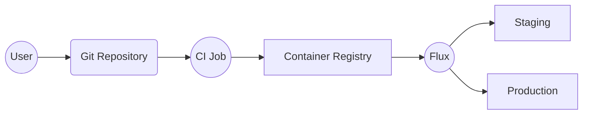
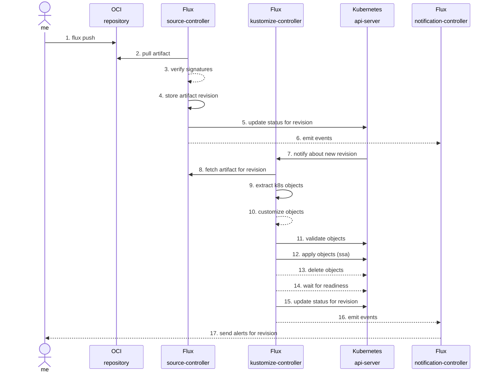

## How does Flux OCI work?

With Flux, you can distribute and reconcile Kubernetes configuration packaged as
[OCI artifacts](https://github.com/opencontainers/artifacts/blob/main/artifact-authors.md).
Instead of connecting Flux to a Git repository where the application desired state is defined,
you can connect Flux to a container registry where you'll push the application deploy manifests,
right next to the application container images.

{}
Using OCI instead of Git is particularly useful when the Git repository doesn't contain the
final Kubernetes manifests. If you are using [cuelang](https://cuelang.org/), [jsonnet](https://jsonnet.org/)
or any other tool that generates Kubernetes resources in YAML format, you can run the generators in CI
and publish the resulting manifests as OCI artifacts for Flux to consume.
{}

### Authoring artifacts

On the client-side, the Flux CLI offers commands for packaging Kubernetes configs into OCI artifacts and
pushing these artifact to container registries. 

The Flux CLI commands for managing OCI artifacts are:
- `flux push artifact`
- `flux pull artifact`
- `flux tag artifact`
- `flux diff artifact`
- `flux list artifacts`

{}
While this guide refers to Kubernetes YAMLs as the manifests which are bundled in an OCI artifact,
any type of configuration can be published with the Flux CLI.
For example the [tf-controller](https://github.com/weaveworks/tf-controller)
(A Flux controller created by Weaveworks) expects for Terraform files to be included in the OCI artifact.
{}

The OCI artifacts produced with `flux push artifact` have the following custom media types:
- artifact media type `application/vnd.oci.image.manifest.v1+json`
- config media type `application/vnd.cncf.flux.config.v1+json`
- content media type `application/vnd.cncf.flux.content.v1.tar+gzip`

### Consuming artifacts

On the server-side, Flux pulls OCI artifacts from container registries, extracts the Kubernetes manifests
and reconciles them on the cluster.

With [OCIRepository](/flux/components/source/ocirepositories/) you tell Flux which artifacts to pull
from a container registry and how to authenticate in order to download and make available
the artifacts' content inside the cluster.

The [OCIRepository](/flux/components/source/ocirepositories/) source can be used
in the same way as a [GitRepository](/flux/components/source/gitrepositories/).
You can be notified when new artifacts are pulled (Flux `Alert`),
you can trigger a pull with webhooks (Flux `Receiver`),
and you can apply the OCI artifact content on the cluster (Flux `Kustomization`).

Example:

```yaml
apiVersion: source.toolkit.fluxcd.io/v1beta2
kind: OCIRepository
metadata:
  name: podinfo
  namespace: flux-system
spec:
  interval: 10m
  url: oci://ghcr.io/stefanprodan/manifests/podinfo
  ref:
    tag: latest
---
apiVersion: kustomize.toolkit.fluxcd.io/v1
kind: Kustomization
metadata:
  name: podinfo
  namespace: flux-system
spec:
  interval: 10m
  targetNamespace: default
  prune: true
  sourceRef:
    kind: OCIRepository
    name: podinfo
  path: ./
```

### Helm OCI

For Helm users, Flux comes with [support](/flux/guides/helmreleases/#helm-oci-repository) for
defining Helm releases with charts stored in container registries.

Example:

```yaml
apiVersion: source.toolkit.fluxcd.io/v1beta2
kind: HelmRepository
metadata:
  name: podinfo
  namespace: flux-system
spec:
  interval: 10m
  type: oci
  url: oci://ghcr.io/stefanprodan/charts
---
apiVersion: helm.toolkit.fluxcd.io/v2beta2
kind: HelmRelease
metadata:
  name: podinfo
  namespace: flux-system
spec:
  interval: 10m
  targetNamespace: default
  chart:
    spec:
      chart: podinfo
      sourceRef:
        kind: HelmRepository
        name: podinfo
```

The two artifact types can be used together, for example you could bundle a `Namespace`,
a `HelmRepository` and a `HelmRelease` into a Flux OCI artifact where the `HelmRepository`
points to a container registry where the chart is.

## Workflow examples

Following are examples for deploying a demo application to Kubernetes using manifests stored in Git.



We'll use the main branch to deploy to staging and Git tags for deploying on production.
When pushing changes to the main branch, a CI job generates the Kubernetes manifests for staging and
pushes them to a container registry using the Flux CLI. Flux running on the staging cluster
detects the new artifact digest, pulls the manifests and applies them.

When cutting a release from the main branch by tagging a commit with a semver version, the CI job
generates the manifests for production and pushes them using the Git tag as the OCI artifact tag.
The Flux controllers running on the production cluster
detects the new semver tag, pulls the manifests and applies them.

{}
If you are using GitHub for CI, please see [these examples](/flux/flux-gh-action.md#examples) on
how to automate the publishing of OCI Artifacts in your workflows with the Flux GitHub Action.
{}

### Deploy latest on staging 

Push the latest changes from Git to the container registry:

```shell
git clone https://github.com/stefanprodan/podinfo.git && cd podinfo

flux push artifact oci://ghcr.io/stefanprodan/manifests/podinfo:$(git rev-parse --short HEAD) \
	--path="./kustomize" \
	--source="$(git config --get remote.origin.url)" \
	--revision="$(git branch --show-current)/$(git rev-parse HEAD)"
```

The output is similar to:

```
► pushing artifact to ghcr.io/stefanprodan/manifests/podinfo:b3b00fe
✔ artifact successfully pushed to ghcr.io/stefanprodan/manifests/podinfo@sha256:4f90664660b3a567287e6957fa0481f347541b5908f6f797ec665255a399aed6
```

Tag the current commit SHA as latest:

```shell
$ flux tag artifact oci://ghcr.io/stefanprodan/manifests/podinfo:$(git rev-parse --short HEAD) \
  --tag latest
```

The output is similar to:

```
► tagging artifact
✔ artifact tagged as ghcr.io/stefanprodan/manifests/podinfo:latest
```

Pull the latest build on the staging cluster:

```yaml
apiVersion: source.toolkit.fluxcd.io/v1beta2
kind: OCIRepository
metadata:
  name: podinfo
  namespace: flux-system
spec:
  interval: 5m
  url: oci://ghcr.io/stefanprodan/manifests/podinfo
  ref:
    tag: latest
```

Reconcile the latest manifests from the OCI artifact:

```yaml
apiVersion: kustomize.toolkit.fluxcd.io/v1beta2
kind: Kustomization
metadata:
  name: podinfo
  namespace: flux-system
spec:
  sourceRef:
    kind: OCIRepository
    name: podinfo
  interval: 60m
  retryInterval: 5m
  path: ./
  prune: true
  wait: true
  timeout: 2m
  targetNamespace: default
  patches:
    - patch: |
        - op: add
          path: /metadata/annotations/env
          value: staging
      target:
        name: podinfo
```

### Deploy stable on production

Push the latest release from Git to the container registry:

```shell
git checkout 6.1.0

flux push artifact oci://ghcr.io/stefanprodan/manifests/podinfo:$(git tag --points-at HEAD) \
	--path="./kustomize" \
	--source="$(git config --get remote.origin.url)" \
	--revision="$(git tag --points-at HEAD)/$(git rev-parse HEAD)"
```

Tag the release as stable:

```shell
flux tag artifact oci://ghcr.io/stefanprodan/manifests/podinfo:$(git tag --points-at HEAD) \
  --tag stable
```

Deploy the latest stable build on the production cluster:

```yaml
apiVersion: source.toolkit.fluxcd.io/v1beta2
kind: OCIRepository
metadata:
  name: podinfo
  namespace: flux-system
spec:
  interval: 5m
  url: oci://ghcr.io/stefanprodan/manifests/podinfo
  ref:
    tag: stable
```

Or deploy the latest version by semver:

```yaml
apiVersion: source.toolkit.fluxcd.io/v1beta2
kind: OCIRepository
metadata:
  name: podinfo
  namespace: flux-system
spec:
  interval: 5m
  url: oci://ghcr.io/stefanprodan/manifests/podinfo
  ref:
    semver: ">=1.0.0"
```

## Authentication

Flux works with Docker Hub, GitHub and GitLab Container Registry,
ACR, ECR, GAR, Harbor, self-hosted Docker Registry and
any other registry which supports custom OCI media types.

For authentication purposes, the `flux <verb> artifact` commands are using the `~/.docker/config.json`
config file and the Docker credential helpers.

Login to GitHub Container Registry example:

```shell
echo ${GITHUB_PAT} | docker login ghcr.io -u ${GITHUB_USER} --password-stdin
```

To pull artifacts in Kubernetes clusters, Flux can authenticate to container registries
using image pull secrets or IAM role bindings to the `source-controller` service account.

Generate an image pull secret for GitHub Container Registry example:

```shell
flux create secret oci ghcr-auth \
  --url=ghcr.io \
  --username=flux \
  --password=${GITHUB_PAT}
```

Then reference the secret in the `OCIRepository` with:

```yaml
apiVersion: source.toolkit.fluxcd.io/v1beta2
kind: OCIRepository
metadata:
  name: podinfo
  namespace: flux-system
spec:
  interval: 5m
  url: oci://ghcr.io/stefanprodan/manifests/podinfo
  provider: generic
  secretRef:
    name: ghcr-auth
```

### Contextual Authorization

When running Flux on managed Kubernetes clusters like EKS, AKS or GKE, you
can set the `provider` field to `azure`, `aws` or `gcp` and Flux will use
the Kubernetes node credentials or an IAM Role binding to pull artifacts
without needing an image pull secret.

For more details on how to setup contextual authorization for Azure, AWS and Google Cloud please see:

- [OCIRepository documentation](/flux/components/source/ocirepositories/#provider)
- [HelmRepository documentation](/flux/components/source/helmrepositories/#provider)

## Signing and verification

Starting with v0.35, Flux comes with support for verifying OCI artifacts
signed with [Sigstore Cosign](https://github.com/sigstore/cosign).

To secure your delivery pipeline, you can sign the artifacts and configure Flux
to verify the artifacts' signatures before they are downloaded and reconciled in production.

### Workflow example

Generate a Cosign key-pair and create a Kubernetes secret with the public key:

```shell
cosign generate-key-pair

kubectl -n flux-system create secret generic cosign-pub \
  --from-file=cosign.pub=cosign.pub
```

Push and sign the artifact using the Cosign private key:

```shell
flux push artifact oci://ghcr.io/stefanprodan/manifests/podinfo:$(git tag --points-at HEAD) \
	--path="./kustomize" \
	--source="$(git config --get remote.origin.url)" \
	--revision="$(git tag --points-at HEAD)/$(git rev-parse HEAD)"

cosign sign --key=cosign.key ghcr.io/stefanprodan/manifests/podinfo:$(git tag --points-at HEAD)
```

Configure Flux to verify the artifacts using the Cosign public key from the Kubernetes secret:

```yaml
apiVersion: source.toolkit.fluxcd.io/v1beta2
kind: OCIRepository
metadata:
  name: podinfo
  namespace: flux-system
spec:
  interval: 5m
  url: oci://ghcr.io/stefanprodan/manifests/podinfo
  ref:
    semver: "*"
  verify:
    provider: cosign
    secretRef:
      name: cosign-pub
```

{}
For publicly available OCI artifacts, which are signed using
the [Cosign Keyless](https://docs.sigstore.dev/cosign/keyless/)
method, you can enable the verification by omitting the `.verify.secretRef` field.

Note that keyless verification is an **experimental feature**, using
custom root CAs or self-hosted Rekor instances are not currently supported.
{}

### Verification status

If the verification succeeds, Flux adds a condition with the
following attributes to the OCIRepository's `.status.conditions`:

- `type: SourceVerified`
- `status: "True"`
- `reason: Succeeded`

If the verification fails, Flux will set the `SourceVerified` status to `False`
and will not fetch the artifact contents from the registry. The verification
failure will trigger an [alert](/flux/guides/notifications.md) and the
OCIRepository ready status message will contain the verification error message.

```console
$ kubectl -n flux-system describe ocirepository podinfo

Status:                        
  Conditions:
    Last Transition Time:     2022-09-29T18:29:12Z
    Message:                  failed to verify the signature using provider 'cosign': no matching signatures were found
    Observed Generation:      1
    Reason:                   VerificationError
    Status:                   False
    Type:                     Ready
```

Verification failures are also visible when running `flux get sources oci` and in Kubernetes events.

## Verify Helm charts

Starting with v0.36, Flux comes with support for verifying Helm charts stored as OCI artifacts
and signed with [Sigstore Cosign](https://github.com/sigstore/cosign).

The verification works the same as for `OCIRepository`, the main difference is that for Helm,
the verification must be enabled with `HelmRelease.spec.chart.spec.verify`.

Assuming you've pushed and signed a Helm chart with:

```shell
helm push <app-name>-<app-version>.tgz oci://<registry-host>/<org>/charts
cosign sign --key cosign.key <registry-host>/<org>/charts/<app-name>:<app-version>
```

You can configure Flux to verify the chart signature before installing and upgrading a Helm release:

```yaml
apiVersion: source.toolkit.fluxcd.io/v1beta2
kind: HelmRepository
metadata:
  name: helm-charts
spec:
  interval: 1h
  url: oci://<registry-host>/<org>/charts
  type: oci
---
apiVersion: helm.toolkit.fluxcd.io/v2beta2
kind: HelmRelease
metadata:
  name: <app-name>
spec:
  interval: 1h
  chart:
    spec:
      chart: <app-name>
      version: <app-version>
      sourceRef:
        kind: HelmRepository
        name: helm-charts
      verify:
        provider: cosign
        secretRef:
          name: cosign-pub
```

For more details on how Helm chart verification works,
please see the [HelmChart documentation](/flux/components/source/helmcharts/#verification).

## Monitoring

Configure alerting for when new artifacts are pulled and reconciled:

```yaml
apiVersion: notification.toolkit.fluxcd.io/v1beta3
kind: Alert
metadata:
  name: podinfo
  namespace: flux-system
spec:
  summary: "podinfo in production"
  providerRef:
    name: slack
  eventSeverity: info
  eventSources:
    - kind: OCIRepository
      name: 'podinfo'
    - kind: Kustomization
      name: 'podinfo'
```

Or watch the Kubernetes events:

```console
$ kubectl events -n flux-system --for OCIRepository/podinfo --watch

stored artifact with digest '04db795c5e8f039ee06e7f388e90ef9d16b713506dc100faed1773e0f8410d07'
from 'oci://ghcr.io/stefanprodan/manifests/podinfo',
origin source 'https://github.com/stefanprodan/podinfo.git',
origin revision '6.1.5/6b869d1a184969f7e24e6e4ad30be0b18f8b7416'
```

## Tracing

When publishing artifacts with `flux push` it is important to 
specify the Git source and revision with: 

```shell
flux push artifact oci://<repo url> --path=<manifests dir> \
	--source="$(git config --get remote.origin.url)" \
	--revision="$(git branch --show-current)/$(git rev-parse HEAD)"
```

The Git source and the revision are stored in the container registry as annotations in the OCI artifact manifest,
and they are reflected in-cluster under the `status.artifact.metadata` of the `OCIRepository` object.

You can determine the Git origin of an artifact pulled by an `OCIRepository` by looking up its status:

```console
$ kubectl -n flux-system describe ocirepository podinfo

Status:
  Artifact:
    Revision:          sha256:04db795c5e8f039ee06e7f388e90ef9d16b713506dc100faed1773e0f8410d07
    Last Update Time:  2022-08-09T18:29:11Z
    Metadata:
      org.opencontainers.image.created:   2022-08-08T12:31:05+03:00
      org.opencontainers.image.revision:  6.1.5@sha1:6b869d1a184969f7e24e6e4ad30be0b18f8b7416
      org.opencontainers.image.source:    https://github.com/stefanprodan/podinfo.git                           
  Conditions:
    Last Transition Time:     2022-08-09T18:29:12Z
    Message:                  stored artifact for digest 'sha256:04db795c5e8f039ee06e7f388e90ef9d16b713506dc100faed1773e0f8410d07'
    Observed Generation:      9
    Reason:                   Succeeded
    Status:                   True
    Type:                     Ready
```

For any Kubernetes resources managed by Flux, you can trace it back to its source with `flux trace`:

```console
$ flux -n default trace deployment podinfo

Object:          Deployment/podinfo
Namespace:       default
Status:          Managed by Flux
---
Kustomization:   podinfo
Namespace:       flux-system
Target:          default
Path:            ./kustomize
Revision:        sha256:dbdb109711ffb3be77504d2670dbe13c24dd63d8d7f1fb489d350e5bfe930dd3
Status:          Last reconciled at 2022-08-10 14:40:28 +0200 CEST
Message:         Applied revision: sha256:dbdb109711ffb3be77504d2670dbe13c24dd63d8d7f1fb489d350e5bfe930dd3
---
OCIRepository:   podinfo
Namespace:       flux-system
URL:             oci://ghcr.io/stefanprodan/manifests/podinfo
Digest:          sha256:dbdb109711ffb3be77504d2670dbe13c24dd63d8d7f1fb489d350e5bfe930dd3
Revision:        sha256:dbdb109711ffb3be77504d2670dbe13c24dd63d8d7f1fb489d350e5bfe930dd3
Origin Revision: 6.1.6@sha1:450796ddb2ab6724ee1cc32a4be56da032d1cca0
Origin Source:   https://github.com/stefanprodan/podinfo.git
Status:          Last reconciled at 2022-08-10 14:40:22 +0200 CEST
Message:         stored artifact for digest 'sha256:dbdb109711ffb3be77504d2670dbe13c24dd63d8d7f1fb489d350e5bfe930dd3'
```

## Automated updates to Git

If you wish to track the OCI artifacts revisions in Git, you can use
Flux [image automation](/flux/guides/image-update/) to patch the artifacts
tags in the YAML manifests stored in the Git repository used at bootstrap.

First we'll configure Flux to clone the bootstrap repository and push commits to the `main` branch:

```yaml
apiVersion: image.toolkit.fluxcd.io/v1beta1
kind: ImageUpdateAutomation
metadata:
  name: flux-system
  namespace: flux-system
spec:
  interval: 10m
  sourceRef:
    kind: GitRepository
    name: flux-system
  git:
    push:
      branch: main
    commit:
      author:
        email: fluxcdbot@users.noreply.github.com
        name: fluxcdbot
      messageTemplate: '{{range .Updated.Images}}{{println .}}{{end}}'
  update:
    path: ./clusters/my-cluster
    strategy: Setters
```

You can also configure Flux to push the change to a new branch and open a Pull Request,
for more details please see the [image automation guide](/flux/guides/image-update/)
and [GitHub Actions Auto Pull Request](/flux/use-cases/gh-actions-auto-pr/).

### Flux OCI automation

Define an image repository and a semver policy for the OCI artifact:

```yaml
apiVersion: image.toolkit.fluxcd.io/v1beta2
kind: ImageRepository
metadata:
  name: podinfo-oci
  namespace: flux-system
spec:
  image: ghcr.io/stefanprodan/manifests/podinfo
  interval: 5m
---
apiVersion: image.toolkit.fluxcd.io/v1beta2
kind: ImagePolicy
metadata:
  name: podinfo-oci
  namespace: flux-system
spec:
  imageRepositoryRef:
    name: podinfo-oci
  policy:
    semver:
      range: 6.1.x
```

Then add the policy marker to the `OCIRepository` manifest in Git:

```yaml
apiVersion: source.toolkit.fluxcd.io/v1beta2
kind: OCIRepository
metadata:
  name: podinfo
  namespace: flux-system
spec:
  interval: 5m
  url: oci://ghcr.io/stefanprodan/manifests/podinfo
  ref:
    tag: 6.1.0 # {"$imagepolicy": "flux-system:podinfo-oci:tag"}
```

Based on the above configuration, Flux will scan the container registry every five minutes, and
when it finds a newer version, it will update the `OCIRepository.spec.ref.tag` and will push the
change to Git.

### Helm OCI automation

Define an image repository and a semver policy for the Helm chart:

```yaml
apiVersion: image.toolkit.fluxcd.io/v1beta2
kind: ImageRepository
metadata:
  name: podinfo-chart
  namespace: flux-system
spec:
  image: ghcr.io/stefanprodan/charts/podinfo
  interval: 5m
---
apiVersion: image.toolkit.fluxcd.io/v1beta2
kind: ImagePolicy
metadata:
  name: podinfo-chart
  namespace: flux-system
spec:
  imageRepositoryRef:
    name: podinfo-chart
  policy:
    semver:
      range: 6.1.x
```

Then add the policy marker to the `HelmRelease` manifest in Git:

```yaml
apiVersion: helm.toolkit.fluxcd.io/v2beta2
kind: HelmRelease
metadata:
  name: podinfo
  namespace: flux-system
spec:
  interval: 10m
  targetNamespace: default
  chart:
    spec:
      chart: podinfo
      version: 6.1.0 # {"$imagepolicy": "flux-system:podinfo-chart:tag"}
      sourceRef:
        kind: HelmRepository
        name: podinfo
```

Based on the above configuration, Flux will scan the container registry every five minutes,
and when it finds a newer Helm chart version, it will update the
`HelmRelease.spec.chart.spec.chart.version` and will push the change to Git.

### Diagram: OCI artifacts reconciliation 


