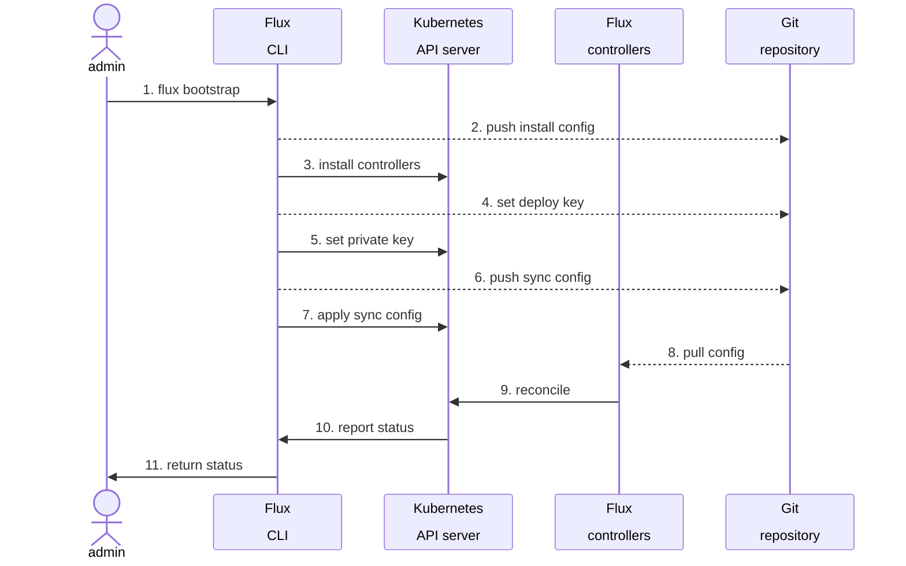
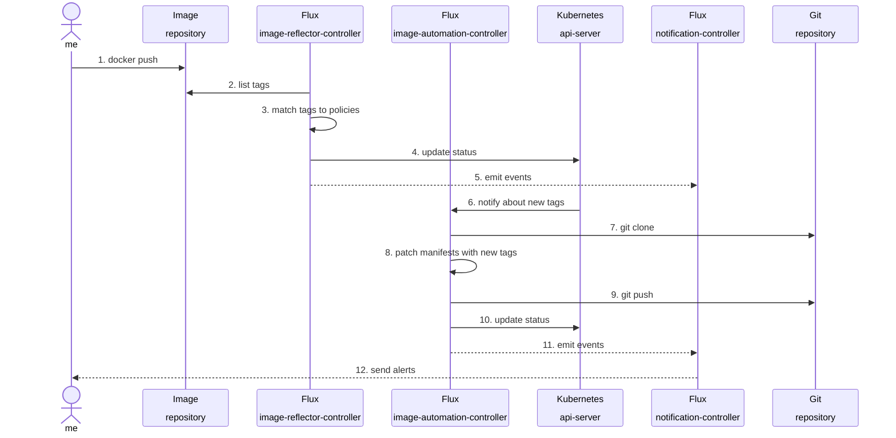
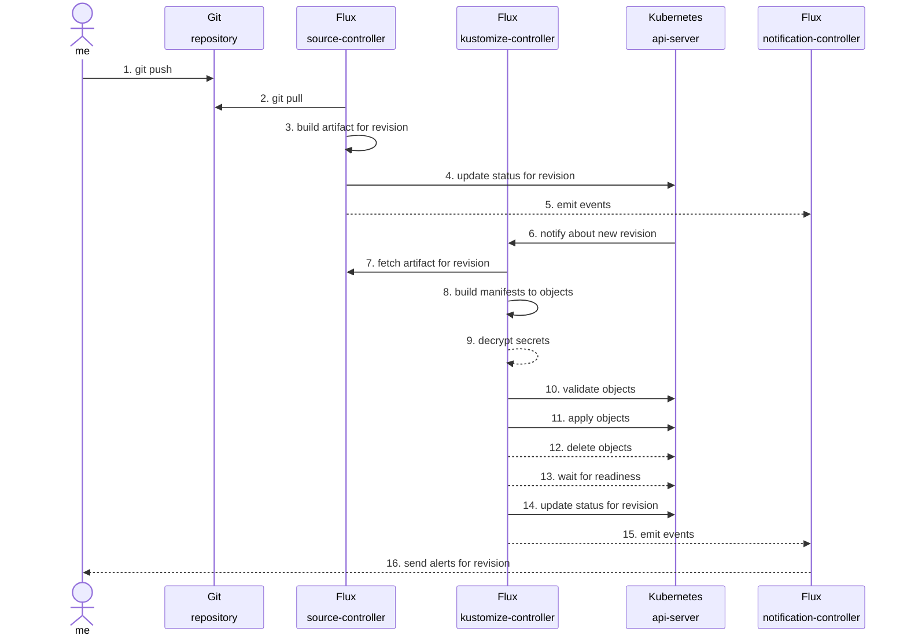
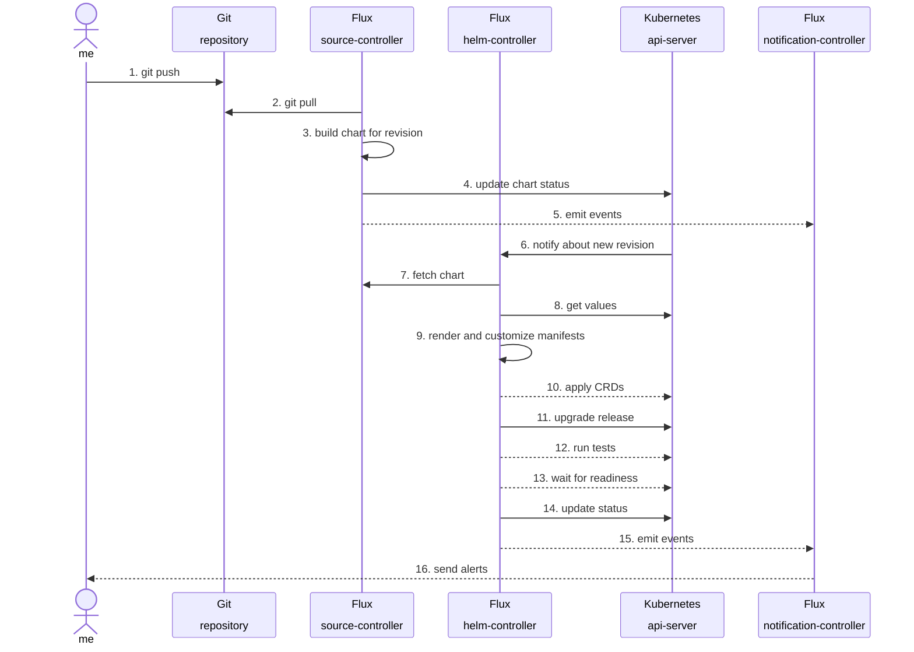

{}
Note that this guide has not been updated since more than a year ago. It does not address `OCIRepository`, needs review in consideration of Flux v2.0.0, and likely needs to be refreshed.

Expect this doc to receive an overhaul soon.
{}

Below we describe the flow of data through Flux, from End to End.

We assume a standard Flux installation, with all optional features enabled, then explain how Flux users can expect their change to flow through the stages
of its life as a commit, and describe how the commit data passes through the Flux system and the cluster, in rough chronological order. We tried to cover
every supported opportunity that users have to inspect and interact with their changes through Flux, with a goal of showing the cohesive behavior of each
component of the [GitOps toolkit][] together in a single document.

Users can start their journey here: [Getting Started][Get Started with Flux] for the beginner's introduction to Flux. Then follow each successive guide in
order to arrive at a fully configured Flux installation with all features enabled. Most users will not need or use all of the features, but we present an
overview of every required or optional part of Flux here.

This document is not a comprehensive guide in and of itself, as that would be far too long to consume in one sitting. It should be clear from reading this
document though, when and how Flux components interact with the cluster resources or APIs, or any commit or registry data or other external resources
outside of Flux and the cluster. This document narrates through those interactions so that there can be an end-to-end analysis of how Flux works that
includes mention of any authentication or security hardening procedures that are in play for Flux at runtime. One specific goal of this document is to
provide an anchor and a starting point for security auditors.

Security and hardening procedures that the Flux development team may be taking to guarantee Flux release-engineering standards for testing, runtime safety,
and release quality are considered outside of the scope of this document. The operational details of each feature should already have their own documentation
supporting them, and we can link out to those documents as references wherever possible to make this document evergreen and easy to maintain; so we should
not try to reflect every detail of every feature here.

See one of: [Security][], [Contributing: Acceptance Policy][] for more information about the standards and practices in general around those topics.
An exhaustive description of the precautions with regard to sensitive and/or secret data and flow of information related to sensitive access, is out of the
scope of this document.

## Terminology

Flux uses the following terms throughout the codebase and documentation:

* **Cluster** - Any number of Kubernetes nodes, joined into a group to run containerized applications.
* **Commit** - A snapshot of a Git repository's state (or any Version Control System) at any given time.
* **Client** - Any application or resource manager which implements the "customer" side of any API or Service.
* **Resource** - In Kubernetes, a YAML data structure represents cluster objects that drive workloads like: `Deployment`, `Pod`, `Service`, `Ingress`,
  `StatefulSet`, `Job`, and many others.
* **Custom Resource** - Kubernetes provides a Custom Resource Definition (CRD) type for defining Custom Resources to be implemented by a controller. In
  Flux, examples include: `GitRepository`, `Bucket`, `HelmRepository`, `Kustomization`, `HelmRelease`, `Alert`, and others.
* **Field** - YAML resources are collections of data fields, which can be nested to create complex structures like with Array and Map.
* **Event** - A YAML resource emits events while undergoing state transitions, which themselves (`Event`) are also resources.
* **API** - In Kubernetes, an API consists of (usually) a CRD, a control loop, and optionally one or more admission or mutation hooks. Flux's APIs are also
  known, collectively, as the GitOps Toolkit.
* **Agent** - A process which runs in the cluster and does some work on behalf of users. Flux's controllers are "software agents" that implement a control loop.
* **Service** - When Kubernetes `Deployments` spawn workloads, they are placed in ephemeral `Pods` which usually are not directly addressable. `Services`
  are used to connect these `Endpoints` to a stable address that can usually be discovered through a DNS lookup in the cluster.

## Microservice architecture

Flux is composed of four separable core components or controllers: [Source Controller][], [Kustomize Controller][], [Helm Controller][], and
[Notification Controller][], with two extra components: [Image Automation Controller][Image reflector and automation controllers] and
[Image Reflector Controller][Image reflector and automation controllers]. These controllers or Agents run on the Cluster, and they define APIs which are based
on Custom Resources that altogether implement the GitOps Toolkit.

**Source Controller** is the Agent responsible for pulling Commit data into the Cluster. Commits are made available as a read-only Service to Clients, which
can connect with the Source Controller and fetch Artifacts, `.tar.gz` files containing Kubernetes Resource manifest data.

Besides artifact acquisition from external sources, the responsibilities of the Source Controller also include: verification of source authenticity through
cryptographic signatures, detection of source changes based on semantic version policies, outbound notification of Cluster subscribers when updates are
available, and also reacting to inbound notifications that represent Git push and Helm chart upload events.

**Kustomize Controller** is the Agent responsible for reconciling the cluster state with the desired state as defined by Commit manifests retrieved through
Source controller. Kustomize controller delivers, or applies, resources into a cluster. The `Kustomization` is the Custom Resource or API through which a Flux
user defines how Kustomize controller delivers workloads from sources.

The Kustomize controller is responsible for validating manifests against the Kubernetes API, and managing access to permissions in a way that is safe for
multi-tenant clusters through Kubernetes Service Account impersonation. The controller supports health checking of deployed resources and dependency
ordering, optionally enabled garbage collection or "pruning" of deleted resources from the cluster when they are removed from the source, and also
notification of when cluster state changes – Kustomizations can also target and deliver resources onto a remote cluster, (which can, but does not necessarily
also run its own local independent set of Flux controllers.)

The Kustomization API is designed from the beginning with support for multi-tenancy as a primary concern.

**Helm Controller** is the Agent responsible for managing Helm artifacts (with some parts of the work shared in the Source Controller). The Source Controller
acquires Helm charts from Helm repositories or other sources. The desired state of a Helm release is described through a Custom Resource named `HelmRelease`.
Based on the creation, mutation or removal of a `HelmRelease` resource in the cluster, Helm actions are performed by the controller.

Helm Controller (and its predecessor, Helm Operator) stand alone in the GitOps world as Go client implementations of the Helm package library. While there are
many projects in the GitOps space that can perform "Helm Chart Inflation" which can also be explained through the activities of merging `values` from different
sources, rendering templates, applying the changes to the cluster, and then waiting to become healthy, other projects usually cannot claim strict
compatibility with all Helm features. Helm Controller boasts full compatibility and reliably identical behavior in Flux with all released Helm features.

Examples of some Helm Controller features that directly leverage upstream features of Helm today include [Helm Chart Hooks][], Helm Release Lifecycle
events and the optional health checking that's performed by `helm --wait` to determine if a release is successful, Helm tests, rollbacks and uninstalls, and
an implementation of Helm's [Post Rendering][] feature that allows safety and security while using the Kustomize post-renderer in Flux Continuous Delivery
pipelines (that is, without requiring untrusted execution of any external scripts or binaries).

**Notification Controller**

The [Notification Controller][] is a Kubernetes operator, specialized in handling inbound and outbound events. The controller handles:

* events coming from external systems (GitHub, GitLab, Bitbucket, Harbor, Jenkins, etc) and notifies the GitOps toolkit controllers about source changes.
* events emitted by the GitOps toolkit controllers (source, kustomize, helm) and dispatches them to external systems (Slack, Microsoft Teams, Discord,
  RocketChat) based on event severity and involved objects.

**Image Reflector Controller**

The Image Reflector Controller scans image repositories and reflects the image metadata in Kubernetes resources. The reflector reconciles `ImageRepository`
resources, which can be used with `ImagePolicy` rules to select a "latest" image. This can be used to drive automation, as with Image Automation
Controller; or more generally, for processes which need to know about the state of tags in image repositories.

With `ImageRepository`, the users can specify how to scan an OCI image repository, such as repository authentication, as well as client and server TLS
certificates to connect to the repository host.

**Image Automation Controller**

The Image Automation Controller automates updates to YAML files based on the latest images scanned by the Image Reflector Controller, and commits the
changes to a given Git repository. The behavior of the automation process is defined by a custom resource named `ImageUpdateAutomation`.

That resource defines the way that automated commits are created and pushed.  The `ImagePolicy` is another custom resource that determines what image tags go
where. `ImagePolicy` can be defined to select the latest image from images within a SemVer range, or more flexible RegEx filters with alphabetical or
numerical sorting to select the "latest" image. Image tags can also be [filtered with FilterTags](/flux/components/image/imagepolicies/#filter-tags)
before they are considered as candidate images by the policy rule.

The updates are governed by marking fields to be updated in each YAML file. For each field marked, the automation process checks the image policy named, and
updates the field value if there is a new image selected by the policy. The marker format is shown in the [image automation guide][]. Within the `spec` of
`ImageUpdateAutomation`, the Git commit branch and message can be customized.

## Commit flow

### Overview

A brief outline of the life cycle of a change as it's processed through Flux, centered around a Git commit:

0. [Bootstrapping Flux][] is the first step to get started using Flux.

1. [Generating a Flux resource][] with `flux create ...`.
2. [Previewing changes][] prior to making or pushing a commit with `flux diff kustomization`.
3. [Automating upgrades through Image Update Automation resources][] uses Flux to generate commits when there are updated images available.
4. [Git as a Single Source of Truth][] means that Flux takes its instructions from a Git commit.
5. [Flux's default configuration for NetworkPolicy][] protects Flux services from arbitrary access across the cluster.
6. [Trigger Reconciling on Git push with Webhook Receivers][].
7. `GitRepository` and other [Sources - Artifacts and Revisions][].
8. [Secret Decryption via SOPS][] is performed if an optional decryption configuration is provided.
9. [Kustomize Controller builds and validates resources][] on the cluster through a server-side apply dry-run operation.
10. [Kustomize Controller applies changes with Server-Side Apply][] in stages, as an atomic transaction.
11. [Helm Controller reconciles HelmRelease resources][] through the Helm client library.
12. [Sources and HelmReleases generate HelmChart resources from a HelmRepository][] before `HelmReleases` can be installed.
13. [Using a GitRepository-backed or S3-backed HelmRelease][] is an alternative to use Helm without a `HelmRepository`.
14. [Channel-based Providers for Notifications][] re-publish `Events` from Flux resources at-large to a channel where users can see them.
15. [Git Commit Status Provider Notifications][] re-publish `Events` from the Kustomize Controller as commit checks.
16. [Waiting and Health Checking for Flux Kustomization][].

### Bootstrapping Flux

Bootstrapping is the process of installing Flux so that Flux manages itself. This is the primary official supported way to install and use Flux.

We recommend all new Flux users start reading the documentation from [Core Concepts][], then follow the introductory guide, [Get Started with Flux][]
which covers bootstrapping Flux in-depth.

The bootstrap process installs all of Flux's core components to a cluster, as well as creating a `GitRepository` and `Kustomization` resource to keep all of
Flux's deployed resources updated when any new changes are detected in Git.

Bootstrap also optionally connects with a Git host provider API if needed, to create a Deploy Key in the cluster and apply it to the repository so that
private repositories can be used. Flux can be bootstrapped into an existing repository, or Flux can create the repository from scratch. The default
bootstrap creates a private repository and generates a deploy key with read-only access for Flux, but there are many other configurations possible.

Once the repository is created and Flux adds its components there as a commit, bootstrap applies the Flux components and Custom Resource Definitions to the
cluster, waits for the components to become ready, then applies the Flux sync resources (`GitRepository` and `Kustomization`) and finally waits for a
successful reconciliation before reporting back to the user that this was successful.

#### Diagram: Bootstrapping over SSH




### Generating a Flux resource

After bootstrapping, the Flux CLI provides `create` generators to help users build more of Flux's Custom Resources that drive the operation of Flux.

`flux create source git --help`

`flux create kustomization --help`

These generators can be used imperatively to create Flux resources in the cluster, or as preferred: when called with the `--export` option, `flux create
...` can emit YAML on stdout. That output can be captured in a file, then committed and pushed to create the resource.

Following this process (rather than applying the resources directly to the cluster) maintains the manifests in the repository as the Single Source of
Truth, according to GitOps principles.

Some resource options are not available through generators and can only be accessed through fields in YAML; users are generally expected to write
resources in YAML and commit them, and should do so when they require access to those features.

For more information, see: [`flux create`](/flux/cmd/flux_create/).

Flux's OpenAPI specification can also be integrated with editors to assist Flux users in producing valid YAML for Flux APIs; for a popular example see
the [Kubernetes Tools](https://marketplace.visualstudio.com/items?itemName=ms-kubernetes-tools.vscode-kubernetes-tools) for VS Code. This method
retrieves the OpenAPI spec from the cluster CRDs and doesn't require any special configuration for Flux.

### Previewing changes

Users have an opportunity to inspect the result of Flux building manifests from a repository from the Flux CLI. This can be done ahead of where Flux actually
applies it to the cluster, with `flux diff kustomization` / `flux build kustomization`.

Run `flux diff kustomization --path=./clusters/my-cluster flux-system` from the bootstrap repo, or point it at any other Flux Kustomization and the matching
path in your configuration repository to observe what changes Flux will apply, even before they are committed and pushed. This takes account of the cluster
state and so it can also be used at any time to check for drift on the cluster that Flux would revert back to the state in Git as soon as the Kustomization is
reconciled, or at its next interval.

Any diff containing secret data is obscured so that no secret data is accidentally divulged from the diff output.

### Automating upgrades through Image Update Automation resources

Flux can create Git commits to apply updates to the cluster, that are applied in the standard GitOps way to the cluster (as a Git commit), written by a Flux
agent called Image Automation Controller. The Image Automation Controller with the help of the Image Reflector Controller works to determine when updates are
available and apply them to the cluster.

`ImageRepository` and `ImageUpdateAutomation` resources, along with `ImagePolicy`, are documented in the [image automation guide][], and in the
[image automation API docs][Image reflector and automation controllers].

#### Diagram: Image update to Git



### Git as a Single Source of Truth

Flux takes instructions from Git (or another source) which is meant to be the Single Source of Truth. Users create Git commits and push them to the
repository that Flux is watching. Except when it happens as a result of Image Automation, the commit itself happens outside of Flux's purview. The
source-controller pulls "commit data" into the cluster.

When the cluster reconciles a Source resource (like `GitRepository` or `Bucket`) the content in the new revision is captured on the cluster through a
set of filters (`.sourceignore`, `spec.ignore`, ...) and collected in a tar file to be stored; this file is known as an Artifact in Flux, and it can be
accessed by any agent in the `flux-system` namespace.

When pushed, the receipt of a new commit activates the Git host to fire a webhook to notify subscribers about a `push` event, which Flux can consume via
its `Receiver` API.

### Flux's default configuration for `NetworkPolicy`

Arbitrary clients cannot connect to any service in the `flux-system` namespace, as a precaution to limit the potential for new features to create and expose
attack surfaces within the cluster. A set of default network policies restricts communication in and out of the `flux-system` namespace according to three
rules:

1. `allow-scraping` permits clients from any namespace to reach port 8080 on any pods in the cluster, for the purpose of collecting metrics. (This can be
  further restricted when the metrics collectors are known to be deployed in a specific namespace.)

2. `allow-webhooks` permits clients from any namespace to reach the Flux notification controller on any port, for the purpose of sending
  notifications via webhook when events are emitted from sources that the Notification Controller can be subscribed to with a `Receiver`.

3. `allow-egress` permits agents in the `flux-system` namespace to send traffic outside of the namespace, (for the purpose of reaching any remote
  `GitRepository`, `HelmRepository`, `ImageRepository`, or `Provider`), and denies ingress for any traffic from pods or other clients outside of
  `flux-system` to prevent any traffic directed into the namespace.

### Trigger Reconciling on Git push with Webhook Receivers

When activated by an event from a `Receiver`, Flux's Notification controller activates `GitRepository` or other Flux "sources" ahead of schedule, without
first waiting for a `spec.interval` to elapse.

If `Receivers` are not configured, the `GitRepository` will activate on an interval, or can be reconciled on-demand ahead of the interval through the
`flux reconcile source git`. This is a difference between Flux controllers and the Kubernetes Controller Runtime at-large, which Flux's code is directly based
upon, where reconciling is usually done immediately upon detecting a change, rather than at intervals. That behavior is able to be accomplished roughly
instantaneously through a publisher-subscriber model.

Resources like `GitRepository` and `Bucket` (and other Source API kinds) can also be activated by webhook receivers to provide a similar experience.
Webhook receivers are used to make Flux's pull-based model as fast and responsive as push-based pipelines, but importantly they do not make Flux
"push-based" as the event contains no instructions, and only serves as an "early wake-up call" to notify Flux controllers. (It is not intended to be
possible for Receivers to change anything else about the behavior of Flux, except for reconciling ahead of schedule.)

Inside the cluster, such subscriptions are auto-negotiated and implied by manifest references like `sourceRef`; for resources that come from the outside
internet, or other non-native resources to Kubernetes, the Flux `Receiver` and a corresponding webhook configuration at the outside service is manually
configured for this purpose instead.

Any Flux resource that subscribes to any outside service (those that are external to the Kubernetes cluster) can be instrumented via webhooks that
publish the events. These events can come from container image registries, Helm chart repositories, Git Repositories, or other arbitrary systems that are
capable of sending a generic event through HTTP POST to notify when a new artifact is made available.

This capability allows Flux to manage resources outside of the cluster with like-native performance, and helps users avoid creating a performance
bottleneck by polling on excessively short intervals.

The period of waiting or `spec.interval` can be increased or reduced for each Flux resource that reconciles an external data source. The lower bound on
that interval is probably best kept above `30s`; if tighter responsiveness is needed from Flux, `Receivers` are expected to be used to close the gap.

This is mentioned here because Flux is specifically used by many organizations seeking to increase velocity and aiming to improve the DORA metrics (from the
DevOps Research and Assessment team at Google Cloud).

One of the measures generally considered important is how long it takes for developers to get feedback from CI/CD systems. It's commonly put forth that
"the CI feedback loop should not take longer than 10 minutes." It should be clear from those relevant materials that for tasks we do many times every day,
seconds add up to minutes quickly. For this reason it is recommended to use `Receivers` wherever possible, at least whenever shortening the feedback loop
is to be considered as an important goal.

### Sources - (Artifacts and Revisions)

A `GitRepository` is a Custom Resource which fulfills a more general interface, Source, that saves a read-only view of the latest revision of a repository
(usually from outside of the cluster) and hosts its data as a service in the cluster.

The [GitRepository Custom Resource][] describes a (usually remote) Git repository, including the URL of the repository host, and the Git reference
(such as a branch name or tag) to monitor for changes. Additionally you may find a secret reference with SSH or TLS keys to verify that host, a secret
reference containing authentication credentials, a secret reference containing keys for verifying commit signatures, a configurable polling interval, and
other meta information related to the source repository.

The Source Controller treats its connection to each Git repository as read-only, even if the authentication credentials supplied would enable writes
to the repository. (Other components, such as the Image Update Automation Controller, may use the Git repository for its access and can write to the
repository.)

The Source Controller connects to the repository host, pulls the latest commit for the specified reference, and stores the contents in a bundled and
compressed format (currently a gzipped tarball file).

The Source Controller also supports:
* the [BucketSpec Custom Resource][] for reading the contents of an Amazon S3, Google Cloud Storage and other similar block-storage services;
* the [HelmRepository Custom Resource][] for reading the index of a Helm chart repository, and
* the [HelmChart Custom Resource][] for reading a Helm chart artifact from a HelmRepository source.

Note that it does not make any difference to the Source Controller whether a source is hosted within the cluster or on an external service or server. The
Source Controller will still attempt to verify the host using the SSH or TLS keys supplied in the GitRepository Custom Resource and will store its contents
as a read-only tarball.

Features include:
* Validate source definitions
* Authenticate to sources (SSH, user/password, API token)
* Validate source authenticity (PGP)
* Detect source changes based on update policies (semver)
* Fetch resources both on-demand (via webhooks) and on-a-schedule (at a configured polling interval)
* Package the fetched resources into a well-known format (tar.gz, yaml)
* Make the artifacts addressable by their source identifier (sha, version, ts)
* Make the artifacts available in-cluster to interested 3rd parties (such as the Kustomize Controller and Helm Controller)
* Notify interested 3rd parties of source changes and availability (status conditions, events, hooks)

#### Diagram: Cluster sync from Git



(This diagram spans some coverage of sections above and below.)

### Secret Decryption via SOPS

The [Kustomize Controller will decrypt Secret values encrypted using Mozilla's SOPS CLI][Mozilla SOPS Guide]
with OpenPGP, AWS KMS, GCP KMS or Azure Key Vault and stored in the source Git repository as Kubernetes Secret manifests.
The encrypted secret can be safely stored in a public or private Git repository.

The Kustomize Controller will pull the Kubernetes Secret manifest with encrypted values from the Source, (the metadata
is stored in plain-text), then Kustomize Controller decrypts its encrypted values using the supplied key.

Note, it's a good idea to also back up your secret values in a password manager or other form of secure external storage.

The decrypted manifests are kept in memory and passed on to the next stage.

### Kustomize Controller builds and validates resources

The Kustomize Controller runs the go library equivalent of a `kustomize build` against the `Kustomization.spec.path` to recursively generate and render (or
inflate) any Kustomize overlays. (All manifests are passed through Kustomize, even those that don't include a `kustomization.yaml`.)

Before it applies YAML or JSON resource declarations to the Kubernetes API for its cluster, the Kustomize Controller
reads the artifact files from its source path and builds them using the Kustomize Go library's `build` call. This call
returns any custom resource definitions (CRDs), namespaces, or other cluster-wide resources it renders before
subordinate custom resources or namespace-scoped resources so that they will be available in the API for the resources
that refer to or use them.

* FAQ: [How does Flux run `kustomize build` internally?][Kustomize Build Flags] (Replicate Kustomize behavior locally with the Kustomize CLI)

### Kustomize Controller applies changes with Server-Side Apply

**Needs a link to Flux documentation for Server-Side Apply process!** _The only current on-point reference is the [Server-side reconciliation is coming](/blog/2021/09/server-side-reconciliation-is-coming/) blog post._

The Kustomize Controller communicates directly with the Kubernetes API using [server-side apply and update][] API operations instead of running the `kubectl
apply` command as a separate forked process and passing it manifest data through a system pipe. Applying resource manifests directly to the Kubernetes
API is both more efficient and provides more control over the process, enabling the Kustomize Controller to give real-time feedback on validation errors,
garbage-collection and resource "health assessment" or health checking.  It also allows the Kubernetes API to track [field management][], so different
management tools or controllers can set field values within the same resource without interfering with each other.

The server-side apply operation is synchronous rather than asynchronous. If any resources fail to become ready before a specified timeout, the controller can
abort the entire transaction. The timeout value is used in two separate contexts, such that either or both of them can take up to `spec.timeout` seconds
before being cancelled or timing out. So the theoretical maximum time for Kustomize to reconcile is 2x `spec.timeout` but this will only be the case when
each of Apply, and Health Checking both take fully up to the maximum allowed time.

The Kustomize Controller applies resource manifests to match the order in which they were rendered by the kustomize `build` call.  It therefore applies any
custom resource definition (CRD), namespace, or cluster-scoped resources before their subordinate custom resource or namespace-scoped resources so that they
will be available in the API for the resources that refer to or use them.

### Helm Controller reconciles HelmRelease resources

A [HelmRelease][HelmRelease API] is a composition of a chart, the chart values (parameters to the chart), and any inputs like secrets or config maps that are
used to compose the values.

Declaring a HelmRelease will cause the Helm Controller to perform an install using the Helm client libraries. Any changes made to the HelmRelease will
trigger the Helm Controller to perform an upgrade to actuate those changes.

You can find more information about HelmReleases [here][HelmRelease Guide] and more general info about Helm for Flux users [here][Helm Use Case].

### Sources and HelmReleases generate HelmChart resources from a HelmRepository

When a `HelmRelease` is first reconciled, the Source Controller polls the source and creates a `HelmChart` artifact from the data that it retrieves.

A Helm Repository is the native and preferred source for Helm. The Helm Controller works in tandem with the Source Controller to provide a
[HelmRepository API][] that collects the correct release version from the helm repo and republishes its data as a [HelmChart][HelmChart API] artifact (another
.tar.gz).

The helm repo itself is represented internally in the Source Controller as a YAML index of all releases, including any charts in the repository.

### Using a GitRepository-backed or S3-backed HelmRelease

The `GitRepository` and `Bucket` sources are also valid for use with Helm Controller.

A `GitRepository` can be used as a source for Helm Release. The Git repo is not a native storage format for helm and there are some idiosyncrasies when you’re
using Helm Controller with a Git repository source. While one can use a GitRepository as a source for HelmRelease, a best practice is to not package
many HelmReleases through the same `GitRepository`, but instead limit it to one chart per `GitRepository`.

It is a bad idea to create a `GitRepository` with 400 helm charts. Why exactly?  The problem is that Git repo sources are simple `.tgz` files under the hood,
and since it's not possible to partially fetch such an artifact, this configuration will end up with lots of oversized artifacts that are all pulled
each time any of them changes.

Using an analogy, if Flux is a juicemaker and Helm Controller is the business end where you put raw fruit in order to make juice, this is like trying to put the entire bag of oranges into the machine without even opening it up first. While this might work, a clearly better option is to remove the fruits from the bag, feed them in one at a time, and (to stretch the analogy) peel and cut the fruit?

In the analogy, the fruits are the charts and the GitRepository is the bag – clearly it doesn't make logical sense to do things like this.

Flux provides tools that you have at your disposal for making sources narrowly scoped, here's one example:

```yaml
apiVersion: source.toolkit.fluxcd.io/v1
kind: GitRepository
metadata:
  name: my-chart-git-repo
  namespace: flux-system
spec:
  interval: 1h
  url: https://github.com/example/chartsrepo
  ref:
    branch: main
  ignore: |
    # exclude all
    /*
    # include singular charts directory
    !/deploy/charts/my-chart/
```

In the example above, we have a monorepo with many charts in the `deploy` directory. The artifact (`.tgz`) that source controller generates will only
carry the weight of one single Helm chart inside of it. Flux users with a monorepo configuration such as this should take care that artifacts are not
over-inflated in size.

Avoid this potential issue stemming from Helm Controller accidentally pulling in too many resources and causing source controller to repackage them again,
when you did not intend to include copies of many charts together in one artifact. There is no partial or sparse checkout for Flux source artifacts; once
they are packed, they can only be downloaded in full.

Take care also that with the approach you use, many releases are not being triggered all at once. [Setting `HelmChartTemplate.spec.reconcileStrategy` to
`Revision`][HelmChartTemplate.spec.reconcileStrategy] can reduce the amount of work required to publish changes via Helm, however this strategy can be
broadly ill-advised, and is not recommended to use without caution as all charts will be released again for every commit, even when there are no changes.

The default `ChartVersion` strategy behavior is not as potentially harmful as `Revision`, but may have other drawbacks as its function is not obvious.
With `ChartVersion`, the source controller will only reconcile a new version of the `HelmChart` when the `version` is changed in `Chart.yaml`.

A `GitRepository` for every chart is a lot of boilerplate, but this is currently the most optimal way to host charts directly in a `GitRepository`.

It is recommended that users who hit scaling issues publish the chart in a `HelmRepository` for a better overall experience.

#### Diagram: Helm release upgrade from Git



### Channel-based Providers for Notifications

Notification Providers are used by Flux for [outbound notifications][Setup Notifications] to platforms like Slack, Microsoft
Teams, Discord and others.  The Notification Provider manifest must contain an identifier to connect to the receiver platforms,
usually `spec.address`, and an authorization token which should be stored in a secret that we will reference in the notification
Provider as `spec.secretRef.name`.

They are driven by [`Alerts`][Alert API], another CRD in the Flux Notification Controller's API. `Alerts` create notifications from events,
and all of the flux reconcilers generate events while they are undergoing status transitions. The `Alerts` are used to filter
the events generated by flux reconcilers using `spec.eventSources` and the `spec.eventSeverity` and then they are forwarded to a
Provider specified on `spec.providerRef`.

To avoid duplicated alerts [`Events`][Event API] are rate limited based on the `InvolvedObject.Name`, `InvolvedObject.Namespace`,
`InvolvedObject.Kind`, `Message`, and `Metadata.revision`. The interval of the rate limit is set by default to 5m, but it's configurable.

### Git Commit Status Provider Notifications

Git Commit Status Providers work similarly to other notification providers however they target a specific commit with their event.
If you [set up Git commit status notifications][Setup Git Commit Status Notifications] through an integration for GitHub, GitLab,
Bitbucket (or any supported Git providers) Flux will display success or failure reported on each commit from any alerts targeting
the provider. This feature is restricted to `Kustomization` as an event source since the Git Commit Status Providers require a
commit hash to be present in the metadata.

The provider will continuously receive events as they happen, and multiple events may be received for the same commit hash. The Git
providers are configured to update the status only if it has changed. This avoids repeatedly spamming the commit status history.

### Waiting and Health Checking for Flux Kustomization

Kustomize Controller can be configured with or without `spec.wait` which decides whether the `Kustomization` will be considered ready
as soon as the resources are applied, or if the Kustomization will not be considered ready until the resources it created are all
marked as ready.

The health checking feature is called [Health Checks][] in the Flux Kustomization API.

[Bootstrapping Flux]: #bootstrapping-flux
[Generating a Flux resource]: #generating-a-flux-resource
[Previewing changes]: #previewing-changes
[Automating upgrades through Image Update Automation resources]: #automating-upgrades-through-image-update-automation-resources
[Git as a Single Source of Truth]: #git-as-a-single-source-of-truth
[Flux's default configuration for NetworkPolicy]: #fluxs-default-configuration-for-networkpolicy
[Trigger Reconciling on Git push with Webhook Receivers]: #trigger-reconciling-on-git-push-with-webhook-receivers
[Sources - Artifacts and Revisions]: #sources---artifacts-and-revisions
[Secret Decryption via SOPS]: #secret-decryption-via-sops
[Kustomize Controller builds and validates resources]: #kustomize-controller-builds-and-validates-resources
[Kustomize Controller applies changes with Server-Side Apply]: #kustomize-controller-applies-changes-with-server-side-apply
[Helm Controller reconciles HelmRelease resources]: #helm-controller-reconciles-helmrelease-resources
[Sources and HelmReleases generate HelmChart resources from a HelmRepository]: #sources-and-helmreleases-generate-helmchart-resources-from-a-helmrepository
[Using a GitRepository-backed or S3-backed HelmRelease]: #using-a-gitrepository-backed-or-s3-backed-helmrelease
[Channel-based Providers for Notifications]: #channel-based-providers-for-notifications
[Git Commit Status Provider Notifications]: #git-commit-status-provider-notifications
[Waiting and Health Checking for Flux Kustomization]: #waiting-and-health-checking-for-flux-kustomization

[GitOps toolkit]: /flux/components/
[Security]: /flux/security/
[Contributing: Acceptance Policy]: /contributing/flux/#acceptance-policy
[Source controller]: /flux/components/source/
[Kustomize controller]: /flux/components/kustomize/
[Helm controller]: /flux/components/helm/
[Notification controller]: /flux/components/notification/
[Image reflector and automation controllers]: /flux/components/image/
[Helm Chart Hooks]: https://helm.sh/docs/topics/charts_hooks/
[Post Rendering]: https://helm.sh/docs/topics/advanced/#post-rendering
[image automation guide]: /flux/guides/image-update/#configure-image-update-for-custom-resources
[Core Concepts]: /flux/concepts/
[Get Started with Flux]: /flux/get-started/
[GitRepository Custom Resource]: /flux/components/source/gitrepositories/
[BucketSpec Custom Resource]: /flux/components/source/buckets/
[HelmRepository Custom Resource]: /flux/components/source/helmrepositories/
[HelmChart Custom Resource]: /flux/components/source/helmcharts/
[Mozilla SOPS Guide]: /flux/guides/mozilla-sops/
[Kustomize Build Flags]: /flux/faq/#what-is-the-behavior-of-kustomize-used-by-flux
[server-side apply and update]: https://kubernetes.io/docs/reference/using-api/server-side-apply/
[field management]: https://kubernetes.io/docs/reference/using-api/server-side-apply/#field-management
[HelmRelease API]: /flux/components/helm/api/
[HelmRelease Guide]: /flux/guides/helmreleases/
[Helm Use Case]: /flux/use-cases/helm/
[HelmRepository API]: /flux/components/source/helmrepositories/
[HelmChart API]: /flux/components/source/helmcharts/
[HelmChartTemplate.spec.reconcileStrategy]: /flux/components/helm/api/v2beta2#helm.toolkit.fluxcd.io/v2beta2.HelmChartTemplate
[Setup Notifications]: /flux/guides/notifications/
[Alert API]: /flux/components/notification/alert/
[Event API]: /flux/components/notification/event/
[Setup Git Commit Status Notications]: /flux/guides/notifications/#git-commit-status
[Health Checks]: /flux/components/kustomize/kustomizations/#health-checks
