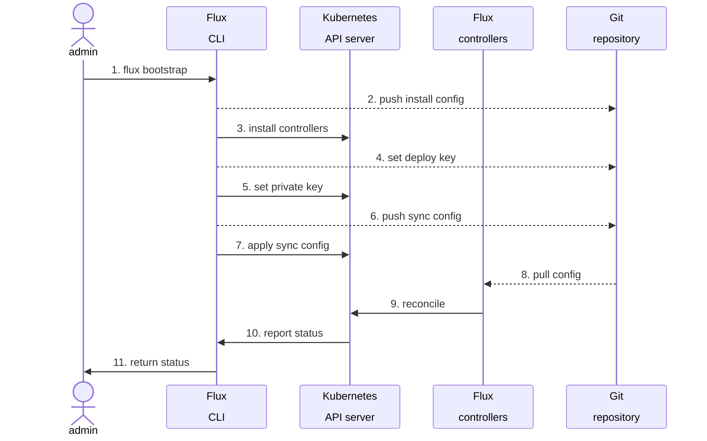

```mermaid
sequenceDiagram
  actor me as admin
  participant cli as Flux<br><br>CLI
  participant kube as Kubernetes<br><br>API server
  participant flux as Flux<br><br>controllers
  participant git as Git<br><br>repository
  me->>cli: 1. flux bootstrap
  cli-->>git: 2. push install config
  cli->>kube: 3. install controllers
  cli-->>git: 4. set deploy key
  cli->>kube: 5. set private key
  cli-->>git: 6. push sync config
  cli->>kube: 7. apply sync config
  git-->>flux: 8. pull config
  flux->>kube: 9. reconcile
  kube->>cli: 10. report status
  cli->>me: 11. return status
```
